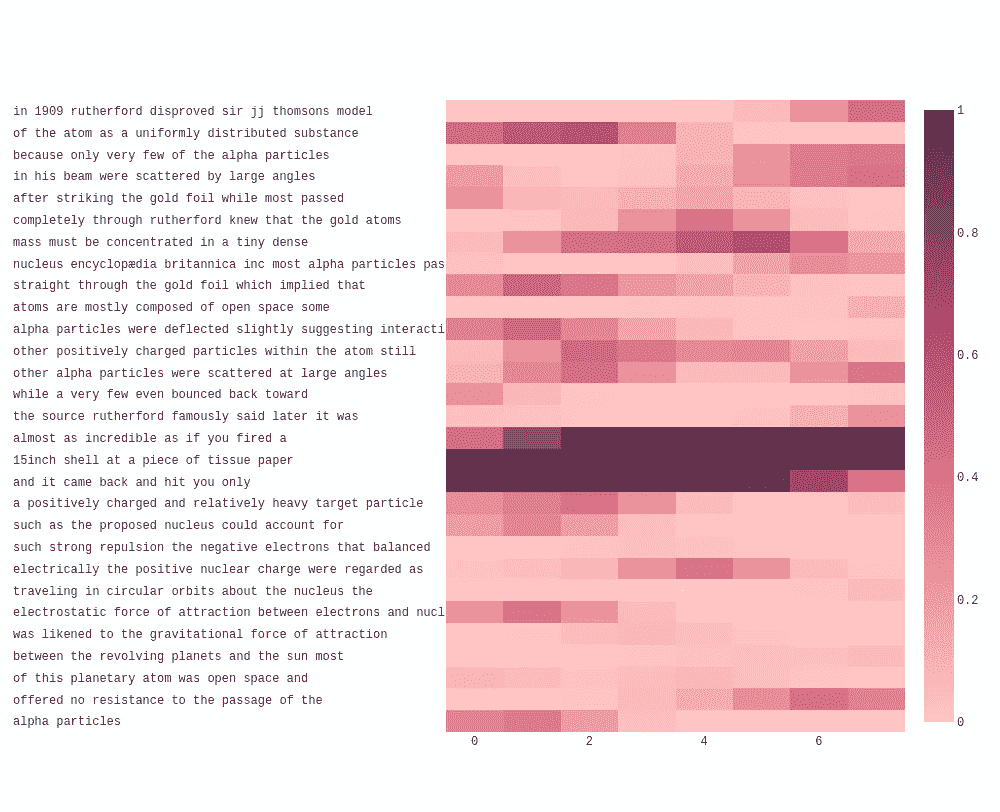
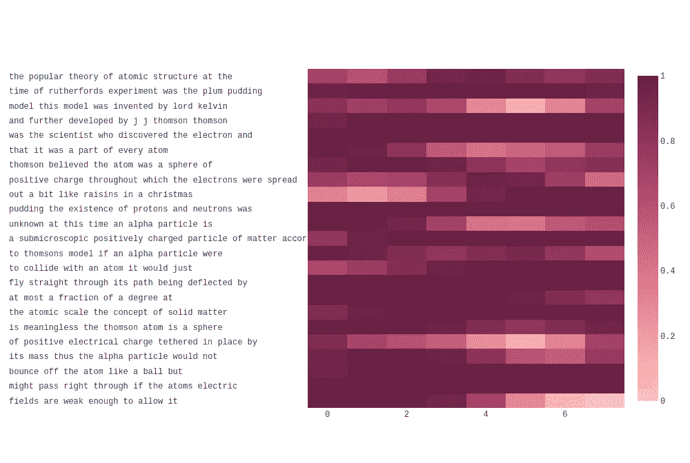

# Python 中简单的抄袭检测

> 原文：<https://towardsdatascience.com/simple-plagiarism-detection-in-python-2314ac3aee88?source=collection_archive---------7----------------------->

## [实践教程](https://towardsdatascience.com/tagged/hands-on-tutorials)

## 使用语言模型(代码、解释和可视化)捕捉骗子

[斯科特·格雷厄姆](https://unsplash.com/@sctgrhm?utm_source=medium&utm_medium=referral)在 [Unsplash](https://unsplash.com?utm_source=medium&utm_medium=referral) 上拍照

作为一名教师，我理解那些努力向学生传授知识和有意义的反馈的教育工作者的沮丧，只是为了一小部分作弊的人通过假冒抄袭的作品作为自己的作品来规避制度。多亏了互联网，现在作弊比以往任何时候都更容易，也更有诱惑力。对老师来说幸运的是，有自动检测作弊的方法。当然，有些服务是收费的，但我想用 Python 创建一个剽窃检测系统，看看这些系统是如何工作的。如果你已经熟悉语言模型是如何工作的，请随意跳到最后的代码和可视化。

## 语言建模

**语言模型是一种统计模型，它捕获了在其上进行训练的语料库的相关语言特征。**在基本水平上，它应该捕获字母和单词的频率分布。一个更高级的语言模型应该捕获句法和语法依赖性，例如一致性和变形，以及语义属性，例如哪些单词可能出现在给定的上下文中。语言模型通常用于两个主要任务:**评分**和**生成**。在评分中，语言模型对在给定上下文中出现的某个单词给出概率分数。给定上下文`machine learning is ____`，它应该有希望给完成`fun`比给完成`octopus`更高的分数，假设它是在英语文本的代表性样本上训练的。在**生成**中，模型从学习到的分布中采样，以生成虚假但听起来似乎可信的文本。克劳德·香农在他 1948 年的开创性论文中讨论了语言模型，给一系列单词分配概率的能力是信息论的一大成就。

要将语言建模应用于剽窃检测，您可以在一堆您认为人们可能会抄袭的文本上训练一个语言模型。假设你目前正在化学课上讲授金箔实验。你可以取几篇相关的维基百科文章，谷歌搜索“金箔实验”的前 10 名结果，也许还有过去几年的学生提交的文章(如果你担心传下来的论文)，然后把它们放在一个文本文件中。这个聚集的数据集将是我们的训练数据，我们使用它来建立语言模型，该模型捕获文本的统计特征。**一旦我们有了这个语言模型，我们就可以通过语言模型运行学生作业来分配分数。**较高的分数意味着工作从训练数据中更可预测，并代表抄袭的可能性较高。

[在之前的文章](/generate-fake-donald-trump-tweets-using-python-8d83885fd5c6)中，我讨论了两种不同的语言建模方法——N-gram 模型和 RNNs。在那篇文章中，目标是生成某种样式的假文本。其中一种方法，N-gram 模型，被证明是一种简单而有效的剽窃检测方法。

## n 元语言模型

N-gram 语言模型基于前一个上下文窗口对单词评分。虽然 N-gram 模型不是非常复杂，并且无法处理长期依赖和抽象语义信息，但我们实际上可以将这视为这项任务的一个功能，而不是一个错误。其他语言模型，如基于递归神经网络或转换器的语言模型，更擅长捕捉长期依赖和更高层次的抽象。然而，对于剽窃来说，重点是复制的单词序列，而不是抽象层面的相似性。转述不应该引起警觉，但直接复制应该引起警觉。我发现 4 的 N-gram 窗口工作得很好，它也符合许多老师的建议，即不要在一个来源中连续使用三个以上的单词。

为了用 Python 实现 N 元语言模型，我们可以使用 NLTK 库(众多选项中的一个)。训练语言模型的基本步骤如下:

*   读入并预处理培训数据文件(例如，删除标点符号、大小写和格式)。我们会剩下类似`this is an example sentence`的东西
*   将训练数据标记化(即分成单个单词)并在开头添加填充。这将留给我们`['<s>', '<s>', 'this', 'is', 'an', 'example', 'sentence']`。
*   使用`nltk.ngrams`或`nltk.everygrams`方法从训练数据中生成 N-gram。对于大小为 3 的 N-gram，这将给我们类似于`[('<s>', '<s>', 'this'), ('<s>', 'this', 'is'), ('this', 'is', 'an'), ('is', 'an', 'example'), ('an', 'example', 'sentence')]`的东西。注意，除了三元模型，每个二元模型还会给我们一元模型和二元模型。
*   用这些 N-gram 拟合一个模型。NLTK 有各种模型可以使用，从基本的 MLE(最大似然估计器)到更高级的模型，如使用插值来处理看不见的 N-gram 的`WittenBellInterpolated`。

一旦我们有了训练好的模型，它就支持各种操作，比如给定上下文给一个单词打分，或者从学习到的概率分布中生成一个单词。现在是时候评价一些“学生作业”了。

*   在预处理中读入测试数据(“学生作业”)。
*   将测试数据符号化。
*   对于文本中的每个单词，调用该单词上的`model.score()`，将前面的`N-1`单词作为上下文参数。

这给了我们一个 0 到 1 之间的分数列表，每个单词一个，分数越大代表给定单词被剽窃的可能性越高。

## 形象化

如果我们能一目了然地看到一篇文章是否以及有多少是抄袭的，这不是很好吗？为此，我们可以将学生提交的内容表示为热图图像，其中每个像素对应一个单词的分数。这让我们可以快速判断是否有抄袭的可能，以及文本的哪些部分最有可能被抄袭。以这种方式可视化信息比查看一组数字分数或所有分数的汇总统计更有用。

我尝试了各种可视化这些数据的方法，我想到了下面的方法:

*   每行显示 *K* 个字(我用的是 K=8)。这是以像素为单位的热图宽度。然后计算高度(测试数据字数除以 *K* )。
*   由于数据集的规模较小和插值的挑战，分配的分数存在一些不确定性，所以我对分数应用了高斯平滑。
*   将分数数组整形为一个由 *K* 列和*高*行组成的矩形。这需要添加零填充以确保数组大小正确。
*   使用 Plotly 热图显示使用您选择的色阶的图像。
*   将文本的 *K* 个单词显示为热图相应行旁边的 y 轴刻度标签，以便于并排比较。调整悬停数据，使每个像素在悬停时显示其对应的单词。

为了测试这种方法，我在盖格尔-马斯登实验(也称为金箔实验)的维基百科文章上训练了抄袭检测模型。对于“学生作品”，我比较了两个提交的作品，一个是从维基百科复制的，略有改动，另一个来自完全不同的来源，谈论相同的主题。

非抄袭的例子，其中的文本不是来自维基百科的文章。注意对应卢瑟福名言的黑色区域，这句话也出现在维基百科的文章中。如果你看到这样的东西，你可以检查一下，以确保它被正确引用，否则它可能是剽窃的证据。图片作者。

抄袭的例子，其中的文本取自维基百科，并不时替换一些单词。较浅颜色的像素对应于被修改的单词。这种方法更容易辨别出文章的哪些部分是抄袭的。图片作者。

## 代码

这是我用来训练、评估和可视化剽窃检测的完整代码。

## 结论

这是一个简单的剽窃检测实现。当然，还可以添加许多其他功能，例如处理引用、自动收集训练数据、比较不同学生提交的内容，或者对其进行调整以适用于剽窃的代码而不是文本。然而，该计划阐明了语言模型背后的一些关键思想和信息论对现实世界问题的适用性。如果你喜欢这个，你可能会喜欢我关于信息论的文章:

 [## 对信息论基础的直观观察

### 数据压缩、熵、加密、Kolmogorov 复杂性以及它们为何重要的非技术之旅

towardsdatascience.com](/an-intuitive-look-at-the-basics-of-information-theory-2bf0d2fff85e) 

## 参考

[1]克劳德·香农。1948.《交流的数学理论》。[http://people . math . Harvard . edu/~ CTM/home/text/others/Shannon/entropy/entropy . pdf](http://people.math.harvard.edu/~ctm/home/text/others/shannon/entropy/entropy.pdf)。

[2]自然语言工具包。【https://www.nltk.org/ 号

[3]维基百科。“盖革-马斯登实验”。[https://en . Wikipedia . org/wiki/Geiger % E2 % 80% 93 marsden _ experiment](https://en.wikipedia.org/wiki/Geiger%E2%80%93Marsden_experiment)

[4]大英百科全书。“卢瑟福模型”。[https://www.britannica.com/science/Rutherford-model](https://www.britannica.com/science/Rutherford-model)