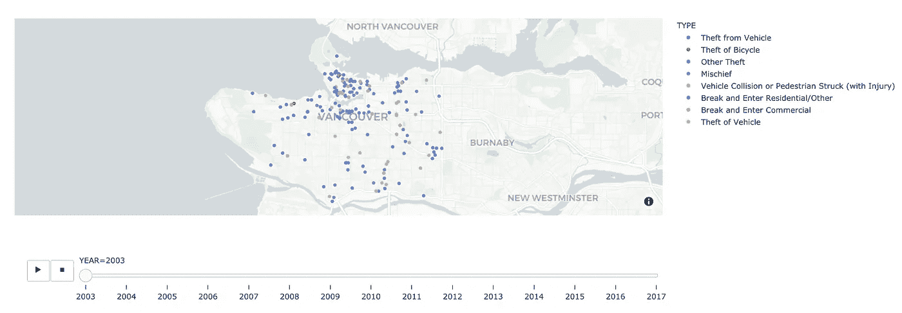
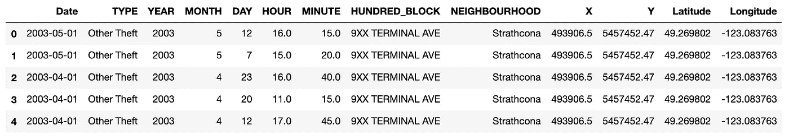
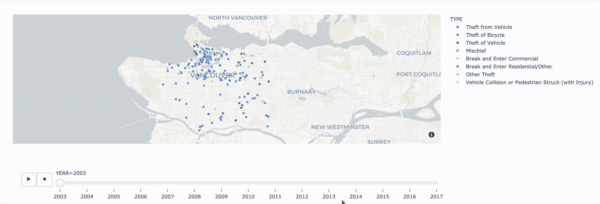
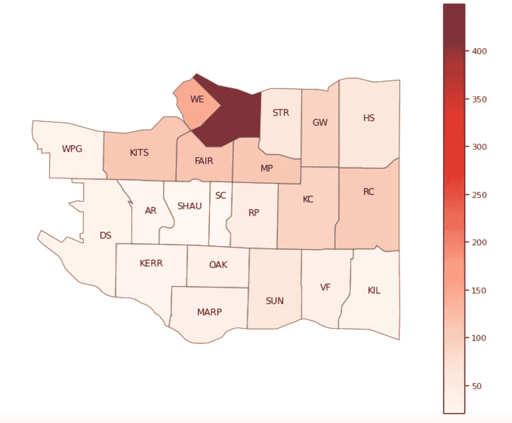
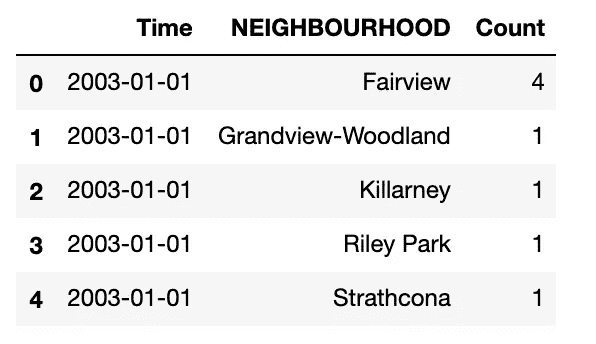
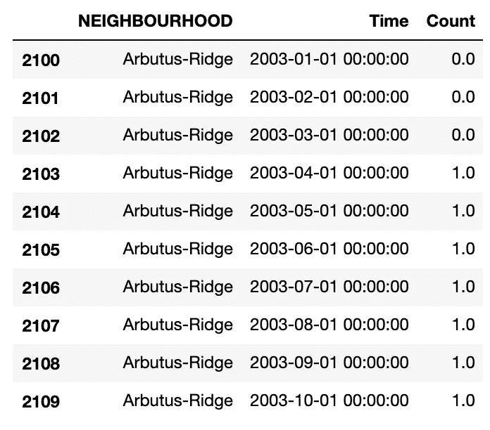
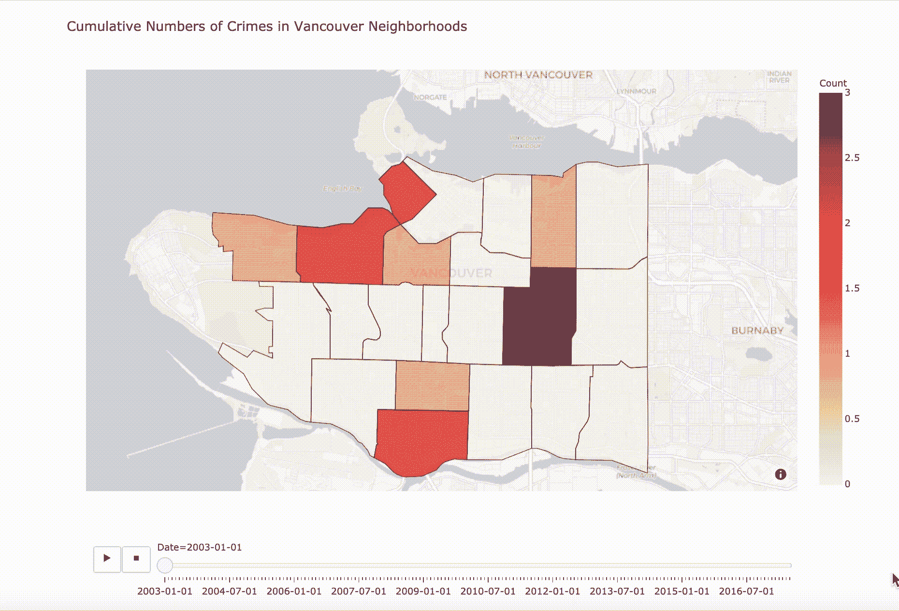

# 简单的情节教程

> 原文：<https://towardsdatascience.com/simple-plotly-tutorials-868bd0890b8b?source=collection_archive---------9----------------------->

## *第 1 部分:创建漂亮的动画地图*



作者图片

动画地图是可视化和交流具有地理属性的数据的有效方式。在本教程中，您将学习如何在 Python 中部署 Plotly Express 包，以快速制作具有交互式功能的精美地图。

Plotly 是数据科学家可用的增长最快的可视化库之一，证明了它的易用性和它可以生成的漂亮的图形。这是展示日益复杂的 Plotly 功能的 3 个系列教程中的第一个。本期将向您展示如何使用 Plotly Express 快速制作动画地图。随后的教程将依次关注进一步定制 Plotly 图形，并在 Dash 应用程序中可视化它们。

# **温哥华犯罪数据集**

在本教程中，我们将使用 Kaggle 数据集，它提供了加拿大温哥华市不同类型犯罪的数据。

在开始编码之前，您需要在 Python 中安装以下包。只需在您的终端或 Jupyter 笔记本中运行以下 pip 安装程序:

*   pip 安装计划
*   pip 安装 geopandas

让我们加载所需的包和数据集。我们可以在读取 CSV 文件时使用 parse_dates 参数创建一个`Date`列。在这里，我选择使用`MONTH`和`YEAR`列来创建`Date`列，但是如果您愿意，也可以包含`HOUR`和`MINUTE`列。



温哥华犯罪数据集的前 5 行。作者图片

在开始分析之前绘制数据是一个很好的做法，以便发现任何不寻常的情况。当查看`Latitude`和`Longitude`特征的分布时，我注意到几个 0 值扰乱了数据的绘制方式——点显示在世界的另一端，使得无法在温哥华可视化数据！

为了本教程的目的，让我们去掉它们，使用一个 2000 行的样本。

# 绘制温哥华地图

## 1.散点图

**“静态”视图**

在我用 Plotly 这样的库做任何“花哨”的工作之前，我总是喜欢看我的地图的简单版本，以便对事物应该是什么样子有一种感觉。通常，这涉及到查找 shapefile 或 geojson，温哥华市的开放数据门户[就有这些工具。](# https://opendata.vancouver.ca/explore/dataset/local-area-boundary/export/?location=6,47.9237,-119.82788)因为我们将需要 geojson 文件来绘制 choropleth 多边形，所以让我们下载它。我们加载带有 Geopandas 库的 geojson，并在其上绘制数据集中的所有事件。


温哥华犯罪类型的分布。作者图片

这看起来很不错，但地图看起来很拥挤，很难获得洞察力。让我们来看看如何使用 Plotly Express 向我们的观众展示犯罪如何随着时间的推移而演变。

**“动态”视图**

map box 是一种在地图上显示散点数据的服务。因为这是第三方服务，所以您需要为自己生成一个访问令牌，以便显示他们的地图。这可以通过遵循此处的说明[轻松完成。你需要做的就是用 Mapbox 创建一个帐户，然后你就可以访问你的令牌了——整个过程是免费的。一旦有了令牌，只需用自己的替换下面代码块中的“your_token”字符串。](https://docs.mapbox.com/accounts/guides/tokens/#default-public-access-token)

```
px.set_mapbox_access_token("your_token")
```

您现在可以开始了！

通过将特征设置为`animation_frame`，可以快速实现具有 Plotly Express 功能的动画，它将使用特征的值来子集化和显示您的数据。例如，将`time_col`设置为“年”将允许您可视化数据集中所有年份的犯罪，“月”表示所有月份，依此类推。

我们可以通过设置一个`“color”`参数来指定散点图的颜色，与海运的`“hue”`参数的工作方式相同。默认情况下，传递给`“animate_frame”`参数(它决定了地图动画的顺序)的值是不排序的，所以我们添加了一个`“category_orders”`参数:一个包含要迭代的值的排序列表。

瞧啊。我们有一个很好的互动地图。如果您想显示数据在几个月(或几个小时等)内的变化。)相反，只需更改上面函数中的`time_col`参数。



温哥华犯罪数据的动画散点图。作者 Gif

注意事项:

*   因为 Plotly 散点图依赖于 Mapbox 服务，使用它们的一个很好的优势是，它们会根据您提供的坐标自动显示地图——无需提供地理文件！但是，在显示 choropleth 地图时，您需要提供一个 geojson 文件，如下一节所示。
*   如 gif 所示，你可以点击`Type`变量中的类别来过滤图上显示的数据点！这提供了很好的初始互动性，可以帮助你引导你如何传达你的见解。

## **2。Choropleth 地图**

**“静态”视图**

绘制犯罪数据的另一个很好的方法是使用 choropleth 地图可视化每个街区的事件数量，然后显示这些数字如何随时间演变。当显示 choropleth 地图时，我们根据想要可视化的基础值给多边形(每个多边形对应一个邻域)着色。在下面的示例中，我们将根据每个面内发生的犯罪事件的数量对其进行着色，较深的着色代表较高的犯罪事件数量，较浅的着色代表较低的犯罪数量。

在我们绘制任何东西之前，数据集需要一些额外的操作。首先，我注意到 geojson 和 crime 数据之间的一些命名差异，所以我重命名了一些街区，以确保它们的名称一致。我还删除了斯坦利公园附近的观测数据，不幸的是，geojson 文件中没有这些数据。

我们现在可以绘制重新格式化的数据。



温哥华社区累积犯罪事件的 Choropleth 地图。作者图片

正如我们所见，温哥华的每个街区都由一个多边形表示，其颜色强度与街区内发生的犯罪事件数量成正比。城市北部的街区往往比南部的街区有更高的犯罪率，CBD(中央商务区)街区在整个样本中的犯罪率最高，白色阴影区的街区犯罪率最低。

**“动态”视图**

让我们制作上图的动画。对于每个时间戳，我们希望可视化温哥华不同社区中累积事件的分布。

在处理最终的数据帧之前，我们需要完成几个额外的步骤，该数据帧将包含数据中每个时间戳每个邻域所有事件的累积总和。



滚动计数数据帧的前 5 行。作者图片

现在这里有一个稍微棘手的部分。如果您查看我们刚刚生成的`counts_rolling`数据帧，您会注意到并非所有的邻域都有每个时间戳的值。这是因为某些街区在特定日期没有任何犯罪记录，因此我们需要使用向前填充来填充那些“缺失”的值。



最终犯罪累计金额数据框架预览。作者图片

现在，我们有了一个完整的数据帧，其中包含每个时间戳/邻域组合的值。我们终于可以绘制图表了！

为了使用 Plotly 的 choropleth_mapbox 函数，我们必须确保包含犯罪数量的数据帧和用于绘制地图的 geojson 具有相同的标识符，以便映射函数可以正确地将每个面与其犯罪数量相关联。这里，我利用`featureidkey`参数告诉映射函数多边形标识符位于 geojson 文件的“properties.name”位置。这些标识符与犯罪数据帧中包含的邻居名称相同。



温哥华犯罪统计动画地图。作者 Gif

## 后续步骤

正如我们刚刚看到的，用 Plotly 制作动画图形是一件轻松快捷的事情。在接下来的教程中，我将展示如何进一步定制 Plotly Express 图形。例如，我们可能希望选择一个特定的年份，并可视化犯罪在这一年的几个月中的演变。或者，我们可能希望有一个选项来按犯罪类型过滤数据，并可视化其随时间的演变。幸运的是，Plotly 使我们可以轻松地在 Plotly Express 图形的基础上构建，一步一步地添加定制层。在后面的教程中，我们将会看到如何将所有的东西包装成一个漂亮的 Dash 应用程序！

我想对我在数据科学和人工智能精英团队的同事们大声欢呼，感谢他们激励我写这篇博文。特别感谢 [Andre Violante](https://medium.com/@violante.andre) 和[Rakshith Dasenahalli linga raju](https://medium.com/@rakshithdl)的意见和建议，以及 Robert Uleman**极其**彻底的校对和代码改进！