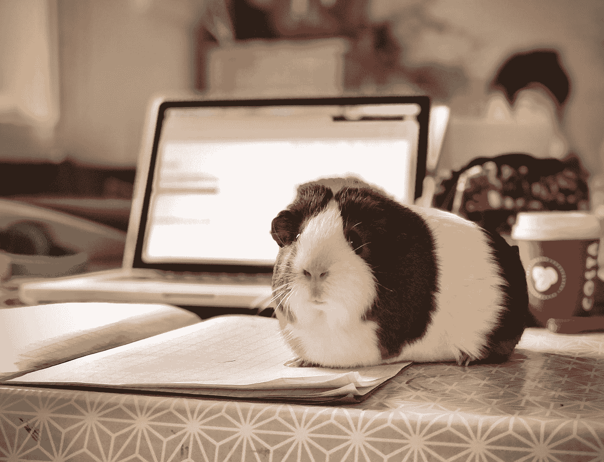

# 让您成为更高效的数据科学家的简单解决方案

> 原文：<https://towardsdatascience.com/simple-solutions-to-make-you-a-more-productive-data-scientist-9e9ad3bd0bd9?source=collection_archive---------31----------------------->

## 或者更有成效的事情

丹·巴瑞特在 [Unsplash](https://unsplash.com?utm_source=medium&utm_medium=referral) 上拍摄的照片

没有比新年更好的时机来解决数据科学家面临的最大问题之一:生产力。

数据科学家有很多工作要做，要求很高的工作描述和不断自我教育的需求。难怪数据科学家会感到筋疲力尽。但是，有一种方法可以看到数据末尾的亮光(或者如果您愿意，也可以是隧道)。

通过实施一些生产力解决方案和工具，数据科学家可以努力缓解似乎永远不会停止的工作压力。你可能以前见过一些这样的建议，但是有时候提醒你所拥有的一切来帮助你变得更有效率并没有坏处。为什么不在新的一年里尝试一下，看看什么对你有用？

# 如何提高工作效率？

## 自动化繁琐的任务。

数据科学家花费[高达 70%的时间](https://www.ibm.com/blogs/research/2017/06/automating-low-level-tasks-data-scientists/)在低级任务上，比如收集、清理和组织数据。

当你想到 80/20 法则时，你会发现 80%的成果来自于 20%的努力，在低级任务上花费这么多时间似乎并不那么有效。再者，不是曾经有一句名言建议你应该聪明地工作而不是努力工作吗？

收集、清理和组织数据所涉及的许多过程都是极其重复的，并且没有很好地利用您的时间。因此，与其把时间浪费在常规任务上，不如让代码为你工作，把单调的东西自动化。

查看这些关于自动化数据科学任务的文章，开始您的工作:

</the-lazy-mindset-of-effective-data-scientists-how-automation-can-help-fbb48a9c9212>  </automation-in-data-science-f11fe389d49b>  

## 如果你在远程工作，利用你最有效率的时候安排你的工作日。

根据你工作的公司，这可能是一个不可能的解决方案。然而，如果你是在一家更自由流动的公司工作，或者你自己是一名自由职业者，为什么不把你的工作时间安排在你效率最高的时候呢？

随着疫情结束后在家工作运动的兴起，许多数据科学家将被允许在他们想去的任何地方工作。不仅如此，随着凌晨 3 点给同事发邮件变得可以接受，工作时间也变得更加灵活。

所以，如果你在早上效率最高，那就把你的工作日安排在早上。或者，如果你是一个夜猫子，晚上工作到很晚。你可能会惊讶于你的生产力、总体幸福感和生活满意度是如何同步提高的。

## 使用适合您的 IDE，而不是大多数人所说的让您“更有效率”的 IDE。

仅仅因为一个 IDE 使一个数据科学家更有效率，并不意味着它会使你更有效率。

首先，当选择一个 IDE 时，选择一个你最熟悉的。如果你不停地摆弄那些你不熟悉的小插件或功能，你就不会有成效。

幸运的是，如果你还没有选择你的唯一，你有几个 ide 可以选择。Spyder、Pycharm IDE、Jupyter Notebooks、R Studio 和 Visual Studio Code 只是可供选择的几个 IDE。

从个人经验来看，Visual Studio Code 和 Jupyter 笔记本是我最喜欢使用的 ide，因为它们的布局简洁，易于使用的生产力增强插件，以及对我的计算机大小的要求不高。

## 拍摄你自己的工作。

我知道这是个奇怪的建议。但是听我说完。

看着人们工作或编码的时间流逝，有种奇怪的满足感。只要在 Youtube 上看一看，你就会发现数以千计的人们正是这样做的视频。

你不仅在一天结束时得到了一个很酷的视频，而且在拍摄期间你也变得有动力去工作。此外，你还可以看到你大部分时间都花在哪里了。如果您发现您花了四分之三的时间编写特性代码，但是认为花更多的时间来选择和调整您的模型会更好，那么您可以在将来进行调整以提高您的生产率。

## 让任务批处理为你工作。

数据科学是那些期望你完美地完成许多不同任务的学科之一。然而，很难从一项任务跳到另一项任务，因为每项任务都需要完全不同的技能或工作类型。这也适用于在不同的项目中工作时必须进行的思维转变。

这个问题的解决方案是让任务批处理为你工作。任务批处理是一个生产力主题，你可以留出时间来处理相同类型的任务，并且只处理那些类型的任务。

例如，如果您使用任务批处理来计划您的工作日，您的日程可能如下所示:

*   上午 8 点到 9 点——查看电子邮件。
*   上午 9:00-11:30—项目 x 的数据清理
*   上午 11:30-下午 12:30—午餐
*   下午 12:30-2:30—关于项目 x 的会议
*   下午 2:30-5:00-对项目 x 的数据进行初步分析并开发模型。

这些任务不仅按类型分批，还按重点分批。例如，你可能在一个给定的时间从事多个项目。对于一些人来说，一整天从一个项目切换到另一个项目是很困难的。为了让自己轻松一点(如果这对你的工作环境/流程有用的话)，试着把你的一整天都集中在一个给定的项目上，以避免不得不在一天的中途把你的思维转移到一个不同的项目上。从那里，你可以将特定于项目的任务进行批处理，这样你就可以将所有的注意力集中在完成一个给定的任务上，而不是试图同时处理多项任务而什么也没完成。

## 使用像 Trello 这样的生产力工具来跟踪你的项目进度。

当我在做我的顶点项目时，像 Trello 这样的生产力工具是我的救命稻草。它不仅允许多个团队成员更新他们的进度，而且给你一个简单的方法来可视化你的团队在过程中的位置。

简单的生产力工具可以让你追踪你的项目进度，但在创造生产力环境方面却没有得到应有的认可。无论你首选的跟踪进度的方法是白板、日志还是生产力工具，跟踪你的进度都是一个确保按时完成和减少压力的方法。

根据您的风格和项目需求，您可能需要升级您的生产力工具。以下是一些我最喜欢的和其他经过验证的跟踪生产力的方法，你可以在下一个项目中实施:

*   特雷罗
*   [MS 项目](https://www.microsoft.com/en-ca/microsoft-365/project/project-management-software)
*   [体式](https://asana.com/)
*   [大本营](https://basecamp.com/)

# 如何通过自我教育提高工作效率？

自我教育是那些必要的罪恶之一，它会让你感到筋疲力尽，没有动力去做你真正有报酬的工作。随着数据科学作为一门学科不断发展，自我教育是雇主期望你做的工作合同中未言明的部分之一。问题是，工作日结束后，几乎没有精力去做个人项目或完成一堂新技术课。为了提高你的自学效率，充分利用你的学习时间，甚至给你自己一些额外的时间，试试这些提高效率的技巧和解决方案。

## 创建个性化的学习课程来学习一项新技能或技术。

虽然许多概念可以通过一个 Youtube 视频学习，但其他概念需要更多的努力。例如，如果你的工作需要你学习如何创建一个特定的机器学习模型，那么很难在一个视频中学习你需要的一切。这可能需要一些更深入的东西，比如学习课程。

创建自己的个性化学习课程不仅是在自学过程中保持积极性的好方法，也是学习困难概念的理想方法，而不必为在线课程支付过高的费用。

对于这个例子，首先列出你需要知道的所有概念来建立一个机器学习模型。然后，添加任何额外的概念，这些概念可能更具体地针对您需要为工作创建的机器学习模型的确切类型。从那里，你可以在网上搜索免费课程、原始文档、博客文章和视频教程，这些都可以满足你需要学习的每一个概念。我最喜欢的一些在线学习内容来源是 freeCodeCamp、Coursera、Udacity、edX、Youtube 和媒体上的 TowardsDataScience 出版物。

在你投入时间对课程进行个性化设置后，你不仅会更倾向于将课程进行到底，而且课程已经为你安排好了，每天只需要少量时间，你就可以深刻理解如何创建一个可以在工作中实施的机器学习模型。

## 将学习概念分成小块，这样可以在一个小时内学会。

不是每个人每天都有八个小时来钻研学习一个新概念或新技术。很少有人有一个小时可以用来学习。正因为如此，如果你觉得你需要学习一些新的东西，但是没有时间去学，你的工作效率会受到影响。

相反，把学习看作是在更短的时间内完成的事情。每个人都有二三十分钟可以用来学习。通过把学习分成更小的部分，你会更容易养成一个只占用你一天一小部分时间的学习习惯。

此外，想到要学习一个完整的概念可能会令人生畏，但是当它被分解成只需要很少时间就能完成的逻辑片段时，这个任务看起来就容易管理得多了。

通过打破你的学习观念，你不仅会养成一个容易保持的习惯，而且你会惊讶于每天花几分钟时间学习会有多快。

## 在努力学习的时候，把工作的想法抛在脑后。

当你试图学习一个新概念时，工作是你能想到的最分散注意力的事情之一。

在担心你是否完成了你需要做的一切，或者你是否正在进行你老板信任你的大项目，或者你发给同事的电子邮件是否有点冒犯，因为你太晚意识到一个笑话可能不是正确的，或者如果办公室的流言是真的，那么太多本可以更好地用于学习的时间将被浪费，因为你的思想正徘徊在你实际上被支付工资要做的事情上。

当你坐在一个无聊的微积分讲座前时，你的思维会自动导航，走神，这是很自然的。

因此，为了在学习的同时提高效率，你需要关掉所有其他的东西，只专注于学习。

这可能意味着早上五点醒来，只是为了了解世界是寂静的，你的工作日还没有开始。或者，这可能意味着在学会放慢你的思维，让你更加集中注意力，专注于手头的任务之前，先进行冥想。或者你可以戴上那些大的降噪耳机来消除任何干扰。

不管是什么诀窍，确保它让你专注于学习，而不是让你每五分钟检查一次邮件。当你把注意力集中在眼前的事情上时，你会惊讶地发现你能学到多少东西。

## 意识到你什么时候会筋疲力尽。

有时候，生活可以很多。在工作、家庭、个人需求和你已经做出的其他承诺之间，有一个优先事项会把你推到边缘。

使用一些过度使用但高度相关的类比:你的盘子只能有这么满，你只能从一个满杯子倒酒。

换句话说，如果一想到要再上一堂新技术课，你就想辞掉工作，卖掉一切，搬到远离电网的荒野中的一个偏僻小屋，在那里你未来四十年都不会接触技术，那么你需要停下来。当你的大脑明显需要休息时，停止强迫自己学习新的东西。

作为一名数据科学家，在精神上已经够累的了，有时候，在一天工作八小时处理数据、清理数据和调试代码之后，你的大脑需要休息一下。

偶尔听听自己的大脑，让自己从学习中解脱出来。除非你的老板是机器人，否则他们可能也经历过同样的事情。技术领域的每个人都曾在某个时候遇到过。给自己足够的时间远离学习，这样你就能兴奋地再次学习。它会回来的，相信我。当学习的激情回来时，你会比以前更有效率。

# 最后的想法。

随着数据科学家头衔带来的一切，人们很容易感到不知所措。然而，如果有一件事可以提高效率，那就是让自己变得有效率。这听起来似乎是显而易见的，但更多的时候，生活发生了，你的生产力解决方案飞出窗外，以补偿任何突如其来的事情。

虽然你可能已经知道我在这篇文章中提到的解决方案，但温和地提醒一下其他可能进一步刺激你的生产力的解决方案也无妨。因为归根结底，数据科学家需要尽可能多的生产力。