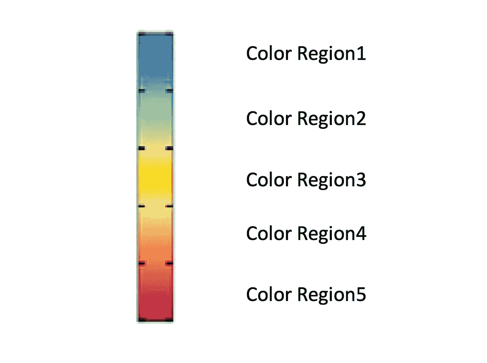
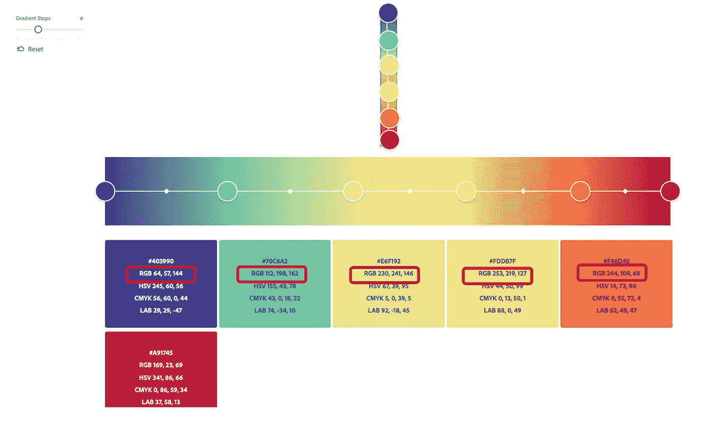
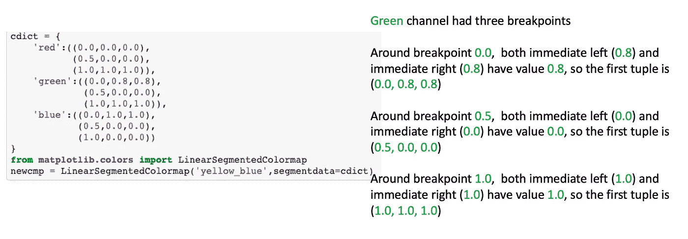
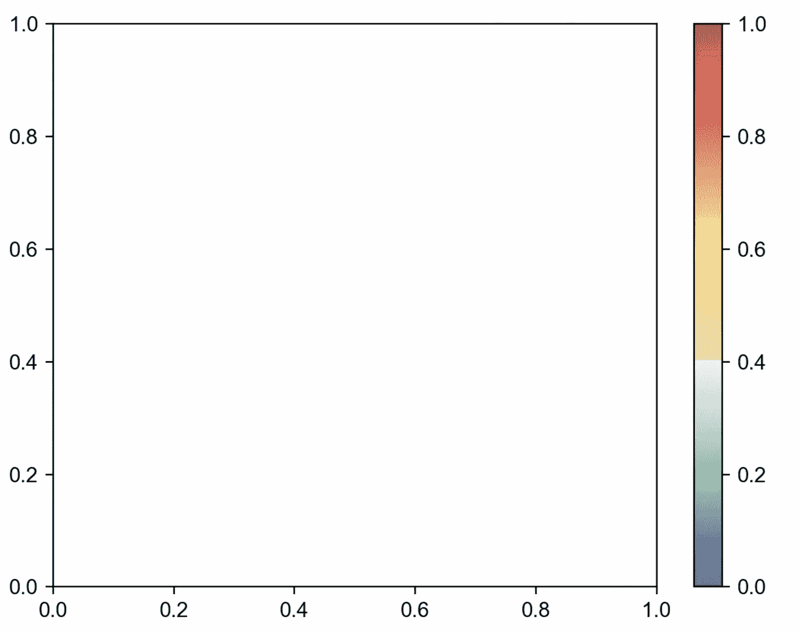

# 用 Python 创建自定义色彩映射表的简单步骤

> 原文：<https://towardsdatascience.com/simple-steps-to-create-custom-colormaps-in-python-f21482778aa2?source=collection_archive---------5----------------------->

## 随心所欲地创造任何色彩


Pawel Czerwinski 在 [Unsplash](https://unsplash.com?utm_source=medium&utm_medium=referral) 上的照片

假设您发现了一个其他人在出版物中使用的漂亮的色彩映射表，并且您也想在您的结果中使用它。然而，遗憾的是，它并不是 matplotlib 中内置的 colormap。周围有解决的办法吗？

所以今天我将向你展示我通常是如何通过创建基于任何图像的自定义色彩映射表来解决这个问题的。

包装器函数的 Github 存储库可以在:[https://Github . com/frank ligy/sc triangulate/blob/main/image/colors _ module/readme . MD](https://github.com/frankligy/scTriangulate/blob/main/image/colors_module/README.md)找到

我在这张[细胞纸](https://www.cell.com/cell/fulltext/S0092-8674(21)01105-3)中遇到了一个好看的色彩图，在他们的[图 4，面板 K](https://els-jbs-prod-cdn.jbs.elsevierhealth.com/cms/attachment/6a494f50-66f9-4e9d-955d-8c7021c24a3b/gr4_lrg.jpg) 中，有一个彩虹般的色彩图，它显示了很大的对比度，在视觉上也很有吸引力。我们需要做的第一步是截取这个色图的截图，如下所示:



我们想要创建的示例色彩映射表(图片由作者提供)

正如你所看到的，它似乎有 5 个不同的颜色补丁，每个补丁内也有一个梯度。为了用 python 再现这个色彩映射表，我们首先需要知道一些锚点的颜色，我们提供的锚点越多，我们的色彩映射表看起来就越接近原始色彩映射表。为了提取锚点的颜色，我们使用了免费的 web 应用程序 [adobe 颜色渐变](https://color.adobe.com/create/image-gradient)。



上传截图后，我们提取了 6 个锚点的 RGB 值(图片由作者提供)

该应用程序要求我们上传截图，然后您可以提取任意数量锚点的 RGB 颜色(用 0-255 之间的值表示)。这里我们选择 6，因为我们假设有 5 个不同的颜色补丁。

我在红框中突出显示的 RGB 值将帮助我们在接下来的步骤中创建自定义色彩映射表。

乍一看，在 matplotlib 中构建自定义色彩映射表的逻辑有点混乱，它要求我们首先创建一个包含`red`、`green`和`blue`通道动态变化规范的`cdict`字典。用一个更简单的例子来解释语法:



理解 cdict 的语法(图片由作者提供)

和上面的例子一样，我们指导程序如何在从 0 到 1 的连续统上线性插值 R、G 和 B 通道。关键的概念是选择断点，在断点处我们表达颜色通道的强度。另一个令人困惑的地方是我们需要输入两个值，一个是断点左边的强度，另一个是右边的强度。在一个简单的情况下，比如我刚才展示的例子，对左右两边使用相同的亮度是完全没问题的。对于更详细的操作，我们可以让他们不同的理想效果。记住这一点，我们终于可以开始我们的旅程了！

第一步是安装和加载必要的软件包:

```
from matplotlib import colors
import numpy as np
import os
import matplotlib.pyplot as plt
from matplotlib import cm
```

我们首先构建如上所示的`cdict`，这里我们定义一个函数`inter_from_256()` 来将 Adobe 输出值(0–255)转换为 range (0，1)。

```
def inter_from_256(x):
    return np.interp(x=x,xp=[0,255],fp=[0,1])
```

现在可以实例化自定义色彩映射表对象了:

```
new_cmap = colors.LinearSegmentedColormap('new_cmap',segmentdata=cdict)
```

我们可以通过使用自定义颜色图生成颜色条来测试它:

```
fig,ax = plt.subplots()
fig.colorbar(cm.ScalarMappable(norm=colors.Normalize(),cmap=new_cmap),ax=ax)
```



我们的自定义彩色地图(图片由作者提供)

# 全程一行代码？

当我几个月前第一次遇到这个问题时，我发现为新的色彩映射表重复这个过程几次是很痛苦的。所以我开始在我开发的一个名为 [scTriangulate](https://github.com/frankligy/scTriangulate) 的 python 包中编写一个名为[“colors”](https://github.com/frankligy/scTriangulate/blob/main/image/colors_module/README.md)的模块。让我们使用[颜色](https://github.com/frankligy/scTriangulate/blob/main/image/colors_module/README.md)模块中非常方便的函数`build_custom_continuous_cmap`将整个过程简化为一行代码:

如您所见，我们只需将 adobe web 应用程序中的所有 RGB 值传递给该函数，不再需要担心底层流程。

现在我们再测试一次:

```
fig,ax = plt.subplots()
fig.colorbar(cm.ScalarMappable(norm=colors.Normalize(),cmap=new_cmap),ax=ax)
```


可以得到同样的结果(图片由作者提供)

# 结论

结束了，我希望这个简短的教程对你的情况有所帮助。此外，我想向您推荐 [scTriangulate.colors](https://github.com/frankligy/scTriangulate/blob/main/image/colors_module/README.md) 模块，以获得更方便的 python 可视化功能。我写这篇教程的部分原因也是为了获得您的宝贵反馈，了解您希望在 python 中简化哪些繁琐的绘图过程？如果您有任何功能要求，请让我知道，以便我可以实现它们并将其添加到 [scTriangulate.colors](https://github.com/frankligy/scTriangulate/blob/main/image/colors_module/README.md) 模块中，以使其他用户受益。

差不多就是这样！我希望你觉得这篇文章有趣和有用，感谢阅读！如果你喜欢这篇文章，请在 medium 上关注我，非常感谢你的支持。在我的 [Twitter](https://twitter.com/FrankLI55917967) 或 [LinkedIn](https://www.linkedin.com/in/guangyuan-li-399617173/) 上联系我，也请让我知道你是否有任何问题或你希望在未来看到什么样的教程！