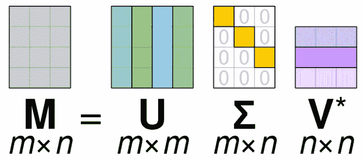
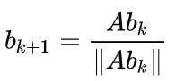
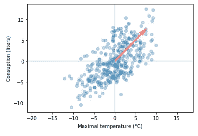
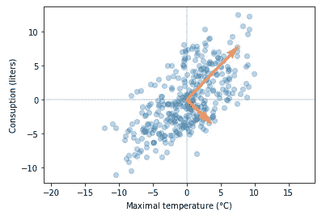
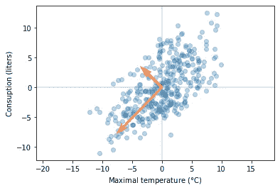

# 简单奇异值分解算法

> 原文：<https://towardsdatascience.com/simple-svd-algorithms-13291ad2eef2?source=collection_archive---------3----------------------->

## 计算奇异值分解的简单方法


[来源](https://pixabay.com/photos/adventure-compass-hand-macro-1850673/)

# 介绍

这篇文章的目的是展示一些简单而有教育意义的例子，如何使用简单的方法计算奇异值分解。如果你对行业力量的实现感兴趣，你可能会发现[这个](http://www.math.iit.edu/~fass/477577_Chapter_12.pdf)很有用。

# 德拉贡诺夫狙击步枪（Snayperskaya Vinyovka Dragunov 的缩写）

奇异值分解(SVD)是一种矩阵分解方法，将方阵(n×n)的特征分解推广到任意矩阵(n×m)([来源](https://en.wikipedia.org/wiki/Singular_value_decomposition))。

如果你不知道什么是特征分解或者特征向量/特征值，你可以谷歌一下或者看看这篇[帖子](https://medium.com/swlh/eigenvalues-and-eigenvectors-5fbc8b037eed)。这篇文章假设你熟悉这些概念。

SVD 类似于主成分分析(PCA)，但更一般。PCA 假设输入方阵，SVD 没有这个假设。奇异值分解的一般公式是:

**m**=**uσv**ᵗ，其中:

*   M 是我们想要分解的原始矩阵
*   **U**-是左奇异矩阵(列是左奇异向量)。 **U** 列包含矩阵的特征向量 **MM** ᵗ
*   **σ**-是包含奇异(本征)值的对角矩阵
*   **V**-是右奇异矩阵(列是右奇异向量)。 **V** 列包含矩阵的特征向量 **M** ᵗ **M**



奇异值分解矩阵([来源](https://en.wikipedia.org/wiki/Singular_value_decomposition#/media/File:Singular_value_decomposition_visualisation.svg))

奇异值分解比主成分分析更通用。从上图中我们看到，SVD 可以处理不同列数和行数的矩阵。奇异值分解类似于主成分分析。PCA 公式为**m**=**𝑄**𝚲**𝑄**ᵗ，将矩阵分解为正交矩阵 **𝑄** 和对角矩阵𝚲.简单地说，这可以解释为:

*   将基准从标准基准变更为基准 **𝑄** (使用 **𝑄** ᵗ)
*   应用变换矩阵𝚲，它改变长度而不是方向，因为这是对角矩阵
*   将基准从基准 **𝑄** 变更为标准基准(使用 **𝑄**

SVD 做类似的事情，但是它没有回到我们开始转换的基础上。它不能这样做，因为我们的原始矩阵 M 不是方阵。下图显示了与奇异值分解相关的基的变化和变换。


奇异值分解变换和基变换。([来源](https://en.wikipedia.org/wiki/Singular_value_decomposition#/media/File:Singular-Value-Decomposition.svg))

从图中我们可以看到，SVD 执行以下步骤:

*   将基准从标准基准变更为基准 **V** (使用 **V** ᵗ).请注意，在图表中，这显示为简单旋转
*   应用矩阵**σ**描述的变换。这在基础 **V** 上缩放了我们的向量
*   基从 **V** 变为基 **U.** 因为我们的原始矩阵 M 不是正方形的，所以矩阵 **U** 不能具有与 V 相同的维数，并且我们不能返回到我们的原始标准基(参见图片“SVD 矩阵”)

SVD 有许多变体和计算 SVD 的方法。我将展示一些计算它的方法。

# **计算奇异值分解的方法**

如果你想尝试自己编写例子，可以使用这本[笔记本](https://github.com/RRisto/learning/blob/master/linear_algebra_learn/PCA_SVD/power_method.ipynb)，里面有这篇文章中用到的所有例子。

## 幂迭代

幂迭代从可能是随机向量的 **b** ₀开始。在每次迭代中，使用以下规则更新该向量:



[来源](https://en.wikipedia.org/wiki/Power_iteration)

首先我们用原始矩阵 A ( **Abₖ** )乘以 **b** ₀，然后用范数除结果(|| **Abₖ** ||)。我们将继续，直到结果收敛(更新少于阈值)。

幂法有几个假设:

*   **b** ₀ **初始化 **b** ₀随机最小化这个假设不成立的可能性**
*   矩阵 A 具有主特征值，该主特征值的幅值严格大于其他特征值的幅值([来源](https://en.wikipedia.org/wiki/Power_iteration))。

这些假设保证了算法收敛到合理的结果。主特征值和第二特征值之间的差异越小，收敛所需的时间可能越长。

非常简单的幂法例子可以在[这里](https://en.wikipedia.org/wiki/Power_iteration)找到。我做了一个例子，也能找到特征值。如你所见，这个函数的核心是幂迭代。

举个简单的例子，我们使用啤酒数据集(可以从[这里的](https://www.kaggle.com/dongeorge/beer-consumption-sao-paulo)获得)。我们将构建协方差矩阵，并尝试确定数据集的主要奇异值。数据处理的完整示例可在[笔记本](https://github.com/RRisto/learning/blob/master/linear_algebra_learn/PCA_SVD/power_method.ipynb)中找到。

```
#construct data 
df=pd.read_csv('data/beer_dataset.csv')
X = np.array([df['Temperatura Maxima (C)'],
              df['Consumo de cerveja (litros)']]).T
C = np.cov(X, rowvar=False)eigen_value, eigen_vec = svd_power_iteration(C)
```

我们可以用原始数据绘制主特征向量。



啤酒数据的主导主成分/特征向量

从图中可以看出，这种方法确实找到了主导奇异值/特征向量。看起来它正在工作。您可以使用 notebook 来查看结果，结果与`numpy`提供的 svd 实现的结果非常接近。接下来，我们将看到如何获得不仅仅是第一优势奇异值。

## n 个奇异值的幂迭代

为了从矩阵中得到更多主要奇异值，我们仍然可以使用幂迭代。我们将实现一个新函数，它使用我们之前的`svd_power_iteration`函数。寻找第一主奇异值很容易。我们可以使用前面提到的函数。但是如何求第二奇异值呢？

我们应该从矩阵中移除主要方向，并重复寻找最主要的奇异值([源](https://jeremykun.com/2016/05/16/singular-value-decomposition-part-2-theorem-proof-algorithm/))。为此，我们可以从原始矩阵中减去先前的特征向量分量(使用我们已经计算过的奇异值和左右奇异向量):

下一站= A-(singular_value₁)(u₁)(v₁)ᵗ

下面是计算多个特征值/特征向量的示例代码(这里借用了[这里是](https://github.com/j2kun/svd/blob/main/svd.py)，做了小的修改)。

当我们应用到我们的啤酒数据集时，我们得到两个特征值和特征向量。



啤酒数据主成分/特征向量

注意，这个例子也适用于列多于行或者行多于列的矩阵。结果可与`numpy` svd 实现相媲美。这里有一个例子:

```
mat = np.array([[1,2,3],
                [4,5,6]])
u, s, v = np.linalg.svd(mat, full_matrices=False)
values, left_s, rigth_s = svd(mat)np.allclose(np.absolute(u), np.absolute(left_s))
#True
np.allclose(np.absolute(s), np.absolute(values))
#True
np.allclose(np.absolute(v), np.absolute(rigth_s))
#True
```

为了将我们的定制解决方案结果与`numpy` svd 实施进行比较，我们采用绝对值，因为矩阵中的符号可能相反。这意味着向量指向相反的方向，但仍然在同一直线上，因此仍然是特征向量。

既然我们已经找到了计算多个奇异值/奇异向量的方法，我们可能会问，我们能更有效地做吗？

## 幂法的块版本

这个版本也有名字，如同时幂迭代或正交迭代。这个版本背后的想法非常简单([来源](http://mlwiki.org/index.php/Power_Iteration)):

*   其他特征向量与主导向量正交
*   我们可以用幂法，强迫第二个向量与第一个向量正交
*   算法收敛到两个不同的特征向量
*   对许多向量这样做，而不只是其中的两个

每一步，我们不只是将 A 乘以一个向量，而是乘以多个向量，我们将这些向量放入矩阵 q 中，在每一步，我们将使用 QR 分解来归一化这些向量。 [QR 分解](https://en.wikipedia.org/wiki/QR_decomposition)将矩阵分解成以下部分:

A=QR，其中

*   我们要分解的原始矩阵
*   q 正交矩阵
*   r-上三角矩阵

如果算法收敛，那么 Q 将是特征向量和 R 个特征值。以下是示例代码:

从代码中我们可以看到，计算奇异向量和值只是代码的一小部分。大部分代码致力于处理不同形状的矩阵。

如果我们将这个函数应用于啤酒数据集，我们应该得到与之前方法相似的结果。



来自 svd _ 联立 _ 幂 _ 迭代的啤酒数据主成分/特征向量

与以前的版本相比，特征向量指向相反的方向，但是它们在同一条线上(有一些小误差),因此是相同的特征向量。在[笔记本](https://github.com/RRisto/learning/blob/master/linear_algebra_learn/PCA_SVD/power_method.ipynb)中，我举例比较了输出与`numpy` svd 实现。

# 结论

计算主奇异值和奇异向量可以从幂迭代法开始。该方法可以被调整用于计算 n-主导奇异值和向量。对于同时奇异值分解，我们可以使用幂迭代的块版本。这些方法不是最快最稳定的方法，但却是很好的学习资源。

# 参考

[啤酒消费——圣保罗](https://www.kaggle.com/dongeorge/beer-consumption-sao-paulo)，卡格尔

[特征值和特征向量](https://medium.com/swlh/eigenvalues-and-eigenvectors-5fbc8b037eed)，Risto Hinno

[如何计算奇异值分解](http://www.math.iit.edu/~fass/477577_Chapter_12.pdf)

[幂迭代](http://mlwiki.org/index.php/Power_Iteration)，ML Wiki

[幂迭代](https://en.wikipedia.org/wiki/Power_iteration)，维基百科

[QR 分解](https://en.wikipedia.org/wiki/QR_decomposition)，维基百科

[奇异值分解](https://en.wikipedia.org/wiki/Singular_value_decomposition#Relation_to_eigenvalue_decomposition)，维基百科

[奇异值分解第二部分:定理、证明、算法](https://jeremykun.com/2016/05/16/singular-value-decomposition-part-2-theorem-proof-algorithm/)，杰里米·昆