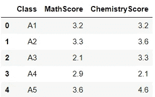
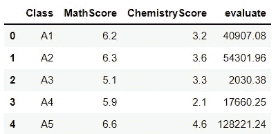
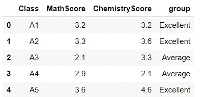

# 在 Python 中应用 Lambda 函数的简单方法

> 原文：<https://towardsdatascience.com/simple-ways-to-apply-lambda-function-in-python-7382276403a4?source=collection_archive---------7----------------------->

## 开始使用高度通用的功能


Yannis Papanastasopoulos 在 [Unsplash](https://unsplash.com?utm_source=medium&utm_medium=referral) 上拍摄的照片

# 什么是λ函数

匿名函数是没有名字的函数。在 Python 中，使用`lambda`关键字来确定匿名函数。这是因为 lambda 函数在定义时不需要名字，不像常规函数。我们使用`lambda`关键字来构造函数，而不是使用`def`关键字。这就是匿名函数也被称为 lambda 函数的原因。

lambda 函数可以有几个参数，但只有一个表达式。以下语法用于声明 lambda 函数:

```
lambda argument(s): expression
```

# 何时使用 Lambda 函数

有成千上万个使用 lambda 函数的用例。然而，当需要函数对象时，它们最常被应用。

此外，lambda 定义中没有“return”语句；相反，它总是包含一个返回的表达式。所以，为了简单起见，可以考虑使用`lambda`函数。

此外，当函数表达式很小时，最好使用 lambda 函数来提高可读性。换句话说，lambda 只能有一个表达式，因此如果你的函数不能用一行代码来描述，就不要使用 lambda 函数。

稍后，我们将探索几个使用 lambda 函数的例子，以便更好地理解它的用例。

# 如何使用 Lambda 函数

## λ和应用

我将通过将 lambda 函数应用于不同的例子来解释它的用法。首先，让我们创建一个简单的数据框进行操作。

```
grade = {'Class':['A1', 'A2', 'A3', 'A4','A5'],
        'MathScore':[3.2, 3.3, 2.1, 2.9, 3.6],
        'ChemistryScore': [3.2, 3.6,3.3,2.1,4.6]}grade = pd.DataFrame(grade)
```

该数据集显示了从 A1 到 A5 的五个班级的数学和化学平均分数。



图 1:数据集—按作者分类的图像

例如，我想根据一个特殊的公式来评估每个班级的数学能力，该公式是将数学分数乘以数学分数本身的幂，然后将结果除以 2。下面是我如何使用`lambda`函数计算的。

```
grade['evaluate']=grade['MathScore'].apply(lambda x: round((x**x)/2,2))
```

`apply`方法调用`lambda`函数，并将计算应用于数据帧的每一行。此外，`apply`还可以对数据框中的每一列进行修改。在这种情况下，在`apply`函数中再指定一个参数作为`axis = 0`。我计算后的结果存储在**“evaluate”**列，如下图所示。

***输出:***



图 2: Lambda +应用——作者图片

在我们的数据框架的另一个例子中(图 1 ),我想根据他们在数学和化学上的表现对班级进行分类。我们可以使用`lambda`很容易地解决这个问题。

```
grade['group']=grade['MathScore'].apply(lambda x: 'Excellent' if x>=3.0 else 'Average')
```

***输出:***



图 3:使用 Apply、Lambda 和条件语句

## **λ和子列表**

假设我有一个如下的列表:

```
list = [[5,6],[12,32,43],[3,43,42]]
```

为了找到具有最大值的子列表，我可以如下应用`lambda`函数和`max`:

```
max(list, key=lambda x: sum(x))
```

因此，[3，43，42]是三个子列表中总值最高的子列表。

## Lambda 和 if-else

万一我想做一个值之间的比较，得到一个更大值的结果。让我们看看如何用`lambda`和`if-else.`来实现它

```
Greater = lambda x, y : x if(x > y) else y
Greater(0.002, 0.5897)
```

结果是 0.5897。简单吧？

## **λ和过滤器**

继续使用图 1 中的示例数据框，我将找出有多少数学成绩大于平均分。`filter`方法可以通过对序列应用 lambda 函数来过滤数据。事情是这样的:

```
mean = mean(grade['MathScore'])
list(filter(lambda x: x> mean,grade['MathScore']))
```

输出是一个大于平均值的数学分数列表:[3.2，3.3，3.6]

在另一种情况下，我想用`filter`方法找到嵌套列表的交集。看看我在下面的两个列表中有什么:

```
group1 = [1, 2,3,43,23,42,8,3,7]
group2 = [[3, 34, 23, 32, 42], [6, 11, 9], [1, 3,9,7,2,8]]
```

现在，通过应用下面的代码，我可以找出一个列表，其中组 2 中的值也存在于组 1 中:

```
[list(filter(lambda x: x in group1, sublist)) for sublist in group2]
```

***输出:*** [[3，23，42]，[]，[1，3，7，2，8]]

简单地说，filter 方法检查每个子列表的项目，以确定它是否包含在组 1 中。列表理解应用于组 2 中的每个子列表。

# 结论

以上是一些简单的`lambda.`例子，希望你觉得有用。如果你有什么有趣的应用，不要犹豫，与我分享。