# 单纯复表示学习

> 原文：<https://towardsdatascience.com/simplicial-complex-representation-learning-a04ccf2d2578?source=collection_archive---------15----------------------->

## [思想和理论](https://towardsdatascience.com/tagged/thoughts-and-theory)

## 使用高阶几何消息传递方案学习整个单纯复表示

[罗南古田](https://unsplash.com/@ronan18?utm_source=medium&utm_medium=referral)在 [Unsplash](https://unsplash.com?utm_source=medium&utm_medium=referral) 上的照片

O 对象表示学习旨在学习一种映射，该映射将该对象的基本组件嵌入到某个欧几里得空间中，同时保留该对象的结构信息。最近，这种方法获得了很大的势头，特别是图形表示学习。具体来说，后者在过去几年里吸引了相当大的流行，在节点级表示学习上都取得了成功。这种图表示的应用是多种多样的，因为它们可以用于诸如图分类或图相似性等领域的几乎任何下游机器学习任务。

本文的目的是将图形表示学习推广到称为*单纯复形*【2】的几何/组合对象。单纯复形是图的一般化，它们可用于存储超出通常用图的边来建模的成对关系的关系。下图给出了单纯复形的例子。

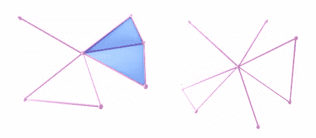

单纯复形的例子

在上图中，左侧 SC 包含两个面。这些面中的每一个都可以被认为是它所包围的三个边中的一个关系，或者一个高维度的“边”。从这个角度来看，很自然地可以将图[3]上常见的信息传递推广到单纯复形 T11。也就是说，高阶面可以用于在它们所绑定的低维面之间发送消息。我们接下来考虑这个。

# 几何消息传递方案

例如，考虑下面的例子:

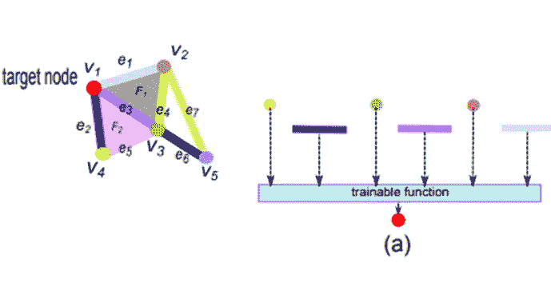

图 1:在单纯复形上传递消息的例子[1]

我们试图通过从图[3]中概括熟悉的消息传递思想来定义单纯复形上的深度学习协议。我们将针对图 1 中给出的红色节点来说明计算图。这个红色节点分别通过边 e1、e3 和 e2 与 v2、v3 和 v3 相邻。我们定义了一个计算图，将这些节点和边考虑在内。这应该与图[3]上的消息传递方案很相似。现在来考虑边缘之间的高阶消息传递协议，我们看一下面[1，7]。

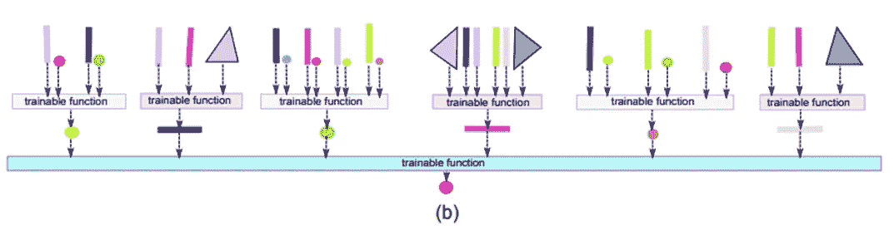

图 2:深入消息传递[1]

我们从图中观察到，蓝色边缘与亮粉色边缘和暗粉色边缘相邻，从某种意义上说，它们都限定了相同的粉色面。为此，计算图如图 2 所示。其他边缘也是如此。注意，图 2 中给出的计算图包含从节点、边和面获得的信号。如下图所示，这种消息传递协议以放射状方式有效地从顶点的邻域收集信息:

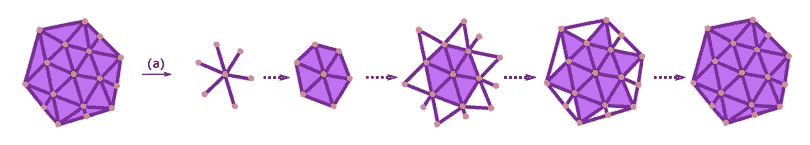

图 3:图 2 中解释的消息传递以放射状方式收集本地信息。如图所示，每次深入网络，我们都会收集更多的信息。

# 三种消息传递方案

上述消息传递方案被称为 ***邻接消息传递方案(AMPS)*** ，因为它考虑了给定单纯复形的邻接关系。如果我们想写一个等式来描述这个方案，它将是这样的:

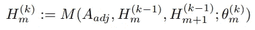

邻接消息传递方案等式[7]

这里的 *H* 是表示单形嵌入的向量。下标 m 是单纯形的维数，上标代表计算阶段。θ是训练参数。注意，在前面的等式中，更新考虑了从 *m* 和 *m+1* 尺寸获得的信号。这与上面的图 1、2 和 3 是一致的。此外，上述等式概括了常见的图形神经网络消息传递协议:

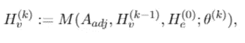

图的通用消息传递方程[7]

注意，当 *m=0* 时，基本上等式是相同的。

然而，单纯复形的情况要有趣得多，并且可以定义其他自然消息传递协议。

***共邻接消息传递方案(CMPS)*** 是一种消息传递方案，从较高的面开始，对较低维度的面进行计算，如下图所示:

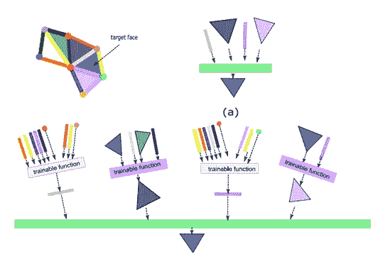

图 4:相邻消息传递方案[1]

这里的信息流通过以下方式给出:

图 CMPS 中的信息流

观察到信息从高阶面孔流向低阶面孔，与前一种情况相反。例如，如果一个人需要对一个给定的单纯复形的面进行分类，这种方案是有用的。

上述方案的等式给出如下:

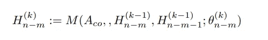

请注意，它非常类似于 AMPS 方程，唯一的区别是此处的更新考虑了较低的相邻面，而不是较高的相邻面。

我们在这里介绍的第三个消息传递代理是一个考虑了边界和联合边界关系的代理。看一个例子是最容易的。我们考虑关于粉红色边缘的情况。这条边的边界是红色和绿色节点，共同边界面是蓝色和粉色面。这解释了下图(a)中的计算图

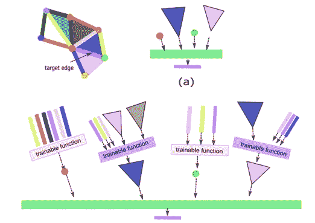

图 6:边界/联合边界消息传递方案(BCMPS)

深入研究上面的网络，我们可以得到上面图(b)中给出的计算图。下图给出了这里的信息流:

图 7:图 6 中给出的 BCMPS 中的信息流。

上述三种消息传递协议最早出现在[1，7]中。

# 单纯复数自动编码器

我们现在看看如何使用上述方案之一(AMPS)来定义一个单纯复数自动编码器。给定一个单纯复形 x，单纯复形自动编码器[1，7]由三部分组成:

(1)编码器-解码器系统，自动编码器的可训练组件。

具体来说，编码器和解码器是以下形式的函数

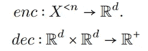

单纯复形上的编码器和解码器功能

(2)感兴趣对象的相似性度量，它是用户定义的相似性函数，表示对象之间相似性的概念，

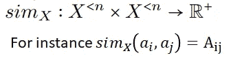

单纯复形上的相似性度量可以是，比如说，它的邻接矩阵。

我们希望上面指定的编码器-解码器系统学习单纯形的嵌入表示，使得:

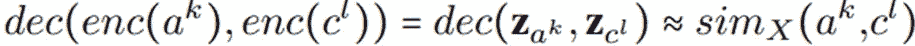

这里 **z_a** 表示单形 a 在欧几里德空间内的嵌入。为了满足上面的等式，我们定义了一个损失函数来强制这些关系。

(3)损失函数，它是用户定义的函数，用于根据相似性度量来优化编码器-解码器系统。

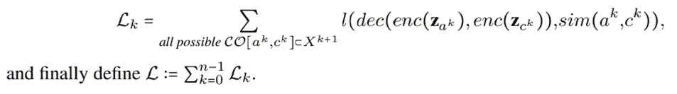

上面的定义有效地定义了单纯复形上的自动编码器。相关处理方法参见[4]、[5]和[6]。

# 学习完全单纯复表示

假设我们已经训练了一个编码器解码器系统，就像我们在上一节中描述的那样。我们寻求学习单形复级嵌入的形式:

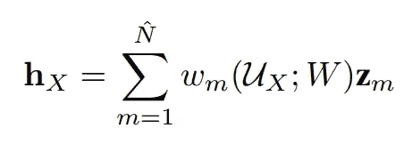

这里 *U_X* 表示由经过训练的编码器编码器( *enc，dec)(详见【7】)*导出的 X 的单形嵌入，以及

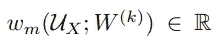

是嵌入 z_m 的单纯形的权重。这些权重可以通过(例如)学习:

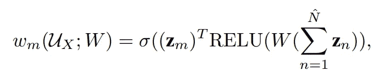

最后，嵌入 hX 的整个单纯复形可以用多种方法学习。例如，给定一个单纯复形{Xi}的集合，可以通过最小化目标来学习复形到复形的邻近嵌入:

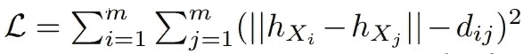

在哪里

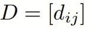

是单纯复形{Xi}上适当选择的距离矩阵。

# **参考文献**

[1] Mustafa Hajij、Kyle Istvan 和 Ghada Zamzmi。[细胞复杂神经网络](https://arxiv.org/abs/2010.00743)。2020 年 NeurIPS 拓扑数据分析研讨会。

[2]艾伦·哈奇，[代数拓扑](https://books.google.com/books?hl=en&lr=&id=xsIiEhRfwuIC&oi=fnd&pg=PR9&dq=hatcher+algebraic+topology&ots=ZpSMioccuT&sig=yabOENNgsVaQXc78e1mB3HWK20Q)，2005。

[3] Gilmer，j .，Schoenholz，S. S .，Riley，P. F .，Vinyal，o .和 Dahl，G. E,《量子化学传递神经信息》。《2017 年国际机器学习会议论文集》

[4]雅各布·查尔斯·赖特·比林斯、米尔科·胡、朱利亚·勒达、阿列克谢·梅德韦杰夫、弗朗切斯科·莫特斯、阿德里安·奥尼卡斯、安德里亚·桑托罗和乔瓦尼·佩特里。用于单纯复形中社区检测的简单 x2vec 嵌入。

[5]迈克尔·T·绍布、奥斯汀·R·本森、保罗·霍恩、加博尔·利普纳和阿里·贾德巴贝。单纯复形上的随机游动和归一化的 Hodge 1-拉普拉斯算子。暹罗评论，62(2):353–391，2020。

[6]西莉亚·哈克。k-simplex 2 vec:node 2 vec 的单纯扩展。NeurIPS 拓扑数据分析研讨会，2020 年

[7]穆斯塔法·哈吉、加达·扎姆兹米和蔡轩亭，单纯复表示学习，arXiv 预印本 arXiv:2103.04046 (2021)