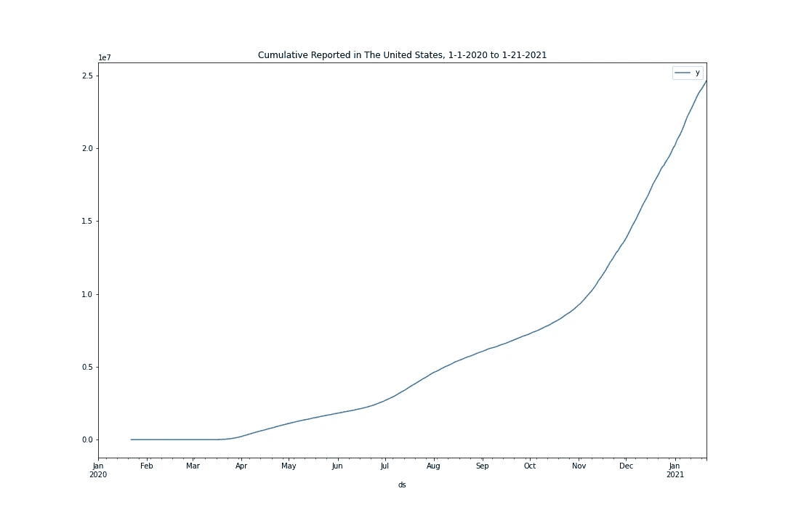
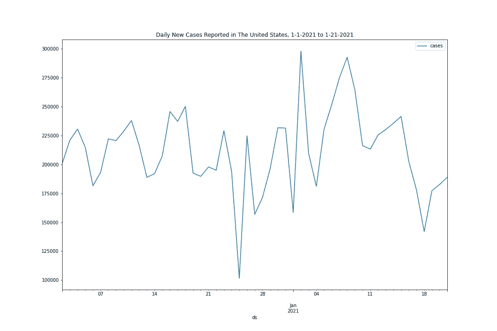
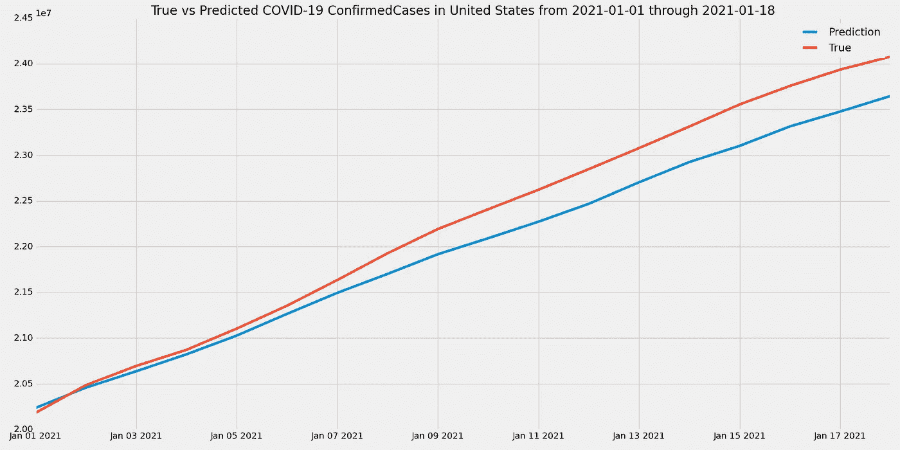
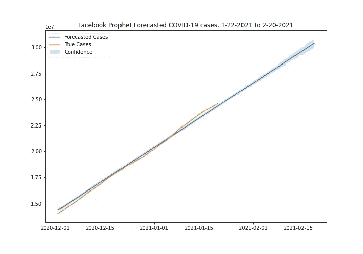

# 用脸书预言家简化预测

> 原文：<https://towardsdatascience.com/simplified-forecasting-with-facebook-prophet-d5789d32acdf?source=collection_archive---------21----------------------->

## fbprophet 库快速预测入门

照片由[德鲁·比默](https://unsplash.com/@drew_beamer?utm_source=medium&utm_medium=referral)在 [Unsplash](https://unsplash.com?utm_source=medium&utm_medium=referral) 上拍摄

# 为什么是脸书先知？

## 时间序列预测的挑战

时间序列预测是一种复杂的艺术形式。许多模型对趋势、周期(称为“季节”)和不断变化的波动幅度非常敏感，而是需要静态数据，而这些数据缺乏这些特征。

非平稳数据的一个很好的例子是 2020 年新冠肺炎在美国的累积扩散。在这个项目中，我将使用冠状病毒政府反应跟踪器的数据，该跟踪器提供每个国家的每日更新数据，包括政府干预。如果您希望通过包含外生变量(建模数据之外的变量，可能会对其产生影响)来进一步进行预测，您可以在该数据集中找到许多相关变量。然而，对于这个例子，我们将只使用美国的累计报告感染。

从上面可以看到，不仅有上升趋势，而且趋势还在不断变化。从累积数据来看，季节性并不明显，但当我们进行一阶差分将累积病例转换为每日新病例时，我们会看到季节性出现。

作者图片

每周的季节性可能是因为:

1.  人们往往在周末接受检测，他们的结果往往在周三回来，造成报告病例的高峰在周三，低谷在其他日子。或者，
2.  实验室在特定的日子报告大量病例。

请注意 12 月 7 日、12 月 14 日、12 月 21 日等的下跌。12-25 日和 01-01 日也有大幅下跌。我想圣诞节和元旦期间没有多少实验室工作人员在工作，所以报告数量有所下降。

我们必须记住，数据不是事实，图表中的病例实际上是报告的病例，而不是实际的感染。报告模式造成了数据的季节性。

## 阿玛系列模特

ARMA 模型是自回归模型和移动平均模型的组合，是预测平稳时间序列数据的重要工具。我不会在这里详细解释，因为这篇文章是关于一种不同的技术，但是你可以在这里[阅读。](https://en.wikipedia.org/wiki/Autoregressive%E2%80%93moving-average_model)

ARMA 模型的扩展，如 ARIMA 可以解释趋势，s ARIMA 可以考虑数据的季节性。然而，这些模型的准确性需要仔细调整几个超参数，以确定过去的数据如何以及在何种程度上影响未来。数据科学家通常会对数据进行一系列转换，例如减去移动平均值或标准偏差，或者对其进行对数缩放以获得良好的预测。通过足够的努力和专业知识，这些都是强大的模型。

通过努力和彻底的数据探索，我调整了我的数据库，以 99%的准确率预测 1 月前 18 天的病例。你可以通过我的 [Github repo 预测 COVID 病例率来体验我在 SARIMA 建模方面的冒险。](https://github.com/Violet-Spiral/covid-xprize/blob/main/models/sarima_models.ipynb)

使用 SARIMA 模型预测 2021 年 1 月的累计新冠肺炎病例，该模型仅根据 2020 年的数据进行训练，并与同期的实际累计病例进行比较。作者图片

# 用脸书预言家做一个简单的预测

R 和 Python 脸书先知库为您做了大量的工作。它允许快速和简单的时间序列预测，但也为经验丰富的预测者提供了调整内部设置的选项。它可以检测并调整残差中的季节性、趋势和移动标准偏差。然而，它是关于你如何实现它的。让我们看看如何开始。

## 加载 fbprophet 并准备数据

我们可以用`!pip install fbprophet`轻松地将 Prophet 安装到 Google Colab 笔记本中。

在我运行 Anaconda 包管理器的本地 Windows 机器上，我用 bash 终端安装了它，脸书在这里有更多关于安装的指南。

作者要点

您可能会注意到，最后一行将“日期”列重命名为“ds”，将“累计案例”列重命名为“y”。这是脸书要求的，以便使用数据框架进行建模。许多有经验的 Pandas 用户可能会尝试将 datetime 列作为索引，但是对于 Prophet，**不要这样做。**

## 用 Prophet 预测

我们的数据框架已经可以建模了。创建和训练开箱即用的模型非常简单:

`m = Prophet()
m.fit(df)`

但是，这是棘手的部分。你必须准备一个特殊的数据帧来存储实际的预测。幸运的是，这个模型提供了一个方便的方法来帮你做这件事。

`future = m.make_future_dataframe(periods=length_of_desired_forecast)`

最后，要进行预测，只需将`future`数据帧作为模型的`.predict()`方法的参数，如下所示:

`forecast = m.predict(future)`

我喜欢脸书的人们创造的变量名惯例，其中模型预测未来以做出预测。对我来说，这是令人满意的，也是恰到好处的。

以下是对未来 30 天的新冠肺炎病例进行预测的完整代码。作者图片

`forecast`将是一个包含您的预测的数据帧，位于您的`future`数据帧中“ds”列的末尾。它包括置信区间和模型用于每一步预测的所有参数。这允许对模型的内部工作进行一些有趣的检查，并有机会用置信带做一些有趣的图表。

作者图片

从上面可以看到，这个开箱即用的预言家模型做了一个非常基本的线性回归作为预测。模型的进一步调整将提高精确度。如果您运行该代码，您将看到警告，表明 Prophet 已经自动识别数据中的每周季节性，但您可以手动告诉它寻找每月或每年的季节性。你可以尝试一些其他的调整和改进，包括添加额外的(外生的)变量，比如假期或我们使用的数据集中提供的政府干预。

Greg Rafferty 的这篇精彩的[文章提供了更全面的指导。但是，以上应该让你离开地面，给你一些东西开始。](/forecasting-in-python-with-facebook-prophet-29810eb57e66)

如果你想看我在尝试预测 Xprize 比赛的新冠肺炎案例方面的全部工作，[你可以在这里查看:](https://github.com/Violet-Spiral/covid-xprize)
(剧透，我最终选择了更准确的萨里玛模型)

## **参考文献**:

[脸书先知快速入门指南](https://facebook.github.io/prophet/docs/quick_start.html)

[用 Python 预测脸书预言家](/forecasting-in-python-with-facebook-prophet-29810eb57e66)Greg raff erty

**数据:**

[冠状病毒政府响应跟踪系统](https://www.bsg.ox.ac.uk/research/research-projects/coronavirus-government-response-tracker)
感谢 Blavatnic 政府学院和牛津大学