# 神经网络背后的简化数学

> 原文：<https://towardsdatascience.com/simplified-mathematics-behind-neural-networks-f2b7298f86a4?source=collection_archive---------16----------------------->

图片由 [**阿丽娜**](https://unsplash.com/@alinnnaaaa) **上** [**下**](https://unsplash.com)

神经网络是将数据映射到信息的通用近似器。这是什么意思？神经网络能解决任何问题吗？神经网络是逐场景/逐帧分析、股票价格预测、零售和许多其他目的的成熟解决方案。我们很多人都在企业级使用它，但是有多少人真正理解它呢？

为了回答这个问题，*‘神经网络能解决任何问题吗？’*，还是从基础说起吧。一个 NeuralNet 由称为层的垂直堆叠组件组成:*输入、隐藏、*和*输出。*每一层都由一定数量的神经元组成。输入图层具有数据集的属性(要素)。基于问题陈述，可以有具有多个神经元的多个隐藏层，并且输出层可以具有多个神经元。

# 理解感知器和激活函数

感知器(或神经元)是神经网络的基本粒子。它的工作原理是*阈值化。*设 *f(x)* 为阈值为 40 的求和函数。

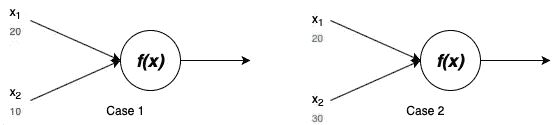

图一。神经元的放电(图片由作者提供)

在这两种情况下，定义的函数都返回两个输入的和， *x₁，*和 *x₂.*在第一种情况下，函数返回小于阈值的 30。在第二种情况下，函数返回大于阈值的 50，神经元将被激活。这个函数比这个复杂。典型神经网络的神经元接收乘以其*权重*并加上*偏差*的输入值之和，并且该函数也称为*激活函数*或*阶跃函数*帮助做出决策。

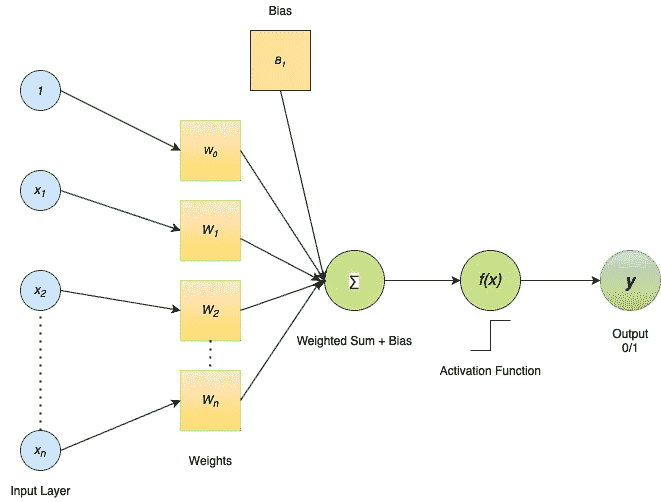

图二。感知器(作者图片)

激活函数将来自节点的输出转换成二进制输出；如果加权输入超过阈值，则为 1，否则为 0(取决于激活函数)。有三种最常见的激活功能:

## 乙状结肠的

Sigmoid 是一种广泛使用的激活函数，有助于捕捉非线性关系。

图三。s 形曲线([来源](https://en.wikipedia.org/wiki/Sigmoid_function#/media/File:Logistic-curve.svg))

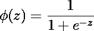

对于 *z 的任何值，*函数*φ(z)*将总是返回二进制(0/1)输出。正因为如此，在概率型题中被广泛使用。

## 正切双曲线

它或多或少类似于 Sigmoid 函数，但是 *tanh* 的范围是从-1 到 1，这使得它适合于分类问题。它是非线性的。

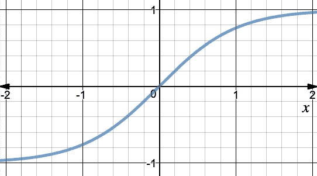

图 4。tanh 曲线(图片由作者提供)

## 整流线性单位

它是深度学习中使用最多的激活函数，因为它没有其他激活函数复杂。 *f(x)* 返回 0 或者 *x* 。

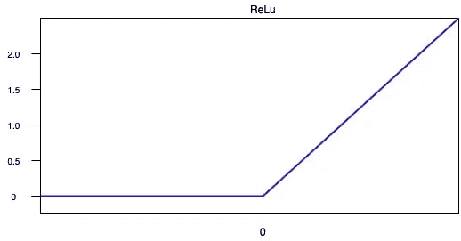

图五。ReLu 曲线(图片由作者提供)

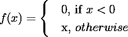

这使得计算变得容易，因为 ReLu 函数的导数返回 0 或 1。

# 神经网络

为了理解神经网络的黑盒，让我们考虑一个具有 3 层的基本结构；输入层、密集/隐藏层(连接在神经元的两侧)和输出层。

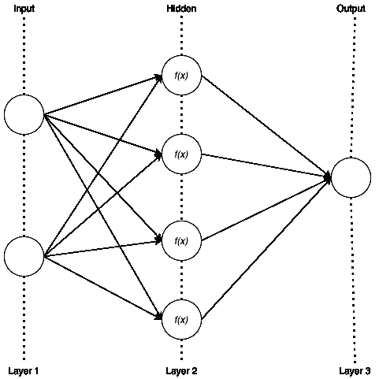

图六。简单的神经网络(图片由作者提供)

权重和偏差是随机初始化的。神经网络输出的准确性在于通过不断更新来找到*权重*和*偏差*的最佳值。让我们考虑一个等式， *y = wx* ，其中“w”是权重参数，“x”是输入特征。简单来说， *weight* 定义了赋予特定输入属性(特征)的权重。现在，方程 *y = wx* 的解总会经过原点。因此，增加了一个截距来提供自由度，以适应被称为*偏差*的完美拟合，等式变为 *ŷ = wx + b* ，我们都熟悉*。*因此，偏差允许激活函数的曲线上下调整轴。

现在让我们看看神经网络可以变得多么复杂。对于我们的网络，输入层有两个神经元，密集层有四个，输出层有一个。每个输入值都与其权重和偏差相关联。输入特征与权重和偏差的组合通过密集层，在密集层中，网络在*激活函数*的帮助下学习该特征，它具有自己的权重和偏差，并最终进行预测(输出)。这就是*正向传播*。那么，我们的网络总共有多少个参数？

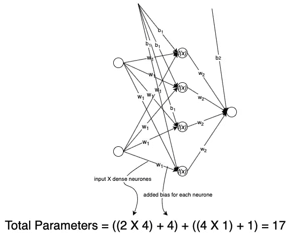

图 7。神经网络的总参数计算(图片由作者提供)

对于这样一个简单的网络，总共有 17 个参数需要优化，以便得到最优解。随着隐藏层数量和其中神经元数量的增加，网络获得了更多的能力(直到某一点)，但我们有指数数量的参数要优化，这可能会占用大量的计算资源。所以，有一个权衡。

# 更新网络

在前向传播的单次迭代之后，通过取实际输出和预测输出之间的(平方)差来计算*误差*。在网络中，输入和激活函数是固定的。因此，我们可以改变权重和偏差来最小化误差。可以通过注意两件事来最小化误差:通过少量改变权重来改变误差，以及改变的方向。

# 价值函数

一个简单的神经网络基于线性关系预测值， *ŷ = wx + b，*其中 *ŷ(预测)*是 *y(实际)的近似值。*现在，可以有几条直线来拟合 *ŷ.*为了选择最佳拟合线，我们定义了*成本函数。*

让 *ŷ = θ₀ + xθ₁.*我们需要找到 *θ₀* 和 *θ₁* 的值，使得 *ŷ* 尽可能靠近 *y* 。为此，我们需要找到 *θ₀* 和 *θ₁* 的值，使得以下定义的误差最小。

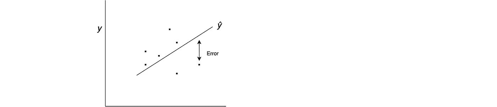

(图片由作者提供)

误差， **E =** 实际值与预测值之差的平方，即= *(ŷ - y)*

因此， ***成本=(1/2n)(θ₀+xθ₁-y)****其中 *n* 是用于计算均方差的点的总数，并且除以 *2* 以减少数学计算。因此，我们需要最小化这个成本函数。*

# *梯度下降*

*该算法通过最小化成本函数来帮助找到 *θ₀* 和 *θ₁* 的最佳值。我知道***c =(1/2n)(θ₀+xθ₁—y)****。*对于解析解，我们取 ***C*** 关于变量的偏导数(**)，称为*梯度*。***

**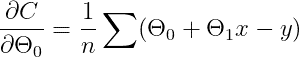****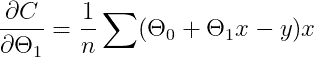**

**这些梯度代表斜率。现在，原来的成本函数是二次的。所以，图表看起来像这样:**

**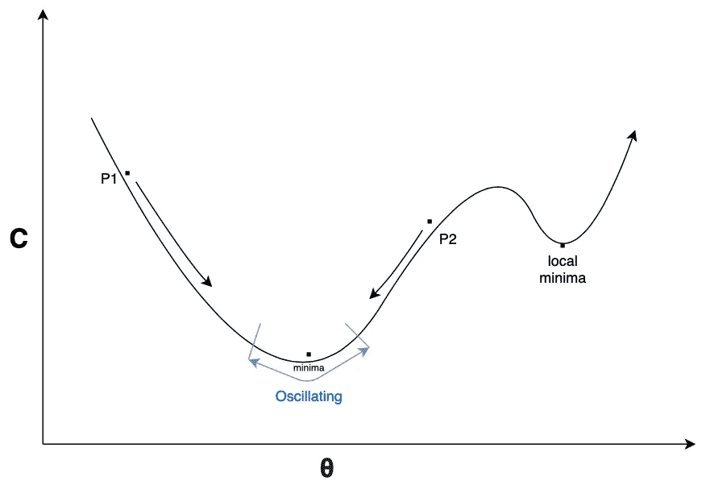**

**图 8。梯度下降曲线(图片由作者提供)**

**更新 *θ* 的公式为:**

**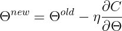**

**如果我们在点 *P1* ，斜率为负，这使得梯度为负，整个方程为正。因此，该点正向下移动，直到达到最小值。类似地，如果我们在点 *P2* ，斜率为正，这使得梯度为正，并且整个方程向负方向移动 *P2* ，直到它达到最小值。这里， *η* 是一个点向最小值移动的速率，称为*学习速率*。所有的*θ’*同时更新(对于某些*时期*)并计算误差。**

## **顺便提一下**

**照此下去，我们可能会遇到两个潜在的问题:1 .在更新 *θ，*的值时，您可能会陷入局部最小值。一种可能的解决方案是使用具有动量的随机梯度下降(SGD ),这有助于越过局部最小值；第二。如果 *η* 太小，收敛时间太长。或者，如果 *η* 太大(甚至中等偏高)，它会继续在最小值附近振荡，永远不会收敛。因此，我们不能对所有参数使用相同的学习率。为了处理这个问题，我们可以安排一个例程，在梯度向最小值移动时(例如余弦衰减)，调整 *η* 的值。**

# **反向传播**

**通过使用*梯度下降*算法优化和更新*权重*和*偏差*的一系列操作。让我们考虑一个简单的神经网络(图 2。)具有输入、单个隐藏层和输出。**

**设， **x** 为输入， **h** 为隐含层， **σ** 为 sigmoid 激活， **w** 权重， **b** 为偏置， **wᵢ** 为输入权重， **wₒ** 为输出权重， **bᵢ** 为输入偏置， **bₒ** 为输出偏置， **O****

**现在，我们通过堆叠从输入到输出的一系列操作来创建图 2 的计算图。**

**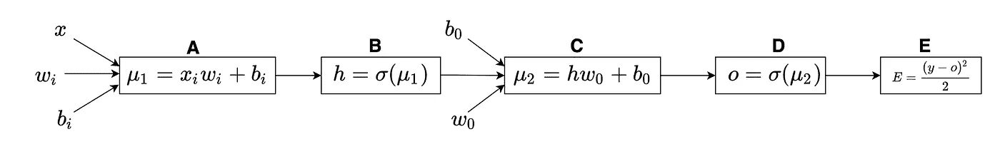**

**图九。计算图(图片由作者提供)**

**这里， **E** 依赖 **O** ， **O** 依赖 **μ₂** ， **μ₂** 依赖 **bₒ** ， **wₒ** & **h** ， **h** 依赖 **μ₁** ， **μ₁** 依赖 **x** ，我们需要计算权重和偏差的中间变化(依赖性)。因为只有一个隐藏层，所以存在输入和输出权重和偏差。所以，我们可以把它分成两种不同的情况。**

## **案例 1: w.r.t .输出权重和偏差**

**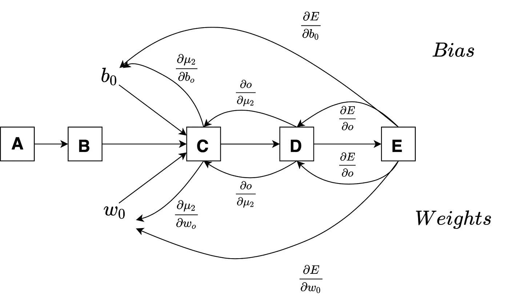**

**图 10。案例 1 的计算图(图片由作者提供)**

**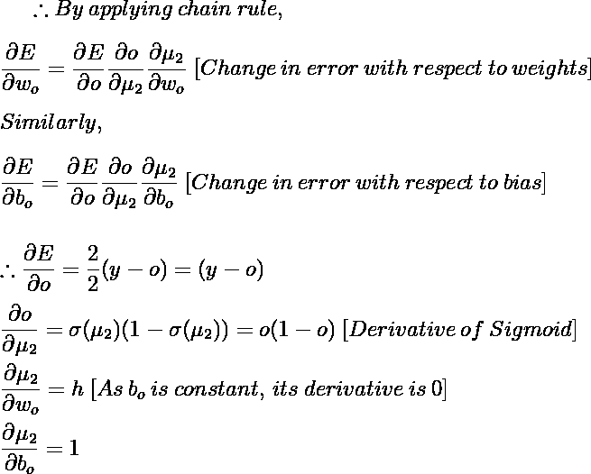**

**因此，通过将导数的值放入上述两个误差变化方程中，我们得到梯度如下**

**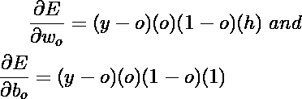**

**我们可以通过以下等式更新权重和偏差:**

**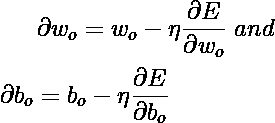**

**这个计算是针对隐藏层和输出的。同样，对于输入和隐藏层如下。**

## **案例 2: w.r.t .输入权重和偏差**

**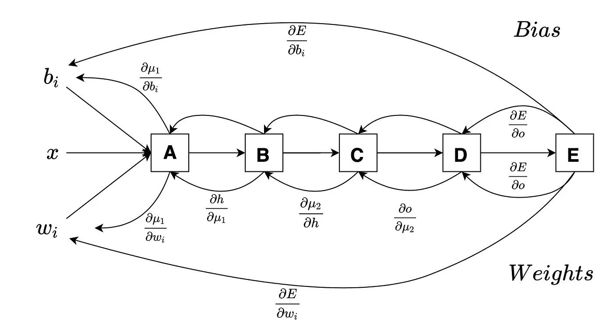**

**图 11。情况 2 的计算图。(图片由作者提供)**

**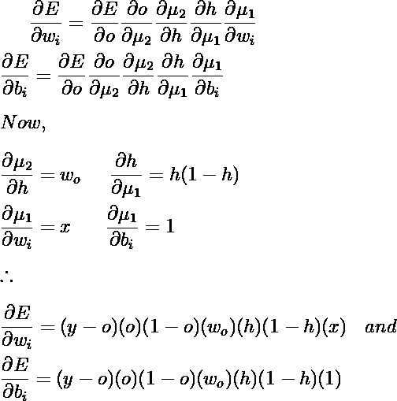**

**我们可以使用以下方法更新这些梯度:**

**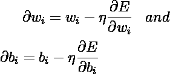**

**两种情况同时发生，计算误差，直到称为*时期的重复次数。*神经网络有监督。在它运行了一定数量的历元后，我们为数据集的选定要素提供了一组优化的权重和偏差。当在这个优化的网络中引入新的输入时，它们用权重和偏差的优化值来计算，以实现最大的精度。**

# **神经网络能解决任何问题吗？**

**如前所述，神经网络是通用逼近器。理论上，它们能够表示任何函数，因此可以解决任何问题。随着网络的增长(更多的隐藏层)，它获得了更多的能力，但是有指数数量的参数需要优化，这需要大量的资源。**

**实现可以在[这里](https://github.com/codebankss/NeuralNet/tree/main/Simplified%20Mathematics%20behind%20Neural%20Networks)找到。**