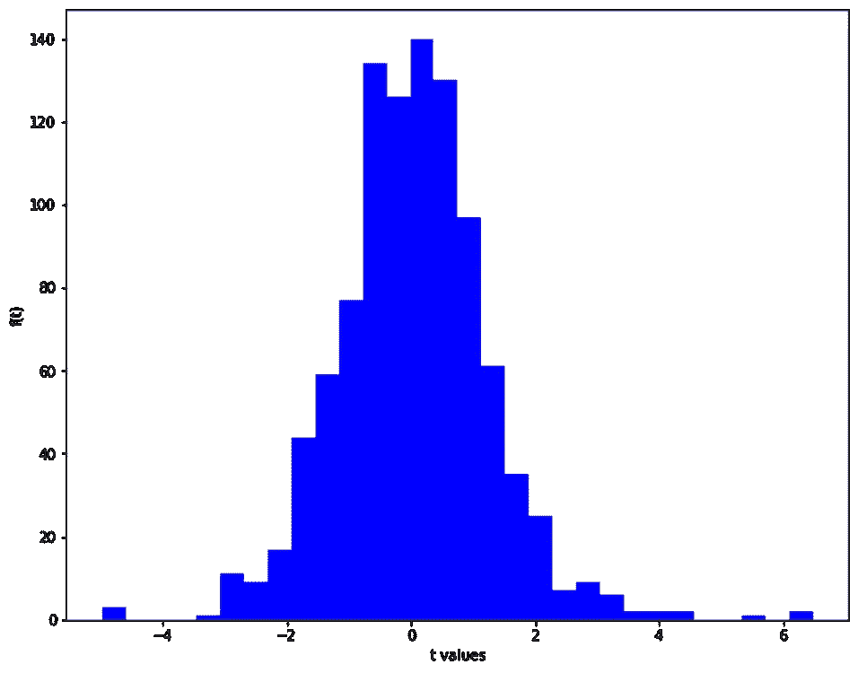

# 简化的学生 t 分布

> 原文：<https://towardsdatascience.com/simplified-students-t-distribution-8ce0e4b950a4?source=collection_archive---------29----------------------->

## 统计学中的分布序列

图片来自 [Unsplash](https://unsplash.com/photos/exf4mcFw4zg)

> **简介**

数据无处不在。我们需要的是通过处理数据来找到数据的核心，并通过提取隐藏在内部的东西来让数据为我们服务。数据分析师、科学家和工程师是实现这一目标的一线人员。当我们谈论数据时，数据点的分布非常重要。它让我们快速了解了数据的平均值和标准差。此外，数据的正态性检验非常重要，因为各种统计测量都是基于正态分布的。在这里，我将讨论 t 分布，它是正态分布和二项式分布的一个家族，对可能出现两种结果的事件的决策非常有影响。

> **T 分布**

t 分布类似于正态分布，只是它的尾部更粗更长。正态分布具有正态形状，这意味着它在偏离中心几个标准偏差后下降到 0，而 t 分布是一族几乎正态形状的曲线，这些曲线因采样数不同而不同。我们来澄清一下说法。中心极限定理指出，当我们随机抽样且抽样次数足够多时，样本均值的分布将遵循正态曲线。让我们试着实现它。

我们有 30000 个测量值，我们想取 5000 个样本，替换 1000 次。然后，我们将计算每个样本的平均值，并绘制样本平均值。

全体人口(图片由作者提供)

一旦获得样本平均值，它们的分布将类似于下图。这证明了虽然总体是非正态的，但样本均值的分布类似正态分布曲线。样本均值也非常接近总体均值。这就是中心极限定理的精髓。当样本容量越来越大时，样本均值的分布接近正态分布。

样本大小= 500 的样本均值分布(图片由作者提供)

如果样本大小是 50 而不是 500，分布变得更宽。

样本大小= 50 的样本均值分布(图片由作者提供)

很明显，样本大小在分布曲线中很重要。样本量越小，分布就成为 t 分布的一部分，尾部越厚越长。当两个图形重叠时，视觉上可以理解。

绿色(样本量= 500)和红色(样本量= 50)(图片由作者提供)

> **标准化测试统计**

在现实世界中，我们不处理正态分布的数据，因为大部分时间人口参数是未知的。在这些情况下，样本提供了一种通过估计获得总体参数的方法。如前所述，不同的样本量提供不同的 t 分布，我们需要一个检验统计量来衡量我们感兴趣的效果。在这种情况下，我们感兴趣的是样本数据的正态性。我们可以利用 t 值并将其作为检验统计量来区分 t 分布。

我有另一篇关于 t 检验的文章，读者可能会发现它与这个讨论有关。

 [## 统计检验:T 检验和方差分析

### 快速比较意味着使用 python 的库

towardsdatascience.com](/statistical-tests-t-test-andanova-674b242a5274) 

t 作为检验统计量

当我们用 5 的小样本量绘制 t-统计量的分布时，我们得到了一个具有较长尾部的分布。样本号是自由度的去定义器。一般来说，如果样本大小为 N，自由度为 N-1。

样本量= 5 的 t 统计分布(图片由作者提供)

我们可以证明自由度也是 t 分布族中的区别因素。样本量为 10 和 50 时，我们得到以下分布。

样本量= 10 的 t 统计分布(图片由作者提供)

样本量= 50 的 t 统计分布(图片由作者提供)

当一起绘制时，它将在视觉上具有吸引力。理论上当自由度为无穷大时，情节变得正常。

黄色(样本量= 5)、蓝色(样本量= 10)和绿色(样本量= 50)(图片由作者提供)

seaborn 软件包的 kdeplot 提供了一种可视化观察分布的方法，这种方法类似于直方图，但它不是绘制频率，而是绘制连续的概率密度。当使用时，它也揭示了 t 分布的长尾。

KDE(核密度估计)图

> **结论**

对于数据科学家和统计学家来说，正态分布的数据听起来像是奢侈品。真实世界的数据有时类似于正态分布，但本质上，它遵循一族 t 分布。这篇文章展示了对 t 分布族以及正态分布的清晰解释。在处理样本时，利益相关者应该意识到样本大小对关键决策估计的影响。

[我的 Github 页面](https://mdsohelmahmood.github.io/2021/12/15/T-distribution.html)