# 使用道格拉斯·普克算法简化折线

> 原文：<https://towardsdatascience.com/simplify-polylines-with-the-douglas-peucker-algorithm-ac8ed487a4a1?source=collection_archive---------7----------------------->

## 一种减少折线中数据点数量的算法

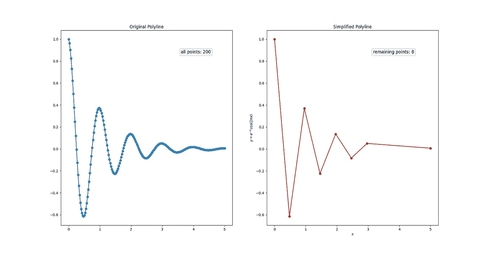

作者图片

# 一.动机

在开发路径跟踪应用和文档扫描应用时，我惊讶地发现这两个应用都需要某种折线简化算法。第一种方法需要算法来减少要保存到数据库中的路线点(纬度、经度)的数量，而后者使用该算法来拟合分割掩模中白色像素周围的四点多边形。虽然这两个应用程序是在两个不同的框架(Flutter 和 Android Native)中编写的，但在这两个实例中，我最终都使用了道格拉斯·普克算法的实现。因此，在这篇文章中，我想把重点放在这个有趣而简单的算法上，并提供该算法在 Python 中的一个“从头开始”的实现。

> 对于那些好奇的人，我使用的 Flutter 实现是由 [darwin-morocho](https://github.com/darwin-morocho/douglas-peucker-dart) 提供的，Android 原生实现是由 OpenCV 在其 [approxPolyDP 函数](https://docs.opencv.org/3.4/javadoc/org/opencv/imgproc/Imgproc.html#approxPolyDP(org.opencv.core.MatOfPoint2f,org.opencv.core.MatOfPoint2f,double,boolean))中提供的。

# 二。道格拉斯·普克算法

> 该算法也被称为 Ramer-Douglas-Peucker 算法，因为早在一年前的 1972 年，Urs Ramer 在其题为“平面曲线多边形近似的迭代程序”(Ramer，1972)的论文中重复了类似的思想。

1973 年，David H. Douglas 和 Thomas K. Peucker 发表了一篇题为“减少表示数字化线或其漫画所需点数的算法”的论文(Douglas & Peucker，1973)。其中他们引入了两种算法。其中一种算法已经被广泛实施，通常被称为道格拉斯·普克算法。该算法的目的是产生一个简化的折线，它比原始折线具有更少的点，但仍然保持原始折线的特征/形状。为了理解算法是如何工作的，我们可以一步一步地看看它是如何在图 1 中的四点折线上运行的。

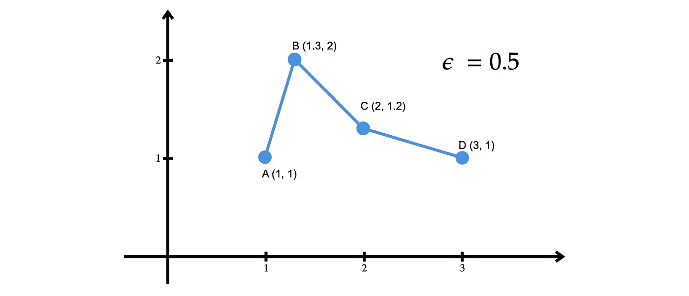

图 1:原始折线。作者图片

## 第一步

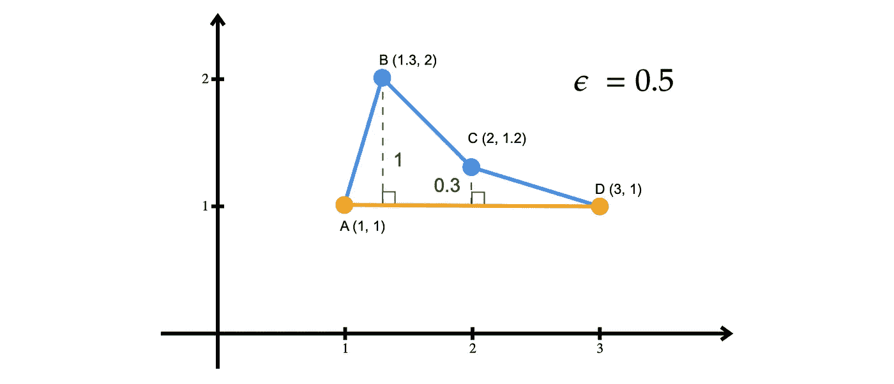

图 2:B 和 C 到 AD 线的距离。作者图片

该算法从识别折线的起点和终点开始。在他们的论文中，Douglas & Peucker (1972)将这两个点分别称为锚点和浮点。在我们的例子中，这些点是 *A* (开始)和 *D* (结束)。对于折线中既不是起点也不是终点的其他点( *B* 和 *C* ，它计算从该点到起点和终点形成的直线的“垂直距离”。这就给了我们 *d(B，AD) = 1* 和 *d(C，AD) = 0.3* 。

## 第二步

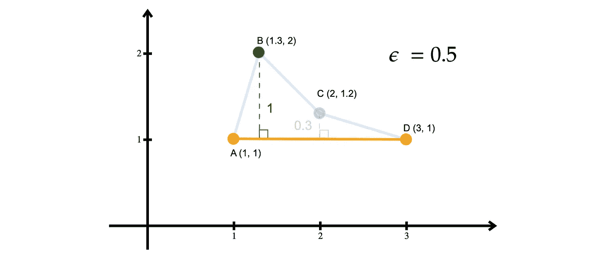

图 3: B 离 AD 线最远。作者图片

然后该算法选择最远的点。在我们例子中，点是 b。我们称这个点为最大值*。然后，它将 *d(B，AD)* 与 epsilon ( *ε* )值进行比较(在我们的示例中为 0.5)。由于 *d(B，AD)* > *ε* ，该算法将折线分为两个子线段。一段由*最大值* ( *A* 和 *B* )左侧的所有点组成，另一段由*最大值* ( *B* 、 *C* 、和 *D* )右侧的所有点组成。*

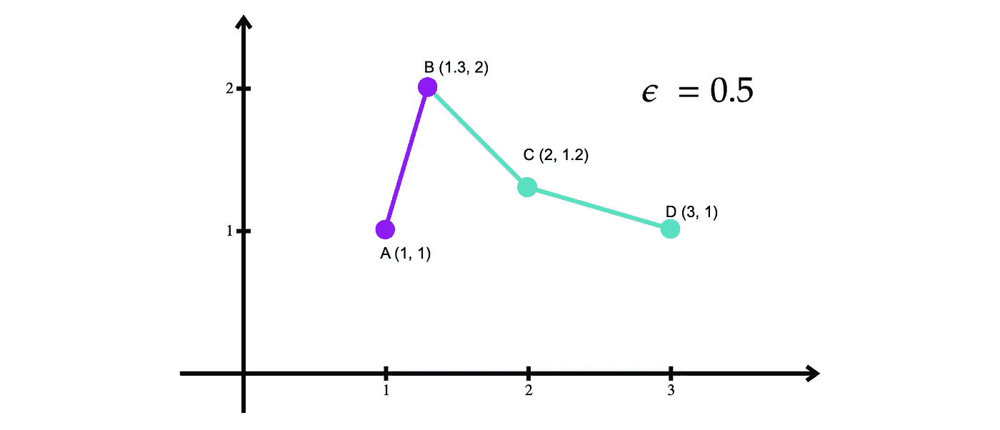

图 4:原始折线被分成两段。作者图片

## 第三步

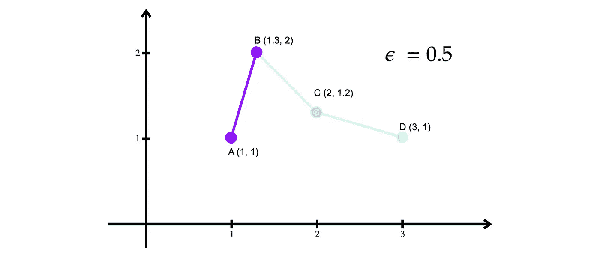

图 5:第一部分。作者图片

该算法然后在第一段上再次执行步骤 1。它将起点和终点分别标识为 *A* 和 *B* 。然而，与之前的迭代不同的是，在这个片段中只有两个点。在这种情况下，该算法不能进一步减少点数，因为直线是任何折线的最简单近似。因此， *A* 和 *B* 被保留。

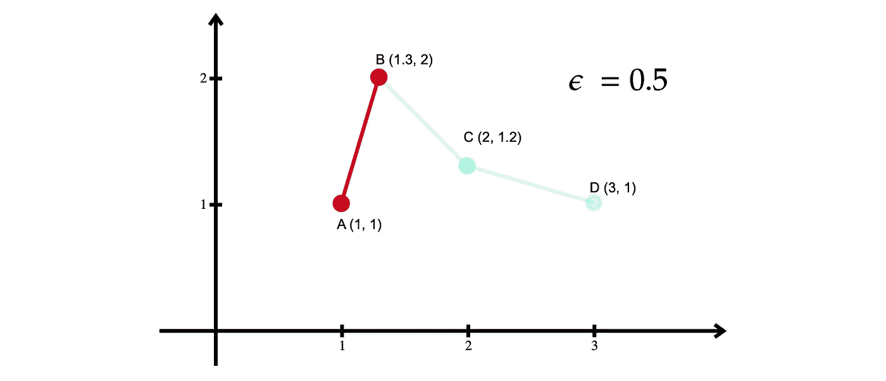

图 6:从第一个片段中选择的点。作者图片

## 第四步

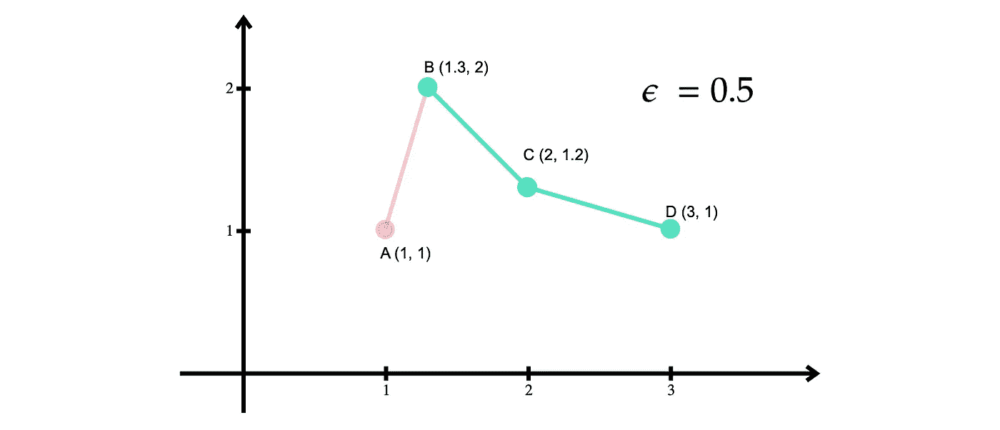

图 7:第二部分。作者图片

类似地，对于第二段，算法执行步骤 1 以将 *B* 和 *D* 识别为起点和终点，并计算所有剩余点(在我们的示例中只有 *C* )与由 *B* 和 *D* 形成的直线之间的垂直距离。

图 8:从 C 到 BD 线的距离。作者图片

由于除了 *B* 和 *D* 之外剩下的唯一一个点就是 *C* ，所以它是距离最远的点。因此，该算法将 *d(C，AB)* 与 *ε* 进行比较。与第一次迭代不同， *d(C，AB)* < *ε* 。因此，该段可以去掉点 *C* ，只保留 *B* 和 *D* 。

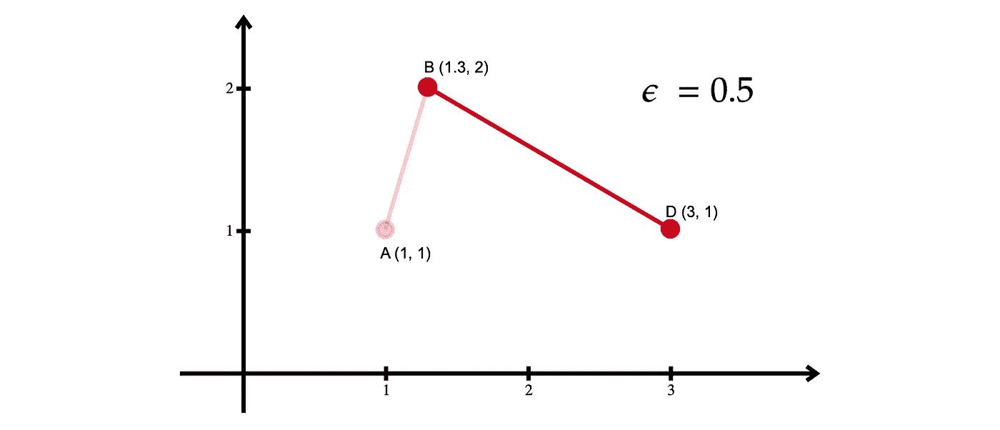

图 8:从第二段中选择的点。作者图片

## 第五步

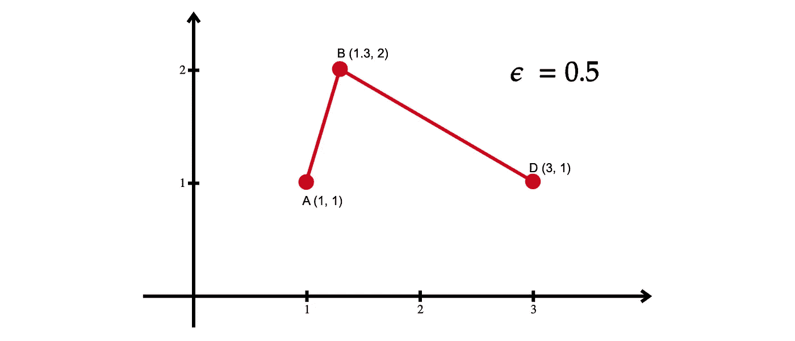

图 9:算法的结果。作者图片

在第一段和第二段上完成所有迭代后，该算法将所有结果组合在一起，以创建原始折线的简化版本。

# 三。代码

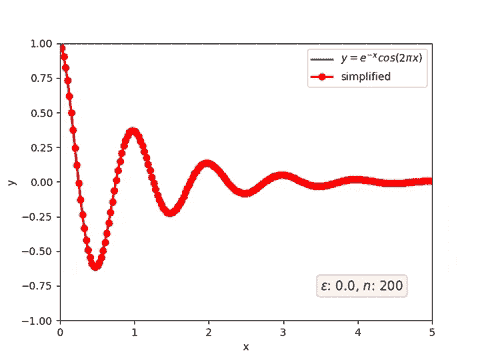

图 10:示例代码的输出

下面的代码是我实现的最简单形式的道格拉斯普克算法。我的实现基于这个主题的维基百科页面提供的伪代码。我确信还有更有效实现。然而，我相信下面的代码足以理解算法的基本思想。

# 四。结论

在这篇文章中，我们学习了一个有用而简单的算法来减少折线中的点数。除了我在这篇文章的介绍中给出的例子，这种算法可以应用于更多真实世界的应用，从加速地图渲染，改善物联网设备之间的通信等。我希望这篇文章能帮助你理解这个算法，并把它应用到更多有用的应用中。

*喜欢这篇文章，想表示你的支持？关注我或者给我买咖啡*

# 参考

道格拉斯，D. H .，&普克，T. K. (1973)。减少表示数字化线或其漫画所需点数的算法。*制图:国际地理信息和地理可视化杂志，10* (2)，112–122。doi:10.3138/fm57–6770-u75u-7727

拉默，U. (1972)。平面曲线多边形逼近的迭代程序。*计算机图形与图像处理，* *1* (3)，244–256。doi:10.1016/s 0146–664 x(72)80017–0

编码列车。(2019 年 10 月 24 日)。*编码挑战#152 : RDP 线简化算法*【视频】。YouTube。[https://www.youtube.com/watch?v=nSYw9GrakjY](https://www.youtube.com/watch?v=nSYw9GrakjY)