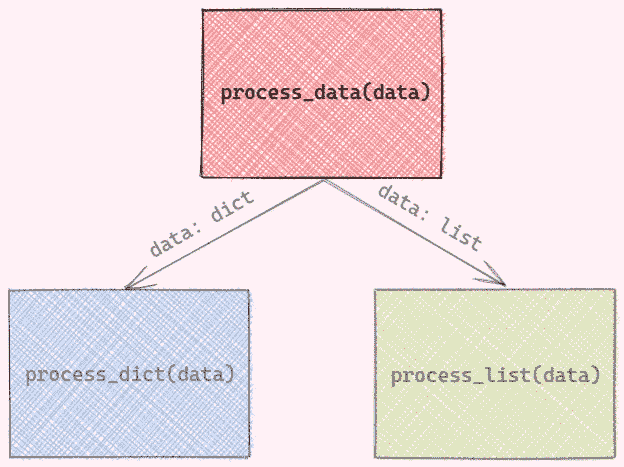

# 使用 Functools 的部分和单一分派简化您的功能

> 原文：<https://towardsdatascience.com/simplify-your-functions-with-functools-partial-and-singledispatch-b7071f7543bb?source=collection_archive---------5----------------------->

## 处理具有许多参数和数据类型的函数

# 动机

你有没有遇到过像下面这样有很多参数的函数，

…或者一个带有不同数据类型参数的函数？

作者图片

在本文中，您将了解上面的函数可能出错的地方以及如何简化它们。

# functools.partial

为了理解`functools.partial`是如何有用的，让我们从一个例子开始。假设您有一个如下所示的数据集:

您可能决定创建一个函数来获取每列中超过特定阈值的行数:

然后调用上面的函数，对每个参数使用不同的值:

以这种方式创建函数没有任何问题。然而，如果我们想试验不同的`threshold`和`column`值，`df`就变得多余了。

有没有一种方法可以让我们用**参数** `**df**` **固定**来创建另一个类似于原始函数的函数？是的，那可以用`functools.partial`来完成。

现在函数`get_acount_above_threshold_per_col`只需要两个参数`threshold`和`column`！

相当酷！如果我们想为列`magnesium`试验不同的阈值，我们可以再次使用方法`partial`来进一步简化函数。

让我们来玩玩我们的新功能。

酷！

# functools.singledispatch

假设您的函数接受两种类型的数据，一种是字典，一种是列表。

在函数中使用 if-else 语句调用另一个函数:

*   如果数据类型为 dictionary，您将调用函数`process_dict`
*   如果数据是列表类型，您将调用函数`process_list`

这很好，但是随着数据类型的增加，函数变得更加复杂。有没有一种方法可以不使用 if-else 语句来处理不同的数据类型**？这时候`functools.singledispatch`就派上用场了。**

`singledispatch`将根据当前函数第一个参数的类型选择正确的函数。

要使用`singledispatch`，只需:

*   将装饰器`@singledispatch`添加到函数`process_data`
*   将装饰者`@process_data.register`添加到`process_dict`和`process_list`中。

让我们试试这些新功能，看看它们是否工作正常。当第一个输入是类型`dict`时，应该调用函数`process_dict`。

当第一个输入是类型`list`时，应该调用函数`process_list`。

当第一个输入是类型`str`时，将调用函数`process_data`，因为没有为该数据类型实现函数。

很酷，不是吗？

# 结论

恭喜你！你刚刚学会了如何使用`functools.partial`和`functools.dispatch`来简化你的功能。我希望这篇文章能给你动力，让你当前的代码更具可读性。

随意发挥，并在这里叉这篇文章的源代码:

 [## 数据科学/func tools example . ipynb at master khuyentran 1401/数据科学

### 收集有用的数据科学主题以及代码和文章-Data-science/func tools example . ipynb at master…

github.com](https://github.com/khuyentran1401/Data-science/blob/master/python/functools%20example.ipynb) 

我喜欢写一些基本的数据科学概念，并尝试不同的数据科学工具。你可以在 [LinkedIn](https://www.linkedin.com/in/khuyen-tran-1ab926151/) 和 [Twitter](https://twitter.com/KhuyenTran16) 上联系我。

如果你想查看我写的所有文章的代码，请点击这里。在 Medium 上关注我，了解我的最新数据科学文章，例如:

 [## Python 干净代码:让 Python 函数更具可读性的 6 个最佳实践

### 停止编写需要 3 分钟以上才能理解的 Python 函数

towardsdatascience.com](/python-clean-code-6-best-practices-to-make-your-python-functions-more-readable-7ea4c6171d60)  [## 自动读取、创建和运行多个文件的 3 个 Python 技巧

### 用 Python 和 Bash For Loop 自动化枯燥的东西

towardsdatascience.com](/3-python-tricks-to-read-create-and-run-multiple-files-automatically-5221ebaad2ba)  [## 在 Python 中停止使用 Print 进行调试。用冰淇淋代替

### 你是使用打印还是日志来调试你的代码？用冰淇淋代替。

towardsdatascience.com](/stop-using-print-to-debug-in-python-use-icecream-instead-79e17b963fcc)  [## 使用 SimPy 在 Python 中模拟真实事件

towardsdatascience.com](/simulate-real-life-events-in-python-using-simpy-e6d9152a102f)