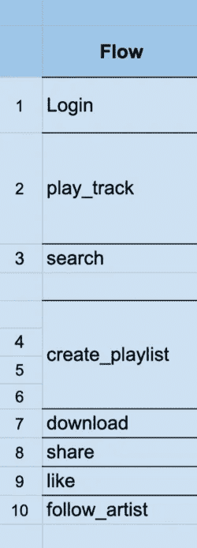
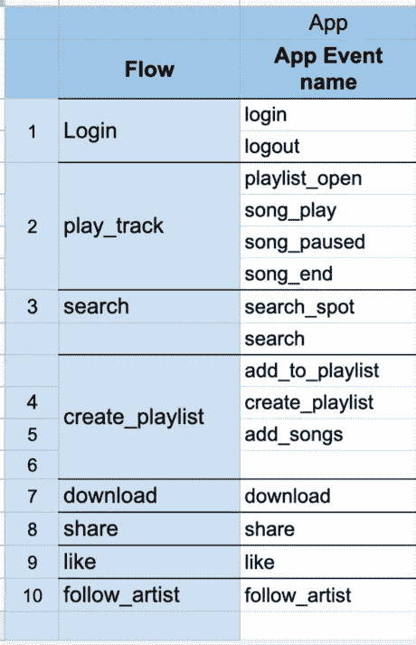
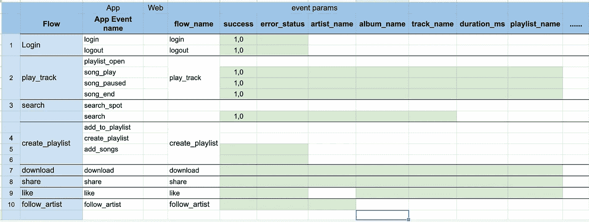
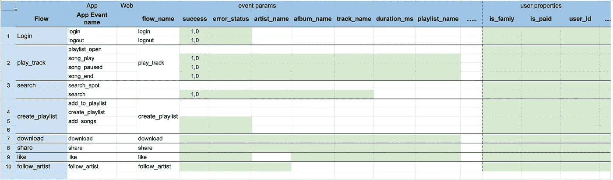

# 使用此框架简化您的 GA4 跟踪和分析—以 Spotify 应用程序为例。

> 原文：<https://towardsdatascience.com/simplify-your-ga4-tracking-analysis-with-this-framework-spotify-app-as-an-example-6fb5327201b0?source=collection_archive---------35----------------------->

## 为您的数字产品制定一个组织良好的测量计划的 4 步框架。

凯利·西克玛在 [Unsplash](https://unsplash.com?utm_source=medium&utm_medium=referral) 上的照片

在这篇文章中，我将分享一个我已经使用了一段时间的跟踪框架。事实证明，这非常有助于简化 GA4/Firebase 数据的测量思路、报告和分析。这个框架可以和任何其他的产品分析工具一起使用，比如 Mixpanel，Amplified 等等。

这个框架应该可以帮助您回答如下问题:

> 我们的用户使用产品功能/流程吗？有哪些热门流量/功能？我们的哪部分用户使用哪些功能，使用频率如何？
> 
> 我们的用户成功地完成了流程吗？每个流量的成功率是多少？我们是否有一个用户因为技术原因而难以完成的流程？
> 
> 每个流程的完成率是多少？用户掉哪里最多？

该框架有四个主要步骤，您应该遵循这些步骤来为您的数字产品制定跟踪计划。虽然我不在 Spotify 工作，但我将举一个 Spotify 应用程序的例子来说明这个想法。

[摄](https://unsplash.com/@fixelgraphy?utm_source=medium&utm_medium=referral)夹具在 [Unsplash](https://unsplash.com?utm_source=medium&utm_medium=referral) 上

**第一步——列出你希望你的用户实现的数字产品**(网络或应用)的所有流程。以 Spotify 为例，下面是一些可能被跟踪的流量。

第 1/4 步:GA4 分析跟踪框架——列出你的应用或网站中的所有流量。

**第 2 步——对于每个流程，列出您希望您的应用程序用户执行的所有事件**。在我们的 Spotify 示例中，下面是一些可能被跟踪的事件。

第 2/4 步:GA4 分析跟踪框架——列出你的应用或网站中的所有事件。

**第 3 步——对于每个事件，列出与之一起发送的所有参数**。与开发团队讨论对这一步很有帮助，这样您就知道每个事件有哪些数据可用。在 Spotify 的简化示例中，以下是一些可能随跟踪事件一起发送的参数。

步骤 3/4 : GA4 分析跟踪框架—列出事件的所有参数。

**步骤 4-列出描述您的用户的所有用户属性。**在这个阶段，与开发团队的协调会很有帮助，因为你的开发人员更了解应用的 API 框架。以 Spotify 为例，下面是一些可以追踪的用户属性。

步骤 4/4 : GA4 分析跟踪框架—列出您的用户的所有用户属性。

**您可以通过以下链接下载带有 Spotify 示例的 GA4 分析框架:**

<https://docs.google.com/spreadsheets/d/1kH_BbETEQDGwIOk4UX84l7yAvC6NWcTLBoHieYmeJm8/edit?usp=sharing>  

**最后的想法:**

在这篇文章中，我试图分享一个分析框架，你可以用它来简化和组织你对数字产品测量的思考。这个框架的输出是一个度量文档，您可以使用它与开发人员、股东进行交流，并在后期的分析中使用参考。这个文档应该是一个动态文档，当有新的特性/流程添加到您的产品中时，它会得到更新。

最后，您是否从事产品分析工作，如果是的话，我很想听听您在为您的产品创建测量计划方面的想法和经验:-)