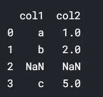

# 使用 ColumnTransformer 和管道简化机器学习模型开发

> 原文：<https://towardsdatascience.com/simplifying-machine-learning-model-development-with-columntransformer-pipeline-f09ffb04ca6b?source=collection_archive---------24----------------------->

## 本文解释了 Scikit-Learn 的 ColumnTransformer 和 Pipeline 类的用法，以简化开发和部署机器学习模型的过程。

图片由[克里斯里德](https://unsplash.com/@cdr6934?utm_source=medium&utm_medium=referral)在 [Unsplash](https://unsplash.com/?utm_source=medium&utm_medium=referral) 上拍摄

# 列变压器简介

ColumnTransformer 使我们能够转换一组指定的列。它帮助我们用一个 fit()或 fit_transform()语句将多个转换应用于多个列。例如，我们可以用一个 fit()或 fit_transform()语句对数据帧的第一列进行估算，对第二列进行热编码。ColumnTransformer 类可以从' sklearn.compose '模块导入，如下所示。

让我们通过一个例子来深入研究 ColumnTransformer。考虑下面的数据帧，其中我们必须进行一次热编码“列 1”和顺序编码“列 2”。

作者图片

按照惯例，我们创建 OneHotEncoder 类的一个实例，并使其适合数据框，然后对其进行转换，如下所示。

作者图片

上面的步骤对数据帧的两列都进行了热编码，这不是我们想要做的。使用 ColumnTransformer 可以解决这个问题。让我们创建一个数据框，并使用 ColumnTransformer 转换它的列。

作者图片

作者图片

如上所述，我们可以用一个 fit_transform()语句在多个列上执行多个转换。如果没有 ColumnTransformer，这个操作会很复杂。在上面的例子中，我们创建了一个 ColumnTransformer 类的实例，并传递了一个名为“transformers”的参数，这是我们想要执行的转换的列表/元组。

变换列表/元组中的每个变换都有三个部分:

1.  转换的名称，可以是任何名称，但是转换列表中的每个转换都必须有唯一的名称。
2.  转变本身。
3.  要转换到的列的列表。它应该是一个列表，即使您必须将它应用于一个单独的列。

让我们看另一个例子。考虑下面的数据帧，我们必须对“列 1”进行热编码，并保持“列 2”不变。

作者图片

作者图片

**输出中的‘col 2’在哪里？**

ColumnTransformer 只返回它已转换的列。在前面的例子中，我们已经转换了两个列，因此，它们都被返回。但是在当前示例中，我们只转换了一个列(“col1”)，所以只返回转换后的“col1”。为了避免这种情况，我们需要传递一个参数' remainder=passthrough '，如下所示，这个参数的默认值是' drop ',它将删除其他列。

作者图片

作者图片

# ColumnTransformer 的局限性

下面将讨论 ColumnTransformer 的一些限制。

1.  即使我们输入了 DataFrame 对象，ColumnTransformer 也会输出一个数组，这使得跟踪列变得很困难。
2.  在 ColumnTransformer 中，我们不能对单个列应用多个转换，如下所示。

考虑下面的数据框，其中我们必须输入模式和一个热编码“列 1”和中值输入“列 2”。这里我们试图对一个列(' col1 ')应用多个转换。

作者图片

作者图片

我们收到一条错误消息，称“输入包含 NaN”。为什么在上述 ColumnTransformer 的第一步中输入了“col1”之后,“NaN”仍然存在？

这是因为 ColumnTransformer 在每一步中都直接从输入数据帧/数组中提取列。一个步骤的输出不是下一个步骤的输入。因此，热编码的第二步是从输入数据帧中提取“col1 ”,而不是从第一步中提取。让我们看另一个例子。在下面的数据框中，我们将尝试顺序编码和最小-最大比例“列 1”和中位数估算“列 2”。

作者图片

作者图片

即使在步骤 1 中添加了一个顺序编码器，仍然会出现错误消息“无法将 string 转换为 float:‘a’”。为了解决这个问题，让我们了解一下管道。

# 管道介绍

管道是一系列的操作，其中一个步骤的输出成为下一个步骤的输入。管道类可以从 sklearn.pipeline 模块导入，如下图所示。

在下面的示例中，我们将首先对数据框的列进行中值估算，然后使用 Pipeline 对其进行最小-最大缩放。

作者图片

作者图片

如上所述，我们可以用一个 fit()或 fit_transform()语句执行多个转换。与 ColumnTransformer 不同，管道遵循一个连续的过程，前一步的输出成为下一步的输入。与 ColumnTransformer 类似，管道接受步骤输入，这些步骤可以是分类器、转换等。管道中的每一步都有两个部分:

1.  步骤的名称。
2.  手术本身。

如果不使用流水线，上述操作将使用如下所示的传统过程来执行。

作者图片

作者图片

传统的过程需要两个 fit_transform()语句来转换列，而 Pipeline 只需要一个。

# 管道的局限性

1.  与 ColumnTransformer 类似，Pipeline 也输出数组。
2.  与 ColumnTransformer 一样，我们不能指定要转换的列。

# 将 ColumnTransformer 与管道结合使用

正如在前面的一个例子中看到的，我们不能使用 ColumnTransformer 对一个列应用多个转换。我们在尝试时出错。让我们再次讨论这个例子。考虑下面的数据帧，其中我们必须输入模式和一个热编码“列 1”和中值输入“列 2”。这里我们试图对一个列(' col1 ')应用两个转换。

作者图片

作者图片

**上面发生了什么？**

如上所述，在流水线(‘col 1 _ pipe’)中，第一步(‘mode _ col 1’)的输出变成了第二步(‘one _ hot _ encode’)的输入。然后，我们将管道作为输入传递给 column transformer(' col _ transform ')，其中这些步骤序列应用于' col1 '，中值转换应用于' col2 '。

因此，将 ColumnTransformer 与 Pipeline 结合使用简化了模型开发和部署过程，还减少了代码的大小。