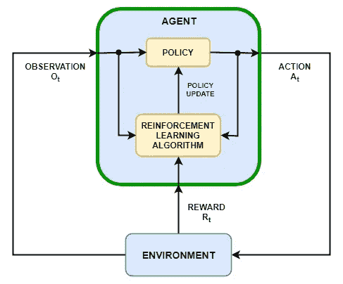
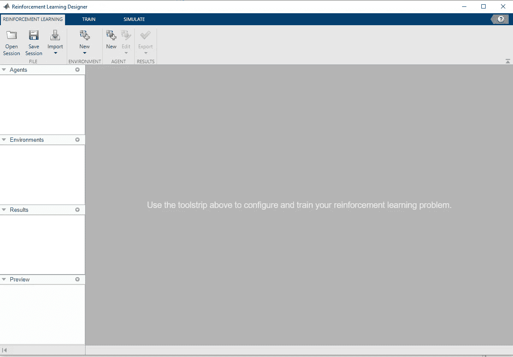
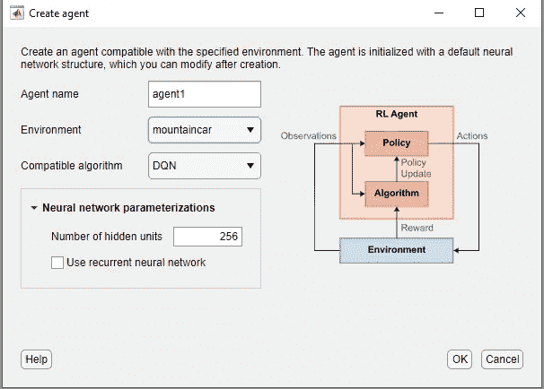
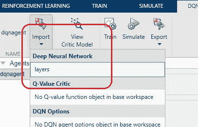
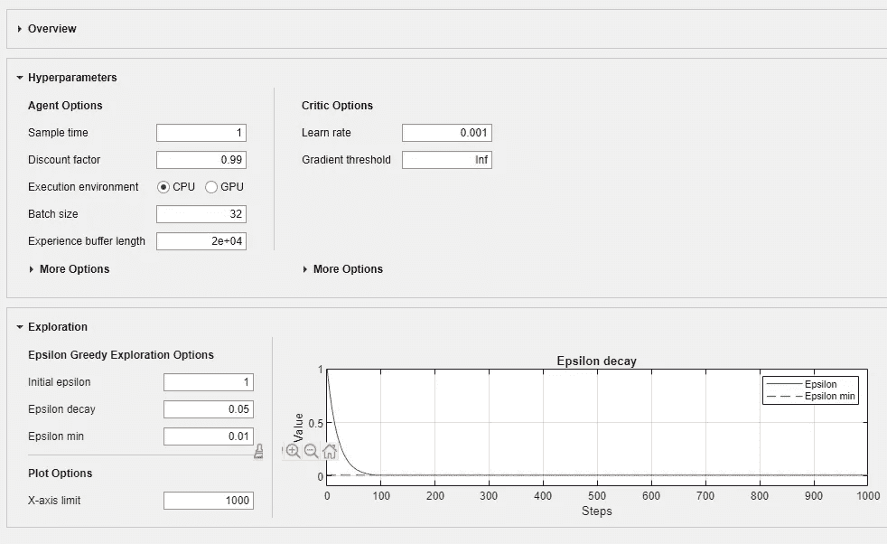
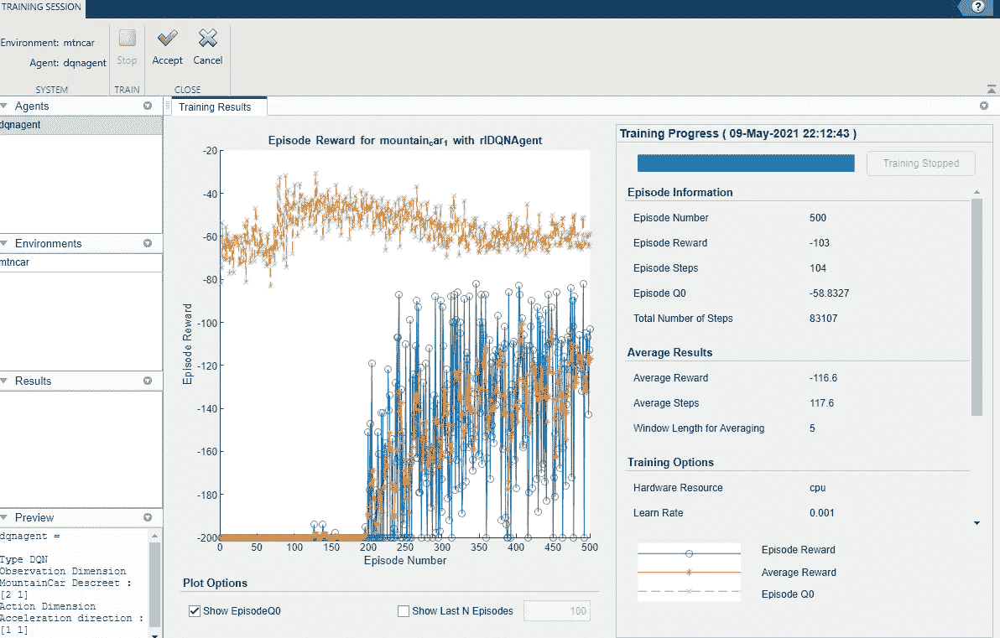

# 简化 MATLAB 中强化学习的工作流程

> 原文：<https://towardsdatascience.com/simplifying-reinforcement-learning-workflow-in-matlab-32b5aa5287b8?source=collection_archive---------20----------------------->

## 在 MATLAB 中求解 OpenAI 环境

假设你对使用强化学习解决某个问题感兴趣。您已经在您的环境中编写了代码，并编译了一系列强化学习(RL)算法来尝试。从头开始自己实现算法是棘手和耗时的，因为它需要大量的试验，并且包含许多实现技巧。那你是做什么的？

最好的答案是使用 RL 框架。RL 框架包含 RL 算法的近似最优实现。算法的实现被卸载到框架中，用户只需要担心演员和评论家模型的神经架构。有很多基于 TensorFlow 和 PyTorch 的框架。然而，与 MATLAB 2021a 一起发布的**强化学习设计器应用程序在这一类别中也是一个强有力的竞争者**，本文就是关于这一点的。

典型的 RL 环路(图片来自 mathworks.com)

RL Designer app 是强化学习工具箱的一部分。它基本上是 RL 工具箱功能的前端。设计器的点击功能使管理 RL 工作流变得极其简单，在这篇文章中，我将描述如何使用该应用程序解决一个简单的 OpenAI 环境。我创建了一个 youtube 系列，深入研究 MATLAB 中强化学习的细节。这篇文章的视频版本在这里:

RL 设计器应用程序看起来有点类似于深度网络设计器应用程序。在左侧窗格中，您可以找到代理、环境、结果和环境详细信息。您可以在应用程序内部执行整个 RL 工作流程。因为我们想让事情有点挑战性，我们将首先演示如何加载到外部环境中，并使用我们的自定义网络在其上训练 DQN。

强化学习设计器

您需要 Python 和 OpenAI-gym 包才能在环境中加载。我们开始吧，

> ***装载环境***

MATLAB R2021a 附带了一些预构建的环境，可以通过单击环境选项卡位置中的“新建”按钮来加载它们。在本文中，我们将尝试加载我们的自定义环境，它基本上是 OpenAI 的 mountain-Car-v 0 环境的包装器。在下面的代码中，我们为体育馆环境定义了包装器。“步骤”函数在健身房环境中执行步骤，并以 MATLAB 友好的格式返回详细信息。

开放式包装

这个类的对象需要在工作空间中创建，然后环境就可以导入 RL Designer 应用程序了。

> **选择代理和型号**

就像选择环境一样，也可以通过选择代理选项卡区域中的“新建”按钮来选择代理。该应用程序给出了可供选择的算法列表。我们将选择 DQN 来完成这项任务。

代理选择屏幕

一旦我们选择了一个代理，MATLAB 就会创建一个默认的演员/评论家神经网络，该网络具有完全连接的层。我们想对此进行修改，并使用我们自己的定制神经网络。这可以通过选择代理并从工作区导入我们的自定义评论家网络来完成。我们使用以下脚本创建一个简单的线性网络，并将其加载到工作空间中。

DQN 客户网络

我们首先将网络加载到我们的 MATLAB 工作区，然后通过从代理选项卡中选择“导入”选项，最终将其加载到 RL designer 应用程序中。

我们还可以使用 Deep Network designer 应用程序来分析和编辑网络。网络架构可以是任意的。对神经网络的唯一限制是输入和输出应该与算法和环境修复相匹配。我们还直接在主窗口中指定超参数。我们也可以直接从这个屏幕设置目标网络的行为。该应用程序会自动处理所有这些小细节。

设置代理的超参数

> **培训代理人**

单击主菜单栏上的“训练”按钮，即可开始训练。在开始这个过程之前，我们需要指定剧集细节和平均细节。训练统计如下所示:

训练步骤

这是一个非常标准的代理培训窗口。培训完成后，您可以保存代理和网络。保存的代理可以被重新训练或用于模拟性能。

> **验证**

我们可以在应用程序中直接模拟我们训练有素的代理的结果。可以在“模拟”选项卡中设置模拟剧集的数量。您还可以加载预先训练的代理并模拟它们，以比较不同的代理。请记住，模拟步骤只记录任何给定环境的最终分数。如果需要可视化，您需要使用脚本手动模拟环境。

> **遗言**

我们讨论了 MATLAB 中完整的 RL 工作流程。改变代理算法是非常无缝的，这是这个应用程序的主要卖点。我想强调的是，可以在 RL 工具箱(使用脚本)中找到额外的功能，但对于大多数用户来说，应用程序中的功能应该足够了。这个应用程序和框架的最大优势是它抽象出了所有的实现细节，以提供无缝的体验。如果你已经进入了 MATLAB 生态系统，试一试吧。干杯！

> **参考文献**

1.  本文代码: [GitHub 链接](https://github.com/sol0invictus/MAT-DL/tree/main/RL-in-MATLAB)
2.  RL 播放列表: [Youtube 链接](https://www.youtube.com/watch?v=Zcjs6rcd_pY&list=PLUHjJ91-nf0T4rEJk8eLrMT3XSe_wJOhn&ab_channel=ChiDotPhi)
3.  [强化学习工具箱文档](https://www.mathworks.com/help/reinforcement-learning/)