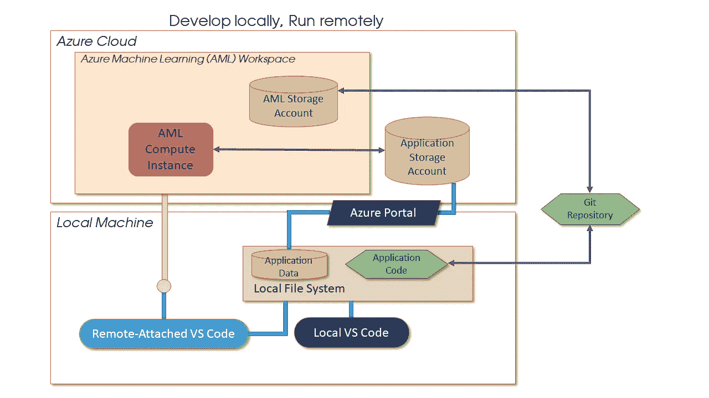
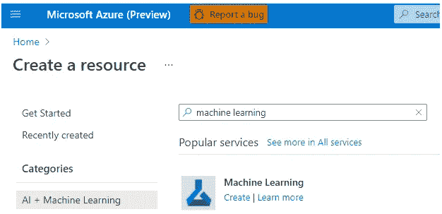
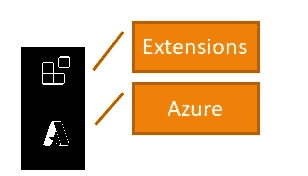
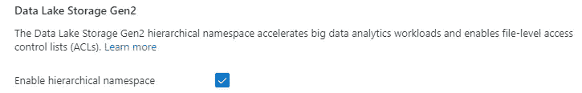
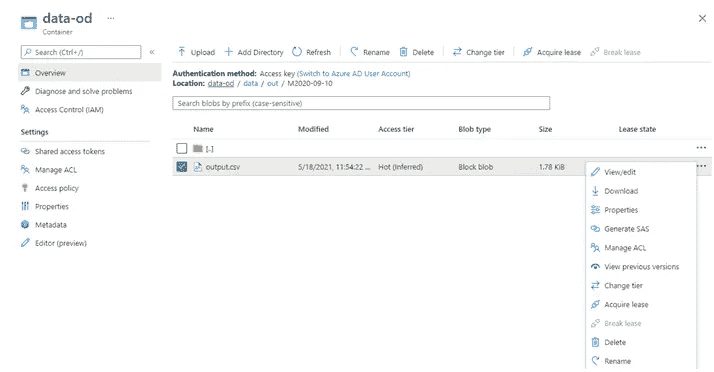
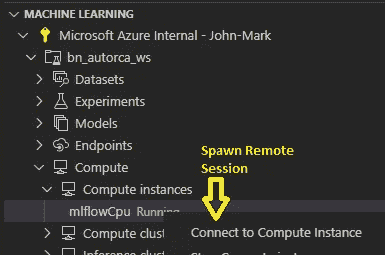
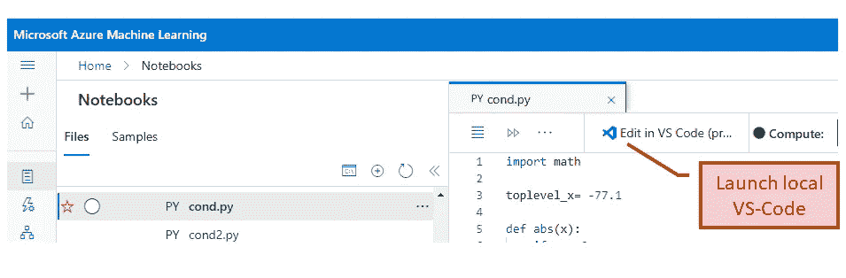
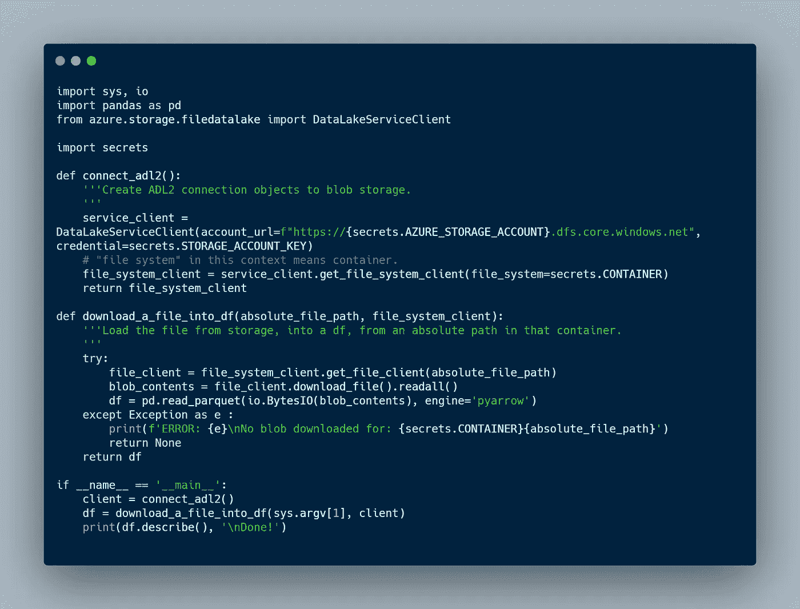
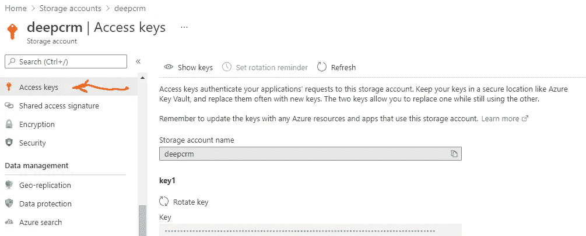

# 简单来说，就是云中的 Python

> 原文：<https://towardsdatascience.com/simply-just-python-in-the-cloud-78274389ab00?source=collection_archive---------27----------------------->

## 所以你只想大规模运行 python？



作者图片

> **TL；博士**
> 
> 这是一个关于在 Azure 中运行代码的“精益”教程。随着你的数据驻留在云中虚拟机旁边的存储中，无需探索 Azure 迷宫般的复杂性，并使用新发布的 VS-Code“Azure 机器学习-远程”扩展，**在虚拟机上编程就像在本地机器上开发代码一样简单**，但具有云的扩展优势。这是利用云计算和 Azure 机器学习(AML)的第一步。

响亮的服务提供了许多选择，Azure 比其他服务更多；但是由于种类繁多，很难知道从哪里开始。让我们假设你已经[订阅了 Azure](https://azure.microsoft.com/en-us/) ，并且已经开始了解 Azure 的网络门户`portal.azure.com,`——它是用于设置和管理网络资源的通用图形界面。云组件、服务和产品的通用管理术语是“资源”如果你对此不熟悉，可以在 Azure Fundamentals 中搜索一门在线课程，内容包括订阅、资源组、区域等。哈佛的 DS intro 让你觉得使用 Azure 门户网站很舒服。请记住，大多数在线培训都是针对企业用户的，比您需要了解的更多。假设您对以合理的成本快速获得结果感兴趣，并且企业用户最关心的问题还包括可用性、可靠性和其他“能力”,这些都不是您最关心的问题——您最终会实现的。在本教程中，您将在 Azure 门户中交互创建一些 Azure ML 资源，然后通过 VS-Code 或命令行工具的组合进行开发。我假设你很容易编程和在命令行工作。根据我的经验，我将特别针对我们的任务，将您的 Python 应用程序迁移到云中运行，这是我强烈的个人偏见，以避免常见的陷阱。

为什么要将代码转移到云中的机器上呢？为了规模。Azure 有一些巨大的机器，巨大的网络带宽，和几乎无限的内存。令人惊讶的是，计算量大的应用程序在单台机器上可能比在集群上更快，并且更容易设置。当然，如果你的目标是运行数十亿字节的数据，或者训练十亿节点的神经网络，有合适的虚拟机集群解决方案。无论是通过集群还是大型虚拟机，它对于任何大规模问题都是一个巨大的福音，不仅是传统的机器学习应用程序，而且对于那些大规模的 MCMC 任务或 GPU 上的培训。

# 云资源

云服务本质上由三种资源组成:*计算、存储和网络。*您的应用程序资源集合被指定为一个“资源组”——一个用于创建、跟踪和拆除云应用程序的逻辑结构。你的资源组需要包括一个*机器学习工作区*，一个方便的资源集合，它本身就是一种资源。在 Azure 的图形界面中找到它。



作者图片

继续创建一个。门户提示非常友好，可以为其存储帐户和其他帐户创建新的资源组和新的组件资源。采用默认值，继续创建新的组件资源。只需记住工作区名称，并对您在应用程序中创建的其他资源使用相同的资源组名称。如果你犯了一个错误，很容易删除整个资源组并重新开始。

## 计算

简而言之，*计算*由虚拟机(VM)组成，从微小的 VM 映像到具有巨大 RAM 和 GPU 的 VM，比您桌面上的任何东西都大。工作区不附带任何默认计算资源，因为它允许您选择创建单个虚拟机、虚拟机计算集群或使用现有计算资源。对于本教程，您需要通过选择满足您需求的大小来创建一个“计算实例”——单个虚拟机。这些在 Azure Machine Learning Studio (AML)中创建的 Ubuntu 虚拟机是受管理的虚拟机——已经安装了几乎所有需要的软件，并为您管理了更新。这减轻了您设置和配置虚拟机的负担。或者，Azure 仍然提供遗留的“数据科学虚拟机”，这些虚拟机带有大量预安装的 ML 工具，但除了一些特殊目的，(如运行 Windows OS) AML 计算实例可以取代它们。

## 储存；储备

存储也可以规模化。但与桌面不同的是，主存储不是运行在虚拟机本地磁盘上的文件系统，而是具有访问 API 的独立组件。一个原因是存储是永久的，但虚拟机来来去去；当你需要完成工作的时候启动它们，然后为了省钱把它们拆掉。存储由“blobs”组成，具有持久性和冗余性的强保证。本教程的重点是演示如何集成现有的 Azure 存储，这些存储可能已经加载了您的数据。

## 建立工作关系网

网络服务连接*计算*和*存储。*此外，云中的网络由软件定义的虚拟网络组成，这些网络连接到您的本地“内部”设备和云资源。借助云资源，网络将组件与本地子网、安全服务(防火墙)和面向公众的 IP 地址结合在一起。对于连接了存储的虚拟机的简单情况，关联的网络看起来像您的家庭网络，具有公共 IP 地址和子网中的 NAT 地址。您不需要了解太多，因为它已经在您创建 VM 时为您设置好了。我们会谈到这一点。但是应该从存储开始，并将数据存储在存储上。

## 设置您的开发环境

在云中运行代码所需的工具有:

*   VS-Code——微软的开源 IDE
*   git:开源版本控制

和两个 Azure 资源:

*   Azure 存储
*   包含计算实例的 AML 工作区。

标题插图显示了这些是如何拼凑在一起的。AML 工作区汇集了一组集成的资源:您只需要两个:受管虚拟机和存储代码的附加存储。此外，你将设置一个 Azure 存储帐户，或使用现有的数据帐户。这不是真正必要的，但学习管理存储是很好的体验。资源设置和管理可以完全在门户中完成。至于代码，你用`git`把它移动到 AML 版本。然后运行编辑-运行-调试循环，并在本地运行 VS 代码的两个副本。*神奇的是，AML 计算实例附加了一个副本，看起来就像是另一个本地实例。*

我的重点是使用 VS-Code 进行代码开发，以及它的两个扩展，Azure ML 扩展和 Azure ML-Remote 扩展。安装来自 VS-Code“活动栏”的扩展，可以在最左边的一列中找到，如下所示:



作者图片

使用扩展图标安装两个 VS-Code 扩展。

Azure 图标将用于启动远程会话。

作为一个开源项目，改进和扩展 VS-Code 的势头值得注意，正如其专用博客[所说。](https://devblogs.microsoft.com/python/python-in-visual-studio-code-july-2021-release/)核心 Python 开发人员可能更喜欢其他专用的 Python 工具，如 *PyCharm* 或 *Spyder* ，但是在本教程中，我使用微软的 [VS-Code](https://code.visualstudio.com/download) 来实现优雅的项目管理、符号调试和扩展，它们与 Azure 完美集成。由于这些原因，我更喜欢它，而不是微软遗留的 Visual Studio IDE 工具。

*所以，如果你还没有 VS-Code，就安装它。*

除了你的 Azure 订阅、`git`和 VS-Code 之外，你还需要`az`命令行包，称为 [Azure 命令行界面(Azure CLI)](https://docs.microsoft.com/en-us/cli/azure/) ，以及它对 Azure 机器学习的扩展，它可以在 Windows 或 Unix shells 上等效地工作。网页上有它的安装程序。

`az`包管理着每一个 Azure 资源，它的 [az 参考页](https://docs.microsoft.com/en-us/cli/azure/reference-index?view=azure-cli-latest)是 Azure 的完整目录。它被实现为 Azure 的 RESTful 管理 API 的包装器。你很少需要直接引用它，因为 VS-Code Extensions 会为你调用`az`，并在它丢失时提供安装。并且门户公开相同的功能。但是每一个都是命令行工具的语法糖，你应该知道这两个。

从长远来看，了解`az`的另一个原因是为了编写自动化管理步骤的脚本。每当您在门户中创建一个资源时，它都会为您提供下载“模板”的选项。模板只是你创建的资源在 JSON 中的描述。使用`az`你可以调用 ARM(Azure 资源管理器)来自动创建它。ARM 是一种用于资源管理的声明性语言，它将资源创建简化为一个命令。详细信息请查看`az deployment group create...`命令。

az 扩展中特定于 Azure Machine Learning (AML)的命令需要单独安装。第一次使用`az ml`时`az`会提示您这样做。

不要把 az CLI 和具有重叠功能的 Azure python SDK 混淆。下面是一个使用 SDK 以编程方式读取存储的示例。您可以用 az CLI 做的大多数事情也在 python `azureml`包中作为 SDK 公开。

最后，为了检查`az`是否正常工作，请尝试验证您的本地机器和您的云订阅。当你跑步的时候跟着指示走

```
$ az login 
```

你在开始的时候做一次。后续的`az`命令将不需要认证。

# 应用程序

好了，您已经得到了代码和数据，并安装了工具。我们开始吧！假设您已经创建了一个新的反洗钱工作区，步骤如下

1.  设置存储，
2.  准备你的代码，
3.  创建 AML 计算实例，并
4.  启动远程 VS-Code 会话。

当你完成你的代码时，一个选择是通过将它包装在一个“RESTful”API 调用中作为一个 *Azure Function 应用程序来部署它。*这将您的应用程序公开为一个“端点”,可以从 Web 上调用。构建 Azure 函数可能是另一个教程的主题。

***第一件事——准备你的资料。把你的数据保存在云中是值得的。*** 存储，比如 Azure blob 存储便宜，速度快，容量看似无限；每月每千兆字节的费用约为 2 美分，移动数据也有少量费用。出于成本和网络带宽的原因，您最好将数据一次性转移到云中，而不是在云中针对本地存储的数据运行代码。简而言之，您将创建一个存储帐户，然后创建一个“Azure Data Lake Generation 2”(ADL 2)blob 存储的*容器*——相当于一个分层文件系统。blob 存储有许多替代方案，甚至有更多的高级选项可以在 Azure 上运行几乎任何你可以想象的数据库软件，但是对于你打算运行的批处理计算，应该从 ADL2 blob 存储开始。

Blob 存储显示为以分层目录结构组织的文件。顾名思义，它将数据视为字节块，与文件格式无关。如果你愿意的话，可以使用`csv`文件，但是我建议你使用像`parquet`这样的二进制格式，因为它的压缩、速度和对定义的数据类型的理解。

也许你的数据已经在云端了。如果创建存储的最简单方法不是使用门户—“创建资源”，那么请按照提示进行操作。它不需要与您的工作区在同一个资源组中，选择权在您。您需要做出的一个关键选择是选择“第二代数据湖存储”:



作者图片

本质上，这是一种 blob 存储，它取代了构建在平面文件系统上的原始 blob 存储。注意“Azure Data Lake Gen 1”存储是*而不是* blob 存储，原因不值得深入讨论，我将忽略它。

您可以使用此门户页面以交互方式上传数据。这里有一个名为“data-od”的容器的例子从顶级存储帐户页面单击几下，即可导航到存储容器和路径。它包含文件和目录操作命令，很像桌面的“文件浏览器”



作者图片

稍后我将展示如何以编程方式读写存储数据。

在本教程的精益风格中，我只包括了构成 Azure ML 的拜占庭式的特性集合的绝对最小值。Azure ML 有自己的数据存储，或者更准确地说，将现有的 Azure 存储组件包装为“数据集”，向你的表添加元数据，并为你验证存储，这很好。但是，如果您仔细观察，底层存储资源是可以访问的。本教程——围绕这些高级特性的最终运行——即使只做一次，也是理解 Azure ML 存储是如何构成的良好实践。

***准备你的代码***

与常识相反，我建议你一旦通过了最初的探索性分析，就应该将笔记本代码转换成 Python 模块。如果你坚持使用笔记本，虚拟机就很好:Azure ML 工作空间和 Spark clusters 都允许你运行笔记本，但是你在管理、调试、测试和部署代码方面会受到限制。笔记本电脑非常适合探索您的数据，但是当开发代码供后续使用时，人们会厌倦它们的局限性:

*   他们和`git`玩的不好。如果版本之间存在合并冲突，区分它们并编辑冲突是一件非常头疼的事情。
*   他们得到巨大的曾经填满的数据和图形。要么在提交之前去掉它们的输出，使它们易于管理。或者将它们转换成 html，作为一个可共享的、自文档化的文档。
*   随着代码的增长，模块化、可调试的面向对象代码的所有优点都消失了。老实说，VS-Code 中的符号调试器值得进行转换，更不用说在单独的模块中按功能组织代码的可管理性了。
*   Python 模块鼓励你构建测试，这是可靠扩展、重用、共享和生产代码的必要实践。

因此，将笔记本电脑归入运行一次的实验，并将代码块升级为易于测试和调试的独立文件。

Jupyter 通过命令行从笔记本中为您生成一个`.py`文件

```
$ jupyter nbconvert --to-py <your notebook>.ipynb
```

***依靠*** `***git***`

值得真正的敬意。随着你的项目规模的扩大和你与他人的合作——使你对你的组织有价值的东西—`git`是你工作的舒适之家。任何一个软件工程师都知道，如果你“破坏了构建”,只需几个命令就能恢复到工作状态，这是从你的同事的愤怒中得到的最大安慰和喘息。拥有一段有记载的历史也是你给后代的礼物。可以说,`git`的复杂性让层次文件系统的复杂性相形见绌，但是每次走出`git`舒适区时，依赖堆栈溢出并不可耻。相信我，有一个`git`指挥部可以完成任何可以想象的任务。

假设您的代码在您选择的`git`库中。`git`将成为您在云与本地文件系统之间来回移动代码的工具。

***设置云资源 Azure 机器学习(AML)工作区***

我假设您已经创建了一个 AML 工作区。导航到工作区后，有一个按钮可以启动网络版:


作者图片

***巡视工作区***

Workspace 在一个地方收集了大量与机器学习相关的功能。我将只涉及本教程使用的几个。然而，使用 VS-Code 的好处是你不需要到这里来:你需要在 Studio 中做的一切都可以从 Azure Remote 扩展中完成。

*   **计算实例**进入工作区窗格后，在其左侧菜单上有一个“计算”菜单项，它会将您带到一个面板，用于创建新的计算实例。创建一个。您有多种尺寸可供选择，比如 64 核和 128G 内存？还是用 4 NVIDA Teslas？否则，接受默认值也没关系。当实例不被使用时，您可以启动和停止实例以节省资金。
*   **代码编辑**在“笔记本”(一个误称)下面，有一个附加到工作区的文件系统视图。它实际上是一个基于 web 的 IDE，用于在必要时编辑和运行代码。它可以包括笔记本、普通 python 文件、本地 git 存储库等等。该文件系统隐藏在工作区的关联 AML 存储中，因此即使删除了计算实例，该文件系统仍然存在。您创建的任何新计算实例都将共享该文件系统。
*   **AML 存储**Studio 不会透露其连接的 AML 存储帐户，因此可以将其视为存储远程文件系统和其他工件的黑匣子。现在使用外部 Azure 存储——为什么？所以你看到了如何通过存储与其他 Azure 服务集成。你们中最勇敢的人可以使用门户来浏览工作区附带的默认存储。可以通过名称找到存储帐户，名称以工作区名称的任意版本开头，后跟一个随机字符串。

请记住，好的一面是，您需要的所有工作区功能都通过 VS-Code 扩展暴露在您的桌面上。

# 开发周期

让我们进入有趣的部分——这些组件如何协同工作并提供更好的体验。值得注意的是，当远程使用云资源时，VS-Code 的本地编辑-运行-调试循环几乎是不可区分的。此外，本地和远程 VS-Code 实例同时在您的桌面上运行，这比运行远程桌面服务器(“rdp”)或尝试完全在浏览器中远程工作要流畅得多。多酷啊！

让我们来看一下这些步骤。

## 本地运行

对云的认证由 VS-Code 的 Azure ML 扩展管理；一旦您启动并运行并连接到您的工作区，您将无需再次进行身份验证。

*   在 VS-Code 的`.vscode`文件夹所在的`git`存储库中的本地目录中启动 VS-Code。(那里的`launch.json`文件为每个文件配置运行调试会话。学会给它添加配置。)
*   一旦您对代码在本地运行感到满意，就使用`git`提交并推送它。如果您提交笔记本，最好先“清理”它们的输出，以保持它们可管理的大小。
*   从 Azure ML 扩展启动 Azure ML 计算实例。首先使用 VS-Code Activity 菜单中的 Azure 图标(见上文)连接到您的工作区。**您可以从隐藏良好的右键菜单项“连接到计算实例”中的本地 VS-Code 实例生成一个远程附加的 VS-Code 实例:**



作者图片

这将启动 VM，并在您的桌面上生成第二个 VS-Code 实例，连接到您的远程工作区文件系统！

## 远程运行

请注意，出现在远程连接 VS-Code 终端窗口中的终端实例正在您的虚拟机上运行！不需要为“putty”或`ssh`设置一个公钥来打开一个远程 shell。类似地，VS-Code 中可见的文件系统是工作区文件系统。多酷啊！

*   第一件事当然是通过使用`git`获取您最近的更改，使工作空间文件系统中的存储库保持最新。然后就像平常一样编辑-运行-调试，但是所有的计算和文件访问都在云中。
*   当两个 VS-Code 实例都在本地机器上运行时，您可以同时在本地和远程版本之间来回工作，用`git`传输代码变更。
*   在远程实例中，Azure ML 扩展菜单自然会被禁用。把一个“远程”衍生到一个“远程”是没有意义的。
*   完成后，关闭虚拟机以节省资金。您的远程文件系统保存在存储中，无需您做任何事情。

如果您不愿意用`git`移动文件(您忘记了什么，或者您需要移动一个机密文件)，请注意 VS-Code 的远程附加实例可以查看云或本地文件系统，使其成为在它们之间移动文件的“后门”。特意使用`git`来保持两个文件系统中代码的一致性，所以要谨慎使用这个后门。

或者，可以在门户中调用远程会话。尝试从 AML Studio 笔记本窗格打开本地机器上的远程 VS-Code 会话。



作者图片

如果您的计算实例正在运行，您可以启动 VS-Code 的一个*本地*实例，该实例远程连接到工作区的*云*文件系统(不仅仅是在门户编辑器中打开的文件)和一个运行在计算实例上的 shell。但是我想你会发现直接从你的本地 VS-Code 实例产生你的远程会话要比在门户的 Azure ML 页面中的 Studio 窗格中启动它更容易。

# 编程 adl2 文件访问

在云中运行代码需要做的一个改变是替换本地文件 IO。对代码的主要修改是将本地文件系统 IO 调用替换为对用于 Blob 存储的 python SDK 的调用。这既适用于代码在本地运行的情况，也适用于当您将应用程序切换到云中处理数据时在 VM 中运行的情况。

有几种方法可以访问虚拟机的文件。这里有一种使用 Azure python SDK 的方法，它只需要很少的依赖就可以工作，尽管要写很多代码。将这些打包成一个模块，然后将你的努力投入到手边的计算任务中。python SDK 在不同的包中定义了许多类。这个类`DataLakeServiceClient`是特定于 adl2 blob 存储的。在本地你需要得到这些包裹，

```
pip install azure-storage-file-datalake 
pip install pyarrow
```

熊猫需要“pyarrow”。Apache project“arrow”是一种内存数据格式，支持多种语言。

在这个代码片段中，第一个函数返回一个到存储的连接。第二个函数定位文件，以字节字符串的形式检索文件内容，然后将其转换为可以作为 Pandas 数据帧读取的 file 对象。无论您引用您创建的 Azure ML workspace 附带的默认存储，还是 Azure cloud 其他部分中的一些预先存在的存储，这种方法都是一样的。详情见[https://docs . Microsoft . com/en-us/azure/storage/blobs/data-lake-storage-directory-file-ACL-python](https://docs.microsoft.com/en-us/azure/storage/blobs/data-lake-storage-directory-file-acl-python)



您可以使用`__name__ == '__main__'`部分来嵌入测试代码。当您导入文件时，它不会运行。但是当您开发使用这个文件的其他脚本时，您可以用一个已知 blob 的路径来调用这个文件，以测试它没有被破坏。

在存储帐户“访问密钥”窗格中，`DataLakeServiceClient`使用从门户中恢复的“帐户密钥”字符串对 Azure 存储进行身份验证。帐户密钥是 88 个字符的随机字符串，用作您的存储帐户的“密码”。从该窗格复制它:



作者图片

因为它是机密的，所以它不应该嵌入到代码中，而是隐藏在另一个文件 secrets.py 中，该文件位于只包含全局变量赋值的本地目录中，在本例中是`AZURE_STORAGE_ACCOUNT`、`STORAGE_ACCOUNT_KEY`和`CONTAINER`。

将文件名放在您的`.gitignore`文件中，因为这是您不想共享的内容。这是一种加强安全性的简单方法，还有几种更好但更复杂的替代方法。你可以将秘密保存在环境变量中，或者更好地使用 Azure“密钥库”来存储秘密，或者将秘密管理留给 Azure ML。如果您在单独开发代码时小心地管理它们，那么授予帐户密钥是一个简单的解决方案，但是在为企业系统构建代码时，您可能希望使用按钮式身份验证。

类似地，有更多的“代码精简”方法来检索 blobs。如前所述，Azure ML 有自己的瘦包装器和一个为工作区创建的默认存储帐户，在那里可以存储数据。但正如我所说，你会想知道如何连接到任何 Azure 数据，而不仅仅是 AML 管理的数据。客气地说，AML“简化”数据科学基础云服务的倾向并不总是让事情变得更简单，而且当“简单”的服务不符合您的要求时，它可能会隐藏导致混乱的事实。

# 其他服务、修饰和后续步骤

对于受益于更多处理能力的计算任务，云为分布式计算提供了集群。但是，在跳到分布式处理解决方案的集群(例如 [dask](https://dask.org/) )之前，请考虑 python 的多处理模块，它提供了一种利用多核机器的简单方法，并避开了 python 的单线程架构。对于令人尴尬的并行任务，使用模块在多个数据集上运行相同的代码，这样每个任务都在自己的进程中运行，并返回父进程接收的结果。模块导入是

`from multiprocessing import Process, Manager`

`Process`类为每个实例生成一个新的操作系统进程，`Manager`类收集实例的结果。

至于超越一台机器，没有限制。Apache Spark clusters 无缝集成了 Python、R、SQL 和 Scala 中的编码，通过为数据科学量身定制的工具，与庞大的数据集交互工作。Azure 上的 Spark 有几种风格，包括第三方数据块，以及 Spark 和 MSSQL 集群的以数据库为中心的集成，名为“Synapse”。

## 更多机器学习功能

本文的重点是 Azure ML 中可用的扩展机会，但是我提到 Azure ML 的 ML 特性了吗？除了将开发升级到一定规模的乐趣之外，你已经开始学习使用 Azure 的数据科学工具。为了跟踪和比较多次运行的结果，AzureML 集成了`MLFlow`。见[这篇文章。](https://medium.com/swlh/how-to-setup-mlflow-on-azure-5ba67c178e7d)为了管理数据，AML“数据集”用元数据修饰数据文件。甚至还有一个类似于 python SDK 的 R 的 [SDK。有用于实验、运行、环境和模型管理的对象。“AutoML”自动监督学习模型的选择和调整。这只是 Azure ML 如何将服务重新包装为机器学习任务的“一站式”商店的几个例子。](https://github.com/Azure/azureml-sdk-for-r)

# Azure 功能部署及其他

Azure 不仅可以用于大规模运行实验，还可以围绕你的代码构建应用。云应用由运行在独立虚拟机上的网络服务集合组成。为了方便起见，我们避免在“基础架构”级别工作，而转向“托管服务”，在这种情况下，虚拟机不公开，只公开接口，就像我们对托管计算实例所做的那样。通过将代码作为 RESTful http 端点发布到云中，您可以对代码做同样的事情。对于您的客户端来说，它看起来像一个 URL，只是它返回的不是一个网页，而是您的计算结果。构建这个的一个基本方法是将你的代码封装在一个 Azure 函数中。一个 [Azure 函数](https://docs.microsoft.com/en-us/azure/azure-functions/create-first-function-vs-code-python)通常在几秒钟内运行，并且不会从一个调用到下一个调用保存状态。(保存状态是 blob 存储的用武之地，记得吗？)实现 http 端点有几种更有特色的替代方案，例如基于 Docker 容器，当然有些可以从 Azure ML Workspace 获得，但都作为托管服务工作，使实现独立于它所构建的平台“基础设施”。如何使用 AFs 值得一个单独的教程，但为了让你开始，加载 Azure 函数扩展到 VS-Code 并浏览它的特性。还记得我说过所有事情的本地管理都带有`az`吗？我没有告诉你全部真相。对于 AF，你需要为以`az func`开头的命令单独安装 [Azure Functions 核心工具](https://github.com/Azure/azure-functions-core-tools)。当你安装 VS-Code Azure Functions 扩展时，VS-Code 会提示你进行安装。

既然你不会因为写代码而放弃，你可以继续与云服务的所有部分集成:数据库、虚拟主机、高级人工智能和安全性——就像你最喜欢的在线零售网站在构建企业 Azure 应用程序时可能已经做的那样。

## VS-Code 远程扩展源代码

[https://github.com/microsoft/vscode-tools-for-ai](https://github.com/microsoft/vscode-tools-for-ai)
[https://github . com/Microsoft docs/azure-docs/blob/master/articles/machine-learning/how-to-management-resources-vs code . MD](https://github.com/MicrosoftDocs/azure-docs/blob/master/articles/machine-learning/how-to-manage-resources-vscode.md)

## Python SDK 参考

[https://azuresdkdocs . blob . core . windows . net/$ web/python/azure-storage-file-data lake/12 . 0 . 0 B7/azure . storage . file data lake . html？highlight = datalakefileclient # azure . storage . filedatalake . datalakefileclient](https://azuresdkdocs.blob.core.windows.net/$web/python/azure-storage-file-datalake/12.0.0b7/azure.storage.filedatalake.html?highlight=datalakefileclient#azure.storage.filedatalake.DataLakeFileClient)

*最初发布于*[https://tech community . Microsoft . com/T5/ai-customer-engineering-team/simple-just-python-in-the-cloud/ba-p/2591940](https://techcommunity.microsoft.com/t5/ai-customer-engineering-team/simply-just-python-in-the-cloud/ba-p/2591940)