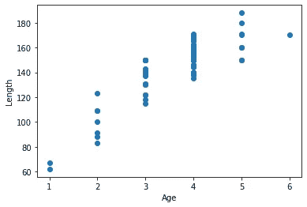
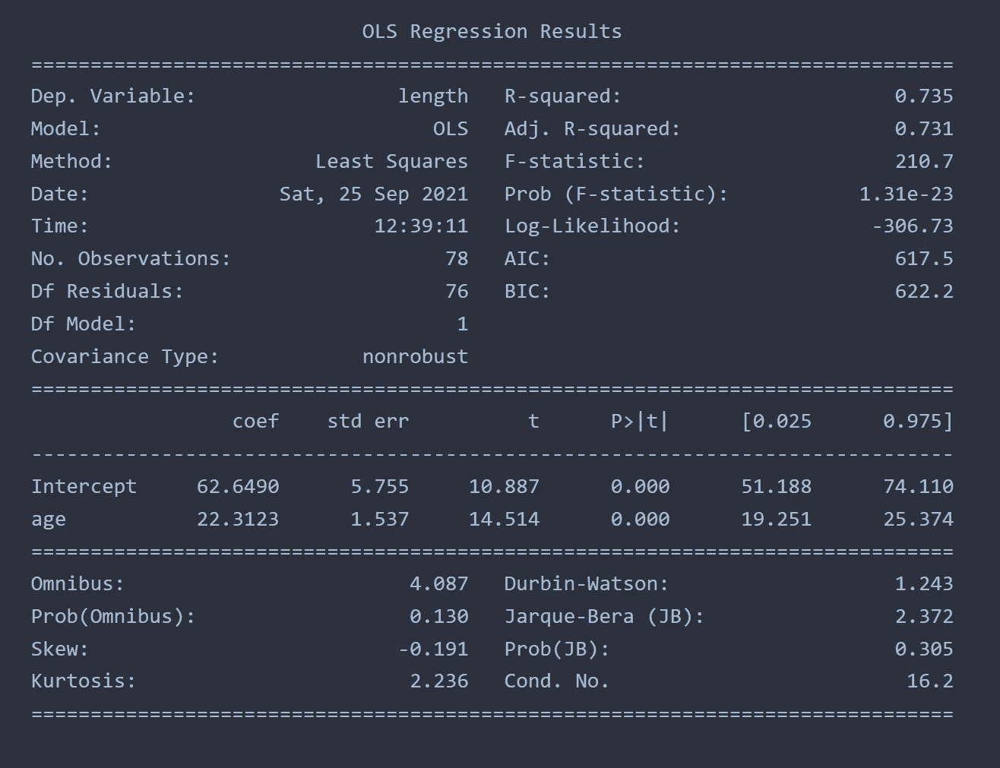
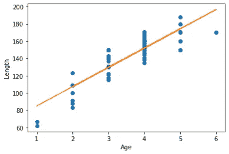
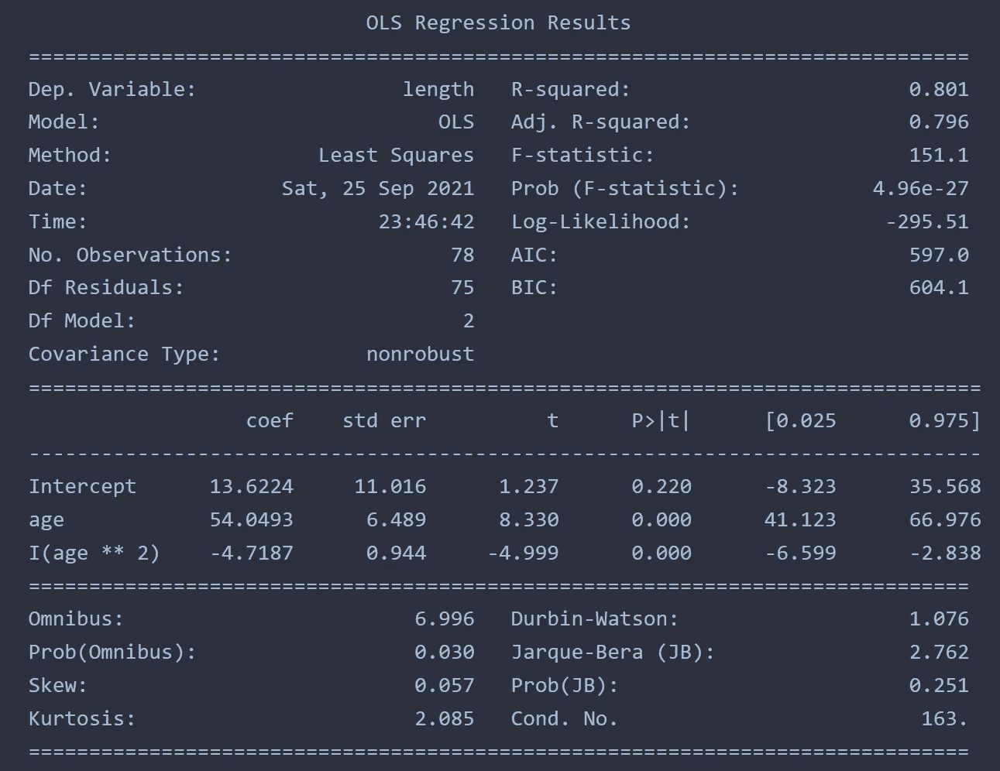
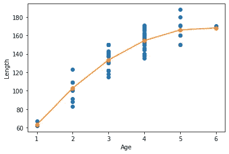
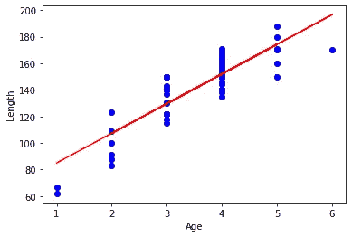
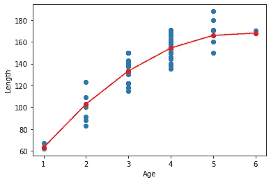

# 简单线性和多项式回归

> 原文：<https://towardsdatascience.com/simply-linear-and-polynomial-regression-9c9624774f5a?source=collection_archive---------8----------------------->

## 使用 Statsmodels、Polyfit、线性回归和多项式特征

图片来自 [Unsplash](https://unsplash.com/photos/-Bq3TeSBRdE)

> 介绍

回归是预测分析和商业预测中最基本的课题之一。它可以通过线性方式和使用高阶多项式来实现。存在使用多元线性回归生成模型的实例，但是许多真实世界的情况在因变量和自变量之间具有非线性相关性。这就是为什么需要多项式回归。使用样条进行回归也有助于最小化多项式回归的缺点，例如不必要的波动。

> **用 Python 实现**
> 
> 使用统计模型

为了用 python 实现，我将使用来自这个[链接](https://online.stat.psu.edu/stat501/lesson/9/9.8)的数据。这是按年龄与鱼长相关的数据。

作者图片

我们希望使用线性和多项式回归来拟合这些数据。使用 statsmodels，可以部署普通最小二乘法(OLS)来拟合数据。我们可以看看拟合的结果。

作者图片

R 平方值决定拟合的好坏。最佳实践是绘制残差图来检查异方差，但这里我们将范围限制为仅检查 R 平方值。R 平方值为 0.735 表示拟合良好，但不是很强。调整后的 R 平方值试图抵消添加更多因变量的影响。这里显示了因变量的系数和截距。

作者图片

为了合并高阶项 aka 多项式回归，我们需要实现以下模块。

作者图片

多项式回归的 R 平方值为 0.801，比线性回归好。

作者图片

> 使用 Polyfit

使用 numpy 的 polyfit 类可以实现相同的回归。这种情况下的 R 平方值也是 0.801。

作者图片

> 使用线性回归和多项式特征

使用 sklearn 的基本功能，可以实现线性和多项式回归。

作者图片

这种情况下的 R 平方值为 0.735，与之前的方法(使用 statsmodels)相同。对于高阶回归(非线性回归)，可以使用下面的代码块。

作者图片

在这种情况下，R 平方值也是 0.801。

> 结论

我们已经尝试了三种不同的方法来实现多项式回归，在所有情况下，我们都得到了相同的 R 平方值。对于 python 中的回归分析，所有这些方法都是相似的。对每次执行持续时间的简单测试表明，numpy 的 polyfit 是最快的实现。因此，在处理大数据时，与其他实现相比，polyfit 可能是更好的方法。