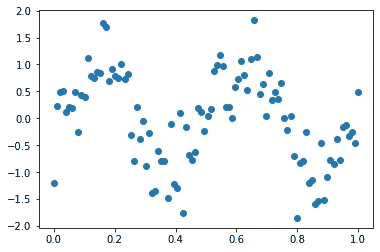
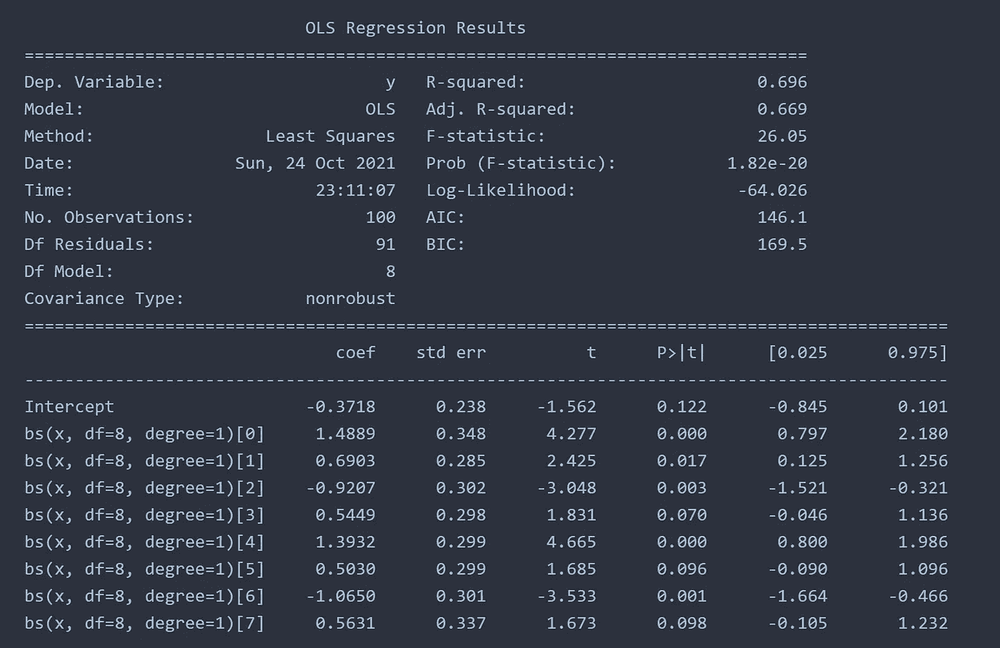
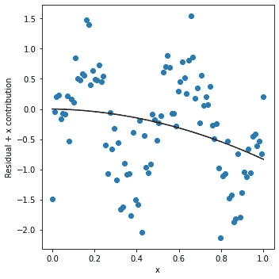
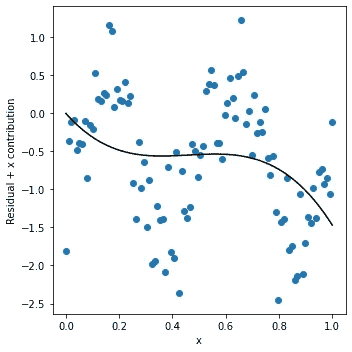
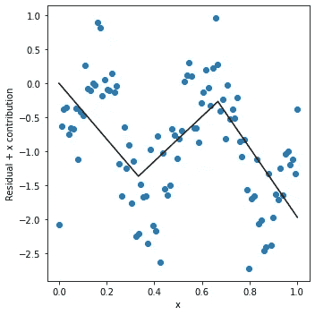
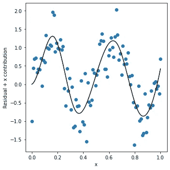

# 简单样条回归:节点间的多项式

> 原文：<https://towardsdatascience.com/simply-spline-regression-polynomials-between-knots-3d007523ad99?source=collection_archive---------21----------------------->

## 使用 python 的 statsmodels 库

图片来自 [Unsplash](https://unsplash.com/photos/1Q6gfwHc5GI)

> **简介**

线性和多项式回归有一些很大的优点，也有一些缺点。线性回归非常简单且易于实施，而多项式回归则需要更高阶的多项式来拟合数据。多项式回归有一个基本的局限性，它导致一些数据拟合向样条拟合发展。样条回归比多项式回归更复杂，但是这里我将使用 statsmodels 库演示 python 中的样条回归实现。

多项式回归可能在局部数据中过度拟合，因此，如果过度拟合，在预测未来趋势时会产生误导。此外，多项式回归线由样本中的每个数据点全局控制。一个单独的数据点可以剧烈地移动多项式曲线。异常值会改变曲线，因此在进行多项式拟合之前从数据中移除异常值非常重要。我还有一篇关于如何去除异常值的文章。

 [## 异常检测在 python 中的实际实现

### IQR、汉佩尔和 DBSCAN 法

towardsdatascience.com](/practical-implementation-of-outlier-detection-in-python-90680453b3ce) 

> **花键**

样条只是整个多项式线的一部分。线被分成几个结，其中每两个结由用户确定的多项式线连接。这基本上消除了单个数据点对全局多项式曲线的影响。

> **python 实现**

在这个简单的代码中，我将展示样条曲线是如何形成的，以及如何控制这些曲线来获得用户定义的输出。让我们用正弦波创建一个虚拟数据集，如下所示。我将用多条样条曲线来拟合这些数据，而不是单一的多项式曲线。

我将把这些数据放在一个 panda dataframe 中，这样我就可以在模型中使用它们作为列。

作者图片

我将使用下面的块实现 statsmodels 样条回归。

这里，基函数采用用户定义的自由度和节点间多项式的次数。然后，将公式输入到模型中。

拟合的 R 平方值显示了遵循趋势的样条的强度。R 平方值越高，模型拟合越好。显然还有一些其他的因素，比如同质性，但这超出了本文的范围。下面的文章就是为了讨论这个话题而写的。

 [## 回归模型中的异方差性

### 使用统计模型检查异方差性

towardsdatascience.com](/heteroscedasticity-in-regression-model-21d9f5a93e59) 

如果 df = 1，degree = 1，本质上将是一个线性回归模型。

df = 1，度数= 1

将 df 更改为 2 将导致以下拟合。很明显，有两条线有三个结。连接线的顺序仍然是 1，因此，在结之间仍然是线性的。

df = 2，度数= 1

将 df 保持在 2，并将 degree 改为 2 将导致这种情况。

df = 2，度数= 2

现在我们有所收获了。曲线变得更加多项式化，但它离正弦波的良好拟合还差得很远。让我们把 df 增加到 3，degree 增加到 3。每当阶数为 3 时，回归就变成三次样条回归，这是许多分析的默认设置。通常需要 25、50 和 75 个百分点来拟合数据。

df = 3，度数= 3

我们正在到达那里。该曲线有 4 个节点(包括端点),在这些节点之间拟合了三次多项式。如果我们将 degree 放回 1(线性),这一点会更加明显，如下所示。

df = 3，度数= 1

当 df =8 和 degree = 3 时，它变得更符合实际。

df = 8，度数= 3

> **结论**

样条回归不像多项式回归那样具有单个数据点的全局影响的缺点。样条回归中的基本数学更为复杂，其中的结由三次样条或用户定义的结确定。它还消除了由于过度拟合而从多项式回归中产生的不期望的摆动。

**参考** : [github 功能](https://github.com/gedeck/practical-statistics-for-data-scientists/blob/master/python/code/Chapter%204%20-%20Regression%20and%20Prediction.py)

[Github 页面](https://mdsohelmahmood.github.io/2021/10/24/Spline-Regression.html)