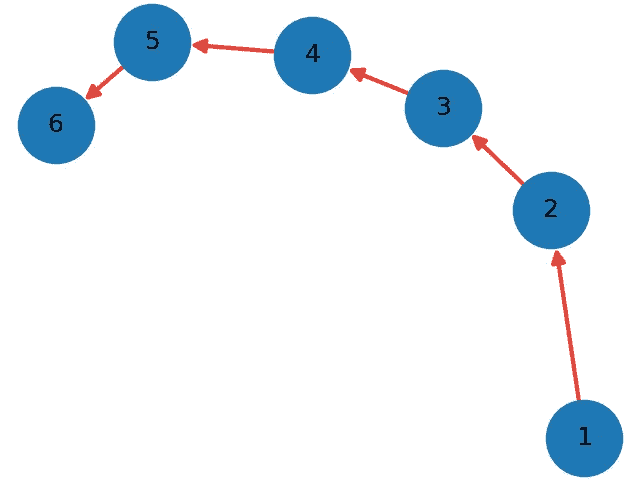
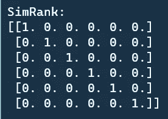
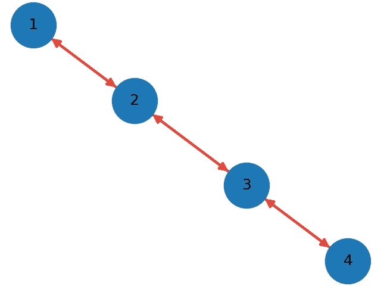

# SimRank:从零开始的相似性分析解释和 Python 实现

> 原文：<https://towardsdatascience.com/simrank-similarity-analysis-1d8d5a18766a?source=collection_archive---------19----------------------->

## 网站的相似性度量


斯凯勒·史密斯在 [Unsplash](https://unsplash.com?utm_source=medium&utm_medium=referral) 上拍摄的照片

相似性度量是各种领域都需要解决的问题。SimRank 是一种直观而通用的相似性度量方法。它适用于任何具有对象对对象关系的领域，根据对象与其他对象的关系来度量对象的相似性。

SimRank 的关键是

> **如果两个对象被相似的对象引用，则认为它们是相似的。**

我们将简要介绍该算法，并从头开始演练 Python 实现。

# 算法

请随意查看评论良好的源代码。这真的有助于理解整个算法。

<https://github.com/chonyy/PageRank-HITS-SimRank>  

算法步骤如下所列

*   初始化以下每对节点的 SimRank

```
if(node1 == node2):
  SimRank(node1, node2) = 1
else:
  SimRank(node1, node2) = 0
```

*   对于每次迭代，更新图中每对节点的 SimRank
*   如果两个节点相同，则 SimRank(a，b) = 1
*   如果其中一个节点没有邻居，则 SimRank(a，b) = 0
*   否则，新的 SimRank 遵循以下等式


*   我们根据上一次迭代的 SimRank 计算新的 SimRank(递归定义，但迭代计算)

# Python 实现

## 初始化 SimRank

我们在相似类构造函数中初始化 SimRank。请注意，初始值存储在 old_sim 中。我们保留 new_sim 以保存下一次迭代中更新的 SimRank。

初始化规则就像我们上面提到的一样。如果二者相同，则 SimRank = 1，否则 SimRank = 0。

## SimRank 一次迭代

这是 SimRank 的主函数。我们迭代图中的每一对节点，并更新 SimRank。在获得所有新的 SimRank 值之后，我们用当前迭代中的值替换旧值。

## 计算新的 SimRank

*   如果两个节点相同，值= 1
*   如果其中一个节点没有邻居，值= 0
*   SimRank_sum =所有相邻对的 SimRank 值之和(SimRank 值来自前一次迭代)
*   用衰减因子计算标度
*   用 SimRank_sum 和 scale 计算新的 SimRank

## 更新 SimRank

将计算出的新 SimRank 值赋给 new_sim。

## 替换 SimRank

用当前迭代的值替换上一次迭代的值。

[https://gist.github.com/9395c9aea14e4086ce2611809084f9a0](https://gist.github.com/9395c9aea14e4086ce2611809084f9a0)

# 结果分析

让我们在回购中的 [***数据集***](https://github.com/chonyy/PageRank-HITS-SimRank/tree/master/dataset) 上测试我们的实现。我们在所有结果中设置 decay_factor = 0.9。

## graph_1.txt



图片由 Chonyy 提供。

> ***结果***



结果遵循节点值的顺序，即行上的`1, 2, 3, 4, 5, 6`和列上的`1, 2, 3, 4, 5, 6`。从矩阵中，我们可以看到对角线上总是全是 1。两个相同节点的 SimRank 始终为 1。

回想一下上面解释的 SimRank 方程，在计算中，有没有共同的双亲关系很大。从图中，我们可以看到没有一对节点有共同的父节点。因此，所有的 SimRank 都是 0。

## graph_2.txt


图片由 Chonyy 提供。

> ***结果***


同样，没有一个节点有共同的父节点。所以 SimRank 都是 0。

## graph_3.txt



图片由 Chonyy 提供。

> ***结果***


从结果矩阵中，有一个有趣的观察。

```
SimRank[1][3] = SimRank[3][1]
```

让我们来看看 SimRank 的配对吧！= 0.(节点 1，节点 3)，(节点 2，节点 4)都有一个共同的父节点，这使得它们的 SimRank 不等于零。

## graph_4.txt


图片由 Chonyy 提供。

> ***结果***


让我们看看 pair(节点 6，节点 4)，(节点 7，节点 4)。这两对节点中的公共节点是节点 4。节点 4 有两个父节点，节点 1 和节点 5。

*   节点 1 是节点 7 的唯一邻居
*   节点 5 是节点 6 的唯一邻居

可以看到，这种关系使得他们得到了相同的 SimRank = 0.695。

## IBM.txt


图片由 Chonyy 提供。

> ***结果***


结果遵循节点值顺序，分别为行和列中的`2076, 2564, 4785, 5016, 5793, 6338, 6395, 9484, 9994`。

您可能想知道为什么(node4785，node5016)有一个**单个和公共的**父节点，但是 SimRank 不是 1。这就是为什么我们需要衰减因子，来区分高度相似和完全相同。

# 计算性能

## 趋同；聚集

现在我们都知道，经过足够的迭代，SimRank 将总是收敛到一个特定的值。为什么我们不画出来看看它收敛的有多快？

> ***在 graph_4.txt 上测试收敛性***


图片由 Chonyy 提供。

这里有两个重要的观察。第一个是就像我们预期的那样，值从 0 开始，逐渐增加到某个值，停止变化。第二个是曲线比我们从 HITS 或者 PageRank 算法得到的图更平滑。

请注意，完成计算可能不总是只需要这几次迭代。例如，如果我们在 repo 中的 graph_6 上测试这个 SimRank 算法，它具有 1228 个节点和 5220 条边，即使 500 次迭代也不足以使 SimRank 收敛。并且由于大量的边，计算会花费很长时间。

## 边数


图片由 Chonyy 提供。

我们用不同数量的总边运行 100 次迭代，以便发现总边和计算时间之间的关系。可以看出，边数对计算时间的推断比线性增加得更快。所以边太多的话计算会特别慢。

请注意，它不是一条完美的曲线的原因是边彼此链接的方式也会稍微影响计算时间。

# 源代码

<https://github.com/chonyy/PageRank-HITS-SimRank>  

# 相关职位

<https://chonyy.medium.com/hits-algorithm-link-analysis-explanation-and-python-implementation-61f0762fd7cf>  <https://chonyy.medium.com/pagerank-3c568a7d2332> 