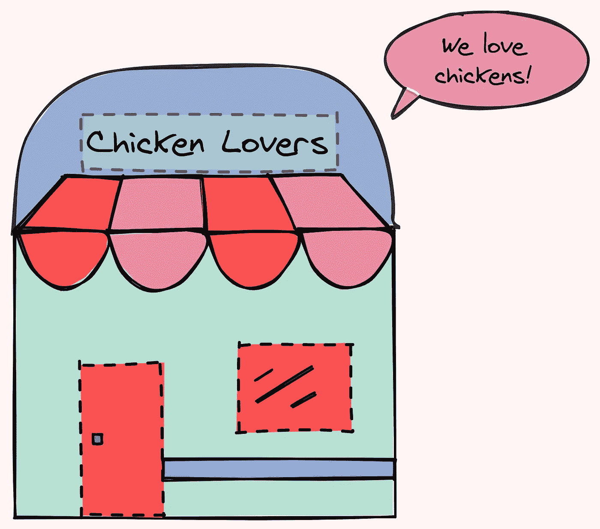

# 使用 SimPy 在 Python 中模拟真实事件

> 原文：<https://towardsdatascience.com/simulate-real-life-events-in-python-using-simpy-e6d9152a102f?source=collection_archive---------5----------------------->

## [实践教程](https://towardsdatascience.com/tagged/hands-on-tutorials)

## 模拟一家有饥饿顾客和有限食物供应的餐馆

# 动机

作为一名餐厅经理，你想估算一下你的餐厅明天需要准备多少食物。你知道每天有多少顾客来你的餐厅，以及为一个顾客服务的平均时间。然而，将所有这些变量放入一个计算中是具有挑战性的。

如果能用 Python 模拟这个事件岂不是很棒？


作者图片

这就是 SimPy 派上用场的时候。

# 什么是简单？

SimPy 是一个 Python 库，可以让你模拟现实生活中的事件。它可以对客户、车辆或代理等活动组件进行建模。

要安装 SimPy，请键入:

```
pip install simpy
```

# 开始—模拟服务员

在 SimPy 中，客户或车辆等活动组件的行为用*流程*建模。这些进程存在于*环境*中。它们通过*事件*与环境和彼此互动。

为了更好地理解这些概念，我们试着对一个在餐厅(一个环境)服务的服务员(一个流程)进行建模。服务员做的一些基本事情是:

*   接受顾客的订单
*   给厨师下命令
*   向顾客提供食物


作者 GIF

在这里，服务员是一个过程。服务员住在一个`env`里。当前模拟时间为`env.now`。`env.timeout(duration)`方法模拟完成一项活动所需的时间。

输出:


作者图片

酷！我们能够模拟服务员做的一些基本事情。上面的输出是有意义的，因为它需要:

*   5s 接受顾客的订单(`take_order_duration = 5`
*   给厨师下命令(`give_order_duration = 2`)
*   5s 为顾客提供食物(`serve_order_duration = 5`)

请注意，我们没有看到“31 开始为顾客提供食物”，因为我们只运行了`30` s 的模拟。

# 资源—模拟客户

我们可以使用与上面相同的逻辑来模拟客户。但是，由于餐厅中可以服务的顾客数量有限，我们也将对容量有限的餐厅进行建模。

这可以使用`simpy.Resource`类来完成。我们将使用`simpy.Resource(env, capacity=2)`将客户数量限制为 2。这意味着只有当餐厅里的顾客少于两个时，新顾客才能进入餐厅。


作者图片

餐馆 1

现在，我们可以指定每个活动的持续时间，并模拟 5 个客户。请注意，客户的顺序和他们的数量是不相关的。

输出:


作者图片

酷！从输出中，我们可以看到:

*   新顾客在随机时间到来
*   如果餐馆里已经有两个顾客，新顾客需要等到一个现有顾客吃完

很酷，不是吗？

# 把所有东西放在一起——模拟一家食物供应有限的餐馆

作为一名经理，你认为每种食物 10 件就足够养活你的顾客了。让我们通过应用到目前为止所学的知识来检验这个假设。

## 创建一家餐厅



作者图片

我们将模拟一家餐厅:

*   只接受外卖订单
*   只有一名工作人员
*   顾客排队等候点菜单上的食物。顾客订购的商品越多，顾客需要等待的时间就越长。

这家餐厅的特点是:

*   `staff`:能力为 1 的资源(员工一次只能服务一个客户)
*   `foods`:餐厅提供的食物选择
*   `available`:每种食物的项目数量
*   `run_out`:每种食物用完时的事件
*   `when_run_out`:各种食物用完的时间
*   `rejected_customers`:因食物选择耗尽而离开队伍的顾客数量

## 创建客户

我们还想创建一个排队等候的客户。客户将:

*   如果剩下的食物不够，就离开
*   如果还有足够的食物，就点餐

如果顾客点了某一种食物后没有食物剩下，我们会宣布所选的食物已经用完了。

上面代码中的两个新概念是:

*   `restaurant.staff.request`:请求使用资源。在这种情况下，客户向工作人员请求服务。
*   `restaurant.run_out[food].succeed` : `run_out`是可以成功也可以失败的事件。在这种情况下，如果事件`run_out`成功，它表示餐馆用完了食物选项。

在模拟达到时间限制之前，会有新的客户。

## 运行模拟

现在我们已经创建了顾客和餐馆，让我们运行模拟。当餐厅没有食物可供选择时，我们会打印信息。

输出:


作者图片

酷！想象一下 SimPy 里的 1 秒在现实生活中就是 1 分钟。如果模拟运行 240 分钟(4 小时)，并且每个食物选择有 10 个项目，那么餐馆将在不到 240 分钟内用完每个食物选择。

还有总共 22 名顾客饿着肚子离开餐厅。因此，如果我们想在 240 分钟内为所有顾客提供食物，我们可能需要为每种食物选择准备 10 种以上的食物。

## 这个例子怎么改进？

注意，上面的例子只是一个真实餐馆的简化版本。为了使这个例子更接近真实的餐馆事件，您可能需要添加更多的交互。

您还可以多次运行模拟，以更好地估计一种食物用完之前的分钟数。

查看 SimPy 文档中的[示例，获取其他灵感。](https://simpy.readthedocs.io/en/latest/examples/index.html)

# 结论

恭喜你！您刚刚学习了如何使用 SimPy 来模拟现实生活中的事件。希望这能给你动力去模拟你感兴趣的事件。

本文的源代码可以在这里找到:

<https://github.com/khuyentran1401/Data-science/tree/master/applications/simpy_examples>  

我喜欢写一些基本的数据科学概念，并尝试不同的算法和数据科学工具。你可以通过 [LinkedIn](https://www.linkedin.com/in/khuyen-tran-1ab926151/) 和 [Twitter](https://twitter.com/KhuyenTran16) 与我联系。

如果你想查看我写的所有文章的代码，请点击这里。在 Medium 上关注我，了解我的最新数据科学文章，例如:

</how-to-create-mathematical-animations-like-3blue1brown-using-python-f571fb9da3d1>  </streamlit-and-spacy-create-an-app-to-predict-sentiment-and-word-similarities-with-minimal-domain-14085085a5d4>  </human-learn-create-rules-by-drawing-on-the-dataset-bcbca229f00>  </how-to-create-fake-data-with-faker-a835e5b7a9d9> 