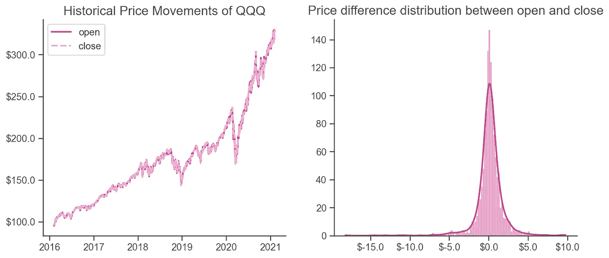
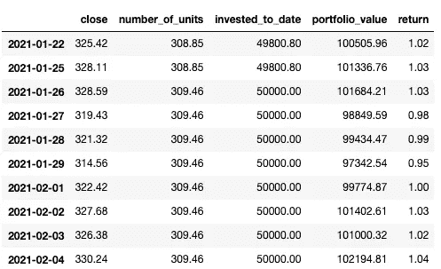
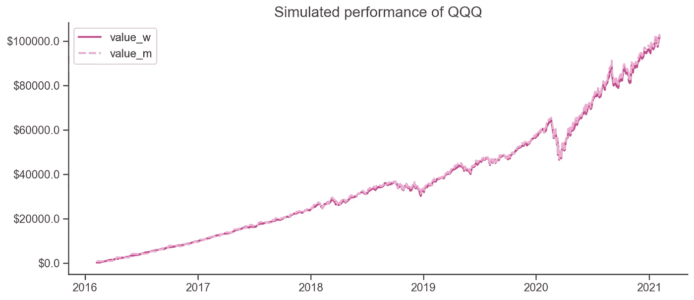
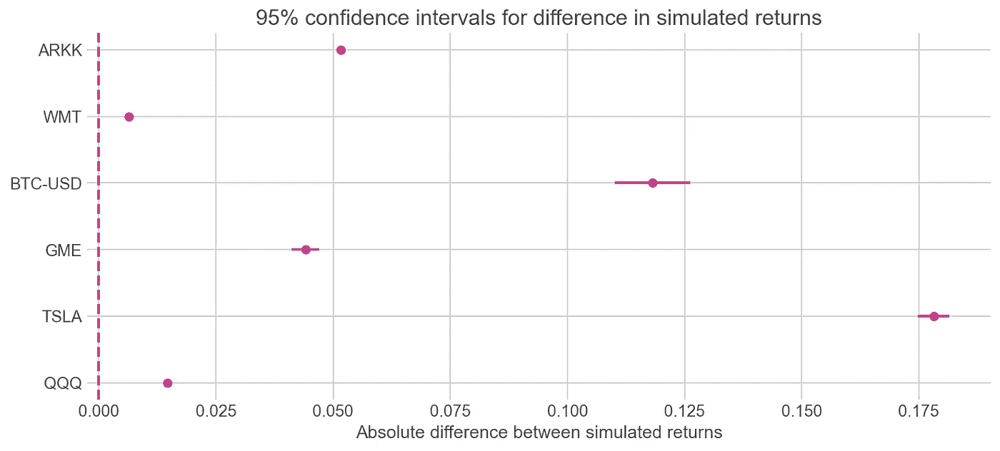
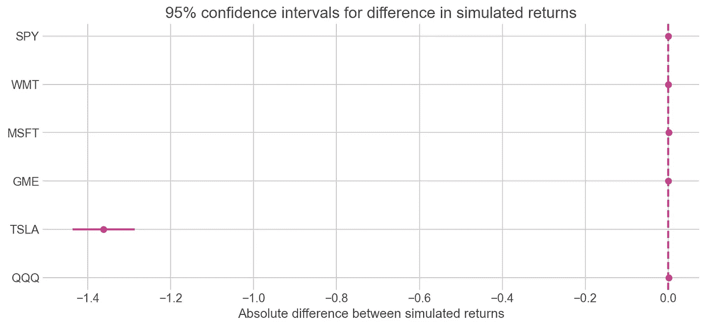

# 用 Python 模拟你的交易策略

> 原文：<https://towardsdatascience.com/simulate-your-trading-strategy-with-python-5a8a556c470e?source=collection_archive---------10----------------------->

## 股票市场中美元成本平均法的回测频率


马修·斯特恩在 [Unsplash](https://unsplash.com?utm_source=medium&utm_medium=referral) 上的照片

W 无论你是新投资者还是现有投资者，你都可能听说过“平均成本”这个术语，它指的是一种投资策略，通过将投资总额分成几个周期来减轻情绪压力和投资风险。

早在 2012 年，Vanguard 等机构就有研究比较了平均成本投资(DCA)和一次性投资(LSI)的历史表现。它得出的结论是，平均而言，即使在调整股票/债券投资组合的较高波动性后，LSI 的表现也有大约三分之二的时间优于 DCA。一次性投资让投资者更早地接触市场，如果市场长期呈上升趋势，这尤其有益。

然而，心理学在投资中起着至关重要的作用。通常情况下，投资决策是出于恐惧或贪婪。有很多关于人们因为 FOMO 或 YOLO 而赚钱或赔钱的故事。

我非常喜欢摩根·豪斯尔的《金钱心理学》这本书。在书中他指出

> 应对失败的诀窍是安排好你的财务生活，让这里的一次糟糕投资和那里的一个失败财务目标不会把你击垮，这样你就可以继续玩下去，直到胜算对你有利。

因此，在本文中，我将继续探讨美元成本平均化的思想，通过调整交易频率来了解资产的风险和回报可能如何相应地变化。

***来自《走向数据科学》编辑的提示:*** *虽然我们允许独立作者根据我们的* [*规则和指导方针*](/questions-96667b06af5) *发表文章，但我们并不认可每个作者的贡献。你不应该在没有寻求专业建议的情况下依赖一个作者的作品。详见我们的* [*读者术语*](/readers-terms-b5d780a700a4) *。*

# 假设和方法

我通常对比较每周(5 天)和每月(20 天)的投资区间感兴趣。

数据集是通过 Python 包 [**yahoofinancials**](https://github.com/JECSand/yahoofinancials) 拉取的。回溯测试是通过随机抽样 2016 年以来 5 年期间的历史价格来构建投资组合。

在开始模拟之前，以下是模型中嵌入的一些假设:

*   相同的起始时间和相同的总投资金额
*   假设部分股票可以收盘价买入和交易(使用收盘价的原因将在下面解释)。这也可以针对任何其他价格进行调整)
*   假设零经纪费
*   每周交易选择一个随机的价格点(而不是每 5 天)进行投资，每 5 个价格点按时间顺序捆绑在一起。这同样适用于月度方法
*   在每次交易中，投资额是固定的，取决于交易频率，即每月投资额高于每周投资额
*   %回报是通过比较迄今为止的投资总额与当前投资组合价值来计算的

# 历史价格的探索性数据分析

在任何建模或模拟之前，重要的一步是实际查看我们正在分析的数据。此外，为了简化模拟过程，我将只考虑开盘价或收盘价。

如果你在推特上，你可能会看到这条推文:

为了测试上面的陈述，我选择了包括纳斯达克上市的前 100 家公司的 **QQQ** ，作为例子。这里我比较了当天开市和收盘的差异(左)，以及收盘和下一次开市的价差分布(右)。



QQQ 开盘和收盘时的价格(左)；收盘价和下一个开盘价之间的差价分布(右)

有趣的是，对于 **QQQ** 来说，价差分布类似于现实生活中的正态分布，这让我有信心使用下面的测试进行假设检验:

> 空:关闭和下一次打开之间的差值为 0
> 
> 替代方案:关闭和下一次打开之间的差异> 0

```
*# add difference between next open price and close as a new column* historical_price["diff"] = historical_price["open"].shift(-1) - historical_price["close"]*# hypothesis test on if the difference between historical open and close was > 0* scipy.stats.ttest_1samp(historical_price["diff"], 0, alternative='greater')
```

测试结果返回小于 5%的 p 值，表明对于所选股票，第二天的开盘价大于前一天的收盘价在统计学上是显著的。

# 模拟成本平均法

在这一节中，我将介绍模拟不同交易频率的美元平均成本的方法，并比较每周(5 天)和每月(20 天)的风险和回报。

[算法](https://github.com/chuxinh/trading-strategy-simulation/blob/main/notebook/core/trading.py)不是每隔 ***n*** *天进行投资，而是在指定的交易区间内随机选择一个可用的日期和价格，以模仿个人在研究期间持续投资固定金额。*

基于随机选取的定价点，算法然后计算每次交易的`number_of_units`、资产的`prices`、`total_dollar_amount invested_to_date`以及`% return`。



随机选股返回的典型数据帧

您还可以选择需要运行模拟的次数，以获得预期的投资组合回报并构建置信区间。

下面是从 2016 年至今在 **QQQ** 上总共投资 5 万美元的模拟回报，其中`value_w`代表以 5 天为间隔投资，`value_m`代表以 20 天为间隔投资。



根据该图，看起来每月的总回报值与每周的总回报值不同。再次应用假设检验，通过分别构建 10，000 个投资组合，看两个模拟值是否不同。双边测试返回的 p 值为 0，这表明这两种交易频率的收益率不同。

风险通常与回报密切相关。在这里，风险分析通过查看回报的差异而得到简化。 [Levene 测试](https://docs.scipy.org/doc/scipy/reference/generated/scipy.stats.levene.html)用于等方差测试。返回的 p 值是 0.976，表明每周或每月交易的收益方差没有显著差异。

```
# perform Levene test for equal variances
scipy.stats.levene(result_w["return"], result_m["return"])
```

我们可以通过查看多种资产及其在过去五年中的模拟表现来进一步扩展分析。在这个例子中，我选择了 **QQQ** ， **TSLA** ， **GME** ，**BTC-美元**， **WMT** 和 **ARKK** 。

对于上面的每个报价器，我使用两种交易策略进行模拟，分别构建 10，000 个投资组合，并计算回报率百分比绝对差异的 95%置信区间。

我们可以看到所有的月策略在模拟下都优于周策略。比特币和 **TSLA** 等波动性资产的回报率通常更高，置信区间更宽。相比之下， **WMT** 等蓝筹股和 **QQQ** 等指数 ETF 的置信区间极窄，但增量正收益也相对较低。

此外，考虑到波动性，基于模拟结果，周交易策略和月交易策略的收益方差没有显著差异。



2020 年似乎是股票非凡的一年。为了提供一个完整的画面，在一个相当动荡的宏观环境下比较两种交易策略的表现也是值得的。

以下是 **QQQ** 、 **TSLA** 、 **GME** 、 **MSFT** 、 **WMT** 、**间谍**在 2007 年至 2012 年期间的表现差异，期间市场受到全球金融危机以及随后的欧洲主权债务危机的冲击。

在所选的报价器中， **TSLA** 是唯一一个月交易严重跑输周交易的资产，而且收益的方差也不同。其余的收益没有差别，也显示出相似的风险状况。



# 结论

如果市场的长期趋势是向上的，模拟结果表明，投资金额较高的月交易区间优于周交易区间。在我们的模拟投资组合中，它产生了具有统计意义的更好回报，并具有类似的波动性(也称为风险)。

在一个资产不断升值的市场中，早配置比晚配置更多的资金来获得风险敞口是合乎逻辑的。然而，结果可能会因你投资的资产而异，风险资产的预期回报波动更大。

如果有兴趣，你可以在这个[资源库](https://github.com/chuxinh/trading-strategy-simulation)中找到以上所有的作品。

# *免责声明*

> 本文仅供参考，不应作为法律、商业、投资或税务建议。对任何证券或数字资产的引用仅用于说明目的，并不构成投资建议或提供投资咨询服务。

*帖子修改后原发于此:*[*https://www . chuxinhuang . com/blog/trading-strategy-simulation-with-python/*](https://www.chuxinhuang.com/blog/trading-strategy-simulation-with-python/)