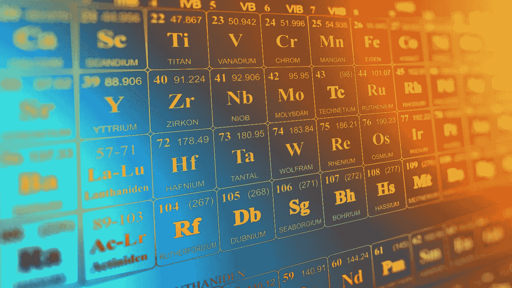
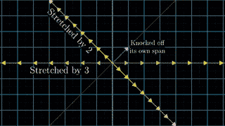
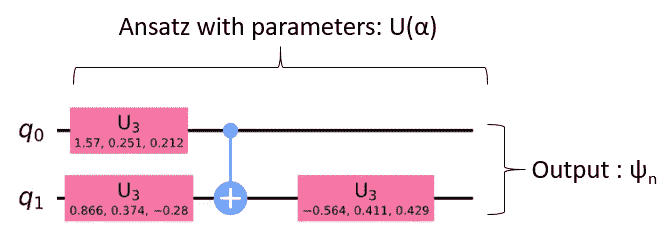
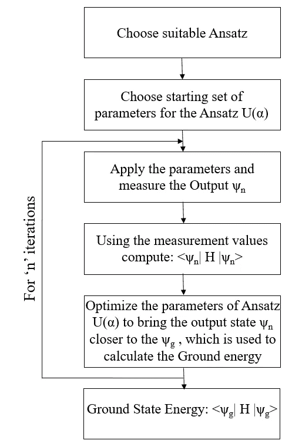
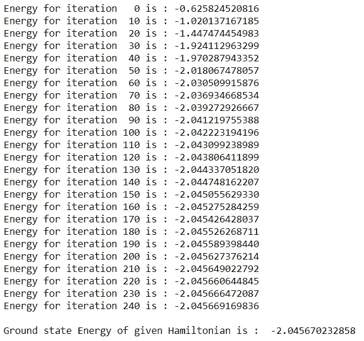
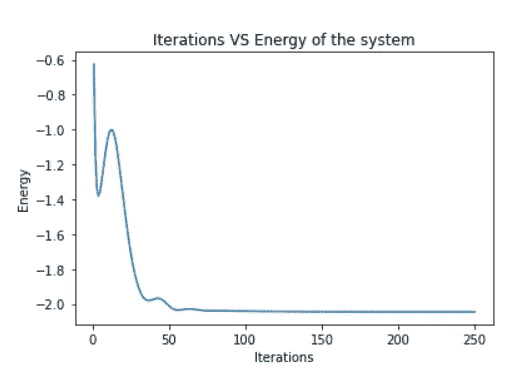

# 用 VQE 模拟分子能量的量子计算

> 原文：<https://towardsdatascience.com/simulated-quantum-computation-of-molecular-energies-using-vqe-c717f8c86b94?source=collection_archive---------22----------------------->

## 用变分量子本征解算器计算哈密顿量的基态能量



图 1:元素周期表(图片由 [Elchinator](https://pixabay.com/users/elchinator-10722855/?utm_source=link-attribution&utm_medium=referral&utm_campaign=image&utm_content=3962844) 提供，来自 [Pixabay](https://pixabay.com/?utm_source=link-attribution&utm_medium=referral&utm_campaign=image&utm_content=3962844) ，来源[https://pix abay . com/illustrations/Periodic-system-chemistry-science-3962844/](https://pixabay.com/illustrations/periodic-system-chemistry-science-3962844/))

如今，许多物理问题都可以用量子计算来解决。其中一个应用是量子化学，它模拟分子来寻找基态能量。原子的基态是指电子处于最低能级的未激发状态。计算基态能量对于多体物理、分子动力学、凝聚态物理以及其他各种学科都是极其重要的。举例来说，了解凝聚态物质中系统的基态是很有趣的，因为它告诉我们系统在低温下的行为，在低温下量子效应通常是最强的。比如在室温下考虑金属，相关的温标就是费米温度，可能是几百开尔文。所以室温金属可以被认为是处于基态，顶部有一些激发。因此计算基态能量是一项重要的任务。

由于其有限的计算能力，较大分子的模拟为经典计算带来了障碍。这就是量子计算机可以提供有效替代方案的地方。作为有史以来最伟大的思想家之一，理查德·费曼说:

> 自然不是经典的，该死的。而如果你想做一个自然的模拟，最好是量子力学的。

因此，与经典计算机相比，量子计算机是模拟哈密顿量来寻找基态能量的完美工具。这是使用称为变分量子本征解算器(VQE)的算法完成的。因此，变分量子本征解的研究在量子计算中至关重要。在本文中，我将尝试用最少的数学来解释这种方法。让我们来看看 VQE 的概念，并探索它的工作原理。

**变分量子本征解算器**

VQE 是一种混合量子经典算法，用于计算量子系统的基态。VQE 使用变分法达到所考虑系统的最低能量状态(基态)。简而言之，在该算法中，量子计算机用于创建分子的波函数 Ansatz，并使用哈密顿量计算期望值。经典优化器用于优化量子电路中的变分参数。用于此目的的哈密顿量“H”总是一个埃尔米特矩阵。这意味着 H 的共轭转置总是等于它自己。谱定理表明埃尔米特矩阵的特征值必须是实数。由于任何可测的量必须是实数，厄米矩阵适合于描述量子系统的哈密顿量。为了理解这种算法的操作，我们需要理解数学中的一些基本概念。

矩阵 A 的特征向量对于应用于向量空间的变换 A 是不变的。这意味着，在对向量空间应用矩阵运算之后，特定特征向量的方向保持不变，但是向量的大小可能会变化。从下图中可以更清楚地理解这个概念，



图 2:特征向量的可视化(来源[https://gfycat.com/fluffyminiaturebackswimmer](https://gfycat.com/fluffyminiaturebackswimmer)

从上图可以看出，即使在向量空间上应用了变换 A，用黄色表示的两个向量的方向也没有改变。这些被称为变换 A 的特征向量，因为变换的唯一效果是拉伸或压缩幅度。与此相反，粉红色的向量从它的初始方向被撞掉了。这就是矢量变化的跨度。因此，它不能被认为是这个变换 a 的特征向量。

每个 2D 变换不一定都有特征值。一些变换可能没有任何特征向量。例如，90⁰逆时针旋转 2D 矢量空间的变换可能没有任何特征矢量，因为它改变了所有可能矢量的跨度。因此，这种变换的本征值是虚的，表示在 2D 平面中没有本征向量可以用于这种变换。

使用相同的逻辑，矩阵向量乘法和标量向量乘法的等式给出为:

H|ψᵢ> = λᵢ |ψᵢ>

其中|ψᵢ>是特征向量，λ是对应特征向量的特征能量或特征值。我们特别感兴趣的是最小本征能级，

H|ψ𝔤> = E𝔤 |ψ𝔤>

其中，E𝔤 = λ𝔤 =最小(λ)

因此我们对 E𝔤感兴趣，它是与哈密顿量相关的最小本征值。VQE 将可能的量子态空间参数化，并优化参数以找到具有最小能量的参数集。因此，为了优化参数，需要迭代改变 Ansatz。这是通过变分 Ansatz 中的通用门的线性变换来实现的。|ψ>上参数的迭代优化旨在产生期望值，

∞λ𝔤，这是我们对基态的期望值

**利用 VQE 发现基态的算法**

为了计算基态能量，最重要的是系统的哈密顿量。Pennylane 提供了各种用于处理和计算分子哈密顿量的内置库。为了计算泡利 X、Y 和 Z 门中的哈密顿量，需要复杂的计算。但是使用 pennylane molecular_hamiltonian()函数可以省去这些计算。该函数采用如下输入参数:

1.  符号和坐标:感兴趣的分子的几何结构可以从各种数据库下载，如 NIST 化学网络图书、化学蜘蛛和智能社交网络。使用函数 qchem . read _ structure(GEOMETRY _ FILE)从该几何图形中，我们可以计算出该结构的符号和坐标。
2.  电荷:要求出基态能量的分子并不总是带中性电荷。根据增加或减少的电子数量，原子上的电荷会发生变化。这可以通过使用电荷参数来解决。
3.  活性电子和轨道:活性电子和轨道的数量可以通过调整这个特定的参数来改变。如果没有明确说明，所有的电子和轨道都被认为是活跃的。
4.  映射:为了解决量子器件上的问题，有必要将费米子哈密顿量转换成量子比特哈密顿量(泡利门)。使用映射选择此转换方法。

这些参数可以馈入内置函数 qchem.molecular_hamiltonian()，该函数为我们提供泡利 X、Y 和 Z 基中所需的哈密顿量。

对于本文，我认为它是一个简单的哈密顿量，只需要两根线(量子位)。下面给出了计算基态能量的哈密顿量，

```
(32.7658547225) [I0]
+ (-2.1433035249352805) [X1]
+ (-2.1433035249352805) [Z0 X1]
+ (17.015854722500002) [Z1]
+ (3.913118960624632) [X0 Z1]
+ (-23.359145277499998) [Z0 Z1]
+ (-3.913118960624632) [X0]
+ (-26.859145277499998) [Z0]
```

其中 X 和 Z 是应用于各个量子位的泡利门。

找到哈密顿量后，我们要设计一个 Ansatz U(α)，这是一个关键的任务。Ansatz 应该相当复杂，以便完美地完成计算，并且不要太复杂以至于参数的优化需要足够长的时间。对于这个特定的问题，Ansatz 是使用下面的用户定义函数设计的。

```
def variational_ansatz(params, wires): n_qubits = len(wires)
    n_rotations = len(params)
    #print(wires," ",n_qubits," ",n_rotations,"\n")

    if n_rotations > 1:
        n_layers = n_rotations // n_qubits
        n_extra_rots = n_rotations - n_layers * n_qubits # Alternating layers of unitary rotations on every qubit                   .       # followed by a ring cascade of CNOTs. for layer_idx in range(n_layers):
            layer_params = params[layer_idx * n_qubits : layer_idx *   .           n_qubits + n_qubits, :]
            qml.broadcast(qml.Rot, wires, pattern="single",               .           parameters=layer_params)
            qml.broadcast(qml.CNOT, wires, pattern="ring") extra_params = params[-n_extra_rots:, :]
        extra_wires = wires[: n_qubits - 1 - n_extra_rots : -1]
        qml.broadcast(qml.Rot, extra_wires, pattern="single",               .       parameters=extra_params)
    else:
        # For 1-qubit case, just a single rotation to the qubit
        qml.Rot(*params[0], wires=wires[0])
```

该算法使用 Adam 优化器进行参数优化，学习率为 0.1。迭代次数选择为 250 次迭代。这些超参数可以根据应用和基态能量的收敛进行调整。最后，在 250 次迭代之后，为了可视化的目的，在 Ansatz 中使用优化的参数集。具有优化参数的 Ansatz 如下所示，



图 3:具有给定哈密顿量的优化参数的 Ansatz 结构

总结一下这个算法，



图 4:VQE 流程图

**结论**

1.  该算法需要大约 15 秒来执行。输出如下所示:



图 5:算法的输出

状态能量减少的可视化如下所示，



图 6:使用 VQE 可视化哈密顿量的减少能量

该图清楚地显示了该态的能量从-0.6258 Ha 开始减少并达到其基态，其在 **-2.0457 Ha** 附近。

对于这个问题，Ansatz 是精心选择的，哈密顿量不太复杂，优化器没有陷入局部最小值。但在某些情况下，对于复杂的哈密顿量和 Ansatz 函数，优化器可能会陷入局部最小值。为了避免这种情况，超参数调整起着重要的作用。

完整的代码可以在 [Github](https://github.com/Atharva-Vidwans/Simulated-Quantum-Computation-of-Molecular-Energies-using-VQE) 上找到。

**参考文献**

1.  [https://pennylane.ai/qml/demos/tutorial_vqe.html](https://pennylane.ai/qml/demos/tutorial_vqe.html)
2.  [https://grove-docs.readthedocs.io/en/latest/vqe.html](https://grove-docs.readthedocs.io/en/latest/vqe.html)
3.  [https://qi skit . org/textbook/ch-applications/vqe-molecules . html](https://qiskit.org/textbook/ch-applications/vqe-molecules.html)
4.  [https://grove-docs.readthedocs.io/en/latest/vqe.html](https://grove-docs.readthedocs.io/en/latest/vqe.html)
5.  [https://youtu.be/PFDu9oVAE-g](https://youtu.be/PFDu9oVAE-g)

更多关于量子计算和机器学习的故事，请关注我的[媒体](https://atharvavidwans.medium.com/)。还有，看看我的 [Github](https://github.com/Atharva-Vidwans) 和 [Linkedin](https://www.linkedin.com/in/atharva-vidwans-62739b169/) 。