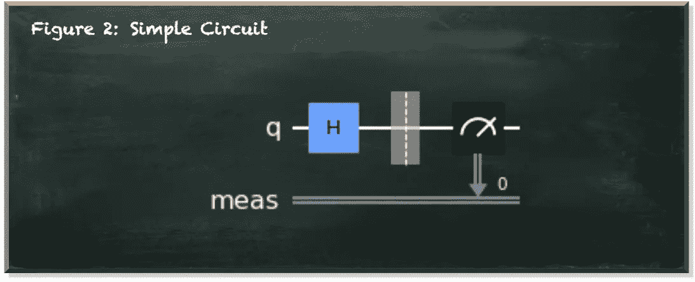
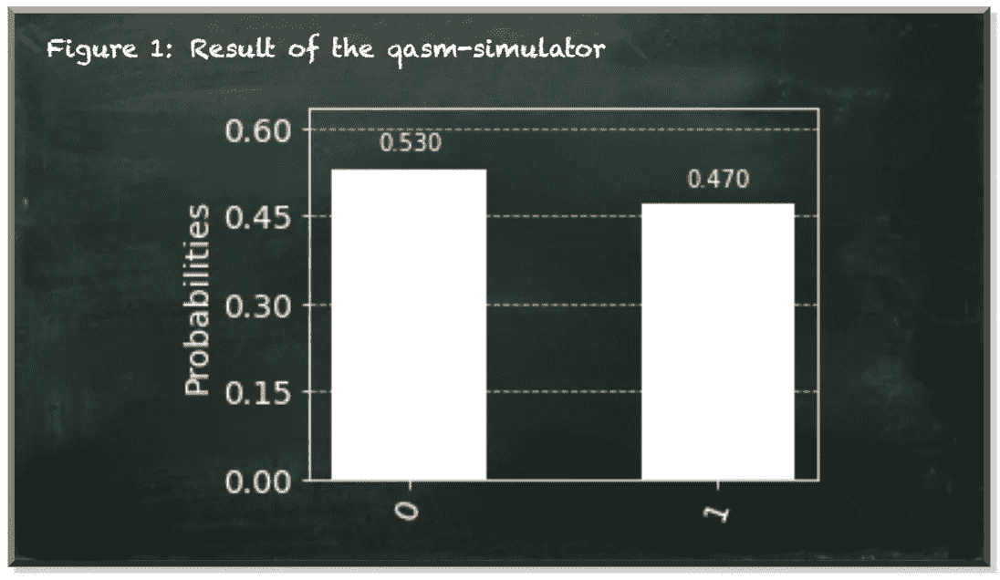
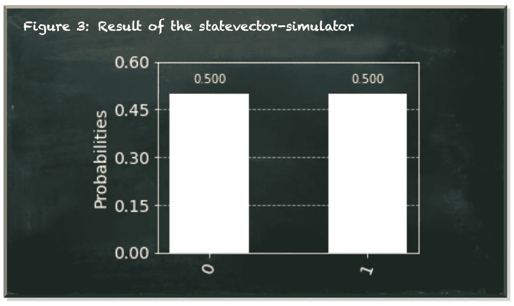
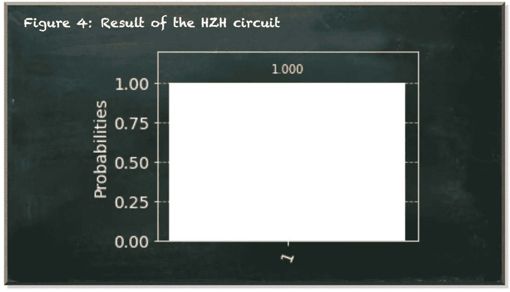

# 用 Qiskit 模拟量子计算机

> 原文：<https://towardsdatascience.com/simulating-a-quantum-computer-with-qiskit-46eb73f78394?source=collection_archive---------30----------------------->

## Qiskit 量子模拟器-如何使用它们以及它们的用途

量子机器学习要不要入门？看看 [**动手用 Python**](https://www.pyqml.com/page?ref=medium_simulator&dest=/) **学习量子机器。**

在量子计算中，我们使用量子物理的基本性质来执行计算:叠加和纠缠。

叠加是指量子系统存在于量子态|0⟩和|1⟩.的复杂线性组合中的量子现象纠缠是量子粒子之间极强的关联。即使相隔很远，纠缠的粒子仍然保持完美的关联。

仅仅是我们能够利用这些现象进行计算这一事实就令人震惊。但是，这种类型的计算使我们能够解决看似无法解决的问题的事实是不可思议的。

令人惊讶的是，我们甚至不需要量子计算机。我们可以用一个日常笔记本来模拟它们。

假设我们有下面的量子电路。



作者图片

我们在|0⟩基态的量子位上应用哈达玛门，把它放入|+⟩.态在这种状态下，我们有 50%的几率将量子位测量为 0，有 50%的几率将其测量为 1。

下面的清单在 Qiskit——IBM 的量子计算 SDK——中描述了这个电路。

Qiskit 提供了`Aer`包。它为模拟量子电路提供了不同的后端。先说第一个，那个`qasm_simulator`。

一旦我们用`qasm_simulator`后端(或任何其他后端)执行了我们的量子电路(`qc`，我们就可以使用`job.result()`方法获得结果。我们可以将这个结果转换成数字(`get_counts()`)，然后输入到最终分布的直方图中。

尽管我们的量子电路产生了一个量子位，我们以 50%的几率将其测量为 0，但结果显示了略有不同的分布。



作者图片

这是因为`qasm_simulator`根据经验检索测量计数。`shots`参数告诉 Qiskit 运行电路多少次并获得测量结果。因此，结果并不完全准确。但是拍摄次数越多，结果就越准确。

`qasm_simulator`只考虑我们测量量子位时使用的经典位。按照量子力学，我们看不到一个量子位所处的真实状态。我们只能反复测量才能得出它的状态。

当然，知道量子位的确切状态会有所帮助——尤其是在量子电路的开发过程中。

幸运的是，Qiskit 提供了另一个后端，即`statevector_simulator`。这个模拟器计算一个量子位的确切状态。当我们使用这个模拟器时，去除所有的测量值是很重要的，因为测量会破坏量子叠加，不可避免地导致系统可能处于一个确定的状态。但是我们对坍缩前的量子叠加感兴趣。

下面的代码描述了更新的量子电路。注意，`statevector_simulator`不接受 shots 参数。

类似于`qasm_simulator`，我们可以从执行结果中得到计数。



作者图片

结果显示了精确的测量概率。

***但是它是怎么做到的呢？***

为了理解经典计算机如何计算量子电路，我们需要考虑量子态(这里是|0⟩)和量子算符(这里是 T9 h T10)到底是什么。

在量子力学中，我们使用看起来像|0⟩.的狄拉克符号这不是什么奇特的东西，只是一个简单的向量。


量子算符通常用大写字母表示，比如 *H* 。但它们也没什么特别的。量子算符是一个矩阵。


最后，量子电路一点也不花哨。就是矩阵乘法。是的。整个电路将矩阵 h 与向量|0⟩相乘，并产生另一个向量，如下式所示。


结果向量表示测量幅度，其平方是测量概率。1/sqrt(2)的平方是 1/2。

从结果对象中，我们也可以使用`get_statevector()`方法获得结果向量。输出是状态向量的数组。在我们的例子中，它是:

```
array([0.70710678+0.j, 0.70710678+0.j])
```

*注:1/2 的平方根约为 0.707 左右。*

`statevector_simulator`后端计算给定量子系统的状态。这是检查叠加态量子位的理想方法。

我们的量子电路由一个单一的算子组成——哈达玛门。比方说，我们用一系列的门来代替。例如，我们可以应用三个门，H-Z-H(在[这篇文章](/towards-understanding-grovers-search-algorithm-2cdc4e885660)中了解更多关于 HZH 序列的信息)。



作者图片

当我们运行电路时，我们看到结果为 1(如果量子位处于|0⟩).态如果你想从数学上验证这个结果，我们需要将三个矩阵相乘。

即使对于小矩阵，它们的乘法也很麻烦。你需要做相当多的乘法，你必须确保不要混淆行和列。

所以，我一直用电脑做矩阵乘法。有无数的计算器可以做到这一点。然而，最方便的是在 Qiskit 内部。就是这个`unitary_simulator`。

这个模拟器执行电路一次，返回电路本身的最终变换矩阵。不管我们的量子电路看起来像什么，最终，它是一个矩阵。在输入状态下运行电路就是将转换矩阵与状态向量相乘。同样，当我们使用这个模拟器时，我们的电路不应该包含任何测量。

以下代码输出 H-Z-H 电路的矩阵。正如我们所看到的，它类似于非门的矩阵。因此，毫不奇怪，当应用于|0⟩态的量子位时，结果是|1⟩态的量子位，我们总是测量为 1。

```
array([
  [ 2.22044605e-16+6.1232340e-17j,  1.00000000e+00-1.8369702e-16j],      
  [ 1.00000000e+00-6.1232340e-17j, -2.22044605e-16+6.1232340e-17j]
])
```


***如果量子计算就是矩阵乘法，有什么了不起？***

矩阵乘法没什么花哨的。但问题是，这需要大量的计算。矩阵越大，所需乘法运算的次数(指数)就越高。因此，矩阵乘法花费的时间越多。我们可以用传统的计算机乘任意大小的矩阵。唯一的问题是，对于大型(假设是巨大的)矩阵来说，它(几乎)需要花费很长时间。大多数经典计算机无法(有效地)处理大于 30x30 的矩阵。

这就是量子计算机发挥作用的地方。他们在一个步骤中乘以许多矩阵。矩阵的大小无关紧要。因此，它们能够执行经典计算机无法执行的计算(在合理的时间内)。

# 结论

量子计算机是令人着迷的设备，尤其是当我们想到它们的硬件以及它们如何利用量子力学来执行计算时。这远远超出了大多数人(包括我)所能理解的范围。

但是量子计算并没有那么复杂。**就是矩阵乘法，本质上就是**。在小范围内，经典计算机在矩阵乘法方面做得相当好(而且准确)。因此，经典计算机可以模拟量子计算机做的事情。

但是随着矩阵规模的增加，经典计算机已经达到了极限。然后，没有模拟器会帮助你了。

量子机器学习要不要入门？看看 [**动手用 Python 学习量子机器**](https://www.pyqml.com/page?ref=medium_simulator&dest=/) **。**


在这里免费获得前三章。