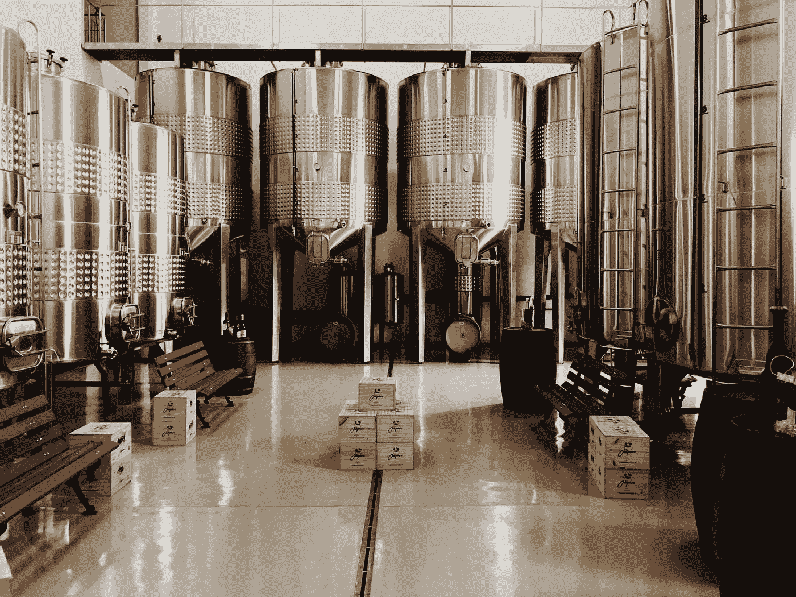

# 用 Python 中的 SimPy 模拟酿造操作

> 原文：<https://towardsdatascience.com/simulating-brewing-operations-with-simpy-in-python-5b67da3783aa?source=collection_archive---------13----------------------->

## python 中的离散事件模拟教程



罗伯特·北原惠子·桑塔纳在 [Unsplash](https://unsplash.com?utm_source=medium&utm_medium=referral) 上拍摄的照片

工业工程师使用离散事件模拟来评估生产车间的替代方案，但模拟还有更多用途。有了 Python 的 [SimPy](https://simpy.readthedocs.io/en/latest/) 包——也有其他语言版本——我们可以模拟个人项目，而无需昂贵的软件许可。SimPy 的 *ReadtheDocs* 文档很好；我建议从头到尾多看一遍。但是这篇文章是为那些喜欢额外的学习例子的人准备的。

# SimPy 简介及示例

SimPy 使用带有 yield 而不是 return 的生成器函数，以便存储模拟中的最新步骤。关于生成器函数的介绍，我推荐[凯文·康拉德的 youtube 教程](https://www.youtube.com/watch?v=0osGrraoCX0)。

这个初始模型利用 SimPy 框架来启动酿造过程，然后清洗酿造罐。后续的模型会更复杂。

在导入 simpy 之前，如果您还没有安装 SimPy，您可能需要安装它。[要安装 SimPy，您可以使用 pip 或 SimPy 文档中编写的替代方法。](https://simpy.readthedocs.io/en/latest/simpy_intro/installation.html)

```
pip install simpy
```

输出:

```
Starting to brew a lager at time 0
Finished brewing the lager at time 30
Starting to brew a lager at time 35
Finished brewing the lager at time 65
Starting to brew a lager at time 70
Finished brewing the lager at time 100
```

在这种情况下，模型在时间单位达到 101 时终止。一旦处理所有酿造过程的循环终止，下一个模型将终止。

# 在 SimPy 中使用资源和建模流程

现在我有 3 个同样大小的啤酒缸。我仍然在酿造淡啤酒，但是我想在第 0、5、11 和 20 天开始一个新罐，如果这些天有可用的罐的话。我在第 12-18 天休假，所以我不想在那几天开始酝酿过程。

在这个模型中，贮藏啤酒的酿造过程时间仍然假定为 30 天，尽管我意识到酿造过程时间实际上是可变的。我们将在下一个模型中添加处理时间的概率分布。

目前，这个模型的焦点是资源的[类型，称为资源(而不是容器资源或商店资源)。](https://simpy.readthedocs.io/en/latest/topical_guides/resources.html)

*   这个 *brewery_tanks* 资源将作为这个模型中的流程。
*   资源被*请求*，然后*在它们不再被使用后释放*。
*   在使用中，资源的*计数*将显示有多少资源的容量单位在使用中。

输出:

```
Decide to start brewing a lager at time 0
	Number of tanks available: 3
	Started brewing at time 0
	Number of tanks now in use: 1
Decide to start brewing a lager at time 5
	Number of tanks available: 2
	Started brewing at time 5
	Number of tanks now in use: 2
Decide to start brewing a lager at time 11
	Number of tanks available: 1
	Started brewing at time 11
	Number of tanks now in use: 3
Decide to start brewing a lager at time 20
	Number of tanks available: 0
Finished brewing a lager at time 30
Finished brewing a lager at time 35
There are 1 tanks available at time 35
	Started brewing at time 35
	Number of tanks now in use: 3
There are 1 tanks available at time 40
Finished brewing a lager at time 41
There are 2 tanks available at time 46
Finished brewing a lager at time 65
There are 3 tanks available at time 70
```

我选择了一个很好的时间去度假，因为当时没有任何可用的坦克。事实上，直到时间 35 都没有可用的坦克。

如您所见，仿真模型的输出值得思考。文档中的一个章节叫做 [monitoring](https://simpy.readthedocs.io/en/latest/topical_guides/monitoring.html) 讨论了保存和监控模型输出的更高级的方法。但是对于这个介绍和许多其他场景，print 语句就足够了。

# 随机模拟

虽然可以用数学方法计算确定性模拟结果，而不是利用模拟模型，但模拟对于讲述故事和自动化数据处理非常有用。随机模型将为更接近真实情况的建模场景提供更多的见解。

我阅读了多种描述酿造啤酒的资源，并分享了典型的酿造时间表是 4-8 周。酵母会做酵母做的事情，但不总是按照你的计划。让我们假设一个均值=6 周，标准差=1 周的正态分布。一旦啤酒冷却(我们假设这是过程的一部分)，然后我们将*罐*或*瓶*啤酒并储存在库存中，比率为每个啤酒厂罐 100 箱。

为了跟踪库存，这个模型中引入了另一种称为容器的资源。虽然容器类似于资源，因为它们都具有容量参数，但是容器也具有初始的*级别*参数，并且容器在给定时间的*级别*将揭示容器存储的量。

容器的级别可以随着一个 *put* 而增加，或者随着一个 *get* 而减少，这实现了与资源不同的建模能力。

输出:

```
Number of tanks available at time 0: 3
Started brewing at time 0 and 1 tanks now in use
Number of tanks available at time 5: 2
Started brewing at time 5 and 2 tanks now in use
Number of tanks available at time 11: 1
Started brewing at time 11 and 3 tanks now in use
Number of tanks available at time 20: 0
Finished brewing a lager at time 38.30356066389249
At time 43.30356066389249 there are now:
	1 tanks available
	100 cases of cans available for sale
Started brewing at time 43.30356066389249 and 3 tanks now in use
Finished brewing a lager at time 44.85515309121678
At time 49.85515309121678 there are now:
	1 tanks available
	200 cases of cans available for sale
Finished brewing a lager at time 53.146254345432425
At time 58.146254345432425 there are now:
	2 tanks available
	300 cases of cans available for sale
Finished brewing a lager at time 85.11565243779629
At time 90.11565243779629 there are now:
	3 tanks available
	400 cases of cans available for sale
```

# 处理订单

现在您已经了解了如何使用两种类型的资源，即资源和容器，下一个模型将分享一种处理订单和销售库存的方法。虽然这是一个处理订单的简单方法，但是更复杂的方法可能需要使用任何简单事件的 AllOf。

输出:

```
Before order processing, cases available: 100
After order of 1, cases available: 99
After order of 10, cases available: 89
After order of 5, cases available: 84
After order processing, cases available: 84
```

我希望本教程对你有所帮助。如果你对第二部分啤酒厂模拟有什么建议，或者想在下一个 SimPy 模型上合作，我很乐意阅读你的想法！