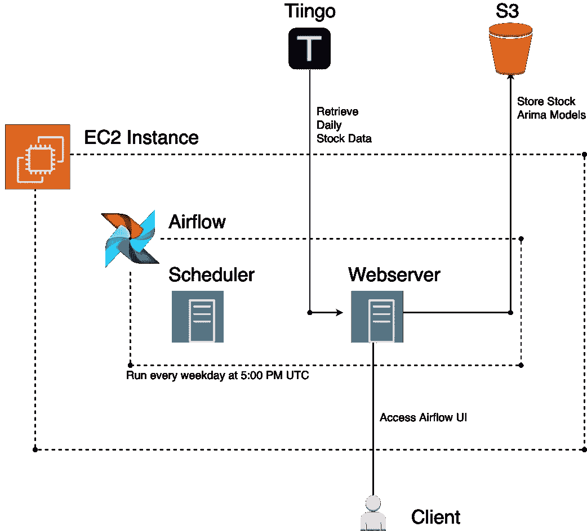
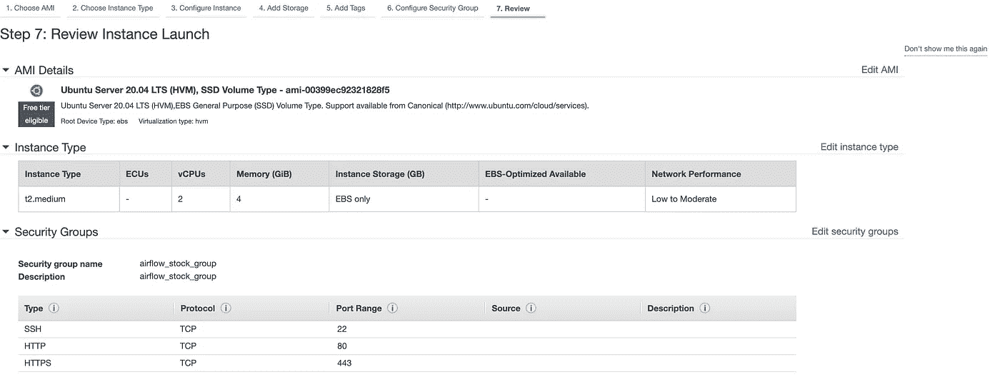
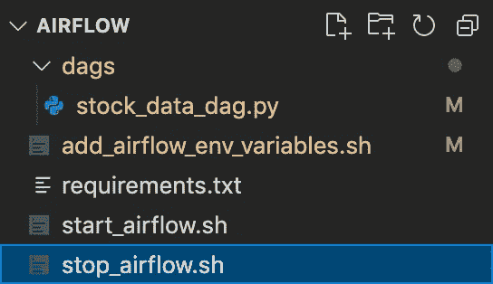
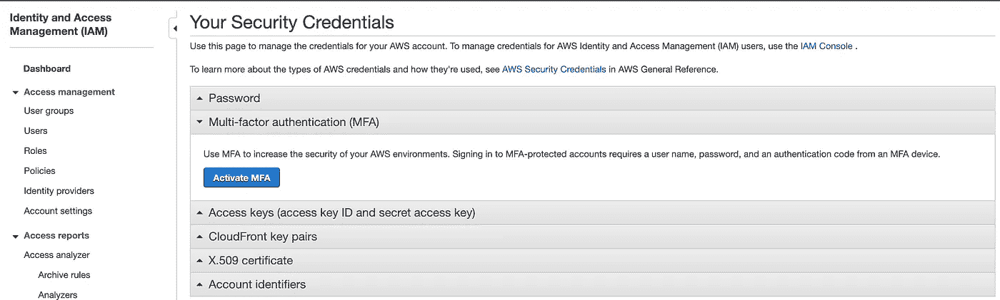
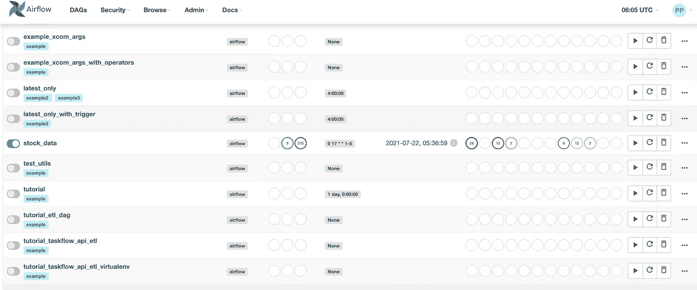
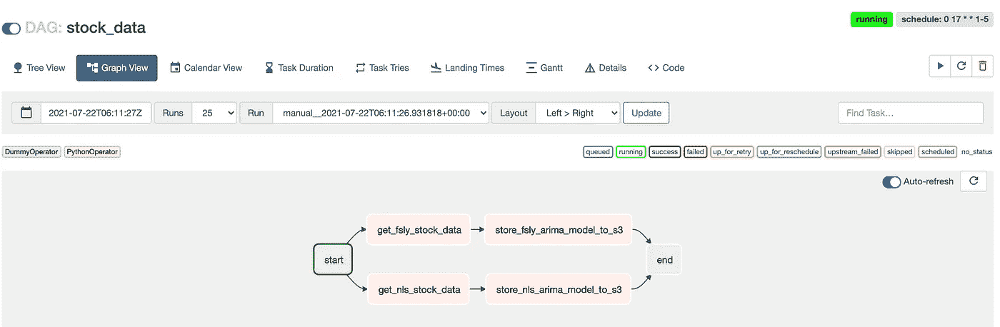
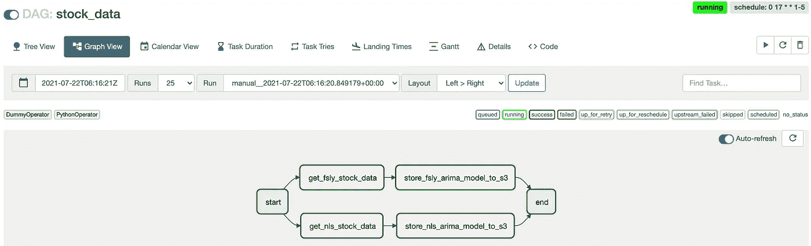
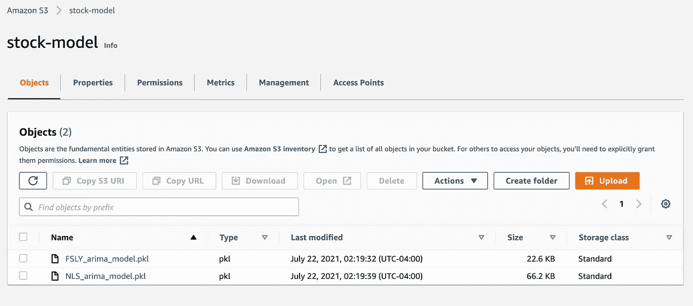

# 用气流模拟连续学习模型

> 原文：<https://towardsdatascience.com/simulating-continuous-learning-models-with-airflow-93d852718a78?source=collection_archive---------22----------------------->

## 配置工作流管理工具，在 13 分钟内定期重新创建模型


照片由来自 [Pexels](https://www.pexels.com/photo/scenic-view-of-rainforest-927414/?utm_content=attributionCopyText&utm_medium=referral&utm_source=pexels) 的[阿尼·周](https://www.pexels.com/@arnie-chou-304906?utm_content=attributionCopyText&utm_medium=referral&utm_source=pexels)拍摄

C 持续学习是系统自适应学习外部世界的过程。在机器学习的背景下，模型通过自主和增量开发不断地学习更多关于它被训练的主题领域的知识。这使模型能够学习更复杂的逻辑、知识和功能，从而有助于做出更好的预测。

持续学习对于更新模型尤其重要。假设你被一家生产哑铃的制造公司聘为数据科学家，比如鹦鹉螺公司。你的目标是预测下个季度的收入和销售额。从 2017 年 3 月到 2020 年 3 月，您的模型在收入预测上的准确率为 95%。但是，从 2020 年 3 月到 2021 年 1 月，你的模型的准确率是 40%。发生了什么事？

2020 年 3 月—2021 年 1 月发生的重大事件是冠状病毒。检疫条例迫使人们呆在室内，不要频繁外出。不能再去健身房的健身爱好者不得不建立他们的内部健身房，以跟上他们的锻炼养生。鹦鹉螺公司是哑铃和家用健身设备的领先公司，因此在疫情期间销售额飙升。在这种情况下，你在 2017 年创建的模型将严重低估 2020 年的预测销售额。这是一个很好的例子，说明为什么一个模型需要根据最近的和新出现的当前数据进行重新训练。世界的发展速度令人难以置信，3 年前的数据见解可能不适用于不断发展的数据。

您可能已经意识到需要创建 3 个独立的模型:一个在疫情之前(2020 年 3 月之前)接受数据培训，一个在疫情期间(2020 年 3 月-2021 年 5 月)接受数据培训，一个在疫情之后(2021 年 5 月至今)接受数据培训。但是，您可能没有足够的时间按照特定的时间段清晰地分割数据集。因为您可以假设疫情的开始和结束日期(例如，假设疫情的结束时间是疫苗推出的时间)，所以您可以准确地知道在哪里分割数据集。

随着时间的推移，各种数据集可能会发生微妙的变化，您需要应用一种持续学习的方法，以便您的模型能够随着新信息的出现而学习。这些数据既反映了收集数据的动态环境，也反映了提供数据的形式和格式。作为后一种发展的例子，考虑一个图像分类器，它确定 1000 页 pdf 中的一页是文本还是表单。随着时间的推移，表单的格式会发生变化，原始图像分类器会将其识别为文本。因为您不知道表单更改的确切时间，所以您需要根据所有当前数据训练一个模型。此外，图像分类器必须在较新的表单数据上重新训练，同时跟踪较旧的表单数据。

一个模型需要一个持续的学习方法来基于更新的数据进行再训练和更新。也就是说，用数学方法实现深度学习模型和递归神经网络的这种方法可能非常棘手。许多数据科学家不具备在公司期限内构建这种定制模型的知识。但是，有一种方法可以使用工作流管理工具(如 **Airflow** )来模拟持续学习。在预定的基础上，Airflow 可以获取新的训练数据，并使用以前的和新的数据重建模型。然后，数据科学家可以构建简单的模型(无论是他们自己构建的简单 **PyTorch** 神经网络，还是他们利用现有的 Python 机器学习库，如 scikit-learn)，并专注于持续更新训练数据。

本文将通过一个例子来说明如何对时间序列模型应用连续学习。我们的模型将使用 ARIMA 分析两只股票的历史股票市场数据:Fastly 和 Nautilus。

**免责声明:**这不是投资建议。话虽如此，我确实持有这两只股票。所以我倾向于提升他们，这样我就能从中受益。在花你的血汗钱之前做你的研究。

另外，在你决定用 ARIMA 预测股市之前，请多读一些时间序列方面的书。当数据集中存在可识别的模式时，时间序列模型是有效的。我没有花时间去分析 ARIMA 是否适合预测 Fastly 和 Nautilus 的股票历史数据。本文从数据工程的角度讨论构建持续学习架构。ARIMA 和时间序列被用来表明，这种架构可以用于各种类型的模型(时间序列，分类，神经网络)。分析这种时间序列模型的预测指标超出了本文的范围。

# 为什么是气流？

Airflow 是一个用 Python 编写的开源工作流管理工具。它已经成为行业标准，并且很容易建立。在处理复杂和动态的工作流时，气流也有缺点，最好使用不同的工作流工具，如 Prefect。对于本教程，我们将创建一个简单的工作流。因此，气流是完美的。

我们将在 AWS EC2 上设置气流。如果你愿意，你也可以利用 AWS MWAA(亚马逊管理的 Apache Airflow 工作流)。但是，请记住，对于一些开发人员的预算来说，AWS MWAA 可能很昂贵。例如，我每天只需支付 27 美元就可以让它正常运行，其他 AWS 弹性云服务(例如 NAT 网关)每月支付 80 美元。

# 术语

*   AWS MWAA-亚马逊管理的 Apache Airflow 工作流。处理气流的所有设置和配置，但维护费用昂贵。
*   AWS EC2 —运行应用程序的虚拟服务器。
*   AWS S3——存放腌制模型的桶。
*   ARIMA——自回归综合移动平均。它是一类模型，捕捉时间序列数据中一组不同的标准时间结构。

# 推荐阅读

本教程假设您对气流和 Dag 有基本的了解。如果没有，请阅读[气流:如何以及何时使用](/airflow-how-and-when-to-use-it-2e07108ac9f5)。

要理解气流的架构，请阅读[Apache 气流架构概述](https://freecontent.manning.com/an-overview-of-apache-airflow-architecture/)。

本教程使用 ARIMA 进行时间序列分析。这个主题超出了本文的范围。如果你想更多的了解时间序列和 ARIMA，我推荐[Arima 简介:非季节模型](https://people.duke.edu/~rnau/411arim.htm)。

# 体系结构



我使用 [Cloudcraft](https://www.cloudcraft.co/) 创建的气流架构图

# 辅导的

在本教程中，我们将在 Linux Ubuntu Server 20.04 LTS 上安装 Airflow。我们可以使用类型 **t2.medium** 创建一个 AWS EC2 映像。要阅读更多关于 AWS EC2 的内容，我推荐亚马逊的教程[这里](https://docs.aws.amazon.com/AWSEC2/latest/UserGuide/EC2_GetStarted.html)。

Airflow 需要运行一个 web 服务器和一个调度程序，因此它需要比自由层提供的内存更多的内存。t2.medium 有足够的资源来安装和运行 Airflow。

我们还使用 Ubuntu，因为它是为数不多的适合机器学习的 Linux 操作系统之一。其他 Linux 操作系统(包括 AWS Linux)将不会有一些机器学习库所需的确切包和依赖项，包括脸书先知。他们有这些包的替代品，但如果脸书先知不能正确编译它们也没关系。脸书预言家需要一个被称为 C++14 的 C++标准来编译它所有的依赖项。Ubuntu(和 Mac OS)支持 C++14，但 CentOS 或 AWS Linux 不支持。Ubuntu 和 MacOS 对于下载未来的机器学习包并正确编译非常有用。

## 创建 EC2 实例

登录 AWS 控制台并导航到 EC2 >实例>启动实例。配置您的实例，使其与以下内容匹配。

**注意:**我删除了安全组中 Source 下的 IP 地址。但是为了保护您的实例以确保没有其他人可以访问它，请确保您选择了我的 IP 而不是 Anywhere)



**编辑:**除了这些安全组，还应该添加 HTTP，TCP，端口 8080。默认情况下，该端口由 airflow webserver 使用。如果您想使用不同的 airflow 服务器端口，您应该更改端口。

启动实例时，它会询问您从哪里下载. pem 文件。将此文件命名为 airflow_stock.pem，并将其存储在您选择的文件夹中。

等待 EC2 实例运行，然后在本地终端上调用这个命令。

```
ssh -i "airflow_stock.pem" ubuntu@ec2-3-131-153-136.us-east-2.compute.amazonaws.com
```

SSH 是一个安全的 Shell 协议，允许您在本地命令行上登录到云实例。它需要一个. pem 文件来验证您是否可以登录到服务器。

**注意:**如果你得到一个*未受保护的私钥*错误，这意味着你的。pem 是大家看得见的。您只需要调整. pem 的权限。在执行之前运行此命令

```
chmod 400 airflow_stock.pem
```

有关此错误的更多信息，请参见本文[这里的](https://99robots.com/how-to-fix-permission-error-ssh-amazon-ec2-instance/)。

## 安装 Pip 和气流

假设你有一个干净的 Ubuntu 实例，你需要安装 pip 和 apache-airflow。要安装 pip，请运行以下命令

```
sudo apt update
sudo apt install python3-pip
```

我们将在教程中使用 Python 3。要安装 apache-airflow，请运行以下命令

```
pip3 install apache-airflow
```

下一步是创建文件作为气流项目的一部分。

## 创建文件夹结构

您可以创建以下文件，或者从 [git repo](https://github.com/hd2zm/Data-Science-Projects/tree/master/Medium/Airflow_CL/airflow) 中获取。

该文件夹有 4 个组件:一个用于添加气流环境变量的 bash 脚本(add_airflow_env_variables.sh)，一个用于安装 pip 包的需求文本(requirements.txt)，一个启动气流脚本(start_airflow.sh)，一个停止气流脚本(stop_airflow.sh)，以及一个 dags 文件夹，该文件夹提取股票数据并从所有数据中重建 ARIMA 时间序列模型。



Visual Studio 代码中气流文件夹结构的屏幕截图

**add _ airflow _ env _ variables . sh**包含了我们在运行 air flow 之前需要设置的所有环境变量。现在，它只列出了 AIRFLOW_HOME，我们存储 AIRFLOW 的日志/输出/数据库的路径。我在 ec2 实例中克隆了这个 repo，所以我使用了 github repo 的[文件路径。](https://github.com/hd2zm/Data-Science-Projects/tree/master/Medium/Airflow_CL/airflow)

这个 **requirements.txt** 文件包含了我们需要的所有 pip 包。

```
statsmodels
pandas
pandas_datareader
boto3
awscli
```

要安装 requirements.txt 中的所有包，只需运行

```
pip3 install -r requirements.txt
```

**start_airflow.sh** 包含在 EC2 服务器上启动 airflow 的所有命令。

**stop_airflow.sh** 包含停止当前在 EC2 服务器上运行的 air flow web 服务器和调度程序的所有命令。

**stock_data_dag.py** 将包含触发工作流的逻辑。工作流分为两个功能:提取和加载。

**Extract**(*get _ stock _ data*)将从 TIINGO 获取股票从 2015 年 1 月 1 日到触发日的所有历史价格。对于本教程来说，这个平台已经足够了。然而，在生产环境中，平台将要求只获取当天的数据，并追加到存储在 S3 中的以前的历史数据。

**Load**(*store _ arima _ model _ in _ s3*)从历史股票价格中创建 ARIMA 模型，并将腌制文件存储在 S3 桶中。我们可以获取那些根据新的训练数据重新训练过的新模型。

**注意:**您需要创建一个 TIINGO 帐户来获取 get_stock_data 中使用的 API 键(第 25 行)。

将 python 函数 *get_stock_data* 和*store _ ARIMA _ model _ in _ S3*视为**任务**。为了在 DAG 上调用这些任务，我们需要使用**操作符**。操作符是 DAG 的主要构件，用于执行某些功能/脚本/API/查询等。在本例中，我们创建了 4 个不同的 Python 运算符:

*   获取 NLS 股票数据
*   商店 _ NLS _ ARIMA _ 模型 _in_s3
*   获取 _ FSLY _ 股票 _ 数据
*   存储 _FSLY_arima_model_in_s3

工作流时间表的格式为 crontab:0 17 * * 1–5。这意味着该工作流将在每个工作日的下午 5 点被触发。

*stock_data_dag* 为每只股票列出了两个不同的任务:get_stock_data 和 *store_stock_arima_model* 到 s3。 *get_stock_data* 获取自 2015 年 1 月 1 日以来的 TIINGO 历史股票数据，并将其存储在 JSON 中。 *store_stock_arima_model* 获取股票 JSON，获取所有日期的调整后收盘价，根据这些价格构建 arima 模型，并将 ARIMA 模型存储在名为`stock-model`的 S3 存储桶中。然后我们可以从 S3 下载模型，用它们来预测第二天的价格。

**注意:**这种架构不仅仅适用于 ARIMA 车型。各种其他 skikit-learn 模型和算法，如 XGBoost、RandomForest、NaiveBayes、LinearRegression、LogisticRegression 和 SVM，都可以从这种持续学习方法中受益。您可以简单地重用 **stock_data_dag.py** 文件的*store _ ARIMA _ model _ in _ S3*函数，或者直接编辑 python DAG 并将第 44 行更改为您想要的模型。您甚至可以添加自己的神经网络逻辑来代替 skikit-learn 模型，也就是说，您必须重新考虑您的回归/分类模型是基于哪些数据进行训练的。您可能需要更改 *get_stock_data* 来为您的模型获取不同的数据集。无论您试图解决什么样的业务问题，这种气流持续学习架构都可以互换，以适用于各种用例。

我们现在有了本教程计算所需的所有文件。下一步是执行某些脚本，并为运行配置气流。

## 创建 AWS S3 时段

我们想创建一个 S3 桶来存储我们的模型。导航到 S3 并创建一个名为`stock-model`的新存储桶。然后，我们将配置 EC2 aws 凭证，以便我们可以使用 boto3 来存储进入 S3 的气流的模型。

## 配置 AWSCLI

我们想把我们的 ARIMA 模型存放在一个 S3 桶里。为此，我们需要在 EC2 实例上配置本地 AWS 设置，以便它能够识别所需的 AWS 帐户。

首先，导航到 IAM 管理控制台的“安全身份证明”页面: [IAM 管理控制台(Amazon.com)](https://console.aws.amazon.com/iam/home?#/security_credentials)。



IAM 的安全身份证明页

如果您还没有这样做，向下滚动访问键，并点击创建新的访问键。这将生成一个 excel 文件，您可以下载该文件来获得您的访问密钥和秘密访问密钥。不要与任何人共享此文件。如果您这样做，您的 AWS 帐户将面临黑客攻击和可能的超额收费的风险。

在 EC2 上，键入

```
aws configure
```

AWS 将提示您输入访问密钥和秘密访问密钥。将 excel 文件中的值放在那里。您可以在默认区域名称和默认输出上按 enter 键。

AWS 凭证现在设置在 EC2 上，因此您可以创建 boto3 会话。

## 配置气流

首先，添加环境变量。因为我们有一个脚本，您可以简单地调用以下命令。

```
source add_airflow_env_variables.sh
bash add_airflow_env_variables.sh
```

如果您想检查是否添加了环境变量 AIRFLOW_HOME，请在命令行中运行`env`。

下一步是创建用于存储 dag 运行的气流数据库。如果这是您第一次创建 airflow 数据库，请在 AIRFLOW_HOME 路径中运行下面的命令。

```
airflow db init
```

您还需要添加一个用户，因为 airflow 会提示用户登录。以下命令摘自[本地运行气流文档](https://airflow.apache.org/docs/apache-airflow/stable/start/local.html)中的示例。

```
airflow users create \
    --username admin \
    --firstname Peter \
    --lastname Parker \
    --role Admin \
    --email spiderman@superhero.org
```

它会提示您输入自己选择的密码。

接下来，使用以下命令安装 requirements.txt 中的所有包

```
pip3 install -r requirements.txt
```

最后，运行以下命令来启动 daemon 中的 airflow webserver 和调度程序。

```
bash start_airflow.sh
```

这将运行气流调度和网络服务器没有任何问题。要检查 UI 是否工作，请导航到此 url。

**http://ec2–11–111–111–11 . us-east-1 . compute . Amazon AWS . com:8080**

ec2–11–111–111–11.us-east-1.compute.amazonaws.com 是一个虚构的 Ec2 公共 IPv4 地址。您应该能够在 EC2 -> Instances 控制台上的 Details 选项卡中为您的 EC2 实例获取它。确保您使用 **http** (不是 https)和端口 8080(如果您设置气流使用该端口，否则使用您配置的任何端口)。

您应该会看到一个登录页面弹出。输入用于在 Airflow 中创建用户帐户的用户凭据(用户名:admin，密码:您键入的任何内容)。现在，您应该可以看到列出的所有气流 DAG，包括我们之前创建的 stock_data DAG。



气流中所有 Dag 的列表，启用了 stock_data。

单击股票数据 dag。然后，您可以在图形视图中看到这个 dag 的 UI。



股票数据的 DAG 视图

在类型的右上角(在“时间表”下)，您会看到一个“播放”按钮。点击该按钮手动触发 DAG。如果一切正常，您应该会看到所有操作员都成功通过绿色认证。如果有错误(失败，等待重试)，单击操作符检查日志。



成功的 DAG 运行

现在，让我们导航到 S3 桶`stock-model`，看看我们的模型是否已经被添加。



添加了模型的库存模型桶

如果让 EC2 整夜运行，并且气流调度程序和 web 服务器不中断，您将看到这两个模型最后一次修改是在 7 月 23 日下午 5:00 UTC-05:00 左右。

**注意:确保完成后终止 EC2**

# 结论

本教程解释了如何使用工作流工具构建持续学习架构，以在当前和新的训练数据上重建 ARIMA 模型。我们学习了如何利用气流来创建这种持续学习架构，以预测两种不同股票的收盘价:Nautilus 和 Fastly。我们学习了如何在亚马逊 EC2 上部署气流，并在 S3 上存储新建立的模型。

持续学习不需要从头开始创建循环神经网络。这是通过使用流行的数据工程工具来创建持续学习模型的一种更简单的替代方法。仍在学习错综复杂的神经网络的入门级数据科学家可以依靠这一解决方案来创建一个健壮、可持续的架构，用于模型“学习”更新的数据。此外，这种架构可以在各种不同的算法上复制:时间序列、线性回归和分类算法。虽然读取和训练数据模型的逻辑需要改变，但总体架构应该适应各种业务问题。

**Github Repo:**【github.com】Data-Science-Projects/Medium/air flow _ CL/air flow at master hd2zm/Data-Science-Projects(

**参考文献:**

1.Matthew Kish 鹦鹉螺公司报告称，由于疫情推动了家庭锻炼趋势，销售额增长了 94%

2. [Apache Airflow —开源工作流管理工具](https://airflow.apache.org/)

3. [PyTorch —开源机器学习框架](https://pytorch.org/)

感谢阅读！如果你想阅读更多我的作品，请查看我的目录。

如果你不是一个中等收入的会员，但对订阅《走向数据科学》感兴趣，只是为了阅读类似的教程和文章，[单击此处](https://hd2zm.medium.com/membership)注册成为会员。注册这个链接意味着我可以通过向你推荐 Medium 来获得报酬。