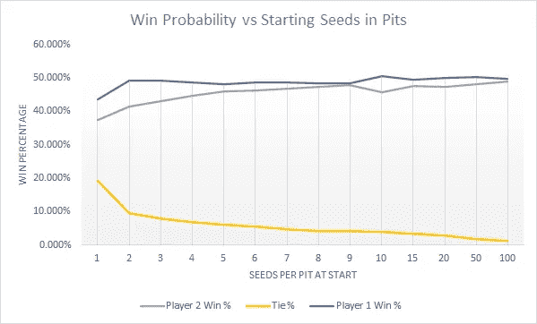
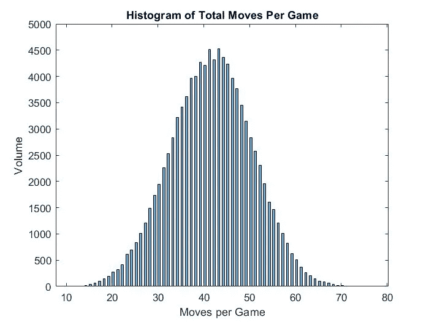
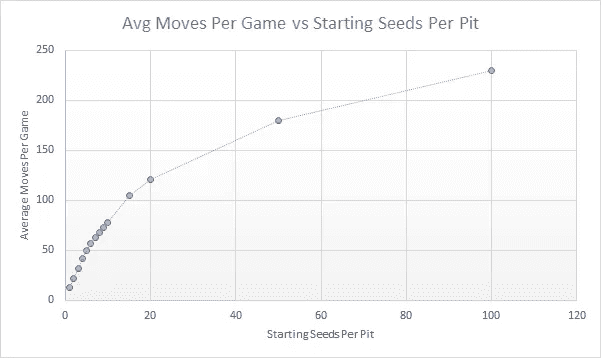
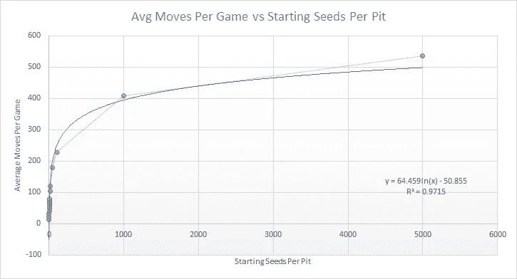

# 模拟曼卡拉:当我把这个游戏推到极限时会发生什么？

> 原文：<https://towardsdatascience.com/simulating-mancala-what-happens-when-i-push-this-game-to-its-limits-28d9c0a58616?source=collection_archive---------13----------------------->

## 我用 MATLAB 模拟了 10 万个曼卡拉游戏，看看会发生什么。结果如下:



图片由作者提供

## 简介:

由于曼卡拉是世界上最古老的游戏之一，所以选择这款游戏作为我的下一个棋盘游戏 MATLAB 项目是有意义的。曼卡拉是一个零和游戏，意思是一个人的收获直接导致另一个人的损失。这使得一次模拟几十万个游戏变得非常容易。

## 曼卡拉规则:

这是一个非常简单的游戏。每个玩家有 6 个坑和一个商店，棋盘上总共有 12 个坑和 2 个商店。每个坑开始时有 4 粒种子。目标是在您的商店中获得最多的种子。每回合，一名玩家从他们的 6 个坑中选择一个，取出所有的种子。逆时针方向移动，玩家从手中丢下一粒种子到下一个坑或仓库，直到手中的种子用完。


图片由[pexels.com](https://www.pexels.com/)提供

还有一些特殊的规则需要注意:

*   如果你的最后一粒种子在你的店里用完了，你可以再去一次。
*   如果你的最后一粒种子落在你这边的一个完全空的坑里，你可以直接收集棋盘上的所有种子。

当一方完全空了，游戏结束，另一方从他们的坑里收集剩余的种子，放入他们的仓库。商店被计算出来，种子最多的人获胜。

## 编码 Mancala:

这种模拟的工作原理是让两个玩家互相随机移动，直到一个人获胜。随机选取一个有种子的坑，这些种子沿着棋盘逆时针分布(见下文)。

```
while gameover == 0 % while nobody has wonwhile p1_turn == 0 % while still player 1 turnif sum(layout(1:6)) ~= 0 % while player 1 still has seeds in pitsmoves = moves + 1; % plus 1 for total moveswhile good_pick1 == 0 % loop to find a pit with seedsp1 = randi(6); % picks random pitamount = layout(p1); % finds amount of seeds in that pitif amount > 0 % if pit has seedsbreak % breaks out of loop (found a good pit)endend
```

在每场比赛结束时，感兴趣的数据点被记录下来，并一直进行到所有 100，000 次模拟完成。

```
move_data(repeats) = moves; % adds moves to move datasetp1_data(repeats) = mean(p1_moves); % adds average move to player 1 move datasetp2_data(repeats) = mean(p2_moves) - 7; % adds average move to player 1 move datasetscore1_data(repeats) = layout(7); % adds player 1 score to player 1 score datasetscore2_data(repeats) = layout(14); % adds player 2 score to player 2 score dataset
```

## 结果是:

一个标准的曼卡拉游戏是什么样子的？完成一局游戏平均需要多少回合？最短的游戏是什么？所有这些问题都可以通过 10 万次曼卡拉模拟来回答。

曼卡拉(每坑 4 粒种子)的平均游戏需要 41.42 步才能完成一局。找到的最长的游戏是 77 步，最短的是 11 步(见下面的柱状图)。



图片由作者提供

最短可能的游戏发生在一个玩家很快用完他们所有的种子，然后游戏结束，另一个玩家收集剩下的种子。

每个玩家的获胜概率是多少？先走对你的胜算有影响吗？嗯，开始时每个坑有 4 粒种子，先走的玩家有 48.624%的机会获胜，而另一个玩家有 44.604%的机会获胜(剩下的 6.772%的机会是平局)。

开始游戏时有没有一个最好的第一坑可以选择，以增加自己的胜算？如果你是第一个出手的玩家，选择 6 号坑(最右边的坑)将使你平均每局获得 24.9033 粒种子，比第二高的坑平均多 0.3 粒种子。第二个玩家也一样。第 6 号坑将让他们平均每场比赛获得 23.9039 粒种子。

## 将曼卡拉推向极限:

开始时每个坑有 100 个种子的游戏是什么样子的？1000 呢？这对胜负概率有什么影响？

我对下面显示的每个初始种子数量(1-10、15、20、50 和 100)运行了 100，000 次模拟，以查看获胜百分比如何变化。


图片由作者提供

随着首发种子数量的增加，比赛平局的几率下降。这是有道理的，因为随着种子数量的增加，商店最终拥有准确数量种子的几率越来越低。

这里值得注意的是获胜概率。第一次行动的玩家和第二次行动的玩家之间的差异似乎变小了，这意味着随着更多种子的加入，游戏变得更加公平。当每个坑有 10 粒种子时，这种差异又跳回来重新开始。这意味着，如果你想要最公平的比赛，每个坑 9 个种子是理想的设置(100 个种子也有一点点差别，但这种游戏将永远持续下去)。

我还想看看开始种子的数量如何影响完成游戏的总平均移动。



图片由作者提供

每场比赛的平均移动不是线性增加的，而是以对数的方式增加的。我将其扩展到 1000 个种子和 5000 个种子，找到了一个 R 值为 0.9715 的最佳拟合方程(如下所示)。



图片由作者提供

假设你从 3 个或更多的种子开始，最佳拟合方程可以用来找出一个游戏在任何初始种子数量下大概要走多少步。

## 结论:

当您以不同的方式调整初始设置时，Mancala 会出现一些有趣的模式。先走一步可以大大增加你获胜的机会，如果你想降低比赛以平局结束的几率，就多加些种子。观察棋盘游戏的极限以及游戏在这些时刻的反应是非常有趣的。

如果您对这类内容感兴趣，我推荐您阅读我的其他一些关于用 MATLAB 模拟棋盘游戏的文章:

*   [打造最好的卡坦板](https://medium.com/codex/the-best-and-worst-catan-board-setups-989df4ba550a)
*   [寻找最佳垄断属性](/simulating-monopoly-finding-the-best-properties-using-matlab-130fe557b1ae)
*   [滑道和梯子里的数学](/the-surprisingly-interesting-mathematics-within-chutes-and-ladders-40f931c18489)
*   [教机器玩井字游戏](/applying-machine-learning-to-tic-tac-toe-47d954671c73)
*   [教机器玩 Connect-4](/i-taught-a-machine-how-to-play-connect-4-df261da4e23f)