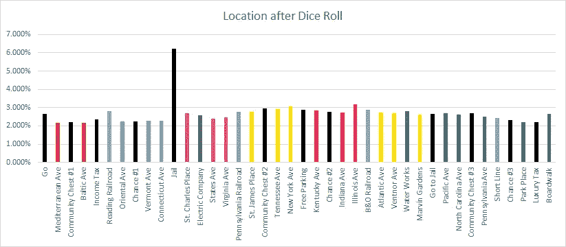
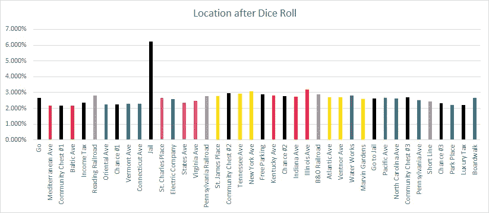
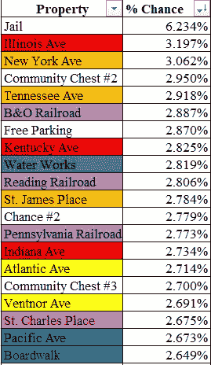
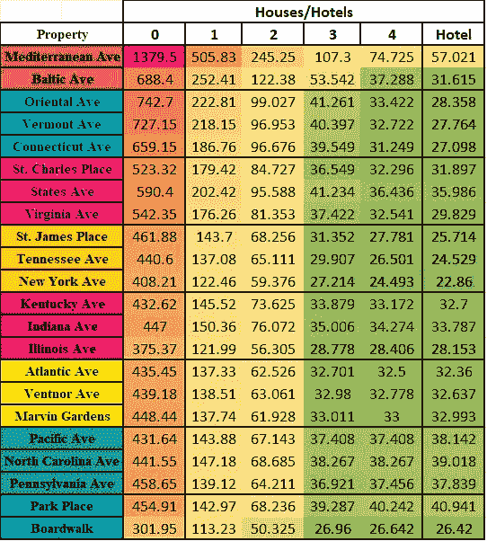
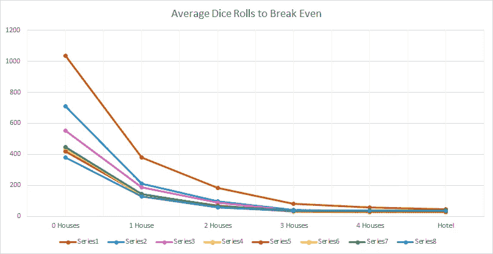
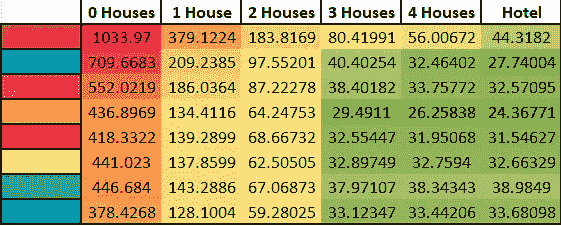
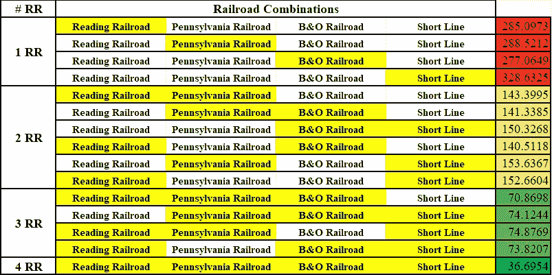
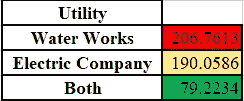
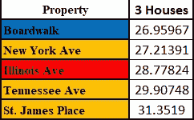
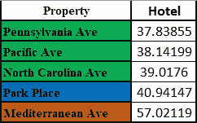

# 模拟垄断:使用 MATLAB 寻找最佳属性

> 原文：<https://towardsdatascience.com/simulating-monopoly-finding-the-best-properties-using-matlab-130fe557b1ae?source=collection_archive---------14----------------------->

## 我用 MATLAB 模拟了 1000 万次大富翁游戏来寻找最好的属性



图片由作者提供

## 简介:

“大富翁”有 40 个空间和 28 种不同的属性，起初看起来完全是随机的，但在游戏过程中，某些属性可能对你更有益。我想通过 MATLAB 模拟 10，000，000 次掷骰子来找出这些属性。

## 工作原理:

我用随机数发生器模拟两个骰子滚动，然后将两个值相加。然后，我将该金额添加到玩家的当前位置，以获得他们的新位置。我还有一个变量来跟踪一行中的 doubles 数量。如果玩家连续掷出 3 个双打，他们会因为超速被送进监狱。

```
die1 = randi(6); % roll first diedie2 = randi(6); % roll second dieif die1 == die2 % if same valuedoubles = doubles + 1; % increase number of doubles in a rowelsedoubles = 0; % set doubles to 0 if different dice valuesend
```

接下来的代码是所有的特殊情况。例如，如果位置加起来大于 40，它将返回到起点作为参考，因为棋盘是一个循环。位置值 43 将变为 3。此外，如果玩家降落在位置 31(“去监狱”空间)，他们将被发送到位置 11(监狱)。

```
if doubles < 3 % if less than 3 doubles in a rowposition = position + die1 + die2; % finds new positionif position > 40 % if above 40position = position - 40; % reverts position back to starting position as a referencearound = around + 1; % indicates the player went around the boardendif position == 31 % if player lands on the "go to jail" spacelands(position) = lands(position) + 1; % indicates player landed on position 31position = 11; % sends player to jailend
```

其他特殊情况的例子是公益金空间和机会空间。16 张社区公益金卡中，只有 1 张改变了玩家的位置(坐牢)。在 16 张机会卡中，有 9 张会改变玩家的位置:

*   进监狱
*   前进到木板路
*   前进到伊利诺斯大街
*   前进到圣查尔斯广场
*   前进到雷丁铁路
*   前进到最近的铁路
*   前进到最近的设施
*   继续前进
*   后退 3 格

在每一轮结束后，玩家结束的空间被记录在所有 40 个点的数组中，然后每个点被模拟的总量(1000 万)除。这给了我们所有 40 个空间着陆的百分比可能性。

## 结果:

掷骰子 10，000，000 次后，每个空格落在上面的可能性如下所示:



图片由作者提供

下面显示的是上面条形图中的前 20 个电路板空间:



图片由作者提供

虽然一个属性被登陆的次数确实会影响它给玩家带来的利益，但我们也需要考虑购买该属性的成本，以及玩家每次登陆时会付给你多少钱。

上面显示的概率也可以描述为玩家在每次掷骰子后落在该地产上的机会。我们可以利用它，以及每处房产的租金，来计算如果你拥有该房产，你在每个玩家的掷骰子中将会赚到的预期金额。

例如，Ventnor Ave(如上所示)在每一次掷骰中有 2.691%的几率被击中。Ventnor Ave 没有房子的租金是 22 美元，这意味着每一次掷骰子的结果是所有者预期的 0.59202 美元。

每一卷的收入并不是比较房产的最佳指标，因为一个比 Ventnor 更贵的房产应该产生更多的收入，但事实并非总是如此。如果我们将购买房产的初始成本除以每卷的收入，我们可以找到一笔房产需要多少卷才能达到收支平衡。例如，Ventnor 的购买成本为 260 美元，因此所有者应该预计在 439.18 卷后可以收回所有的钱。不需要太多投资就能达到收支平衡的房产会被认为是更好的投资，因为你可以在其他玩家之前开始盈利。

我们还需要考虑在地产上建造房屋和酒店会如何影响盈亏平衡点。下面是一个垄断委员会上的每个属性的细分，给出了关于房屋和酒店的情况(不包括铁路和公用事业)。每个单元格中的值表示平均收回在该资产上花费的资金所需的滚动量。



图片由作者提供

正如你所看到的，从长远来看，有些房产几乎肯定会让你赔钱。购买地中海大道而不在上面建造任何房屋，在整个游戏过程中肯定会让你损失金钱。这不会是一个显著的数额(只需 60 美元购买)，但它仍然不是最好的购买。

所有没有房子的房产都需要非常长的时间才能达到收支平衡，这就是为什么买房子和酒店如此重要。



图片由作者提供

上面的图显示了如何为你拥有的每一个垄断权购买至少 3 个房子，可以大大减少回本所需的滚动次数。即使是开始时是可怕投资的棕色房产(上面的棕色线),在有 3 个或更多房子的游戏中也可以开始盈利。

值得注意的另一点是，随着房产变得越来越贵，3 套房子、4 套房子和一家酒店之间的变化越来越小。以浅蓝色和黄色属性为例:



作者提供的图像(每个单元格中的值代表平均收回在该属性颜色上花费的钱所需的卷数)

淡蓝色的房产在 3 至 4 套房子之间，以及 4 套房子和一家酒店之间的价格有相当大的下降。黄色属性显示最右边的 3 列之间几乎没有变化。这意味着花在 3 套房子上的钱和花在 4 套房子上的钱一样多，但是收支平衡后的收益会更大(对于更贵的房产)。

但是铁路和公用事业呢？

下面显示了铁路，以及您拥有的铁路的所有不同排列。每个单元格中的值表示平均收回在一处或多处房产上花费的钱所需的滚动量。



图片由作者提供

对于仅仅一条铁路的所有权，最好拥有 B&O，因为它会登陆更多。如果你想拥有 2 个，那就去雷丁和 B&O 组合吧。对于 3，寻找阅读，宾夕法尼亚州和 B&O。总的来说，铁路的最佳投资要么获得 3 或全部 4，只是因为人们开始在他们的财产上建造房屋，你的 1 或 2 铁路将不会比游戏早期赚得更多。

至于公用设施:



图片由作者提供

在游戏早期拥有公用事业可能是最好的举措之一。与其他没有房子的房产相比，这两处房产的盈亏平衡点最低。然而，就像铁路一样，你不能在上面建房子，所以随着游戏的进行，这些变得越来越没用。考虑到其他 22 处房产中有 21 处房产的盈亏平衡点低于 3 处房产，即使同时拥有这两处房产，它们的排名仍然垫底。

## 结论:

橙色的属性是游戏中最好的点。橘子园位于最好的 5 处房产内，有 3 栋房子，是酒店的前 3 名。orange properties New York Ave 和 Tennessee Ave 在最受欢迎的景点中排名第三和第五。



图片由作者提供

木板路和公园广场(深蓝色)是棘手的。Boardwalk 在盈亏平衡的滚动次数方面一直名列前茅，而 Park Place 总是垫底。与橙子相比，这种垄断是一种高风险、高回报的选择。

绝对最差的酒店群体肯定是格林一家。这三家酒店的盈亏平衡营业额都排在后 5 名。就登陆的可能性而言，它们也低于平均水平。



图片由作者提供

只有当你拥有 3 个或者全部 4 个的时候，铁路才会在游戏接近尾声的时候变得有利。如果你能早点得到它们，并开始收支平衡，那么这是一个伟大的举动。公用事业是最好的财产，直到人们开始建造房屋。仅仅依靠公用事业或铁路是无法取胜的，所以不要把所有的精力和金钱都投入其中。

总的来说，这个模拟表明，有一些策略可以应用到你的下一个垄断游戏中。如果你对这种类型的内容感兴趣，我推荐阅读我的其他棋盘游戏文章，[我教了一台机器如何玩 Connect 4](/i-taught-a-machine-how-to-play-connect-4-df261da4e23f) ，以及[最好和最差的卡坦棋盘设置](https://medium.com/codex/the-best-and-worst-catan-board-setups-989df4ba550a)。