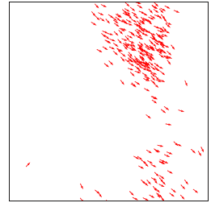

# 用 Python 模拟多智能体群集事件

> 原文：<https://towardsdatascience.com/simulating-multi-agent-swarming-events-in-python-ee133143944d?source=collection_archive---------13----------------------->

## 以鸟类迁徙为例模拟多主体强化学习分析中的群集现象

成群结队在自然界频繁发生:从一群候鸟到一群执行特定任务的无人机。因此，能够模拟群集如何工作将使您能够构建自己的多智能体强化学习算法，以密切模仿现实世界的场景。为了让你对我们今天正在构建的东西有所了解，下面的 GIF 将是我们使用候鸟为例的群集模拟模型的输出。事不宜迟，我们开始吧！



作者 GIF

**注:**可以在帖子末尾找到完整代码。

# 动机

为什么模拟在多智能体强化学习(RL)问题中很重要？这主要是因为模拟是 RL 中的探索性数据分析(EDA)方法之一，它允许我们可视化系统中不同代理的相互关系。在这篇文章中，我们将讨论群集事件，因为它们是多智能体强化学习的许多例子中的一些，我在下面编译了它们在现实生活中是如何行动的！

1.  [成群的鸟](https://www.youtube.com/watch?v=V4f_1_r80RY)
2.  [无人机群](https://www.youtube.com/watch?v=44KvHwRHb3A&ab_channel=GuinnessWorldRecordsGuinnessWorldRecordsVerified)
3.  [鱼群](https://www.youtube.com/watch?v=15B8qN9dre4&ab_channel=GuinnessWorldRecordsGuinnessWorldRecordsVerified)
4.  还有很多其他的！

# 群集算法:Viscek 模型

我们将实现 [Viscek](http://arxiv.org/pdf/cond-mat/0611743.pdf) 模型(1995 ),作为我们的多智能体群集基线算法，在此基础上已经构建了许多更高级的实现。

想象你正在试图模拟 300 只鸟的群集( *N* =300)，其中每只鸟的索引为 i=0…( *N* -1)。一只鸟只有在半径为 *R* 的圆内与另一只鸟相互作用时，才会改变方向和速度矢量。


交互发生的半径(来源: [Viscek](http://arxiv.org/pdf/cond-mat/0611743.pdf) )

让我们从导入所需的 Python 库并初始化上述常量开始。

```
import matplotlib.pyplot as plt
import numpy as npN = 300 # number of birds
R = 0.5 # radius of effect# Preparing the drawing
L = 5   # size of drawing boxfig = plt.figure(figsize=(6,6), dpi=96)
ax = plt.gca()
```

对于每个时间步， *n* ，每只鸟沿 x 轴和 y 轴( ***r*** )的位置更新如下:


每个时间步长的位置更新(来源: [Viscek](http://arxiv.org/pdf/cond-mat/0611743.pdf)

这是用 Python 实现的。

```
Nt = 200 # number of time steps
dt = 0.1 # time step# bird positions (initial)
x = np.random.rand(N,1)*L
y = np.random.rand(N,1)*L
```

***v*** 为速度恒定的速度矢量， *v0* ，角度*θ****ᵢ***(读作:theta) *。*我们还将引入一个角度扰动(读作: *eta* )来模拟鸟类运动的自然随机性。


时间步长 n 时 x 和 y 方向的速度矢量计算(来源: [Viscek](http://arxiv.org/pdf/cond-mat/0611743.pdf)

速度向量在下面的 Python 中初始化。

```
v0 = 0.5 # constant speed
eta = 0.6 # random fluctuation in angle (in radians)
theta = 2 * np.pi * np.random.rand(N,1)# bird velocities (initial)
vx = v0 * np.cos(theta)
vy = v0 * np.sin(theta)
```

现在我们将进入主 for 循环。对于每个时间步长，位置***r***更新为:

```
# Update position
x += vx*dt
y += vy*dt
```

并且通过找到 R 内的(1) **平均角度，(2) 加上**随机扰动**以产生新的θ，以及(3)更新**新的速度向量**、 ***v*** 来更新**v**:**

(1)R 内的平均角度

```
mean_theta = theta# Mean angle within R
for b in range(N):
    neighbors = (x-x[b])**2+(y-y[b])**2 < R**2
    sx = np.sum(np.cos(theta[neighbors]))
    sy = np.sum(np.sin(theta[neighbors]))
    mean_theta[b] = np.arctan2(sy, sx)
```

(2)给速度角增加一个随机扰动。随机项是通过从[-0.5，0.5]内的正态分布中采样，将其乘以预定义的η，并将该扰动项与计算的平均θ相加而生成的。


正态分布(作者图片)

```
# Adding a random angle perturbation
theta = mean_theta + eta*(np.random.rand(N,1)-0.5)
```

(3)用新的θ更新速度矢量:

```
# Updating velocity
vx = v0 * np.cos(theta)
vy = v0 * np.sin(theta)
```

总的来说， ***r 和 v*** 的更新将在 dt * Nt 个时间步长内完成。

最后，现在一切都准备好了，让我们画出更新的样子来结束吧！

```
plt.cla()
plt.quiver(x,y,vx,vy,color='r')
ax.set(xlim=(0, L), ylim=(0, L))
ax.set_aspect('equal')
plt.pause(0.001)
```

如果一切正常，你会在屏幕上看到这个消息。恭喜你！您可以试验并更改一些参数，看看您的模拟模型如何变化。


蜂拥事件(图片由作者提供)

如果你已经到达终点，那就做得很好。你可以在这里找到完整的代码:

# 离别的思绪

模拟是强化学习中探索性数据分析的一个步骤。一旦您对现实世界的数学行为有了更清晰的认识，您将能够设计更鲁棒的 RL 算法。如果你喜欢这篇文章，我会做更多真实世界的模拟，作为我的多代理 RL EDA 系列的一部分。敬请关注！

【https://tinyurl.com/2npw2fnz】*订阅我的电子邮件简讯:*<https://tinyurl.com/2npw2fnz>*****我定期在那里用通俗易懂的英语和漂亮的可视化总结 AI 研究论文。*****

**最后，您可以在这里找到更多关于 RL 和仿真主题的资源:**

**</getting-started-to-reinforcement-learning-tic-tac-toe-f1d32d53acb4>  <https://github.com/AndreasKuhnle/SimRLFab>  <https://deepsense.ai/what-is-reinforcement-learning-the-complete-guide/>  <https://www.guru99.com/reinforcement-learning-tutorial.html> **