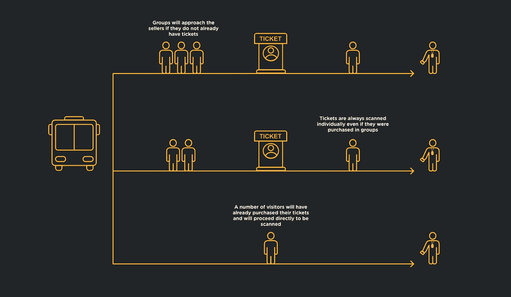
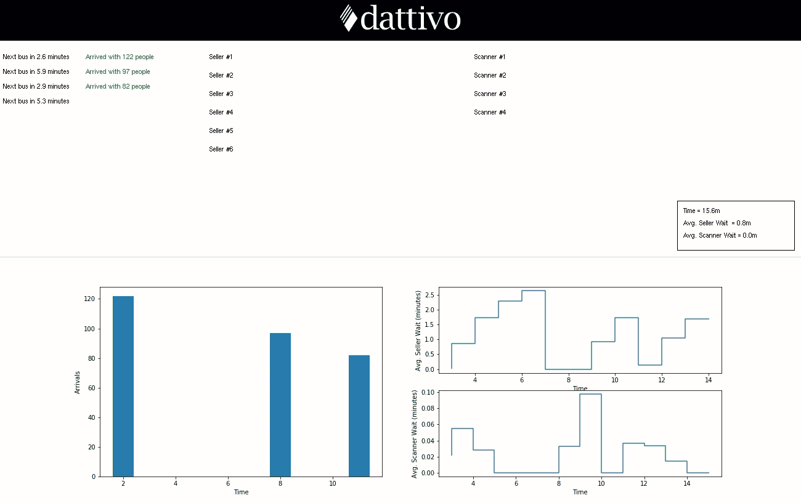
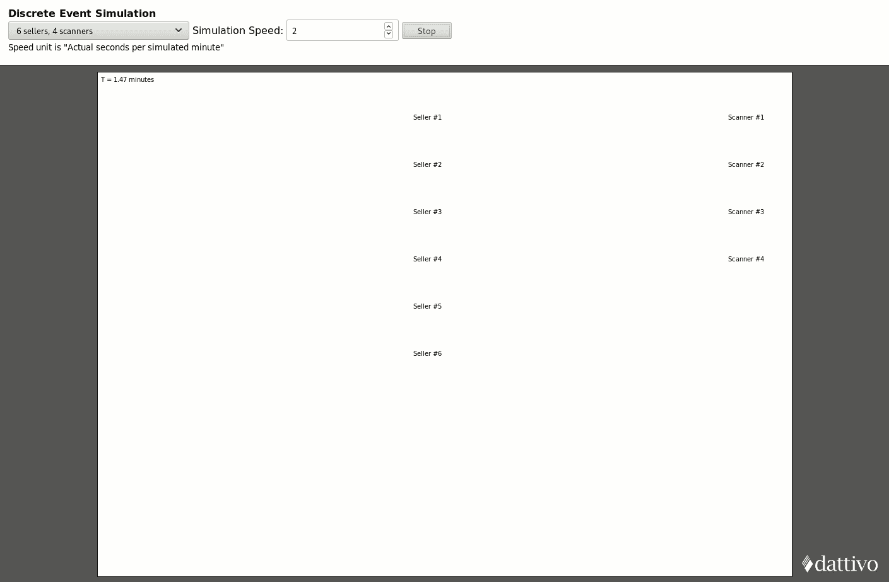
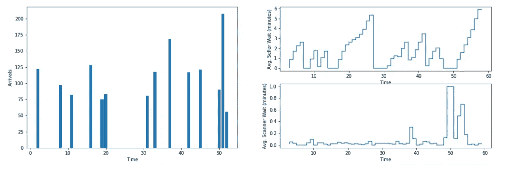
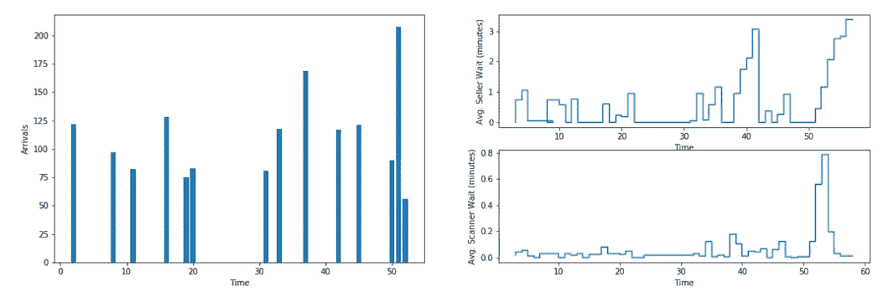
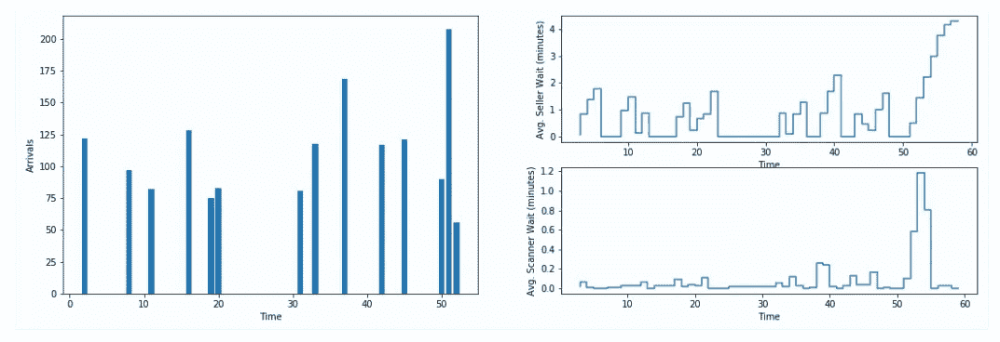

# 用 SimPy 在 Python 中模拟和可视化真实事件

> 原文：<https://towardsdatascience.com/simulating-real-life-events-in-python-with-simpy-619ffcdbf81f?source=collection_archive---------2----------------------->

## 我们将介绍活动行业完整模型的开发过程，并展示三种不同的可视化结果的方法(包括 AR/VR)

离散事件仿真(DES)已成为专门产品的领域，如 Simulink 8[1]和 MatLab/Simulink [2]。然而，在用 Python 进行分析的时候(过去我会使用 MatLab ),我很想测试 Python 是否也有 DES 的答案。

DES 是一种使用统计函数对现实生活事件建模的方法，通常用于医疗保健、制造、物流和其他领域的队列和资源使用[3]。最终目标是获得关键的运营指标，如资源使用和平均等待时间，以便评估和优化各种实际配置。SIMUL8 有一个描述如何模拟急诊室等待时间的视频[4]，MathWorks 有许多教育视频来提供该主题的概述[5]，此外还有一个关于汽车制造的案例研究[6]。SimPy [7]库支持在 Python 中描述和运行 des 模型。与 SIMUL8 等软件包不同，SimPy 不是一个用于构建、执行和报告模拟的完整图形环境；但是，它确实提供了执行模拟和输出数据以进行可视化和分析的基本组件。

本文将首先介绍一个场景，并展示如何在 SimPy 中实现它。然后，它将查看可视化结果的三种不同方法:Python 原生解决方案(使用 Matplotlib [8]和 Tkinter [9])、基于 HTML5 canvas 的方法和交互式 AR/VR 可视化。最后，我们将使用 SimPy 模型来评估替代配置。

# 场景

在我们的演示中，我将使用我以前工作中的一个例子:一个活动的入场队列。然而，遵循类似模式的其他示例可能是在杂货店或接受在线订单的餐馆、电影院、药店或火车站排队。

我们将模拟一个完全由公共交通服务的入口:定期会有一辆公共汽车让几个顾客下车，然后他们需要在进入活动前扫描他们的门票。一些参观者会有他们预先购买的徽章或门票，而其他人则需要先去售票亭购买门票。更复杂的是，当参观者走近售票亭时，他们会成群结队(模拟家庭/团体购票)；但是，每个人都需要单独扫描门票。

下面描述了该场景的高级布局。

图片作者和 [Matheus Ximenes](https://medium.com/u/ff9741c7a288?source=post_page-----619ffcdbf81f--------------------------------)

为了模拟这种情况，我们需要决定如何使用概率分布来表示这些不同的事件。在我们的实施中所做的假设包括:

*   平均每三分钟就有一辆公共汽车到达。我们将使用λ为 1/3 的指数分布来表示这一点
*   每辆巴士将包含 100 +/- 30 名游客，使用正态分布确定(μ = 100，σ = 30)
*   游客将使用正态分布(μ = 2.25，σ = 0.5)组成 2.25+/–0.5 人的群体。我们将把它四舍五入到最接近的整数
*   我们假设 40%的访问者需要在销售亭购买门票，另外 40%的访问者将带着已经在线购买的门票到达，20%的访问者将带着员工凭证到达
*   参观者平均需要一分钟走出巴士，走到卖家摊位(正常，μ = 1，σ = 0.25)，再花半分钟从卖家走到扫描仪(正常，μ = 0.5，σ = 0.1)。对于那些跳过卖家的人(预先购买的门票或佩戴徽章的员工)，我们假设平均步行时间为 1.5 分钟(正常，μ = 1.5，σ = 0.35)
*   游客到达时会选择最短的队伍，每一队都有一个卖家或扫描仪
*   销售需要 1 +/- 0.2 分钟完成(正常，μ = 1，σ = 0.2)
*   完成一次扫描需要 0.05 +/- 0.01 分钟(正常，μ = 0.05，σ = 0.01)

记住这一点，让我们从输出开始，并从那里向后工作。

作者图片

左手边的图表代表每分钟到达的游客数量，右手边的图表代表在该时刻离开队列的游客在被接待之前需要等待的平均时间。

# 简单模拟设置

包含完整可运行源代码的存储库可以在[https://github.com/dattivo/gate-simulation](https://github.com/dattivo/gate-simulation)找到，下面的片段摘自 **simpy example.py** 文件。在本节中，我们将逐步完成简单的特定设置；但是，请注意，为了将重点放在 SimPy 的 DES 特性上，省略了连接到 Tkinter 进行可视化的部分。

首先，让我们从模拟的参数开始。分析起来最有趣的变量是销售者行数( **SELLER_LINES** )和每行的销售者数( **SELLERS_PER_LINE** )以及它们对于扫描器的等价物( **SCANNER_LINES** 和 **SCANNERS_PER_LINE** )。此外，请注意两种可能的队列/卖家配置之间的区别:尽管最普遍的配置是拥有多个不同的队列，访问者将选择并停留，直到他们得到服务，但在零售业中看到多个卖家排队也变得更加主流(例如，在一般商品大盒子零售商的快速结账队列)。

配置完成后，让我们开始 SimPy 过程，首先创建一个“环境”、所有队列(资源)，并运行模拟(在本例中，直到第 60 分钟)。

请注意，我们正在创建一个 **RealtimeEnvironment** ，它旨在近乎实时地运行一个模拟，特别是为了在它运行时将它可视化。随着环境的建立，我们生成我们的销售者和扫描器线路资源(队列),然后我们将依次传递给我们的总线到达的“主事件”。 **env.process()** 命令将开始流程，如下图的 **bus_arrival()** 函数所述。此函数是顶级事件，所有其他事件都从该事件调度。它模拟每隔 **BUS_ARRIVAL_MEAN** 分钟到达一辆公交车，车上有 **BUS_OCCUPANCY_MEAN** 人，然后相应地触发销售和扫描过程。

由于这是顶级事件函数，我们看到该函数中的所有工作都发生在一个无限的 while 循环中。在循环中，我们用 **env.timeout()** 来“放弃”我们的等待时间。SimPy 广泛使用了生成器函数，这些函数将返回生成值的迭代器。关于 Python 生成器的更多信息可以在[10]中找到。

在循环的最后，我们将分派两个事件中的一个，这取决于我们是直接进入扫描仪，还是随机决定该组需要先购买门票。请注意，我们不会屈服于这些过程，因为这将指示 SimPy 按顺序完成这些操作中的每一个；取而代之的是，所有下车的游客将同时排队。

请注意，使用了 **people_ids** 列表，以便为每个人分配一个唯一的 ID 用于可视化目的。我们使用 **people_ids** 列表作为待处理人员的队列；随着游客被分派到他们的目的地，他们从 **people_ids** 队列中被移除。

**purchasing_customer()** 函数模拟三个关键事件:走向队列、排队等候，然后将控制传递给 **scanning_customer()** 事件(与 **bus_arrival()** 调用的函数相同，用于那些绕过销售者直接进入扫描器的事件)。这个函数根据选择时最短的线来选择它的线。

最后，我们需要实现 **scanning_customer()** 的行为。这与 **purchasing_customer()** 函数非常相似，但有一个关键区别:尽管游客可能会成群结队地到达和步行，但每个人都必须单独扫描他们的门票。因此，您将看到对每个被扫描的客户重复扫描超时。

我们将步行持续时间和标准偏差传递给 **scanning_customer()** 函数，因为这些值会根据访问者是直接走到扫描仪前还是先在卖家处停留而变化。

# 使用 Tkinter(原生 Python UI)可视化数据

为了可视化数据，我们添加了一些全局列表和字典来跟踪关键指标。例如，到达字典按分钟跟踪到达人数，而 seller_waits 和 scan_waits 字典将模拟的分钟映射到在这些分钟内退出队列的人的等待时间列表。还有一个 event_log 列表，我们将在下一节的 HTML5 Canvas 动画中使用。当关键事件发生时(例如，一个访问者退出队列)，调用 **simpy example.py** 文件中 **ANALYTICAL_GLOBALS** 标题下的函数来保持这些字典和列表最新。

我们使用一个辅助的 SimPy 事件向 UI 发送一个 tick 事件，以便更新时钟、更新当前的平均等待时间并重新绘制 Matplotlib 图表。完整的代码可以在 GitHub 储存库中找到([https://GitHub . com/dattivo/gate-simulation/blob/master/simpy % 20 example . py](https://github.com/dattivo/gate-simulation/blob/master/simpy%20example.py))；但是，下面的代码片段提供了如何从 SimPy 发送这些更新的框架视图。

使用标准 Tkinter 逻辑来表示用户进出销售者和扫描者队列的可视化。我们创建了 **QueueGraphics** 类来抽象销售者和扫描者队列的公共部分。这个类中的方法被编码到上一节中描述的 SimPy 事件函数中，以更新画布(例如， **sellers.add_to_line(1)** ，其中 1 是卖方编号，以及**sellers . remove _ from _ line(1)**)。作为未来的工作，我们可以在流程的关键点使用事件处理程序，这样 SimPy 模拟逻辑就不会与特定于该分析的 UI 逻辑紧密耦合。

# 使用 HTML5 画布制作数据动画

作为另一种可视化方式，我们希望从 SimPy 模拟中导出事件，并将它们放入一个简单的 HTML5 web 应用程序中，以便在 2D 画布上可视化场景。我们通过在简单事件发生时添加一个 **event_log** 列表来实现这一点。特别是，公交车到达、步行到销售者、在销售者队伍中等待、购买门票、步行到扫描仪、在扫描仪队伍中等待和扫描门票事件都被记录为单独的字典，然后在模拟结束时导出到 JSON。你可以在这里看到一些示例输出:[https://github . com/dattivo/gate-simulation/tree/master/output](https://github.com/dattivo/gate-simulation/tree/master/output)

我们开发了一个快速的概念验证来展示如何将这些事件转化成 2D 动画，你可以在 https://dattivo.github.io/gate-simulation/visualize.html 进行实验。你可以在[https://github . com/dattivo/gate-simulation/blob/master/visualize . ts](https://github.com/dattivo/gate-simulation/blob/master/visualize.ts)中看到动画逻辑的源代码。

作者图片

这种可视化得益于动画，然而，出于实际目的，基于 Python 的 Tkinter 接口组装起来更快，Matplotlib 图形(可以说是该模拟最重要的部分)在 Python 中设置起来也更平滑和更熟悉。也就是说，让行为生动起来是有价值的，尤其是在向非技术利益相关者传达结果的时候。

# 使用虚拟现实制作数据动画

让画布动画更进一步， [Matheus Ximenes](https://medium.com/u/ff9741c7a288?source=post_page-----619ffcdbf81f--------------------------------) 和我一起工作，使用 HTML5 画布也在使用的相同 JSON 模拟数据，将以下 AR/VR 3-D 可视化放在一起。我们使用我们已经熟悉的 React [11]和 A-FRAME [12]实现了这一点，A-FRAME 令人惊讶地易于使用和学习。

你可以在 https://www.dattivo.com/3d-visualization/的[亲自测试模拟](https://www.dattivo.com/3d-visualization/)

# 分析卖方/扫描仪队列配置备选方案

虽然这个例子是为了演示如何创建和可视化 SimPy 模拟，但是我们仍然可以展示几个例子来说明平均等待时间如何依赖于队列的配置。

让我们从上面动画中演示的案例开始:六个销售人员和四个扫描仪，每行一个销售人员和一个扫描仪(6/4)。60 分钟后，我们看到卖家的平均等待时间为 1.8 分钟，而扫描仪的平均等待时间为 0.1 分钟。从下面的图表中，我们看到销售者的时间在大约 6 分钟的等待时达到峰值。

我们可以看到，卖家们都是一致备份的(虽然 3.3 分钟可能不会太不合理)；所以，让我们看看，如果我们再增加四个卖家，总数达到 10 个，会发生什么。

正如预期的那样，卖家的平均等待时间减少到了 0.7 分钟，最长等待时间减少到了 3 分钟多一点。

现在，让我们说，通过降低在线门票的价格，我们能够将持票到达的人数提高 35%。最初，我们假设所有访客中有 40%需要购买门票，40%已经在线预购，20%是凭凭证进入的工作人员和供应商。因此，随着 35%以上的人带着票到达，我们将需要购买的人数减少到 26%。让我们用初始的 6/4 配置来模拟一下。

在这种情况下，卖家的平均等待时间减少到 1.0 分钟，最长等待时间超过 4 分钟。在这种情况下，增加 35%的在线销售额与增加更多的卖家队列有相似的效果；如果等待时间是我们最想减少的指标，那么在这一点上，我们可以考虑这两个选项中哪一个具有更强的业务案例。

# 结论和未来工作

Python 可用的数学和分析工具的广度令人生畏，SimPy 完善了这些功能，还包括离散事件模拟。与 SIMUL8 等商业打包工具相比，Python 方法确实留给编程更多的空间。对于快速分析来说，组装模拟逻辑和从头构建 UI 和度量支持可能是笨拙的；然而，它确实提供了很大的灵活性，对于已经熟悉 Python 的人来说应该相对简单。如上所述，SimPy 提供的 DES 逻辑产生了清晰易读的代码。

如前所述，Tkinter 可视化是三种演示方法中最直接的一种，尤其是在包含 Matplotlib 支持的情况下。HTML5 canvas 和 AR/VR 方法可以方便地将可共享的交互式可视化放在一起；然而，他们的发展并不平凡。

比较队列配置时需要考虑的一个重要改进是销售者/扫描者利用率。减少排队时间只是分析的一个组成部分，因为在得出最佳解决方案时，还应该考虑销售者和扫描仪空闲时间的百分比。此外，如果有人看到队列太长而选择不进入，添加一个概率也会很有趣。

# 参考

[1][https://www.simul8.com/](https://www.simul8.com/)

[2][https://www . mathworks . com/solutions/discrete-event-simulation . html](https://www.mathworks.com/solutions/discrete-event-simulation.html)

[3]https://en.wikipedia.org/wiki/Discrete-event_simulation

[https://www.simul8.com/videos/](https://www.simul8.com/videos/)

[5][https://www . mathworks . com/videos/series/understanding-discrete-event-simulation . html](https://www.mathworks.com/videos/series/understanding-discrete-event-simulation.html)

[6][https://www . mathworks . com/company/newslettes/articles/optimizing-automotive-manufacturing-processes-with-discrete-event-simulation . html](https://www.mathworks.com/company/newsletters/articles/optimizing-automotive-manufacturing-processes-with-discrete-event-simulation.html)

[https://simpy.readthedocs.io/en/latest/](https://simpy.readthedocs.io/en/latest/)

[https://matplotlib.org/](https://matplotlib.org/)

[9][https://docs.python.org/3/library/tkinter.html](https://docs.python.org/3/library/tkinter.html)

【https://wiki.python.org/moin/Generators 

[11]https://reactjs.org/

[12][https://aframe.io/](https://aframe.io/)

*(本文改编自之前发表的两篇文章:*[https://dattivo . com/simulating-real-life-events-in-python-with-simpy/](https://dattivo.com/simulating-real-life-events-in-python-with-simpy/)*和*[https://dattivo . com/3d-visualization-of-a-simulated-real-life-events-in-virtual-reality/](https://dattivo.com/3d-visualization-of-a-simulated-real-life-event-in-virtual-reality/))