# 在线性建模中模拟多重共线性的影响

> 原文：<https://towardsdatascience.com/simulating-the-effect-of-multicollinearity-in-linear-modelling-using-r-purrr-parallel-computing-756a365896d?source=collection_archive---------48----------------------->

## 使用 R、purrr 和并行计算

在数据科学中，使用线性回归有时会被低估。作为 t 检验和方差分析等非常基本的统计概念的概括，它与统计学领域有着很深的联系，可以作为解释数据方差的强大工具。由于线性模型只有参数是线性的，所以也可以描述多项式甚至一些乘法关系。

但是，由于参数的性质，线性回归也更容易受到极值和数据中多重共线性的影响，我们希望通过模拟对后者进行更详细的分析。在[许多其他问题](https://online.stat.psu.edu/stat462/node/88/)中，多重共线性可能产生不稳健的模型(交错系数),并可能破坏统计显著性。

在运行模拟之前，我们将研究多重共线性对简单线性模型的影响。我们将使用来自 [Stat Trek](https://stattrek.com/multiple-regression/multicollinearity.aspx) 的数据集，其中包含学生的考试成绩和一些其他表现指标(如智商或平均绩点):

我们观察到所有变量之间的高度相关性，尤其是`iq`和`gpa`相关性非常强:

```
GGally::ggpairs(data)
```

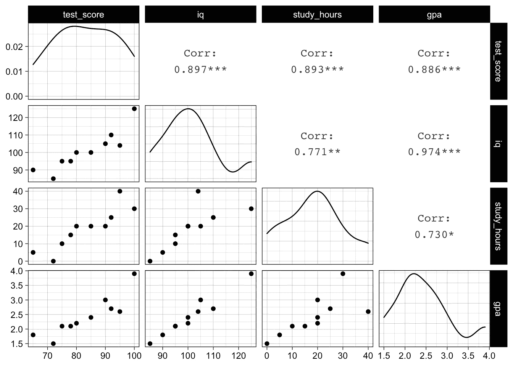

成对测量图—图片由作者完成

如果我们使用`iq`和`study_hours`拟合一个简单的模型来解释测试分数，我们可以看到它们的影响在统计上是显著的(p 值约为 0.03，总体显著性):

```
simple_model <- lm(test_score ~ iq + study_hours, data = data)
sqrt(mean((simple_model$residuals)^2))
## [1] 3.242157
summary(simple_model)
## 
## Call:
## lm(formula = test_score ~ iq + study_hours, data = data)
## 
## Residuals:
##    Min     1Q Median     3Q    Max 
## -6.341 -1.130 -0.191  1.450  5.542 
## 
## Coefficients:
##             Estimate Std. Error t value Pr(>|t|)  
## (Intercept)  23.1561    15.9672   1.450   0.1903  
## iq            0.5094     0.1808   2.818   0.0259 *
## study_hours   0.4671     0.1720   2.717   0.0299 *
## ---
## Signif. codes:  0 '***' 0.001 '**' 0.01 '*' 0.05 '.' 0.1 ' ' 1
## 
## Residual standard error: 3.875 on 7 degrees of freedom
## Multiple R-squared:  0.9053, Adjusted R-squared:  0.8782 
## F-statistic: 33.45 on 2 and 7 DF,  p-value: 0.0002617
```

如果我们将`gpa`加入到模型中，我们预计会得到一个更小的(样本内)误差，但截距和斜率的估计值会有很大不同。另外，`iq`和`gpa`不再重要。这是由于它们的共线性，在这里有很好的描述[。](https://stattrek.com/multiple-regression/multicollinearity.aspx)

```
# estimates and p values very different
full_model <- lm(test_score ~ iq + study_hours + gpa, data = data)sqrt(mean((full_model$residuals)^2))
## [1] 3.061232summary(full_model)
## 
## Call:
## lm(formula = test_score ~ iq + study_hours + gpa, data = data)
## 
## Residuals:
##     Min      1Q  Median      3Q     Max 
## -6.3146 -1.2184 -0.4266  1.5516  5.6358 
## 
## Coefficients:
##             Estimate Std. Error t value Pr(>|t|)  
## (Intercept) 50.30669   35.70317   1.409   0.2085  
## iq           0.05875    0.55872   0.105   0.9197  
## study_hours  0.48876    0.17719   2.758   0.0329 *
## gpa          7.37578    8.63161   0.855   0.4256  
## ---
## Signif. codes:  0 '***' 0.001 '**' 0.01 '*' 0.05 '.' 0.1 ' ' 1
## 
## Residual standard error: 3.952 on 6 degrees of freedom
## Multiple R-squared:  0.9155, Adjusted R-squared:  0.8733 
## F-statistic: 21.68 on 3 and 6 DF,  p-value: 0.001275BIC(full_model, simple_model)
##              df      BIC
## full_model    5 62.26804
## simple_model  4 61.11389
```

在正常的预测建模场景中，我们将通过使用正则化来自动进行特征选择，从而在保持良好的可预测性的同时，提高我们模型的泛化能力和鲁棒性，从而尝试避免这种情况。在经典统计学中，我们不仅关心可预测性(低误差)，还关心变量的统计显著性(p 值)和因果关系。

这里的传统方法是使用[方差膨胀因子](https://online.stat.psu.edu/stat462/node/180/)从等式中移除变量。我们不仅仅着眼于预测因子的成对相关性，而是试图着眼于预测因子的线性相关性:我们本质上试图通过所有其他预测因子来估计一个预测因子，然后方差膨胀因子作为未解释方差的倒数给出(即`1 / (1 - R.sq.)`)。如果预测值可以由其他预测值线性表示，则该值较高，否则该值较低。根据经验，如果它高于 4，则该预测值可能会被丢弃。

```
vif_gpa_model <- lm(gpa ~ iq + study_hours, data = data)
vif_gpa_factor <- 1 / (1 - summary(vif_gpa_model)$r.squared)
vif_gpa_factor
## [1] 19.65826
```

我们可以很容易地对所有的预测值都这样做，并决定去掉高膨胀系数的特征。

```
car::vif(full_model)
##          iq study_hours         gpa 
##   22.643553    2.517786   19.658264
```

领域知识可能会告诉我们，GPA 是智商的结果，而不是智商的结果，因此将智商作为一个独立变量可能比使用代理变量 GPA 更合理。

# 模拟 1:用 purrr 运行“许多模型”

为了了解数据中多重共线性的有害影响，让我们模拟一下当我们重复拟合具有不同特征的线性回归时，模型系数可能会发生什么情况。

为了做到这一点，我们将使用`purrr`，它帮助我们在数据帧列表的顶部以矢量化的方式运行我们自己的函数，并因此在数据和/或模型上运行(推荐阅读:R 中的[用于数据科学](https://r4ds.had.co.nz/many-models.html)以及[官方文档和`purrr`的](https://github.com/tidyverse/purrr))。

为了理解我们的模拟，让我们首先模拟从简单的线性关系`y = 5 + 3 * x`中提取一些虚拟数据，并多次拟合线性模型。我们创建了一些辅助函数来绘制可重复的样本并拟合模型:

```
generate_dummy_data <- function(data, seed = NULL) {
  set.seed(seed = seed)
  data <- dplyr::tibble(x = rnorm(100, 50, 10),
                        y = 5 + 3 * x + rnorm(100, 0, 0.1))
  return(data)
}generate_dummy_model <- function(data) {
  model <- lm(y ~ x, data = data)
  return(model)
}
```

我们现在可以多次运行该模拟，并使用`purrr::map`提取模型系数(截距和斜率):

我们看到估计值非常稳定，接近真实值。

```
dummy_simulation %>%
  tidyr::unnest(coefs) %>% 
  ggplot(aes(x = estimate)) + 
  geom_histogram(bins = 30) + 
  facet_wrap(~ term, scales = "free") +
  theme(axis.text.x = element_text(angle = 45, hjust = 1))
```

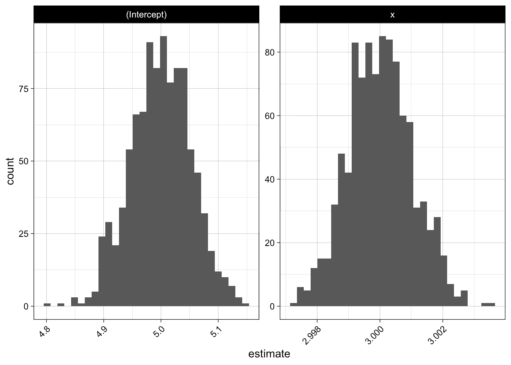

非常简单的线性关系的估计分布—图片由作者完成

现在，让我们通过使用自举样本，将此应用于我们的测试分数数据:

我们不仅要看一个模型，还要比较两个模型:一个是使用所有特征的完整模型(即存在多重共线性),另一个是使用简化特征集的模型:

让我们绘制两个模型中截距和斜率的估计值(使用`ggplot2`和`theme_set(theme_linedraw())`)。我们看到截距的巨大差异，还有`iq`-系数:

```
model_coefs <- 
  simulations %>% 
  dplyr::select(name, coefs) %>% 
  tidyr::unnest(coefs)model_coefs %>% 
  ggplot(aes(x = estimate, color = name)) + 
  geom_freqpoly(bins = 30) + 
  facet_wrap( ~ term, scales = "free")
```

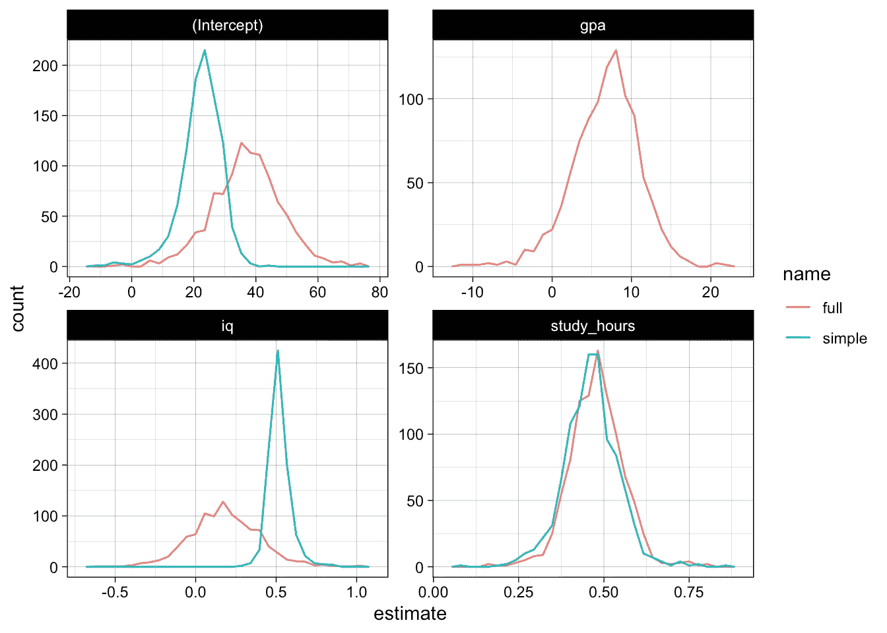

完整和简单模型的系数分布——作者完成的图像

p 值看起来也不是很有希望，模型很难获得关于`iq`和`gpa`相关性的信心，p 值没有真正集中在低端:

```
model_coefs %>% 
  ggplot(aes(x = p_value, color = name)) + 
  geom_freqpoly(bins = 30) + 
  facet_wrap( ~ term) +
  theme(axis.text.x = element_text(angle = 45, hjust = 1))
```

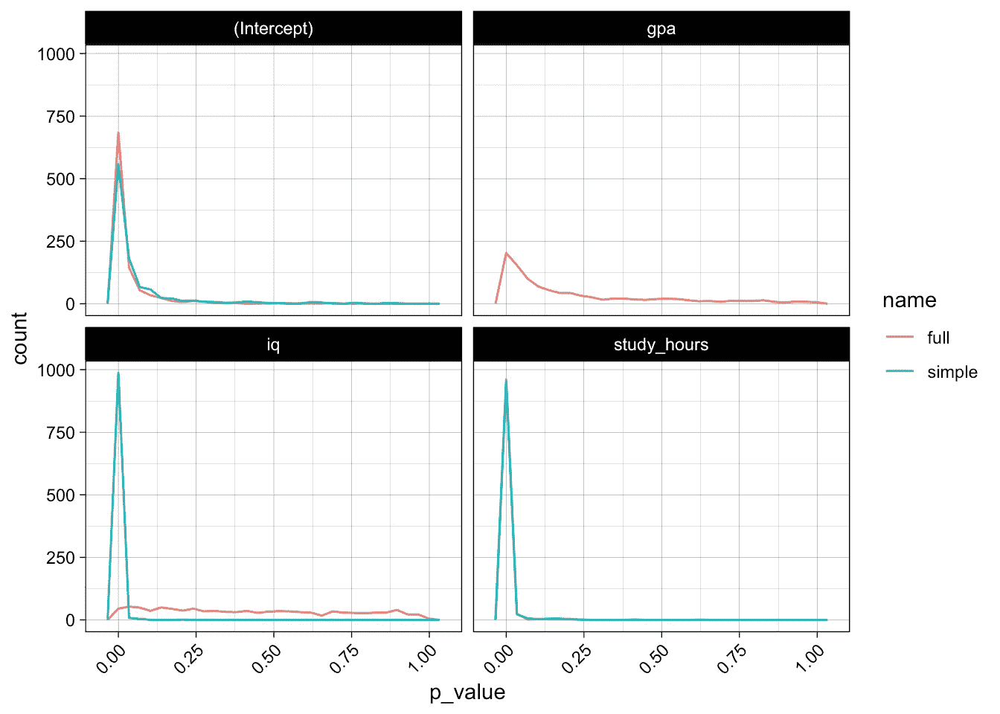

完整和简单模型的 p 值分布—图片由作者制作

# 模拟 2:并行模型评估

让我们在一个稍大的数据集上运行另一个模拟，在这里我们额外计算一些测试数据误差度量。

我们将以稍微不同的方式执行模拟:我们将并行评估不同的模型，并且由于我们只对系数估计和误差度量感兴趣，我们将避免从工人传输太多数据，并且不存储训练数据和模型对象本身。

让我们来看一下[鱼市场数据集](https://gist.githubusercontent.com/stelsemeyer/32cd8a83338c11f354c4cd46167744d7/raw/e73b350d88f1ff2d6d3ca0f6246a3f4ef8c5ad8b/fish_market_data.csv)，它由不同种类的不同鱼类尺寸(长、宽、高)及其重量组成。测量值再次高度相关。我们将尝试预测权重，并在此过程中使用一些简单的领域知识。让我们去除一些明显的异常值，即测量误差。

```
url <- "[https://tinyurl.com/fish-market-dataset](https://tinyurl.com/fish-market-dataset)"
raw_data <- readr::read_csv(url)
## 
## ── Column specification ────────────────────────────────────────────────────────
## cols(
##   Species = col_character(),
##   Weight = col_double(),
##   Length1 = col_double(),
##   Length2 = col_double(),
##   Length3 = col_double(),
##   Height = col_double(),
##   Width = col_double()
## )data <- 
  raw_data %>% 
  dplyr::rename_all(tolower) %>% 
  dplyr::mutate(species = tolower(species)) %>% 
  dplyr::filter(weight > 0)dplyr::sample_n(data, 5)
## # A tibble: 5 x 7
##   species weight length1 length2 length3 height width
##   <chr>    <dbl>   <dbl>   <dbl>   <dbl>  <dbl> <dbl>
## 1 perch    700      34.5    37      39.4  10.8   6.26
## 2 smelt      8.7    10.8    11.3    12.6   1.98  1.29
## 3 perch    820      37.1    40      42.5  11.1   6.63
## 4 bream    700      30.4    33      38.3  14.9   5.29
## 5 perch     78      16.8    18.7    19.4   5.20  3.12GGally::ggpairs(data) +
  theme(axis.text.x = element_text(angle = 45, hjust = 1))
```

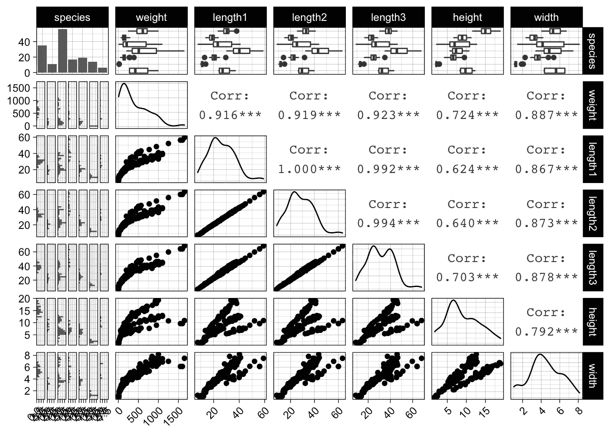

所有测量的混沌对图—图片由作者完成

```
data %>% 
  ggplot(aes(x = length1, y = weight)) + 
  geom_point() + 
  geom_smooth(method = "loess")
## `geom_smooth()` using formula 'y ~ x'
```

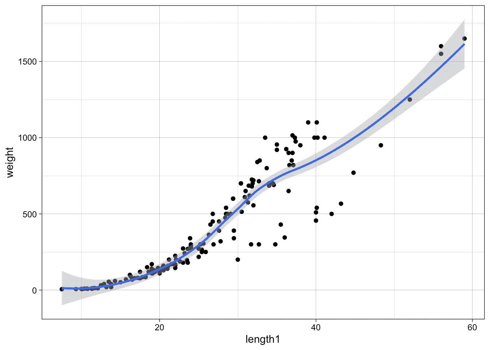

长度 1 与重量—图片由作者制作

由于重量与体积成比例，我们可能会找到类似于`weight ~ length^3`的关系，因此我们可以拟合`log(weight) ~ log(length)`，这将导致`log(weight) ~ a + b * log(length)`的估计值`a, b`。因此，在求幂运算`weight ~ exp(a) * length^b`之后，我们期望`b`大约为 3，而`a`为某个比例因子:

```
simple_log_log_model <- lm(log(weight) ~ log(length1), data = data)summary(simple_log_log_model)
## 
## Call:
## lm(formula = log(weight) ~ log(length1), data = data)
## 
## Residuals:
##      Min       1Q   Median       3Q      Max 
## -0.90870 -0.07280  0.07773  0.26639  0.50636 
## 
## Coefficients:
##              Estimate Std. Error t value Pr(>|t|)    
## (Intercept)  -4.62769    0.23481  -19.71   <2e-16 ***
## log(length1)  3.14394    0.07296   43.09   <2e-16 ***
## ---
## Signif. codes:  0 '***' 0.001 '**' 0.01 '*' 0.05 '.' 0.1 ' ' 1
## 
## Residual standard error: 0.3704 on 156 degrees of freedom
## Multiple R-squared:  0.9225, Adjusted R-squared:  0.922 
## F-statistic:  1857 on 1 and 156 DF,  p-value: < 2.2e-16
```

很公平，`b`在 3.14 左右。添加`height`和`width`可能会再次提高模型性能。在我们开始之前，让我们快速构建另一个没有对数变换的简单模型，通过查看残差图来了解由于非线性关系和不断增加的方差而导致的不良拟合。

```
naive_model <- lm(weight ~ length1 + width + height + species, 
                  data = data)par(mfrow=c(2,2))
plot(naive_model)
```

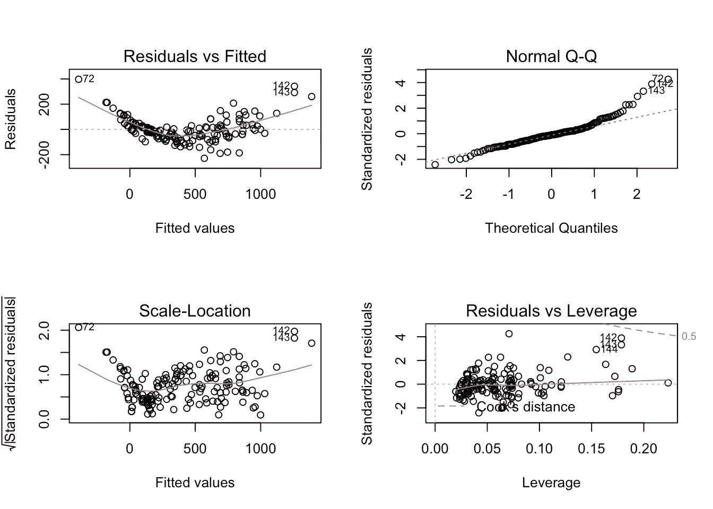

朴素模型的残差诊断—由作者完成的图像

```
# plot residuals against all features
data %>% 
  dplyr::mutate(residual = naive_model$residuals) %>% 
  dplyr::select(-species) %>% 
  # convert to wide to long for plotting
  tidyr::gather(key, value, -residual) %>% 
  ggplot(aes(x = value, y = residual)) +
  geom_point() +
  facet_wrap(~ key, scales = "free")
```

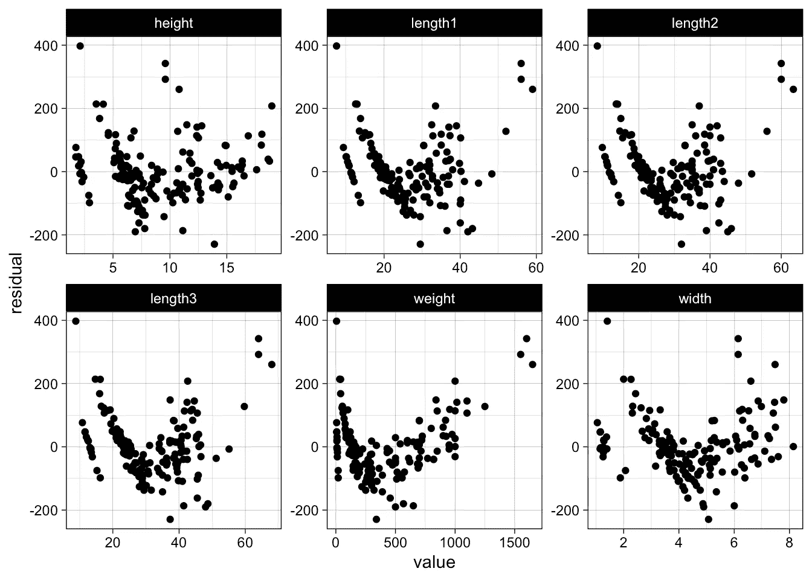

朴素模型的剩余图——作者完成的图像

现在回到双对数模型，我们假设它会表现得更好。

```
log_log_model <- lm(log(weight) ~ log(length1) + log(width) + log(height), data = data)par(mfrow=c(2,2))
plot(log_log_model)
```

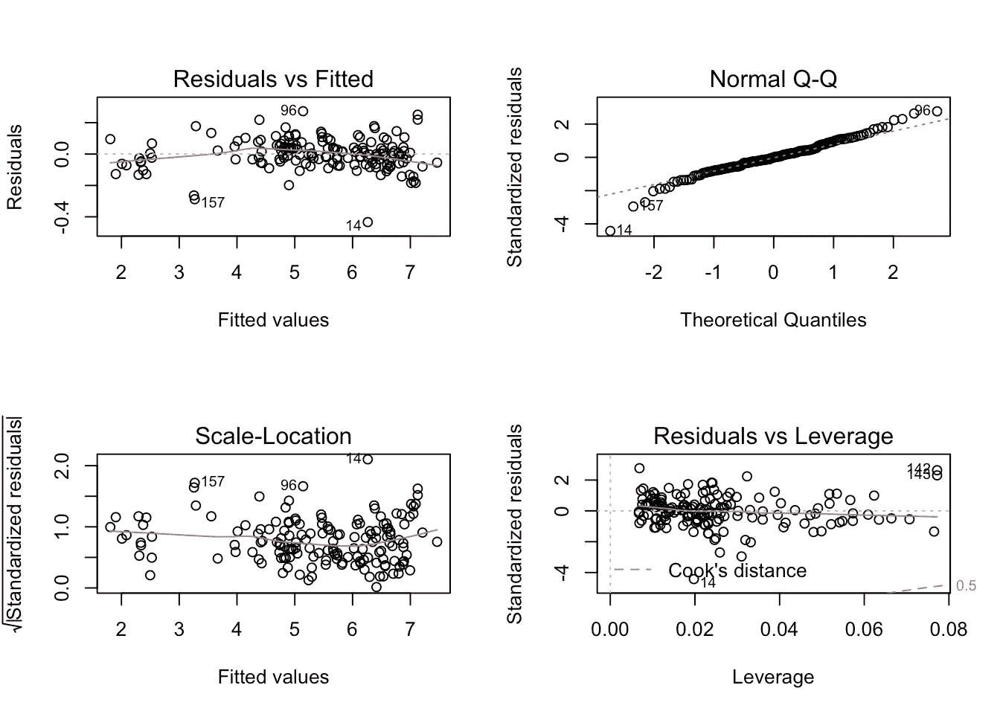

对数模型的残差诊断—图片由作者完成

```
data %>% 
  dplyr::mutate(residual = log_log_model$residuals) %>% 
  dplyr::select(-species) %>% 
  tidyr::gather(key, value, -residual) %>% 
  ggplot(aes(x = value, y = residual)) +
  geom_point() +
  facet_wrap(~ key, scales = "free")
```

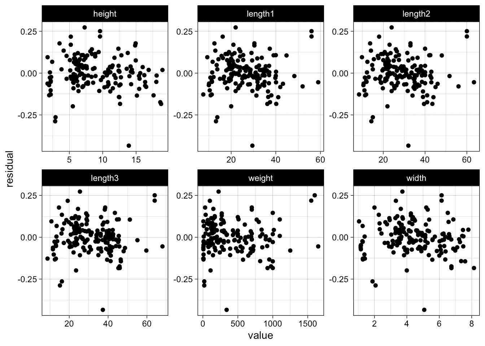

对数-对数模型的残差图—图片由作者完成

我们在残差中没有看到趋势或严重的漏斗效应。一般来说，当我们预期 x%的增加将导致 y%的响应增加时，双对数模型[是有意义的](https://data.library.virginia.edu/interpreting-log-transformations-in-a-linear-model/)。

我们使用`caret::dummyVars`对我们的`species`特性进行一键编码(在`lm`中，我们也可以使用因子，但是那些不能与`glmnet`一起工作):

```
one_hot_encoder <- caret::dummyVars( ~ ., data = data)
data <- dplyr::as_tibble(predict(one_hot_encoder, newdata = data))
```

我们将实际对我们的特征进行对数变换，而不是使用 R 公式:

```
numeric_features <- c("length1", "length2", "length3", "height", "width")data <- 
  data %>% 
  dplyr::mutate_at(numeric_features, log) %>% 
  dplyr::rename_at(numeric_features, function(x) paste0(x, "_log"))

x <- data %>% dplyr::select(-weight)
y <- data %>% dplyr::pull(weight)generate_data <- function(seed=NULL, test_size=1/4) {
  n <- nrow(x)
  set.seed(seed)
  train_idx <- sample(1:n, size = (1-test_size) * n)

  return(list(x_train = x[train_idx,],
              x_test = x[-train_idx,],
              y_train = y[train_idx],
              y_test = y[-train_idx]))
}
```

在正常的线性模型之上，我们还将使用`glmnet`包来拟合正则化的线性模型(山脊、套索和弹性网)。我们创建了一个包装器函数，可以用来传递种子和带有模型参数的命名列表。然后，函数本身将使用上面定义的函数根据种子生成数据。

让我们用一些参数来测试我们的函数:

```
params <- list(features = c("length1_log", "height_log", "width_log"))fit_glmnet(seed = 1, params = params)
## $coefs
## # A tibble: 4 x 2
##   term        estimate
##   <chr>          <dbl>
## 1 (Intercept)   -1.95 
## 2 length1_log    1.50 
## 3 height_log     0.652
## 4 width_log      0.876
## 
## $rmse
## [1] 26.5608
```

用相同的种子和参数再次拟合将产生相同的估计:

```
fit_glmnet(seed = 1, params = params)
## $coefs
## # A tibble: 4 x 2
##   term        estimate
##   <chr>          <dbl>
## 1 (Intercept)   -1.95 
## 2 length1_log    1.50 
## 3 height_log     0.652
## 4 width_log      0.876
## 
## $rmse
## [1] 26.5608
```

我们现在可以使用`purrr::map`轻松运行多次模拟，并使用`purrr::map_dbl`提取错误。

```
simulations <- purrr::map(1:1000, fit_glmnet)
rmse <- purrr::map_dbl(simulations, "rmse")
hist(rmse)
```

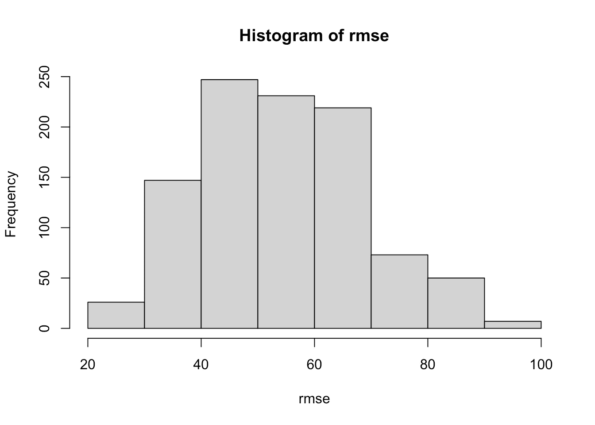

模拟的误差分布—图片由作者完成

现在让我们用不同的参数组合来运行模拟。我们将把我们的参数添加到数据帧中，以便能够在模型和种子上按行并行运行模拟:

```
params <- list(ridge = list(lambda = 0.1, alpha = 0),
               lasso = list(lambda = 0.01, alpha = 1),
               elastic_net = list(lambda = 0.01, alpha = 0.5),
               full = list(lambda = 0),
               simple = list(features = c("length1_log",    
                                          "width_log", 
                                          "height_log"),
                             lambda = 0))params_df <- dplyr::tibble(name=factor(names(params)),
                           params=params)params_df
## # A tibble: 5 x 2
##   name        params          
##   <fct>       <named list>    
## 1 ridge       <named list [2]>
## 2 lasso       <named list [2]>
## 3 elastic_net <named list [2]>
## 4 full        <named list [1]>
## 5 simple      <named list [2]>
```

我们现在将添加和取消种子嵌套:

```
n_simulations <- 1000
n_workers <- 10simulations <- 
  params_df %>% 
  dplyr::mutate(seed = list(1:n_simulations)) %>% 
  tidyr::unnest(seed)head(simulations)
## # A tibble: 6 x 3
##   name  params            seed
##   <fct> <named list>     <int>
## 1 ridge <named list [2]>     1
## 2 ridge <named list [2]>     2
## 3 ridge <named list [2]>     3
## 4 ridge <named list [2]>     4
## 5 ridge <named list [2]>     5
## 6 ridge <named list [2]>     6
```

使用该数据帧，我们现在可以使用`furrr::future_map2`作为`purrr::map2`的并行版本，按行并行运行模拟。我们通过将`furrr::furrr_options(seed = NULL)`传递给函数调用来通知`furrr`我们已经设置了种子。

```
tictoc::tic()future::plan(future::multisession, workers = n_workers)simulations <- 
  simulations %>% 
  dplyr::mutate(simulation = furrr::future_map2(.x = seed, 
                                                .y = params, 
                                                .f = fit_glmnet, 
                                                .options = furrr::furrr_options(seed = NULL))) %>% 
  dplyr::mutate(rmse = purrr::map_dbl(simulation, "rmse"),
                coefs = purrr::map(simulation, "coefs"))tictoc::toc()
## 6.596 sec elapsed
```

让我们看看不同模型的误差分布:

```
simulations %>% 
  ggplot(aes(x = rmse, color = name)) +
  geom_boxplot()
```

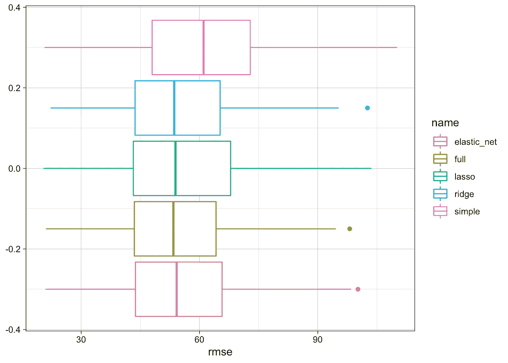

不同模型的误差—图片由作者制作

我们看到，完整模型表现最好，但正则化模型的表现不会差太多。

```
simulations %>% 
  dplyr::group_by(name) %>% 
  dplyr::summarise(rmse_q90 = quantile(rmse, probs = 0.9),
                   rmse = median(rmse)) %>% 
  dplyr::ungroup() %>% 
  dplyr::mutate(perc = rmse / min(rmse)) %>% 
  dplyr::arrange(perc)
## # A tibble: 5 x 4
##   name        rmse_q90  rmse  perc
##   <fct>          <dbl> <dbl> <dbl>
## 1 full            72.5  53.4  1   
## 2 ridge           74.4  53.6  1.00
## 3 lasso           76.5  53.9  1.01
## 4 elastic_net     74.1  54.2  1.02
## 5 simple          83.9  61.0  1.14
```

尽管不同模型的系数变化很大，但不同模拟的系数也不同，尤其是完整模型:

```
model_coefs <- 
  simulations %>% 
  dplyr::select(name, coefs) %>% 
  tidyr::unnest(coefs)model_coefs %>%   
  ggplot(aes(x = estimate, color = name)) + 
  geom_freqpoly(bins = 30) +
  facet_wrap(~ term, scales = "free", ncol = 2) +
  theme(axis.text.x = element_text(angle = 45, hjust = 1))
```

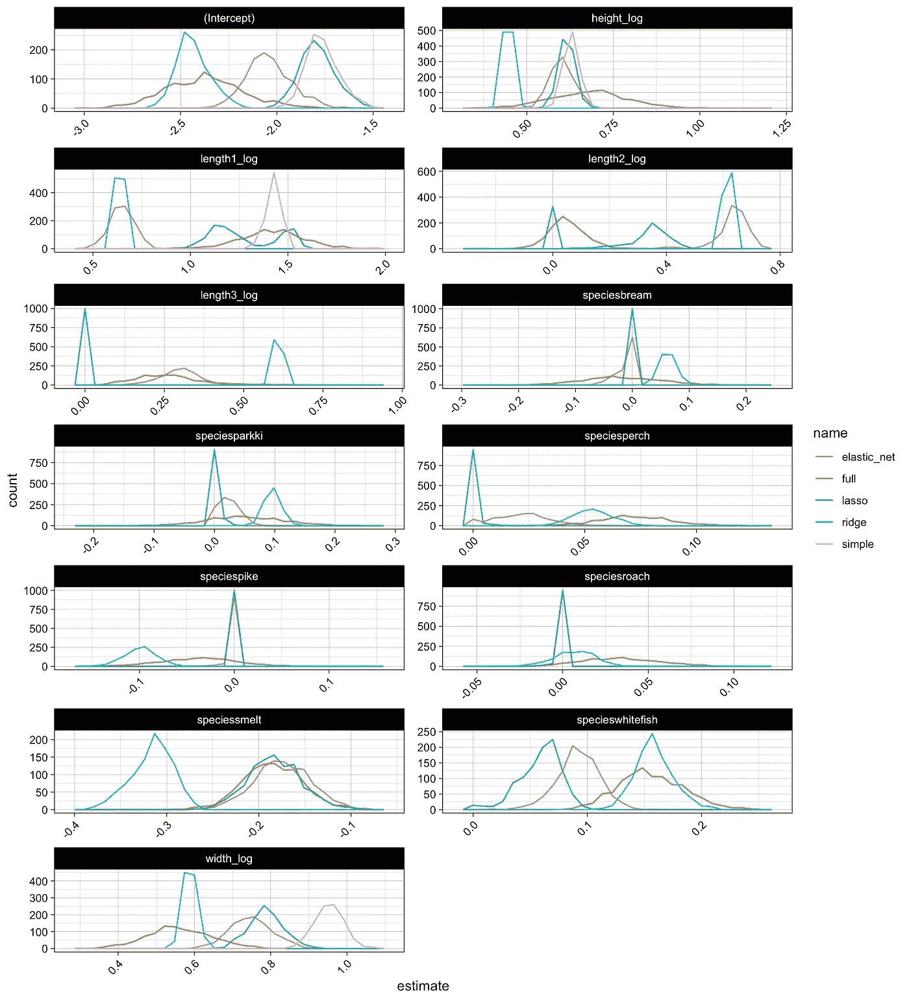

不同模型的系数估计—图片由作者完成。

# 结论

我们看到了多重共线性如何给线性回归中的参数估计带来麻烦，例如在参数的高方差中寻找表达式或缺乏统计显著性。与此同时，我们看到，这并不一定会导致更差的模型性能，如均方根误差等测试误差指标。

我们还学习了一些处理这些问题的经典技术，例如查看方差膨胀因子、进行简单的特征选择或应用正则化。还有许多其他有用的技术，如降维、逐步或基于树的特征选择。

此外，许多其他更复杂的机器学习模型对这些问题更稳健，因为它们在拟合过程中结合了信息增益和正则化，或者使用不同的数据表示，这些数据表示不太容易受到单次观察和数据内相关性的影响。例如，像树模型这样的非参数候选模型，有时还有像神经网络这样的“极端参数”模型。

但是，由于线性回归允许我们从数据中得出强有力的见解和结论，并且通常作为一个简单的基准模型是有用的，所以理解它的统计主干和它的一些缺点是非常有帮助的。

*最初发表于*[*【https://blog.telsemeyer.com】*](https://blog.telsemeyer.com/2020/12/18/simulating-the-effect-of-multicollinearity-in-linear-modelling-using-r-purrr-parallel-computing/)*。*