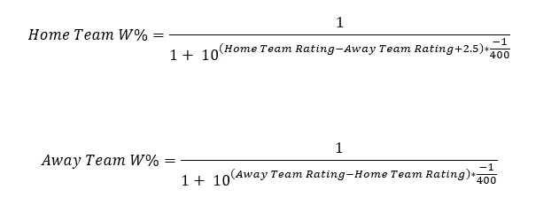
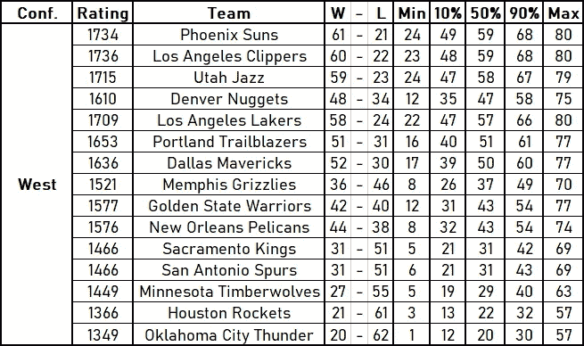
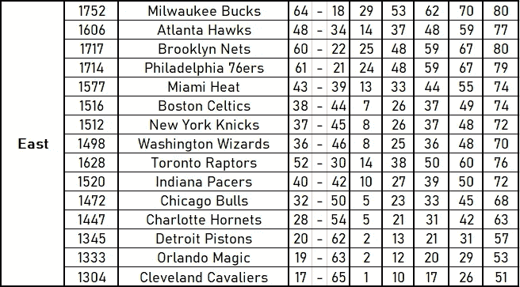
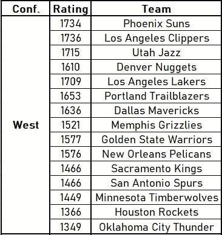
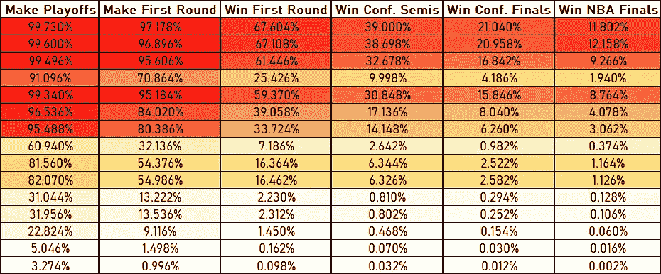
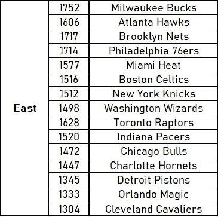
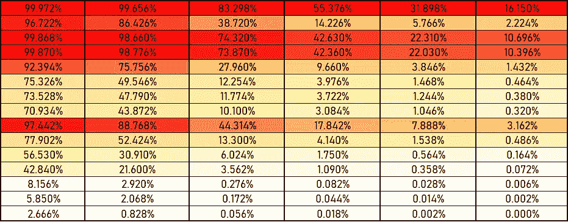

# 模拟 NBA:2021–22 赛季结果

> 原文：<https://towardsdatascience.com/simulating-the-nba-2021-22-season-results-a0884b13690a?source=collection_archive---------26----------------------->

## 我用蒙特卡罗方法模拟了 1230 场比赛和季后赛。你的队会赢几次？


图片由作者提供

## 简介:

随着 NBA 2021-22 季前赛的开始，我开始模拟每支球队的 82 场比赛，加上季后赛，以找出联盟最好和最差的表现。

## NBA 编码:

类似于我的 [NFL 赛季模拟](/the-nfl-simulation-monte-carlo-methods-2f110424b1dd)，所有 30 支球队都有一个评分。今年的范围从 1304(克利夫兰骑士队)开始，到 1752(密尔沃基雄鹿队)，其他球队在两者之间。

每个队赢得比赛的机会是由这个等级决定的。以赛季揭幕战为例:主场作战的雄鹿(1752)对篮网(1717)。



图片由作者提供

利用这些等式，雄鹿有 55.20%的胜算，而篮网有 44.80%的胜算。

一个随机数生成器决定获胜者，然后根据他们是否处于劣势来调整两个评级。如果雄鹿击败了网队，那么他们的排名会比网队击败雄鹿时增加的少，这纯粹是因为雄鹿有望获胜。这使得球队在整个赛季中获得动力。这方面的代码如下所示:

```
for i = 1:length(home_schedule)Ha = 1/(1+10^((team_data(home_schedule(i),1) - team_data(away_schedule(i),1) + 2.5) * -1/400)); % approx home team chance of winningAa = 1/(1+10^((-1 * team_data(home_schedule(i),1) + team_data(away_schedule(i),1)) * -1/400)); % approx away team chance of winningT = Ha + Aa - 1; % chance of a tieH = Ha - T/2; % adjusted home team winning chancesA = Aa - T/2; % adjusted away team winning chancesteam_data(home_schedule(i),1) = team_data(home_schedule(i),1) + 20 * (HW - H); % adjusts home team's ranking based on resultteam_data(away_schedule(i),1) = team_data(away_schedule(i),1) + 20 * (AW - A); % adjusts away team's ranking based on resultend
```

这种模式适用于所有 1230 场比赛，以决定季后赛的赛程。NBA 季后赛由来自每个联盟的 10 支球队组成。每个小组的前 6 名将自动进入第一轮，而 7-10 号种子将在一个小范围内决出第 7 和第 8 号种子。一旦两个联盟的所有 8 支球队都确定下来，季后赛就像一个标准的括号一样开始，两个联盟总决赛的获胜者将在冠军赛上相遇。每场比赛都是 7 场系列赛中的一场，最高分的种子将获得第 1、2、5 和 7 场比赛的主场比赛(如果必要的话)。

常规赛记录、季后赛记录和季后赛机会的所有数据都被记录下来，因为赛季重复了 50，000 次。

## 结果是:

下面显示了所有 30 支球队最有可能的常规赛记录，以及 50，000 个模拟赛季后的统计数据。最小和最大列代表该队在一个赛季中最少和最多的胜利。10%、50%和 90%是所有 50，000 次模拟的百分位数。



图片由作者提供

迈阿密热火队预计将取得 43 胜 39 负的战绩，有 10%的几率他们会赢不到 33 场比赛，有 10%的几率他们会赢超过 55 场比赛。这使得他们有 80%的机会赢得 33 到 55 场比赛。

每支球队的季后赛机会如下所示:



图片由作者提供

第一列代表那支球队进入前 10 名的机会，这意味着他们进入了季后赛。下一列是一个队进入第一轮比赛的机会(前 8)。

只有一支球队在所有 50，000 场比赛中没有赢得一个总冠军，那就是克利夫兰骑士队。奥兰多魔术队和俄克拉荷马雷霆队都只获得过一次总冠军。

NBA 总决赛夺冠热门前 3 名分别是密尔沃基雄鹿队(16.150%)、洛杉矶快船队(12.158%)、菲尼克斯太阳队(11.802%)。

我也对一支球队在 NBA 历史上拥有最好或最差赛季的几率感兴趣。至少有一支球队打破赛季胜利纪录的几率为 6.44%，其中密尔沃基雄鹿队占这些赛季的 34.70%。接下来两个可能的球队是洛杉矶快船(14.20%)和菲尼克斯太阳(13.77%)。

至少有一支球队打破赛季亏损纪录的几率为 12.08%，其中克利夫兰骑士队占这些赛季的 40.31%。接下来两个可能的球队是奥兰多魔术队(19.20%)和俄克拉荷马雷霆队(16.55%)。

在所有 50，000 个模拟赛季中，只有一支球队有机会打破赛季输赢记录。金州勇士队有 0.026%的几率输掉 NBA 历史上最多的比赛，但有 0.031%的几率赢得 NBA 历史上最多的比赛。

## 结论:

这个 NBA 赛季模拟显示，密尔沃基雄鹿队显然是今年 NBA 总决赛的热门球队(16.15%)，即使西部联盟占据了大多数冠军(54.05%)。

一支球队经历 NBA 历史上最糟糕赛季的几率几乎是一支球队经历 NBA 历史上最好赛季的两倍。

在所有 50，000 次模拟中，只有一支球队赢得了零冠军，那就是克利夫兰骑士队，预计战绩为 17 胜 65 负。

如果你对这类内容感兴趣，我推荐你阅读我的另一篇关于职业体育模拟的文章，[NFL 模拟](/the-nfl-simulation-monte-carlo-methods-2f110424b1dd)。