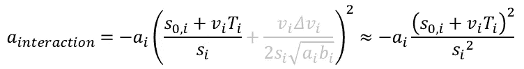

# 用 Python 模拟交通流

> 原文：<https://towardsdatascience.com/simulating-traffic-flow-in-python-ee1eab4dd20f?source=collection_archive---------0----------------------->

## [实践教程](https://towardsdatascience.com/tagged/hands-on-tutorials)

## 实现微观交通模型

约翰·马特丘克在 [Unsplash](https://unsplash.com?utm_source=medium&utm_medium=referral) 上的照片

虽然交通并不总是顺畅，但汽车无缝穿越十字路口，在交通信号灯前转弯和停车，看起来会非常壮观。这种沉思让我想到了交通流量对人类文明的重要性。

在这之后，我内心的书呆子忍不住想了一个模拟交通流量的方法。我花了几周时间做一个关于交通流量的本科项目。我深入研究了不同的模拟技术，最终选择了一种。

在这篇文章中，我将解释为什么流量模拟是重要的，比较不同的方法可能建模流量，并提出我的模拟(连同源代码)。

# 为什么要模拟交通流？

模拟交通的主要原因是在没有真实世界的情况下生成数据。您可以使用软件上运行的模型来预测交通流量，而不是测试如何在现实世界中管理交通系统或使用传感器收集数据的新想法。这有助于加速交通系统的优化和数据收集。模拟是真实世界测试的一种更便宜、更快速的替代方式。

训练机器学习模型需要庞大的数据集，收集和处理这些数据集可能很困难，成本也很高。通过模拟交通按程序生成数据可以很容易地适应所需数据的确切类型。

# 建模

为了分析和优化交通系统，我们首先要对交通系统进行数学建模。这种模型应根据输入参数(路网几何形状、每分钟车辆数、车速等)真实地表现交通流量。

微观模型(左)宏观模型(右)。图片作者。

交通系统模型通常分为三类，这取决于它们运行的级别:

*   **微观模型:**分别代表每一辆车，试图复制驾驶员的行为。
*   **宏观模型:**用交通密度(每公里车辆数)和交通流量(每分钟车辆数)来描述车辆整体的运动。它们通常类似于流体流动。
*   **介观模型:**是结合了微观和宏观模型特点的混合模型；他们将流量建模为车辆的“数据包”。

在本文中，我将使用一个微观模型。

## 微观模型

微观驾驶员模型描述了单个驾驶员/车辆的行为。因此，它必须是一个多智能体系统，也就是说，每辆车都使用来自其环境的输入来独立运行。

图片作者。

在微观模型中，每辆车都有编号 *i* 。第 *i* 辆跟随第( *i-1* )辆。对于第 *i* 辆车，我们将用 **xᵢ** 表示其在道路上的位置， **vᵢ** 表示其速度， **lᵢ** 表示其长度。每辆车都是如此。

我们将用 **sᵢ** 表示保险杠到保险杠的距离，用**δvᵢ**表示第 *i* 辆车与其前车(车号 *i-1* )之间的速度差。

## 智能驱动模型(IDM)

2000 年，Treiber、Hennecke 和 Helbing 开发了一种被称为[智能驾驶模型](https://journals.aps.org/pre/abstract/10.1103/PhysRevE.62.1805)的模型。它将第 *i* 辆车的加速度描述为其变量和其前方车辆变量的函数。动力学方程定义为:

在我解释这个模型背后的直觉之前，我应该解释一些符号代表什么。

我们已经讲过 **sᵢ** 、 **vᵢ、**和**t31】δ**vᵢ**。其他参数是:**

*   **s₀ᵢ** :车辆 *i* 和 *i-1 之间的最小期望距离。*
*   **v₀ᵢ :** 是车辆的最大期望速度 *i.*
*   **δ :** 是加速指数，它控制加速的“平滑度”。
*   **Tᵢ :** 是第*辆车驾驶员的反应时间。*
*   **aᵢ :** 为车辆的最大加速度*一、*
*   **bᵢ :** 是车辆 *i.* 的舒适减速度
*   **s*** :车辆 *i* 和 *i-1 之间的实际所需距离。*

首先，我们将查看 **s*** ，它是一个距离，由三项组成。

图片作者。

*   **s₀ᵢ** **:** 前面说过，是最小期望距离。
*   **vᵢTᵢ :** 是反应时间安全距离。它是驾驶员做出反应(刹车)之前车辆行驶的距离。
    既然速度是距离随时间的变化，那么距离就是速度乘以时间。

*   (vᵢδvᵢ)/√(2aᵢbᵢ):这是一个有点复杂的术语。这是基于速度差的安全距离。它代表车辆减速(不撞上前方车辆)，不过度制动(减速度应小于 **bᵢ** )所需的距离。

## 智能驱动模型如何工作

假设车辆沿直线行驶，并遵循以下等式:

为了更好地理解这个方程，我们可以把它分成两部分。我们有一个**自由道路加速度**和一个**交互加速度**。

**自由道路加速度**是自由道路上的加速度，也就是前方没有车辆的空旷道路。如果我们将加速度绘制成速度 **vᵢ** 的函数，我们得到 **:**

加速度是速度的函数。图片作者。

我们注意到，当车辆静止时( **vᵢ=0** )，加速度最大。当车速接近最大速度 **v₀ᵢ** 时，加速度变为 0。这表明**自由道路加速**将使车辆加速至最大速度。

如果我们为不同的 **δ、**值绘制 v-a 图，我们会注意到，它控制着驾驶员在接近最大速度时减速的速度。这又控制加速/减速的平滑度

加速度是速度的函数。图片作者。

**互动加速度**与前方车辆互动相关。为了更好地理解它是如何工作的，让我们考虑以下情况:

*   **在自由路面上(sᵢ > > s*):** 当前方车辆很远，也就是距离 **sᵢ** 是主导期望距离 **s*** 时，交互加速度几乎为 0。
    这意味着车辆将受到自由道路加速度的控制。

*   **在高接近速率(δvᵢ):** )下，当速度差很大时，交互加速度试图通过使用分子中的**(vᵢδvᵢ)**项制动或减速来补偿，但太难了。这是通过分母 **4bᵢsᵢ** 实现的。(老实说，我不知道它如何将减速精确地限制在 **bᵢ** 。

*   **在小距离差时(sᵢ < < 1 和δvᵢ≈0):** )加速度变成简单的排斥力。

## 交通道路网络模型

有向图的例子。图表(左)集合(右)

我们需要建立一个道路网的模型。为此，我们将使用一个**有向图 G=(V，E)** 。其中:

*   **V** 是顶点(或节点)的集合。
*   E 是代表道路的边的集合。

每辆车都有一条由多条道路(边)组成的路径。我们将对同一条道路(同一条边)上的车辆应用智能驾驶员模型。当一辆车到达路的尽头时，我们把它从那条路上移走，并把它附加到下一条路上。

在模拟中，我们不会保留一组节点(数组),相反，每条道路都将由其起始和结束节点的值明确定义。

## 随机车辆生成器

为了将车辆添加到我们的模拟中，我们有两个选项:

*   通过创建一个新的`Vehicle`类实例并将其添加到车辆列表中，将每辆车手动添加到模拟中。
*   根据预定义的概率随机添加车辆。

对于第二个选项，我们必须定义一个随机车辆生成器。

随机车辆生成器由两个约束条件定义:

*   **车辆生成率(τ):** (每分钟车辆数)描述平均每分钟应添加多少车辆到模拟中。
*   **车辆配置列表(L):** 包含车辆配置和概率的元组列表。L = [(p₁，V₁)，(p₂，V₂)，(p₃，V₃)，…]

随机车辆生成器以概率 **pᵢ** 生成车辆 **Vᵢ** 。

## 交通灯

图片作者。

交通灯位于顶点，由两个区域表征:

*   **减速区:**以一个*减速距离* 和一个*减速系数*为特征，是一个车辆使用减速系数降低其最大速度的区域。

*   **停车区:**以*停车距离*为特征，是车辆停车的区域。这是通过以下动力学方程使用阻尼力实现的:

# 模拟

我们将采用面向对象的方法。每辆车和每条路都将被定义为一个类别。

我们将在许多即将到来的课程中重复使用下面的`__init__`函数。它通过一个函数`set_default_config`设置当前类的默认配置。需要一个字典，并将字典中的每个属性设置为当前类实例的属性。这样我们就不用担心更新不同类的`__init__`功能，也不用担心以后的变化。

## 路

我们将创建一个`Road`类:

在屏幕上绘制道路时，我们需要道路的`length`及其角度的余弦和正弦值。

## 模拟

还有一个`Simulation`班。我添加了一些方法来给模拟添加道路。

我们必须在屏幕上实时显示我们的模拟。为此，我们将使用`pygame`。我将创建一个期望一个`Simulation`类作为参数的`Window`类。

我定义了多个绘图函数来帮助绘制基本形状。

`loop`方法创建一个`pygame`窗口，并在每一帧调用`draw`方法和`loop`参数。当我们的模拟需要每帧更新时，这将变得有用。

我将名为`trafficSimulator`的文件夹中的每个文件与一个导入所有类名的`__init__.py`文件组合在一起。

每当一个新的类被定义时，它应该被导入到这个文件中

将`trafficSimulator`文件夹放在我们的项目文件夹中，我们就可以使用这个模块了。

模拟测试。图片作者。

## 车辆

现在，我们必须增加车辆。

我们将使用[泰勒级数](https://en.wikipedia.org/wiki/Taylor_series)来近似本文建模部分讨论的动力学方程的解。

无限微分函数`f`的泰勒级数展开式为:

用`▲x`代替`a`，用`x+▲x`代替`x`，我们得到:

用位置`x`替换`f`:

作为近似，我们将在位置的 2 阶停止，因为加速度是最高阶导数。我们得到方程 **(2)** :

对于速度，我们将用`v`代替`x`:

我们将停在 1 阶，因为我们的最高阶导数是加速度(1 阶是速度)。方程式 **(2)** :

在每次迭代(或帧)中，使用 IDM 公式计算加速度后，我们将使用以下两个公式更新位置和速度:

在代码中是这样的:

因为这只是一个近似值，所以速度有时会变成负值(但是模型不允许这样)。当速度为负时，不稳定性出现，位置和速度发散到负无穷大。

为了克服这个问题，每当我们预测一个负速度时，我们将它设置为零，并从那里计算出:

在代码中，这是按如下方式实现的:

为了计算 IDM 加速度，我们将前导车辆表示为`lead`，并计算当`lead`不是`None`时的交互项(表示为`alpha`)。

如果车辆停止(例如在红绿灯处)，我们将使用阻尼方程:

然后，我们在一个`Vehicle`类中的一个`update`方法中将所有东西组合在一起:

在`Road`类中，我们将添加一个`deque`(双端队列)来跟踪车辆。队列是存储车辆的更好的数据结构，因为队列中的第一辆车是道路上最远的一辆车，它是可以从队列中移除的第一辆车。要从`deque`中移除第一个项目，我们可以使用`self.vehicles.popleft()`。

我们将在`Road`类中添加一个`update`方法:

和`Simulation`类中的`update`方法:

回到`Window`类，我添加了一个`run`方法来实时更新模拟:

现在，我们将手动添加车辆:

车辆在移动！图片作者。

## 车辆发电机

一个`VehicleGenerator`有一个包含`(odds, vehicle)`的元组数组。

元组的第一个元素是在同一个元组中生成车辆的权重(不是概率)。我使用权重是因为它们更容易处理，因为我们可以只使用整数。

例如，如果我们有 3 辆车，重量分别为`1`、`3`、`2`。这与`1/6`、`3/6`、`2/6`和`6=1+3+2.`相对应

为了实现这一点，我们使用以下算法

*   生成一个介于 1 和所有权重之和之间的数字。
*   当 **r** 为非负时:
    遍历所有可能的车辆，并在每次迭代中减去其权重。
*   归还最后使用的车辆。

如果我们有权重: **W₁** 、 **W₂** 、 **W₃** 。该算法将第一辆车分配到 **1** 和 **W₁** 之间的号码，第二辆车分配到 **W₁** 和 **W₁+W₂** 之间的号码，第三辆车分配到 **W₁+W₂+W₃** 之间的号码。

至于何时添加车辆，每当生成器添加车辆时，名为`last_added_time`的属性被更新为当前时间。当当前时间与`last_added_time`之间的持续时间大于车辆生成周期时，增加一辆车辆。

添加车辆的周期是`60/vehicle_rate`，因为`vehicle_rate`在*每分钟车辆*，`60`是 1 分钟或 60 秒。

我们还必须检查道路是否还有空间来容纳即将到来的车辆。我们通过检查道路上最后一辆车之间的距离以及即将到来的车辆的长度和安全距离之和来做到这一点。

最后，我们应该从`Simulation`的`update`方法中调用`update`方法来生成`update`车辆。

车辆正在产卵！图片作者。

## 红绿灯

交通信号的默认属性是:

`self.cycle`是一个元组数组，包含`self.roads`中设置的每条道路的状态(`True`表示绿色，`False`表示红色)。

在默认配置中，`(False, True)`表示第一组道路是红色，第二组是绿色。`(True, False)`则相反。

使用这种方法是因为它易于扩展。我们创造的交通灯包括两条以上的道路，交通灯有单独的右转和左转信号，甚至有多个交叉路口的同步交通信号。

交通信号的`update`功能应该是可定制的。其默认行为是对称的固定时间循环。

我们需要将这些方法添加到`Road`类中:

而这个，在`Road`的`update`方法中。

并用`Simulation`的`update`方法检查交通灯状态:

停下来。图片作者。

## 曲线

在现实世界中，道路是有曲线的。虽然从技术上讲，我们可以通过手写大量道路的坐标来近似一条曲线，从而在这个模拟中创建曲线，但我们也可以在程序上做同样的事情。

为此，我将使用[贝塞尔曲线](https://en.wikipedia.org/wiki/B%C3%A9zier_curve)。

我创建了一个`curve.py`文件，其中包含了帮助创建曲线并通过道路索引引用它们的函数。

测试:

优美的曲线。图片作者。

# 例子

这些示例的代码可以在本文底部链接的 Github 资源库中找到。

## 高速公路上

高速公路上。图片作者。

## 双向交叉路口

双向交叉路口。图片作者。

## 迂回的

迂回。图片作者。

## 分叉菱形立交

分叉菱形立交。图片作者。

# 限制

虽然我们可以修改`Simulation`类来存储关于我们稍后可以使用的模拟的数据，但是如果数据收集过程更加精简的话会更好。

这个模拟还欠缺很多。弯道的实施是糟糕和低效的，并导致车辆和交通信号之间的相互作用的问题。

虽然有些人可能认为智能司机模型有点矫枉过正，但拥有一个能够复制真实世界现象的模型很重要，如[交通波](https://en.wikipedia.org/wiki/Traffic_wave)(又名幽灵交通蛇)和司机反应时间的影响。出于这个原因，我选择使用智能驱动程序模型。但是对于准确性和极端真实性不重要的模拟，如视频游戏，IDM 可以由更简单的基于逻辑的模型代替。

完全依赖基于模拟的数据会增加过度拟合的风险。您的 ML 模型可以针对只存在于模拟中而不存在于真实世界中的零食进行优化。

# 结论

仿真是数据科学和机器学习的重要组成部分。有时，从现实世界中收集数据要么是不可能的，要么是昂贵的。生成数据有助于以更好的价格建立庞大的数据集。模拟也有助于填补真实世界数据的空白。在某些情况下，真实世界的数据集缺乏可能对开发的模型至关重要的边缘案例。

这个模拟是我参与的一个大学项目的一部分。目的是优化城市十字路口的交通信号。我做这个模拟是为了测试和验证我的优化方法。

我从来没有想过要发表这篇文章，直到我在看特斯拉的 AI day，在这篇文章中，他们谈到了他们如何使用模拟来为边缘案例生成数据。

# 源代码和贡献

这里有一个到 Github 库 的链接，包含本文中的所有代码，包括例子。

如果您对代码有任何疑问或问题，请随时联系我，或者在 GitHub 上提交请求或问题。