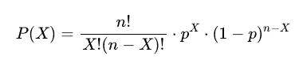
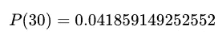
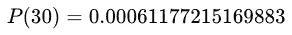
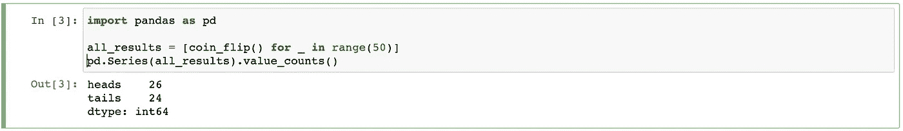
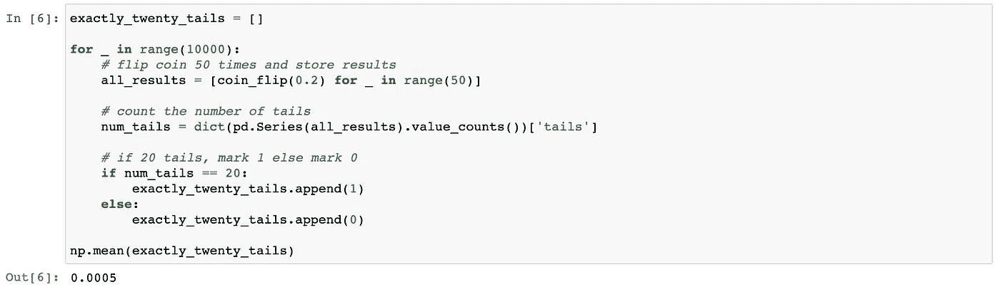
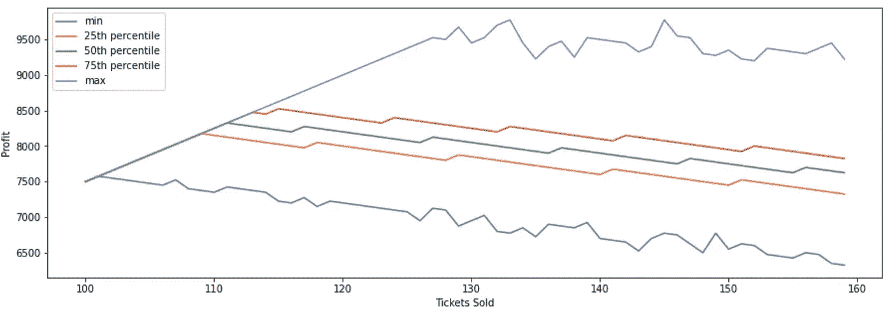
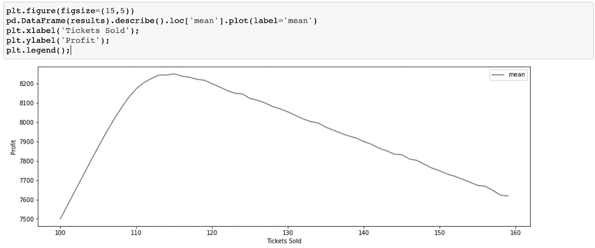

# 数据科学模拟

> 原文：<https://towardsdatascience.com/simulation-fbfc3227b021?source=collection_archive---------21----------------------->

## 有三个代码示例

[https://www . free pik . com/free-vector/people-using-VR-glasses-illustration _ 11790695 . htm # page = 1&query = simulation&position = 17](https://www.freepik.com/free-vector/people-using-vr-glasses-illustration_11790695.htm#page=1&query=simulation&position=17)

在本文中，我们将看三个模拟示例。

1.  统计理论 101
2.  蒙蒂·霍尔问题
3.  航线优化

> 介绍

在高中和研究生院的时候，我总是纠结于与以下相关的课程:

1.  证明
2.  统计理论

通过实践，我最终理解了这些课程中的信息。现在，我作为一名实践数据科学家进入了现实世界，显然这些课程会为我提供日常工作和生活所需的丰富知识…我不会走那么远！

说实话，我确实在这些课程中学到了很多。但实际上，我有了一种新的方法来回答这些课上提出的很多问题。其实这几天几乎每个问题我都用同样的方法回答！解决方法是 ***模拟*** 。

让我们看一个统计理论导论课上的例子。

> 统计理论 101

假设你的任务是找出将一枚硬币抛 50 次，恰好得到 20 条反面的概率？

你知道这是一个二项分布吗？如果你这样做了，很可能你很快就计算出这些几率是 4.2%。我个人在[statisticshelper.com](http://statisticshelper.com/binomial-probability-calculator#answer)用在线计算器找到了答案，上面显示的是概率密度函数(以下所有公式/解都是从上述网站截取的图片):

这张图片显示了我们的问题设置中每个字母代表的含义。

 [## http://www . mathnstuff . com/math/口语/hee/2class/90/binom1.gif 的谷歌图片结果

### 编辑描述

www.google.com](https://www.google.com/imgres?imgurl=http%3A%2F%2Fwww.mathnstuff.com%2Fmath%2Fspoken%2Fhere%2F2class%2F90%2Fbinom1.gif&imgrefurl=http%3A%2F%2Fwww.mathnstuff.com%2Fmath%2Fspoken%2Fhere%2F2class%2F90%2Fbinom3.htm&tbnid=brz1spRymlKULM&vet=12ahUKEwiD8qLE_OPyAhVMS60KHaCgCucQMygGegUIARDPAQ..i&docid=yDZN7C9J9IpfGM&w=412&h=205&q=binomial%20distribution%20formula&ved=2ahUKEwiD8qLE_OPyAhVMS60KHaCgCucQMygGegUIARDPAQ) 

如果硬币被操纵了，它 80%的时候都是正面朝上。现在，20 条尾巴的几率是多少？如果你对上面的公式感到满意，你会发现答案是 0.06%。

但是如果你不知道这是二项分布呢？或者如果那个公式对你没有意义呢？或者如果问题不同呢？

如果问题是第一条尾巴在第五次翻转时翻转并且前四条都是正面的几率有多大呢？第一条尾巴出现在第 100 次翻转时，前 99 条是正面的可能性有多大？

现在，你需要知道几何分布。🤦‍♂️

你在第 100 次空翻中完成第 5 次空翻的几率有多大？而另外 4 次空翻可以分散在前 99 次空翻中的任何地方。几率有多大？

现在你需要了解负二项分布。️️🤦‍♀️.这已经失控了！

> 模拟示例 1:二项式分布

如果你不理解上面的任何解决方案，没关系。这就是这个帖子的力量。你不需要！

除了了解所有这些统计分布，您还可以模拟结果。让我们重温一下第一个问题:假设你的任务是找出将一枚硬币抛 50 次，恰好得到 20 条反面的概率？

我们可以用上面的方法模拟一次翻转。`random.random()`以相等的概率返回 0 和 1 之间的值。所以默认情况下，`coin_flip()`模拟公平的硬币投掷，但是通过更新默认的`probability`值也允许不公平的硬币。

现在我们可以模拟 50 次抛硬币，看看结果。

作者图片

您的结果可能会有所不同，因为这是随机的，我们没有设置种子。你可以看到在第一组 50 次抛硬币中，我们得到了 26 个正面和 24 个反面。问题是我们多久才能得到 20 条尾巴。我们现在可以模拟这个过程 10，000 次，看看 20 条尾巴出现的频率。

运行这段代码，我得到了大约 4.2%的结果！🎉 🎊

您可以通过将`probability`更改为 0.2 来轻松进行修改。我的模拟结果提供了 0.0005，这与理论结果并不完全相同。然而，在现实世界中，这是一个非常合理的值。

作者图片

> 模拟示例 2:蒙蒂霍尔问题

如果你对三门蒙蒂霍尔问题不熟悉，[大卫伯顿](https://medium.com/@trvlingteacher/the-monty-hall-problem-4f942a330207)的这篇文章可以帮助你加快速度。你也可以在 [UCSD 网站这里](http://www.math.ucsd.edu/~crypto/Monty/monty.html)自己试题。总的来说，有三扇门。一扇门后面有辆车，另外两扇门是哑弹。你选择了一扇门，然后给你看了一个哑弹。此时，您可以将您的选择更新到另一个门，或者继续使用您最初选择的门。

对我来说，在看到一扇坏门后换门以增加选择汽车的几率从来都不是直觉。然而，我们可以模拟这个问题，以证明更新我们的选择是正确的决定。

下面的代码将迭代一个游戏，其中我们选择用门的变化来更新我们最初的选择。

我们现在可以运行这个场景的 10，000 次迭代，并跟踪我们赢得汽车的频率。这可能会有一些变化，但我的模拟运行提供了几乎准确的理论解决方案，其中 66%的情况下我们会选择更换门，而只有 33%的情况下我们会选择保留原来的门。

> 模拟示例 3:航线问题

作为最后一个模拟示例，假设您为一家航空公司工作。想象一下，我们知道一架飞机有 100 个座位，每个买了票的乘客有 10%的几率不会出现。另外，每张票的利润是 75 美元。如果你超售了飞机，你会为每个因没有座位而需要转到新航班的乘客赔钱。这些超售席位的损失是 25 美元。

想象一下，无论乘客是否出现，你都会获得利润。

如果你卖出 100 张票，你会赚 7500 美元。

如果你卖出 101 张票，每个人都来了，你就赚了

75 美元 X100-25 美元 x1 = 7，475 美元

但是，如果至少有 1 人缺席，您将获得:

75 美元 x101 = 7 575 美元

> 为了实现利润最大化，应该出售的最佳座位数是多少？

我们可以使用下面的函数计算收入，默认情况下销售 100 张门票，这应该总是提供 7，500 美元的收入。

然后，我们可以模拟多次运行`calculated_revenue`函数，但是销售不同数量的门票，以了解最佳数量。假设我们在每一个可能售出的门票数量上运行 10，000 次迭代。然后我们看看每张售出的票的可能收入。下面的代码执行模拟。

然后我们可以画出可能的收入值。

作者图片

如果我们想要最大可能的收入，我们可能会选择增加风险，直到卖出 130 张以上的门票。然而，潜在的不利因素导致售出的座位数非常高时的预期利润低于我们在座位数低得多时的预期利润。取决于我们的风险承受能力，没有正确的答案。该图提供了做出明智决策所需的信息。

使用平均值(在大多数传统课程中建议的最优值)提供了以下图表和售出 115 个座位的解决方案。

作者图片

> 结论

我们的模拟解决方案之旅到此结束。下次你遇到问题时，如果你不确定正确答案，记得你可以模拟各种可能性！然后利用结果做出正确的决定！