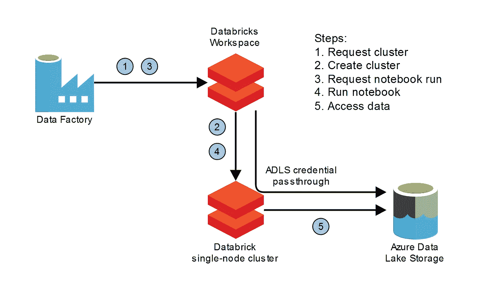

# 基于数据块的单节点分布式深度学习

> 原文：<https://towardsdatascience.com/single-node-and-distributed-deep-learning-on-databricks-2ab69797f812?source=collection_archive---------31----------------------->

## [理解大数据](https://towardsdatascience.com/tagged/making-sense-of-big-data)

卢克·范·德·维尔登& [里克·琼格里乌斯](https://medium.com/u/8d3b69256f17?source=post_page-----2ab69797f812--------------------------------)

Databricks 是一个分析生态系统，现在可以在大多数主要的云提供商 Google、AWS 和 Azure 上使用。数据块集群计算使用分布式 Spark 引擎。最近推出的单节点 Spark 集群不支持分布式计算，为什么？

# 单节点数据块集群

在多节点集群上，带有 [PySpark](https://spark.apache.org/docs/latest/api/python/index.html) 的 Python 解释器在驱动节点上运行以收集结果，而工作节点执行 JVM jar 文件或[Python UDF](https://docs.databricks.com/spark/latest/spark-sql/udf-python.html)。运行单节点集群的选项于 2020 年 10 月[日](https://databricks.com/blog/2020/10/19/announcing-single-node-clusters-on-databricks.html)推出，其动机如下。

> 标准数据块 Spark 集群由一个驱动节点和一个或多个工作节点组成。这些集群最少需要两个节点——一个驱动程序和一个工作程序——来运行 Spark SQL 查询、从增量表中读取数据或执行其他 Spark 操作。然而，对于许多机器学习模型训练或轻量级数据工作负载，多节点集群是不必要的。

单节点集群可以运行 Databricks 机器学习运行时，该运行时经过精心策划，开箱即用。您可以选择 GPU 或 CPU 运行时，并将其部署在各种规模的虚拟机上。非常适合训练我们的机器学习模型。

# 熊猫数据帧

在单节点集群上，Spark 命令以本地模式运行。单节点集群仍然可以使用 Spark 数据源和相关的云认证/授权支持，比如 Azure 上的 ADLS 认证直通。除了数据提取和加载，Spark 功能在单节点集群上并不那么有用。为了训练机器学习模型，我们经常从 Spark 转换到 Pandas 数据帧。自从 Spark 2.3-2.4 以来，熊猫之间的转换已经通过[箭头](https://arrow.apache.org/blog/2017/07/26/spark-arrow/)加速。有时，我们甚至在数据砖块上立即将拼花地板(数据湖)转换成熊猫，见下文。

```
# azure data lake parquetdf = spark.read.parquet("abfss://<storage>/path").toPandas()
```

# Azure 用例

让我们讨论一下在计算管道中使用单节点集群。我们希望训练多个 DeepAR 模型，每个模型在我们的数据集中有不同的时间序列。这是令人尴尬的并行，因为每个模型都可以在内存中有一个时间序列的单个 CPU 虚拟机上训练。每个培训工作相当于运行一个 Databricks 笔记本，它导入一个特定的时间序列和一个具有单元测试功能的 Python 包。我们有数百个时间序列，并希望旋转数十个单节点来执行我们的训练工作和注册我们的模型。我们使用 Azure Data Factory 来安排我们的 Databricks 笔记本和启动集群。



DataFactory-Databricks 架构，图片由作者提供

## Azure 数据工厂的并行性

DataFactory 管道可以并行运行 Databricks 笔记本，并等待它们完成，然后继续进行管道的下一个活动。ForEach 操作符为序列中的元素(例如数据湖拼花路径)启动一个记事本。它可以按批量顺序或并行运行。请参见下面数据工厂 JSON 导出中的“isSequential”和“batchCount”。我们启动了 20 个运行相同数据块的单节点笔记本活动来处理我们的时间序列。数据工厂通过数据块链接服务管理这些集群资源。

```
{
    "name": "train_each_time_series",
    "type": "ForEach",
    "dependsOn": [
        {
            "activity": "generate_time_series_paths",
            "dependencyConditions": [
                "Succeeded"
            ]
        }
    ],
    "typeProperties": {
        "items": {
            "value": "[@json](http://twitter.com/json)('[{\"time_series\": \"some/path\"}]')",
            "type": "Expression"
        },
        "isSequential": false,
        "batchCount": 20,
        "activities": [
            {
                "name": "train_a_time_series",
                "description": "Train a time series DeepAR",
                "type": "DatabricksNotebook",
                "dependsOn": [],
                "userProperties": [],
                "typeProperties": {
                    "notebookPath": "/our_model/train_model"
                },
                "linkedServiceName": {
                    "referenceName": "[parameters('db_pool')]",
                    "type": "LinkedServiceReference"
                }
            }
        ]
    }
}
```

## 数据块实例池

要从 DataFactory 运行 Databricks 笔记本，我们需要在 DataFactory 中创建一个链接服务。启动笔记本活动时，有三种方法可以配置链接服务来选择或创建 Databricks 集群。

1.  互动集群是一个预先存在的运行集群，我们可以选择我们的笔记本活动。
2.  为启动的每个笔记本活动创建作业群。作业集群在笔记本活动期间存在。这会导致集群创建和终止的等待时间很长(两者都需要几十分钟)。
3.  数据块实例池包含可配置数量的就绪虚拟机实例，这些实例会等待被包含到集群中。空闲和运行之间的延迟是几分钟。从 2019 年末开始支持，[实例池](https://techcommunity.microsoft.com/t5/azure-data-factory/support-for-azure-databricks-instance-pool-for-operationalizing/ba-p/901006)允许作业之间的快速周转时间。

我们在数据块中创建了一个[实例池，其中包含我们选择的 20 个 CPU 密集型虚拟机。当我们在 DataFactory 中创建数据块链接服务时，我们选择这个实例池，并提供数据块工作区的访问令牌。当笔记本活动完成时，其集群虚拟机实例被释放回池中。ForEach 操作符最多可以并行处理 50 个活动，我们根据实例池的大小来限制这个数量。如果我们的资源请求大于数据块实例池大小，DataFactory 管道将失败。如果我们想在单节点上并行处理 20 个笔记本活动，我们需要一个包含 20 个实例的池。在这种情况下，如果资源不可用，DataFactory-Databricks 组合不支持排队。](https://docs.databricks.com/clusters/instance-pools/configure.html#instance-pool-configurations)

## 待续

关于我们使用 Python SDK 的 Databricks 笔记本和数据工厂管道的 CICD 工作流的后续博客将进一步深入这个用例。在下一节中，我们想知道如果我们不使用 Spark 进行模型训练，多节点数据块集群有什么用。

# 分布式深度学习

当我们在具有足够内存和 GPU/CPU 资源的单节点上运行 Databricks 笔记本时，我们已经看到了单节点 Databricks 集群对于机器学习的价值。让我们回溯并考虑分布式计算。多节点数据块集群只对 Spark 计算有用吗？我们能否在多节点数据块集群之上搭载一个不同的分布式计算框架？

## Databricks Horovod 转轮

Horovod ( [开源](https://github.com/horovod/horovod)优步)是一个使用 MPI 和 NCCL 的分布式深度学习框架，支持 TensorFlow、Keras、PyTorch 和 Apache MXNet。[Databricks 的 Spark-Deep-Learning](https://github.com/databricks/spark-deep-learning) 通过机器学习运行时支持 data bricks 集群上的 Horovod。它提供了一个 [HorovodRunner](https://docs.databricks.com/applications/machine-learning/train-model/distributed-training/horovod-runner.html) 来对 Spark 任务中的多个工人运行 Python 深度学习。Spark 任务在 worker 节点(spark executor)上的现有 SparkContext 中运行，并涉及 worker 节点上的 Python 运行时，它与共存的 JVM 通信。

## 使用分布式数据

[通常](https://docs.databricks.com/applications/machine-learning/train-model/distributed-training/mnist-pytorch.html)，分布式 Horovod 优化器使用梯度下降计算，通过 MPI 在节点之间进行通信。数据提取和预处理在 worker 节点上的 Python 解释器中完成。坚持培训成果；DBFS 上的一个检查点目录被一个工作人员用来存储模型检查点，参见下面的简明代码[。](https://docs.databricks.com/applications/machine-learning/train-model/distributed-training/mnist-pytorch.html).)

```
import horovod.torch as hvdfrom sparkdl import HorovodRunnerlog_dir = "/dbfs/ml/horovod_pytorch"def train_hvd(learning_rate): hvd.init() train_dataset = get_data_for_worker(rank=hvd.rank())
        train_loader = torch.utils.data.DataLoader(
            train_dataset,
            batch_size=batch_size,
            sampler=train_sampler,
        ) optimizer = optim.SGD(
        model.parameters(),
        lr=learning_rate,
        momentum=momentum,
    ) # hvd.DistributedOptimizer handles the distributed optimization
    optimizer = hvd.DistributedOptimizer(
        optimizer, named_parameters=model.named_parameters()
    ) # all workers start with the same initial condition
    hvd.broadcast_parameters(
        model.state_dict(), root_rank=0
    ) for epoch in range(1, num_epochs + 1):
        train_epoch(
            model, device, train_loader, optimizer, epoch
        ) # save model checkpoints only from one worker
        if hvd.rank() == 0:
            save_checkpoint(
                log_dir, model, optimizer, epoch
            )# initialize a runner with two workers
hr = HorovodRunner(np=2)
# launch our training function across the workers
hr.run(train_hvd, learning_rate=0.001)
```

在为 Horovod runner 编写 Python 代码时，我们不能使用 Spark SQL 功能从类似 HDFS 的文件系统中查询数据。只有 Spark driver 节点可以协调该功能并收集其结果。但是，也有从类似 HDFS 的数据湖存储中读取的选项。

## 佩塔斯托姆

Petastorm(也是优步的[开源](https://docs.databricks.com/applications/machine-learning/load-data/petastorm.html))符合我们的需求。该库允许在深度学习模型的单节点和分布式训练期间使用数据湖存储的拼花文件。它还可以使用内存中的 Spark 数据帧。Petastorm 将物化的 Spark 数据帧转换为 PyTorch 和 Tensorflow 的不同数据加载器。预处理转换可以作为 [TransformSpec](https://petastorm.readthedocs.io/en/latest/api.html#module-petastorm.transform) 添加到 Petastorm 转换器中，它作用于 Pandas 数据帧。

我们可以使用 Petastorm 进行分布式深度学习，如果我们将 Petastorm 转换器中的' shard_count '配置为 Horovod runners 的数量，并让 Horovod 根据工人的等级选择合适的 shard([py torch 示例](https://docs.databricks.com/_static/notebooks/deep-learning/petastorm-spark-converter-pytorch.html))。我们还会根据 Horovod 工作线程的数量小心地划分底层的 parquet 文件或内存中的数据帧。这太棒了！HDFS 式文件系统上的分布式数据可用于深度学习模型的分布式训练。

# 通过流媒体实现未来协同效应

我们已经讨论了 Horovod(深度学习)与 Databricks spark cluster 和 Petastorm 的集成，用于数据加载。如何改进 Spark 和 Horovod 集成？我们希望每个 worker 节点上的 worker JVM 和 Python 解释器之间的数据传输更加容易。Arrow 只是一项技术，并且已经得到支持。一个解决方案方向可能是[火花结构化流](https://spark.apache.org/docs/latest/structured-streaming-programming-guide.html)。

结构化流抽象是基于一个连续的数据框架，随着事件从流源进入而增长(f.i. Kafka)。操作以微批处理或连续方式执行，有三种输出格式(追加、更新、完成)。PySpark API 落后于 [Java/Scala API](https://databricks.com/blog/2017/10/17/arbitrary-stateful-processing-in-apache-sparks-structured-streaming.html) ，不支持有状态或无状态的任意操作。性能限制可能是不支持任意 Python 操作的原因，也是 API 关注 Spark SQL 聚合的原因。

## 愿望列表:任意 PySpark 流操作

在训练期间，我们的 DL 模型表示我们希望在每个训练步骤中更新的状态。传递给 HorovodRunner 的 Python UDF 是对一批数据的有状态操作。例如，在数据集中的每个图像上训练 DNN。我们可以通过 Spark 结构化流将 HDFS 或卡夫卡的每幅图像传输到 Python 进程，正好赶上培训，就像在[在线学习](https://en.wikipedia.org/wiki/Online_machine_learning)一样。下面的非功能性代码让我们对它的外观有了一些了解(我们忽略了事件窗口逻辑)。我们将训练数据流与模型权重流相结合，并对模型进行增量训练，将更新后的模型权重添加到模型权重流中，用于下一个处理步骤。

```
# Pseudo code not functional
schema = ...
train_data = spark.readStream.format("kafka").option(
    "subscribe", "train_data"
)model_weights = spark.readStream.format("kafka").option(
    "subscribe", "model_weights"
)train_data.join(
    model_weights,
    expr("train_data.model_id == model_weights.model_id"),
).filter(col("train_data.rank") == hvd.rank).groupByKey(
    model_id
).mapGroupsWithState(
    train_model
).writeStream.format(
    "kafka"
).option(
    "topic", "model_weights"
).outputMode(
    "append"
).start()
```

# 包裹

这个博客围绕着数据块集群的非 Spark 中心的使用。我们从在单节点集群上并行运行深度学习训练转移到在多节点集群上运行分布式训练。我们可以使用分布式数据进行模型训练。此外，我们还提出了缩小 Spark/Databricks 集群的数据密集型和计算密集型用途之间差距的方法。在后续博客中，我们将更详细地讨论我们如何通过 Databricks 笔记本和数据工厂管道来接近 CICD。

*最初发布于*[*https://codebeez . nl*](https://codebeez.nl/blogs/single-node-and-distributed-deep-learning-databricks/)*。*