# 奇异值分解

> 原文：<https://towardsdatascience.com/singular-value-decomposition-158469b433ad?source=collection_archive---------19----------------------->

## Python 中的解释、推导和应用


来自 [Pexels](https://www.pexels.com/photo/milk-way-2706654/?utm_content=attributionCopyText&utm_medium=referral&utm_source=pexels) 的 Nicole Avagliano 的照片

# 介绍

对数据科学、机器学习和人工智能至关重要的线性代数经常被忽视，因为大多数入门课程未能展示整体情况。从从业者的角度来看，像特征分解和奇异值分解(SVD)这样的概念非常重要；它们是包括主成分分析(PCA)和潜在语义分析(LSA)在内的降维技术的核心。本文旨在展示 SVD，方法是结合有形的 Python 代码，温和地介绍所需的数学知识。

# 奇异值分解

## 矩阵乘法

首先，让我们考虑下面的向量， **x** ，作为两个基向量 **i** 和 **j** 的和。


由作者生成的图像

我们可以很容易地使用 matplotlib 和 Python 来可视化这个向量…

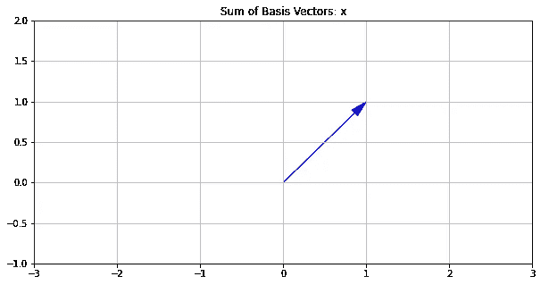

由作者生成的图像

矢量相对简单，它们有方向和大小。在这个例子中，我们从原点画出向量 **x** 。然而，这个相同的向量可以在ℝ**的任何地方等价地绘制。**

现在让我们考虑一个矩阵和矩阵乘法。数学上…


由作者生成的图像

使用标准矩阵乘法…


由作者生成的图像

在 Python 中…

此外，我们可以画出矩阵和向量的乘积…

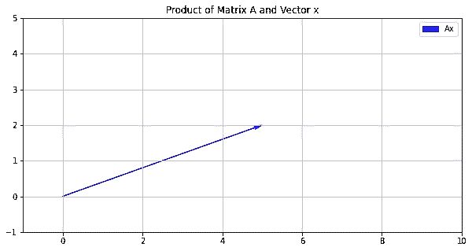

由作者生成的图像

我们可以看到矩阵乘法( **Ax** )改变了我们原始向量 **x** 的方向和大小。

> E *本质上，矩阵*旋转*并且*拉伸*我们的原始向量。*

这可以通过在同一张图上绘制两个向量来更有效地看出…

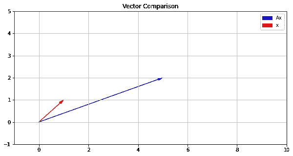

由作者生成的图像

更具体地说，我们可以看到原始向量 **x** 被旋转了一个角度 **θ** ，并被拉伸了一个标量 **α** 。分解成*旋转*和*拉伸*的概念可以推广。

然而，在我们继续之前，代替我们的原始向量， **x** ，现在让我们考虑向量的集合作为矩阵 **V.**


由作者生成的图像

在这种情况下，我们的向量集合包含原始基向量( **i** 和 **j** )，它们相加产生 **x** 。

维度一般可以扩展到**m***x***n**—使用**2***x***2**辅助可视化。

这种旋转和拉伸的概念也可以在 **AV** 中看到…

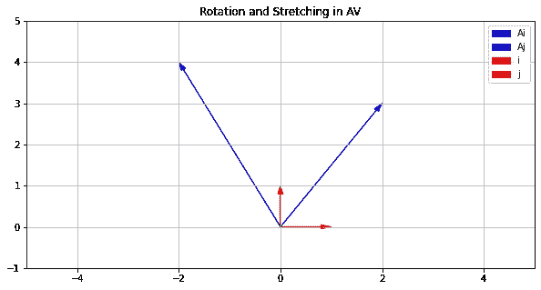

由作者生成的图像

## 旋转矩阵

这是负责*旋转*原矢量的矩阵 **θ** 。


由作者生成的图像

重要的是要注意旋转矩阵是*酉变换*。酉变换的一个特殊性质是它们的逆是(平凡的)复共轭转置。

旋转很容易可视化，尤其是在二维空间中。然而，该矩阵可以被修改以实现更高维度的旋转，同时指定特定的旋转轴。

## 拉伸矩阵

这是负责*拉伸*原向量由 **α** 的矩阵。


由作者生成的图像

向更高维度的扩展是非常明显的——通过简单地对角化相关维度空间中的拉伸参数。

## 简化奇异值分解

这个难题的所有部分现在对我们来说都是可用的。我们知道，乘积 **AV** ，包含一个*旋转*和一个*拉伸*。为了进一步推广这一观点，我们还将考虑…

*   *dim*(**A**)=**m***x***n**
*   *dim*(**U _ hat**)=**m**xn
*   *dim*(**σ_ hat**)=**n***x***n**
*   *dim*(**V ***)=**n***x***n**

数学上…


由作者生成的图像

如果我们将右边两边乘以 **V** 的倒数…

> 在这种情况下，我们将把 V 的倒数称为 V*


由作者生成的图像


由作者生成的图像


由作者生成的图像

这就是*约化奇异值分解*。

## **奇异值分解**

我们可以通过向旋转矩阵添加 **m-n** 列，向拉伸矩阵添加 **m-n** 行来实现这一点。利用这个想法，我们将 **U_hat** 和**σ_ hat**重新定义为 **U** 和**σ**…

*   *dim*(**A**)=**m***x***n**
*   *dim*(**U**)=**m***x****m***
*   *dim*(**σ**)=**m***x***n**
*   *dim*(**V ***)=**n***x***n**


由作者生成的图像

这被正式称为*奇异值分解*。其中**σ**包含*拉伸*元素，*奇异值*，降序排列。这种分解的主要好处是它适用于任何矩形或正方形矩阵。

## 解析奇异值分解

如前所述，特征分解与奇异值分解密切相关。我们可以把上面已经得到的转化为初等线性代数中的经典特征值问题来寻找奇异值分解。


由作者生成的图像


由作者生成的图像

回想一下 **U** 是酉变换…


由作者生成的图像


由作者生成的图像

将两边乘以矢量集合***V**…*

**

*由作者生成的图像*

**

*由作者生成的图像*

**

*由作者生成的图像*

*回想一下特征值问题…*

**

*由作者生成的图像*

*我们可以在这个问题的上下文中匹配以下元素…*

*   ***甲→ A^TA***
*   ****x* → V***
*   ***λ→**σ*

*通过从 AA^T.开始，可以采用相同的程序找到 **U***

## *Python 中的奇异值分解*

*Python 使得使用 numpy 找到矩阵的奇异值分解变得非常容易。*

```
*array([[ 2.,  3.],
       [-2.,  4.]])*
```

*在上面的代码片段中，我们找到了矩阵 **A** 的奇异值分解，也展示了原始矩阵的 SVD 重构。*

*在其分解形式中，我们还可以通过线性变换原始基向量集合 **V** 来可视化奇异值分解的元素。*

*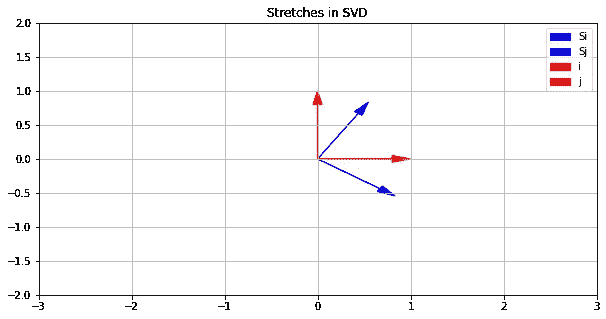*

*由作者生成的图像*

*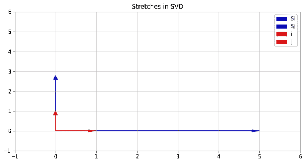*

*由作者生成的图像*

# *图像压缩中的应用*

*也许奇异值分解最直观的例子之一来自图像压缩。首先，我们将读入一幅图像，并找到奇异值分解。接下来，我们将把秩降低到包含奇异值的矩阵的任意三层(**σ**)。最后，我们将重建降秩后的图像。*

## *在图像中阅读*

> **注意:确保你的 cwd 有一个图像，这样你就可以跟随**

*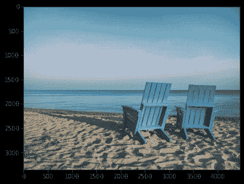*

*照片由 [Aaron Burden](https://unsplash.com/@aaronburden?utm_source=unsplash&utm_medium=referral&utm_content=creditCopyText) 在 [Unsplash](https://unsplash.com/s/photos/beach?utm_source=unsplash&utm_medium=referral&utm_content=creditCopyText) 上拍摄——情节由作者生成*

## ***移除颜色通道***

*在奇异值分解之前，我们要移除与这张图片相关的颜色通道…*

*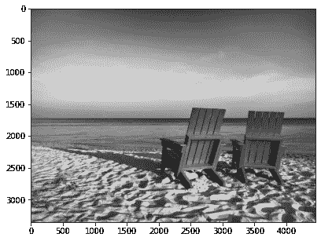*

*[Aaron Burden](https://unsplash.com/@aaronburden?utm_source=unsplash&utm_medium=referral&utm_content=creditCopyText) 在 [Unsplash](https://unsplash.com/s/photos/beach?utm_source=unsplash&utm_medium=referral&utm_content=creditCopyText) 上的照片——作者生成的情节*

## *奇异值分解*

*现在我们可以计算代表这个图像的矩阵的奇异值分解。我们将像以前一样使用 numpy，并使用 matplotlib 可视化这个分解的组件…*

*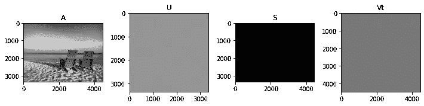*

*[Aaron Burden](https://unsplash.com/@aaronburden?utm_source=unsplash&utm_medium=referral&utm_content=creditCopyText) 在 [Unsplash](https://unsplash.com/s/photos/beach?utm_source=unsplash&utm_medium=referral&utm_content=creditCopyText) 上的照片——作者生成的情节*

*为了更好地理解奇异值，我们可以按降序绘制前 50 个值…*

*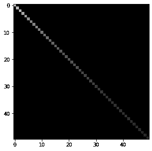*

*由作者生成的图像*

## *降级**σ***

*现在让我们计算对角矩阵 S 的秩(**σ)**…*

```
*480*
```

*我们可以选择保留哪些奇异值，并将其余的设置为零以降低秩——因此，我们可以通过取分解和绘图的乘积来查看对原始图像的影响…*

***10 个奇异值***

*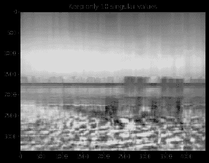*

*[Aaron Burden](https://unsplash.com/@aaronburden?utm_source=unsplash&utm_medium=referral&utm_content=creditCopyText) 在 [Unsplash](https://unsplash.com/s/photos/beach?utm_source=unsplash&utm_medium=referral&utm_content=creditCopyText) 上的照片——作者生成的情节*

***25 个奇异值***

*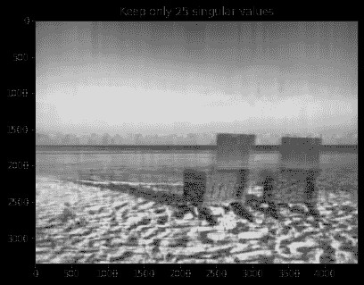*

*图片由 [Aaron Burden](https://unsplash.com/@aaronburden?utm_source=unsplash&utm_medium=referral&utm_content=creditCopyText) 在 [Unsplash](https://unsplash.com/s/photos/beach?utm_source=unsplash&utm_medium=referral&utm_content=creditCopyText) 上拍摄——由作者生成的情节*

***50 个奇异值***

*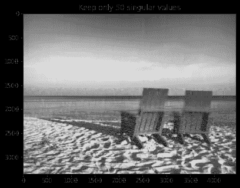*

*[Aaron Burden](https://unsplash.com/@aaronburden?utm_source=unsplash&utm_medium=referral&utm_content=creditCopyText) 在 [Unsplash](https://unsplash.com/s/photos/beach?utm_source=unsplash&utm_medium=referral&utm_content=creditCopyText) 上的照片——作者生成的情节*

# *结论*

*本文介绍了奇异值分解及其应用。首先，我们对矩阵乘法有了一个基本的了解，并将运算分解为一个旋转和一个原始向量(或向量集合)的拉伸。然后我们通过解析地和计算地寻找奇异值分解来推广旋转和拉伸的概念；同时示出了分解对基向量集合的影响。最后，我们通过降低含有奇异值的矩阵的秩(**σ**)给出了奇异值分解在图像压缩中的应用。*