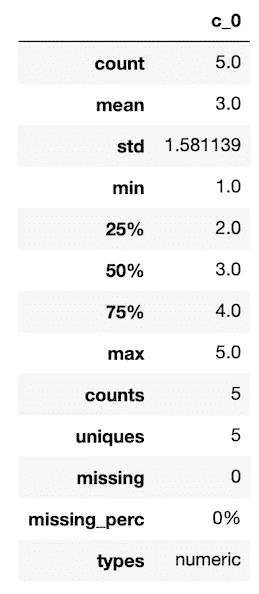
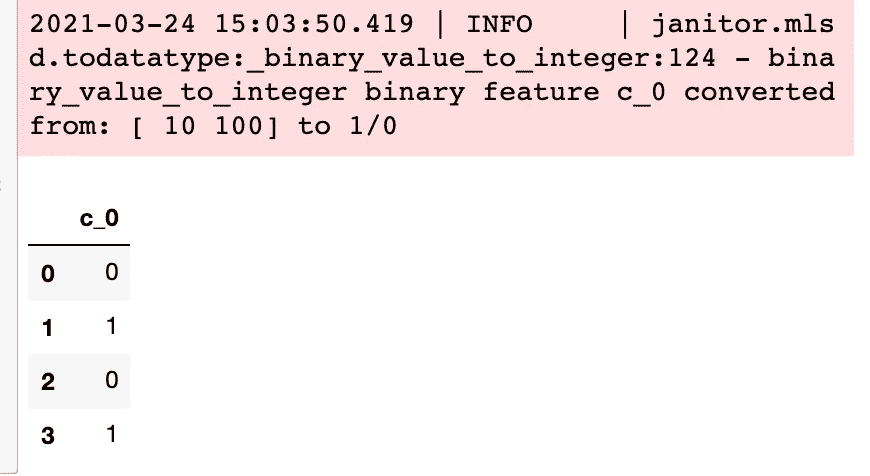
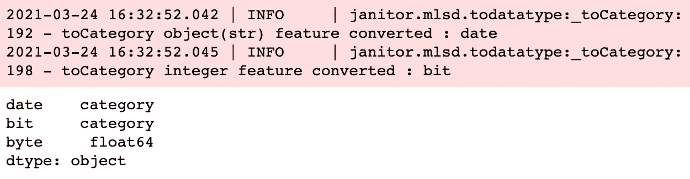
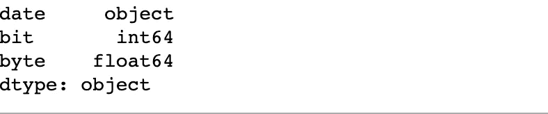
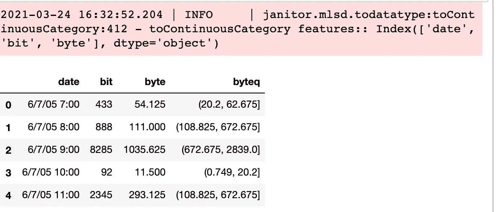
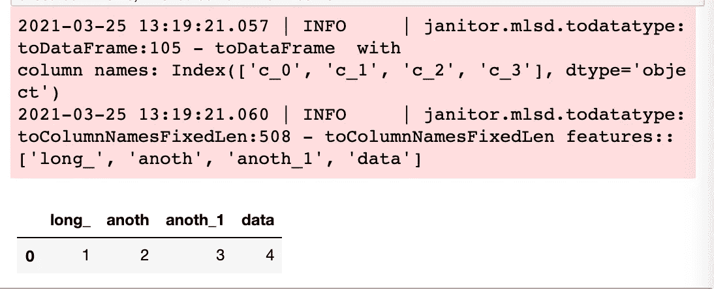
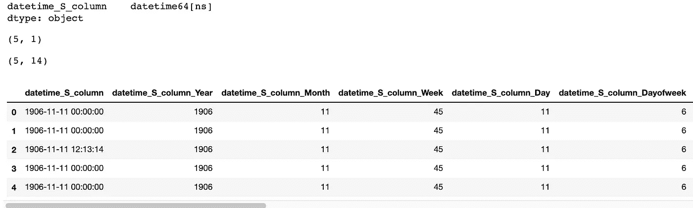
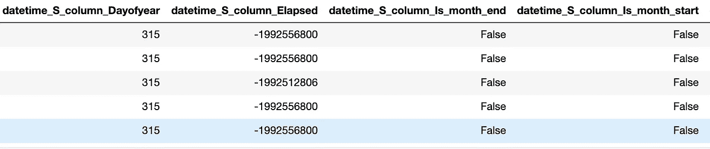
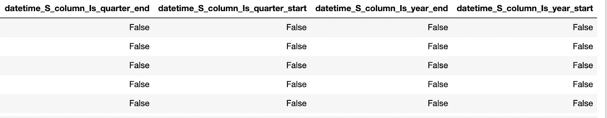

# 用于机器学习数据预处理的六种数据类型转换函数

> 原文：<https://towardsdatascience.com/six-datatype-transformer-functions-for-data-pre-processing-for-machine-learning-eb9abcce68cd?source=collection_archive---------26----------------------->

## 包括所有 Python 代码，提供 pandas 链接，并扩展 py teacher 包。


来源:[弗兰基·查马基](https://unsplash.com/@franki)在 Unsplash 上

# 数据预处理简介:数据类型转换

在您作为数据工程师或数据科学家的工作中，您将花费大量时间对数据进行预处理，以完成对您的传销的实际训练，然后从您的传销进行准确预测。

</what-70-of-data-science-learners-do-wrong-ac35326219e4>  

在将数据输入到机器学习模型(MLm)之前，数据类型转换和其他变形可能会带来一些好处。

将数据更改为更好地供传销使用的过程称为数据预处理。

我主要关注机器学习的数据类型转换，以及如何使用函数链创建 pandas 函数语句，并将这些函数放置在 py teacher 包中。

我发现编写和读取函数链比编写 sklearn 管道要容易得多。

我认为链管道(函数式编程)比 sklearn 管道更容易复习和理解。

# 数据预处理的需要

> 如果你喂你的机器学习模型苹果，在通过喂它橘子来重新训练机器学习模型之前，预处理输入数据。—匿名

在第一个项目中，我们在数据预处理代码开发上花费了相当多的时间。以至于在第二个项目开始时，项目管理已经将数据清理分为三类:相同的、小于 33%的不同代码变更和大于 33%的不同代码变更。

***注意*** *:这些是在实际编码之前对工作需求评估的指导方针。*

第二个项目有一个数据预处理功能包，几乎不需要修改。其中一些我已经包含在开源包 py toolter 中，这些*“用于机器学习的预处理实用函数*”是这篇博客文章的主题和文档。

这些类别定义了两个重要的成就:

*   作为一个团队，随着数据预处理需求的确定，我们能够消除大量的“*重新编码”*
*   我们的开发时间估计变得更加精确。

我发现 15 个数据预处理函数中不到 1 个属于第三类，更耗费开发人员的时间，超过 33%的不同代码更改。我的概念到生产的时间是我们前两个项目的三分之一。我现在花了大部分时间来寻找一种足够好的机器学习解决方案。

# 熊猫是什么？

如果你正在学习或者更好地使用 Python，那么就采用 [Pandas](https://pandas.pydata.org/) 进行强大的数据操作。

# 什么是 py 看门人？

[py gate er](https://pyjanitor.readthedocs.io/)是一个数据预处理函数的 Python 包。它开始是 R 的看门人包的一个端口。py teacher 通过将 py teacher 的数据预处理功能作为函数运算符添加到 pandas 来支持 pandas 包。

# 函数式编程——用链接创建可读管道

链接可以使它非常容易理解，因为操作是从左到右执行的。这和你阅读(英语和许多其他语言)的方式是一样的。

有些人更喜欢链而不是用 **sklearn 的管道**。你会注意到我们的链接在语法上与 **sklearn 的管道**链接略有不同。

***注意*** *:您必须按照相同的顺序对所有数据应用数据预处理动作。所有数据意味着你的训练、测试、验证和预测数据。*

我选择将这些函数添加到 py teacher 中，因为它支持链接，并且作为 R 中的一个端口，它非常接近 R 函数式编程风格的外观。从现在开始，我使用这两种调用方法。

```
toDataFrame(arr, columns=['a','b']).toCategory(verbose=False).dtypes
```

在这种情况下，我*链接了`toDataFrame`输出的 DataFame 实例的两个方法`.toCategory().dtypes`*。

在这篇博客文章中，我会做更多的解释并展示更多的例子。

# 数据类型转换器

## 1.to_DataFrame

因为 py gate er 函数和方法只消耗 pandas 数据帧，所以我们需要转换各种 python 数据类型。这个功能就是`janitor.mlsd.todatatype.toDataFrame()`。

```
janitor.mlsd.util.toDataFrame(X: any, 
    columns: List = [], 
    verbose: bool = True) 
    -> pd.DataFrame:Parameters:
    X: 
        Attempt to convert python datatype argument into 
        pandas dataframe. labels: [] (default)    
        The column names to  be used for new DataFrame. 
        If a number of column names given is less than a number 
        of column names needed, then they will be generared 
        as c_0...c_(n-1), where n is the number of missing
        column names.*verbose:
        True: output
        False: silent (default)

Raises:
    1\. ValueError will result of unknown argument type.
    2\. ValueError will result if labels is not a string or list of strings.

Returns:  pd.DataFrame*from pandas_summary import DataFrameSummary as DFS
from janitor.mlsd.todatatype import toDataFramedisplay(DFS(toDataFrame([1,2,3,4,5],verbose=False)).summary())
```

*输出= >*



使用显示的数据帧摘要(DFS(toda frame([1，2，3，4，5]))。摘要()

请注意，在将列表转换为 DataFrame 时，创建了列名`c_0`。

尝试将`verbose=True`作为默认设置。：

```
display(DFS(toDataFrame([1,2,3,4,5])).summary())
```

输出有什么不同？

***注*** *:这篇博客文章中讨论的 py guardian 的所有添加都在* `*janitor.mlsd*` *子包中。* `*mlsd*` *是* [*机器学习结构化 dat*](https://www.geeksforgeeks.org/difference-between-structured-semi-structured-and-unstructured-data/)*的缩写*

****注*** *:函数* `*toDataFrame*` *是 py teacher 规则“第一个参数是数据帧”的例外，因为它将一维或二维列表、元组、csr_matrix、numpy 数组的一维 pandas 系列转换为 pandas 数据帧。**

*一个好的做法是在管道的开始制作类型为`DataFrame`的数据集。函数所做的更改会保持 DataFrame 实例的状态(`inplace=True`)。在您的实验运行的整个管道中，就地将会发生，以最大化完成速度和最小化内存使用。*

*你也有`janitor.mlsd.util.isDataFrame(X) -> bool`来检查对象是否是一个`pandas.DataFrame`。*

*如果不需要 py gate 的服务，比如日志记录，可以使用方法`pandas.DataFrame`。我会建议你*不要这样做*，但是你有选择。*

*如果您需要引用原始数据帧，那么您可以执行类似以下操作:*

```
*<dataFrame_name>_original = <dataFrame_name>.copy()*
```

*但是，保留原始副本会消耗一些计算机内存。*

*我有 68GB(千兆字节)的快速内存，如果大小大于 1 GB，我不会保留原始数据帧。*

*我预计内存和硬件速度将会提高，但数据集的大小将会增长得更快。*

*几乎总是从本地文件或通过 URL 寻址的非本地文件输入原件，因此，您可能不需要在计算机内存中保留副本。*

*由您决定是否保留原始数据集的副本。我只在 EDA(探索性数据分析)期间保留一份。生产中不需要。*

*您可以通过以下方式查看任何对象的大小(以字节为单位):*

```
*from sys import getsizeof
getsizeof(pd.DataFrame())=> 24*
```

*上面显示了一个大小为 24 字节的空数据帧。*

## *2.二进制值到整数*

*除了树之外，MLM 和其他函数一样，需要将`True/False`或`value_1/value_0,`的布尔值(只有两个值的特性)或任何二进制值特性转换为整数`1/0`才能正常工作。*

```
*binary_value_to_integer(
    oX: pd.DataFrame, inplace: bool = True, verbose: bool = True
) -> pd.DataFrame: *Parameters:
           oX: dataset

        Keywords:
            inplace:
                True: mutate X, return X
                False: do no change X, return df-stats

            verbose:
                True: output (default)
                False: silent

        Returns:
            pd.DataFrame**
```

****注意*** *:为了安全起见，任何传销都要换算成整数* `*1/0*` *。**

*函数`boolean_to_integer`转换所有二进制值特征。因为它不影响非二进制值特性，所以可以在任何数据帧上调用它。*

```
*from janitor.mlsd.todatatype import binary_value_to_integertoDataFrame([10,100,10,100],verbose=False).binary_value_to_integer()*
```

**

*toDataFrame 的输出([10，100，10，100]，verbose=False)。二进制值到整数()*

*尝试非二进制值功能。发生了什么事？*

## *3:分类*

*`janitor.msld.todatatype.toCaterory`将熊猫数据帧的任何布尔、对象或整数特征类型转换为类别特征类型。*

*例外情况是连续(浮点或日期时间)值，它返回未转换的值。*

```
*def toCategory(
    oX: pd.DataFrame,
    boolean: bool = True,
    integer: bool = True,
    object_: str = True,
    inplace: bool = True,
    verbose: bool = True
) -> pd.DataFrame:
 *Parameters:
            oX: pd.DataFrame

        Keywords:

            boolean: bool Default: True
                If ``True`` will convert to ``category`` type.

            integer: Default: True
                If ``True`` will convert to ``category`` type.

            object_: Default: True
                If ``True`` will convert to ``category`` type.

            verbose: Default: True
                True: output
                False: silent

            inplace: 
                True: (default) replace 1st argument with new dataframe
                False:  (boolean)change unplace the dataframe X

        Returns: pd.DataFrame**
```

*如果要将连续或日期时间类型转换为类别，请在 py toolter to category 之前使用 ContinuoustoCategory 或 DatetimetoComponents。*

****注意****:py gate 数据清理步骤(如删除 Null 和 NA 值)需要在此步骤之前完成。py teacher 具有完成改变空值和 NA 值的功能。关于 py gate 清洁工的未来博客文章的主题。**

```
*from janitor.mlsd.todatatype import toCategoryinternet_traffic.toCategory().dtypes*
```

**

*internet_traffic.toCategory()的输出。数据类型*

*`byte`特性没有改变，这正是我们想要的，因为它是 float 类型的。*

*`date`特征被改变了，这正是我们想要的，因为它是 object 类型的。*

```
*internet_traffic.dtypes*
```

**

*internet_traffic.dtypes 的输出*

*将`date`功能更改为日期时间类型。*

```
*internet_traffic_s = pd.to_datetime(internet_traffic['date'])
toCategory(internet_traffic_s).dtypes*
```

**

*toCategory 的输出(internet_traffic_s)。数据类型*

*`date`特性没有改变，这正是我们想要的，因为它的类型是 datetime。*

## *4.toContinuousCategory*

*`janitor.msld.todatatype.toContinuousCategory`通过将熊猫数据帧的任何连续浮点或整数值分组到类别箱中，将它们转换为类别值。*

```
*toContinuousCategory(
    oX: pd.DataFrame,
    features: list = [],
    integer: bool = True,
    float_: bool = True,
    quantile: bool = True,
    nbin: int = 10,
    inplace: bool = True,
    verbose: bool = True,
) -> pd.DataFrame:*"""
Transforms any float, continuous integer values of
 a pandas dataframe to category values.

Parameters:
    X: pd.DataFrame

Keywords:

    features:  [] (default)
        The column  names to  be transform from continuous to category.

    int_: True (default)
        set integer=False if not continuous and not to transform into category.

    float_: True (default)
        set floaty=False if not continuous and not to transform into category.

    quantile: True use quantile bin. (default)
        quantile is simular to v/(maxy-miny), works on any scale.
        False, use fixed-width bin. miny,maxy arguments are ignored.

    nbin: 10 (default)
        Alternately ``nbins`` can be integer for number of bins.
        Or it can be
        array of quantiles, e.g. [0, .25, .5, .75, 1.]
        or array of fixed-width bin boundaries i.e. [0., 4., 10, 100].

    verbose: 
       True: output (default)
       False: silent

    inplace: True (default)
        True: replace 1st argument with resulting dataframe
        False:  (boolean)change unplace the dataframe X

Returns: pd.DataFrame

Raises:
    TypeError('" requires boolean type.")**
```

*宁滨，也称为量化，用于将连续的数字特征(`np.number`类型)转换为`category`类型。*

*每个容器代表一系列连续的数值。*

*宁滨数据的具体策略有固定宽度(`quantile=False`)和自适应宁滨(`quantile = True`)。*

*无论输入数据集的类型如何，它都作为`DataFrame`返回。如果要设置功能名称，在此功能之前调用`toDataFrame`。*

*固定宽度宁滨仅适用于*无缩放*的基于树的模型数据集，如random forest、xgboost、lightgbm、catboost 等。非基于树模型，例如线性、对数、SVM、神经网络等。，不会准确地工作，因为它们依赖于值的大小。*

## ***线性宁滨的统计问题。***

*宁滨增加 I 型和 II 型误差；(简单的证明是，随着箱数趋近于无穷大，那么信息损失趋近于零)。此外，改变容器数量将改变容器分布形状，除非分布均匀*平坦*。*

## *分位数宁滨用于单一数据集。*

*如果你有一个训练和测试数据集，将一个连续特征转换成一个基于百分位数(*分位数*的类别特征是*错误的*。*

*分位数基于数据集，训练和测试是不同的，除非它们各自的分布形状相同。*

*如果训练和测试数据集通过了 [t 检验](https://www.investopedia.com/terms/t/t-test.asp#:~:text=Key%20Takeaways-,A%20t%2Dtest%20is%20a%20type%20of%20inferential%20statistic%20used,of%20hypothesis%20testing%20in%20statistics.)，则分布在统计上没有差异。然而，使用分位数宁滨仍然会导致脆弱的转换。*

## *特征之间的非线性甚至非单调关系*

*如果你需要线性宁滨，而不是分位数，使用`quantile=False`。*

## *分位数-宁滨。*

*尽管有上述警告，您的用例可能需要分位数宁滨。
在这种情况下，将分位数宁滨应用于合并的训练和测试数据集，然后再将它们分开。*

*基于分位数的宁滨是用于自适应宁滨的一个相当好的策略。分位数是将要素的连续值分布划分为离散的连续箱或区间的特定值或分界点。因此，q-分位数将数值属性划分为 q 个相等(百分比-宽度)的分区。*

*这些箱变成分类特征。你可能想这样做的年龄，体重，温度，工资，价格等特征。*

*分位数的众所周知的例子包括 2-分位数，中位数，它将数据分布分为两个相等(百分比宽度)的二进制数，4-分位数，标准四分位数，四个相等的二进制数(百分比宽度)，以及 10-分位数，十分位数，十个相等宽度(百分比宽度)的二进制数。*

*您应该注意到，新要素是由分位数宁滨附加 q 产生的，而新要素是由固定宽度宁滨附加 w 产生的*

*将连续浮动要素转换为固定宽度的分类箱，保留原始列并添加箱列。*

```
*from janitor.mlsd.todatatype import toContinuousCategoryinternet_traffic.toContinuousCategory(integer=False).head()*
```

**

*tinternet _ traffic . tocontinuouscategory 的输出(integer=False)。头部()*

## *5.toColumnNamesFixedLen*

*`janitor.msld.todatatype.toColumnNamesFixedLen`将所有列截断到给定的长度，并附加给定的分隔符和重复列的索引，第一个不同的列名除外。*

*如果列长度较短，则列长度保持不变。*

```
*toColumnNamesFixedLen(
    oX: pd.DataFrame,
    column_length: int = 3,
    column_separator: str = "_",
    inplace: bool = True,
    verbose: bool = True,
) -> pd.DataFrame:
    *"""
    Truncate column name to a specific length.  If column length is
    shorter, then column length left as is.

    This method mutates the original DataFrame.

    Method chaining will truncate all columns to a given length and append
    a given separator character with the index of duplicate columns, except
    for the first distinct column name.

    Parameters:
        X: dataset

    Keywords:

        column_length: 3 (default)
            Character length for which to truncate all columns.
            The column separator value and number for duplicate 
            column name does not contribute to total string length.
            If all columns string lenths are truncated to 10
            characters, the first distinct column will be 10 
            characters and the remaining columns are
            12 characters with a column separator of one
            character).

        column_separator: "_" (default)
            The separator to append plus incremental Int to create
            unique column names. Care should be taken in choosing
            non-default str so as to create legal pandas column
            names.

        verbose: True (default)
            True: output
            False: silent

        inplace: True  (default)
            True: replace 1st argument with resulting dataframe
            False:  (boolean)change unplace the dataframe X

    Returns: A pandas DataFrame (pd.DataFrame) with truncated column lengths.*from janitor.mlsd.todatatype import toColumnNamesFixedLendf = toDataFrame([[1],[2],[3],[4]])
df.columns = [
 "long_name",
 "another_long_name",
 "another_longer_name",
 "data"]
df.toColumnNamesFixedLen(column_length=5)*
```

**

*输出*

## *6.today time 组件*

*为什么要将日期时间分成整数部分？*

*出于多种原因，所有这些都会产生更好的预测能力，您可以将一个`datetime`分解成`int`个组件。您可以更进一步，将`datetime` `int`组件转换成分类类型的组件。*

*你可能知道这是怎么回事了。如果我有一些非分类特征，比如一列`datetimes`值，我需要一个函数将日期时间转换成分类特征。*

*`janitor.msld.todatatype.toDatetimeComponents`将日期时间功能转换为时间组件分类功能。*

```
*def toDatetimeComponents(
        oX: pd.DataFrame,
        drop: bool = True,
        components: list = [],
        prefix: bool = True,
        inplace: bool = True,
        verbose: bool = True,
) -> pd.DataFrame:
    #    import pdb; pdb.set_trace() # debugging starts here
    *"""
    Parameters:
        X: dataset

    Keywords:
        drop: True (default)
            If True then the datetime feature/column 
            is removed.

        components: [] (default) which results in all components
            list of column(feature) names of
            datetime components created.

            One or more of : 
            [Year', 'Month', 'Week', 'Day','Dayofweek'
            , 'Dayofyear','Elapsed','Is_month_end'
            , 'Is_month_start', 'Is_quarter_end'
            , 'Is_quarter_start', 'Is_year_end', 'Is_year_start']

        prefix: True (default)
            If True then the feature is the prefix of the created 
            datetime component fetures. The posfix is
            _<component> to create the new
            feature column <feature>_<component>.

            if False only first _PREFIX_LENGTH_ characters 
            of feature string is used to
            create the new feature name/column
            featurename[0:2]>_<component>.

        verbose: 
            True: output (default)
            False: silent

        inplace: True (default)
            True: replace 1st argument with resulting dataframe
            False:  (boolean)change unplace the dataframe X

    Returns: pd.DataFrame  transformed into datetime 
             feature components**
```

*您可以看到`datetimeComponents`提供了哪些日期时间组件。我们的版本基于 **fast.ai** 包中的一个函数。*

```
*from janitor.mlsd.todatatype import toDatetimeComponentsdisplay(date_df.dtypes)
display(date_df.shape)
display(date_df.toDatetimeComponents(verbose=False,inplace=True).shape)
date_df.head()*
```

*当创建了十三个日期时间组件列时，输出为十四列宽。输出分为三个图像，因为 DataFame 有十四列。*

**

*头部输出(1)*

**

*中间输出(2)*

**

*尾部输出(3)*

*`datetimeComponents`将每个日期时间值转换成另外十三个`int`成分。然后它将这些`int`类型转换成`category`类型。*

*如果 X[[dt_features]]不是日期时间类型(如`object`类型)，那么*不会试图将 X[[dt_features]]强制转换为`datetime`类型。**

*最好将原始数据字段作为`datetime`而不是`object`读取/输入。您可以使用以下方法将 dataframe 列转换为 Datetime:*

```
*X[feature] = pd.datetime(X[feature])*
```

*我们可以进行自动转换，但我们发现一些较大的数据集(> 1 亿行)转换太慢。使用数据帧列作为`datetime`而不是`object`来启动管道要快得多。*

# *摘要*

*对于生产中的 MLa，输入数据集中出现的新要素非常常见。输入数据中出现的新特征通常被称为*数据*漂移*T21。这是未来博客文章的主题。**

*`todatypes`函数调用签名总结如下:*

```
*#1
janitor.mlsd.util.toDataFrame(X: any, 
    columns: List = [], 
    verbose: bool = True) 
    -> pd.DataFrame:#2
binary_value_to_integer(
    oX: pd.DataFrame, inplace: bool = True, verbose: bool = True
) -> pd.DataFrame:#3
def toCategory(
    oX: pd.DataFrame,
    boolean: bool = True,
    integer: bool = True,
    object_: str = True,
    inplace: bool = True,
    verbose: bool = True
) -> pd.DataFrame:#4
def toContinuousCategory(
    oX: pd.DataFrame,
    features: list = [],
    integer: bool = True,
    float_: bool = True,
    quantile: bool = True,
    nbin: int = 10,
    inplace: bool = True,
    verbose: bool = True,
) -> pd.DataFrame:#5
toColumnNamesFixedLen(
    oX: pd.DataFrame,
    column_length: int = 3,
    column_separator: str = "_",
    inplace: bool = True,
    verbose: bool = True,
) -> pd.DataFrame:#6 
toDatetimeComponents(
        oX: pd.DataFrame,
        drop: bool = True,
        components: list = [],
        prefix: bool = True,
        inplace: bool = True,
        verbose: bool = True,
) -> pd.DataFrame:* 
```

*这篇博客文章的代码在这里[给出](https://github.com/bcottman/pyjanitor/tree/branch-3fca8630-9aa0-40b4-910d-3a2b8feb8b89/janitor/mlsd)在这里[给出](https://github.com/bcottman/pyjanitor/blob/branch-3fca8630-9aa0-40b4-910d-3a2b8feb8b89/janitor/tests/mlsd/todatatype.ipynb)。*

*请告诉我们你是否知道其他信息，我们可以补充。田野在滚雪球。*