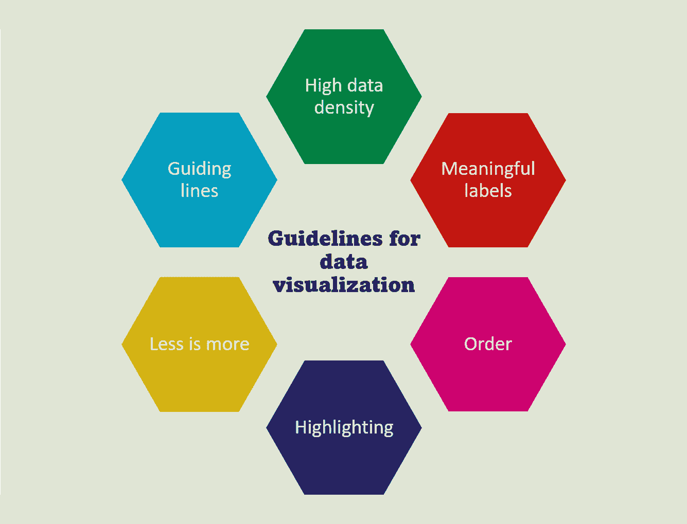
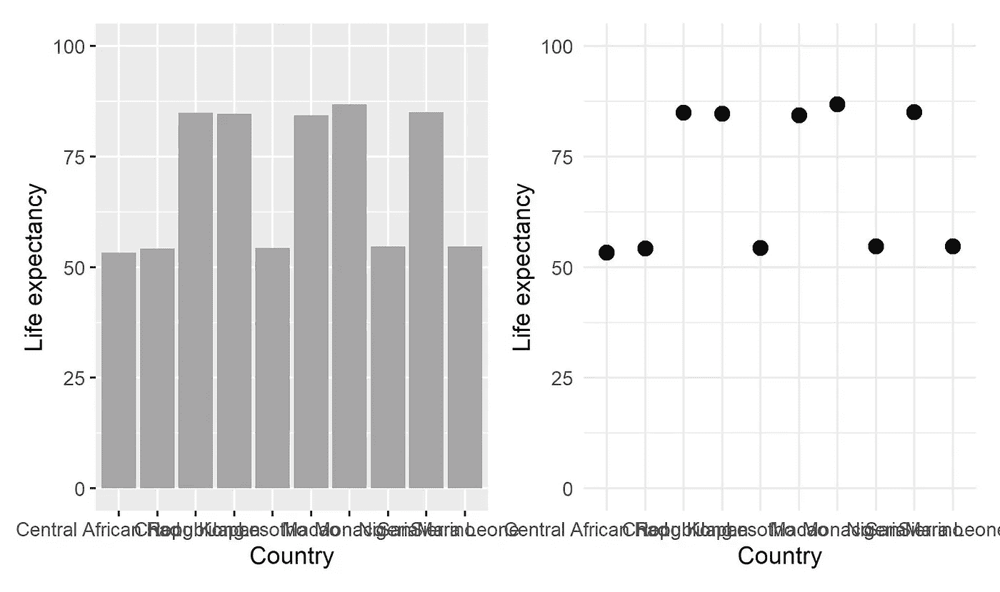
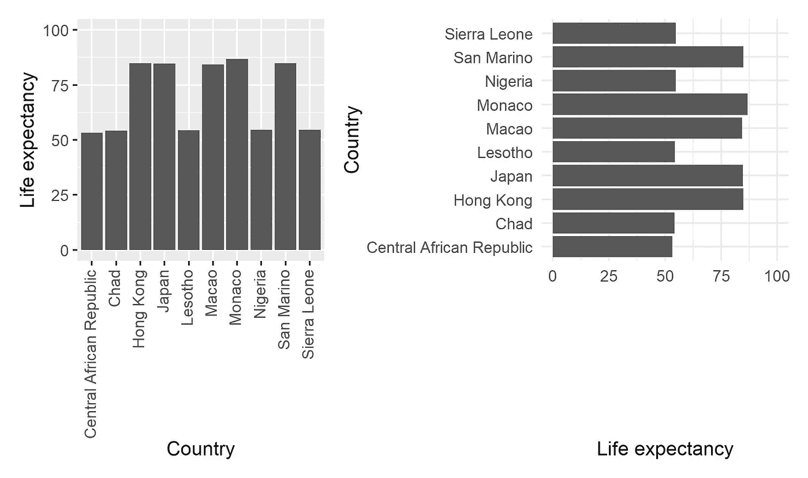
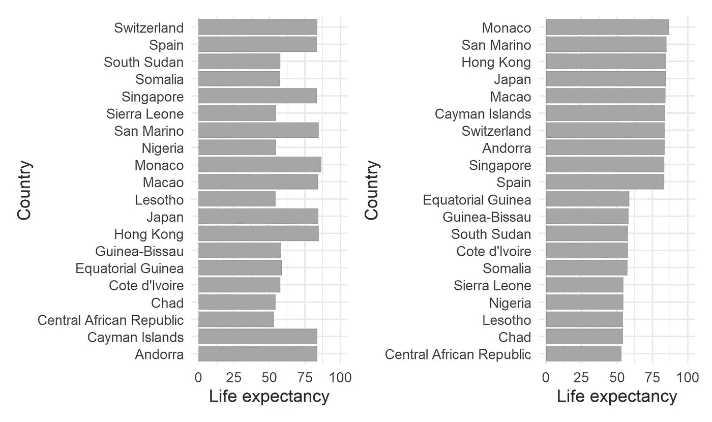
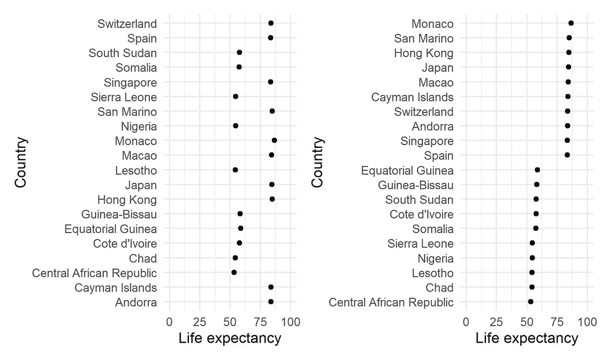
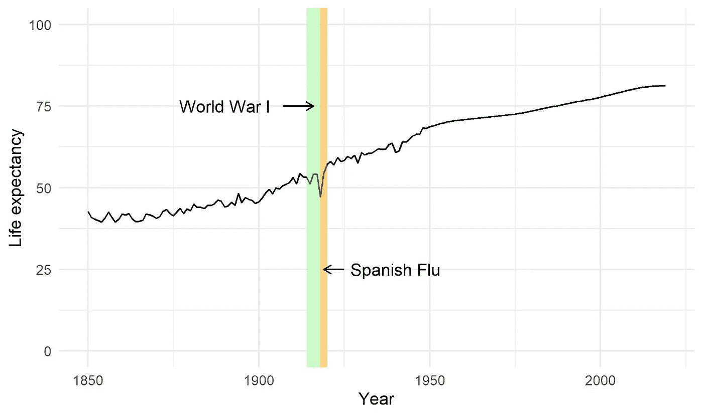
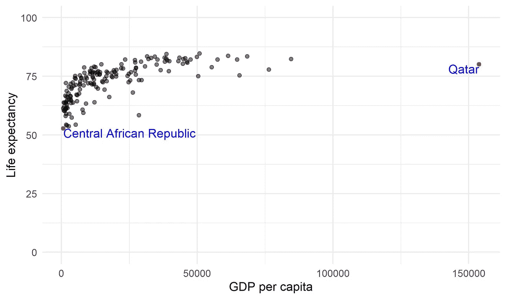
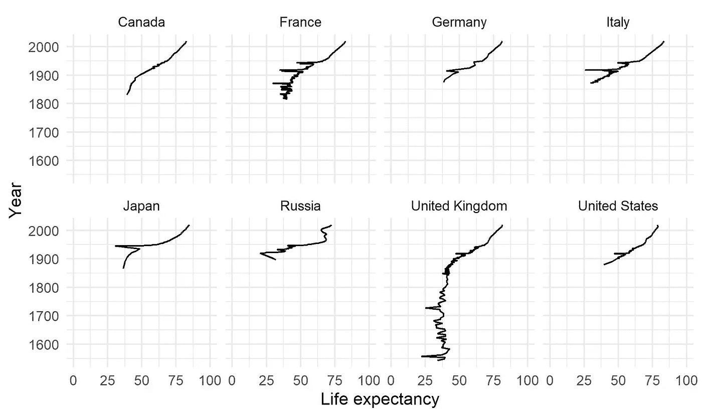
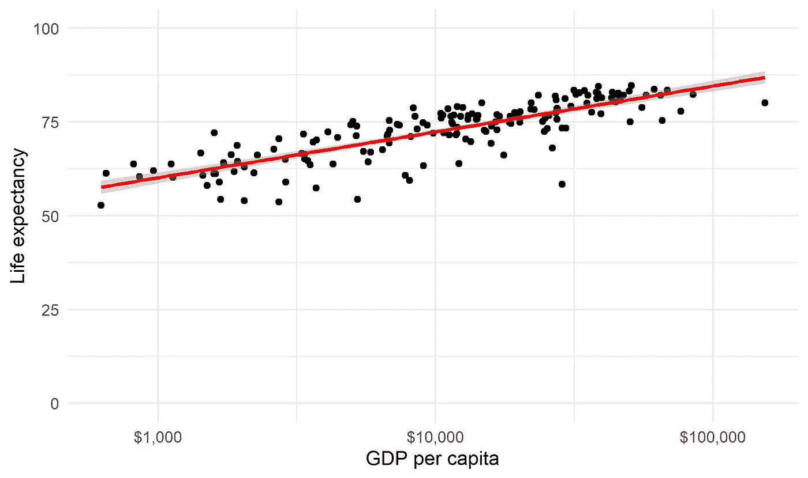

# 良好可视化的六个准则

> 原文：<https://towardsdatascience.com/six-guidelines-for-good-visualizations-7c1831cda29f?source=collection_archive---------27----------------------->

## DataViz 传奇作品的要点。

由作者设计

在我讨论六个指导原则之前，我发现这六个原则对于创建良好的可视化效果非常有效。有些是从经验/观察中学到的，有些是通过数据可视化先驱的教导学到的。

> "好的设计很像清晰的视觉思维."
> ——**爱德华·塔夫特**

这不是一个详尽的列表，而是数据可视化领域的一个很好的起点。将要讨论的六个准则是:

1.  高数据密度
2.  有意义的标签
3.  命令
4.  突出
5.  小倍数/少即是多
6.  参考/指导线

让我们开始吧。

# 高数据密度

创建视觉效果时，始终努力实现高数据密度。那么，**高数据密度**意味着什么呢？高数据密度可以解释为****数据对油墨*** 的比率。向可视化添加更多的墨水不一定会增加价值，但有时会分散注意力。下图显示了相同的数据，但格式不同。左图是条形图，右图是散点图。通过控制墨水的用量，同样的信息得以传达，但干扰更少。*

> *“卓越的图形能够在最短的时间内，用最少的笔墨，在最小的空间里，向观众传达最多的思想。”— **爱德华·塔夫特***

**

*(图片由作者提供)*

*另一种减少图表中墨水量的方法是在图表中使用白色背景。*

# *有意义的标签*

*标签和数据有助于创建出色的可视化效果。没有数据标签或轴标签的图表是没有意义的，因为它无法传达正确的信息。如前所述，x 轴上的国家名称重叠，因此不可读。这可以通过垂直旋转文本来解决，如下图所示。文本在 x 轴上垂直对齐的问题会分散观众的注意力，并从主要故事中转移焦点，因为人类的思维更喜欢阅读水平方向的文本。最好的选择是翻转 x 轴和 y 轴，就像右侧的图表一样。这将水平定位标签，并且它们也不会彼此重叠。*

*还应该记住，在标记记号时不要使用速记符号，特别是对于分类数据，还要确保文本标签的方向便于阅读。*

**

*(图片由作者提供)*

# *命令*

*为了从数据中获得更好的洞察力，最好在显示时对数据进行排序。在处理分类数据时，默认情况下，ggplot 按字母顺序排列数据。这可以让你的图形看起来更混乱。这里的焦点应该是正确显示的数据，而不是分类变量的顺序。按升序或降序排列数据将传达正确的信息，而不会导致对数据的误解。下图清楚地展示了排列数据有助于回答查看数据时可能出现的问题，例如:*

*哪个国家的人均寿命最高？*

*或者*

*哪个国家的人均寿命最低？*

**

*(图片由作者提供)*

*同样，数据也可以绘制成散点图，回答上述问题，更美观。*

**

*(图片由作者提供)*

# *突出*

*在某些情况下，突出显示数据可以增加更多的价值，而不是让它保持原样。以英国的预期寿命数据为例，如下图所示。尽管数据显示出上升趋势，这意味着这些年来整体预期寿命在提高，但在这一过程中也可以看到一些亮点。为了回答这些问题，我们可以突出显示它们并给它们贴上标签，如下所示。在下面的图表中，1915 年前后的短暂现象被标记出来，说明了英国人预期寿命突然下降的原因。*

**

*(图片由作者提供)*

*添加某些数据标签可以帮助我们理解异常值或极值。向这些类型的数据点添加标签有助于发送正确的信息，即为什么这些数据点没有被排除而是被标记。下图显示了公民的预期寿命或生活质量与国家人均国内生产总值之间的关系。最右边的标记点是人均 GPD 最高的国家，左边的标记点是预期寿命最低的国家。*

**

*(图片由作者提供)*

# *小倍数/少即是多*

*当处理大量数据时，尤其是时间序列，动画时间序列是一个伟大的选择，以传达大量的信息。这只有在数据以数字格式呈现时才有可能。在打印格式中，这是不可能的，因此创建原始数据的子集更有意义。通过沿公共轴排列图表，很容易进行比较，而不是创建不同的图表。通过比较这些图表，西班牙流感的影响在 20 世纪 20 年代的欧洲国家清晰可见。*

**

*(图片由作者提供)*

*创建小的多个图表而不是动画有其利弊。对于人类的思维来说，分析同时存在的信息要比分析运动中的信息容易得多。*

# *参考/指导线*

*在处理连续数据集时，直观的指导总是很有用的。一般情况下，数据拟合是在处理连续数据时进行的。数据拟合可以是线性、样条或高阶多项式。这些数据拟合传达了两件事:趋势和变量之间的关系。*

*下图传达了以下信息:趋势是积极的(线的斜率是积极的)，两个变量之间的关系是线性的。*

**

*(图片由作者提供)*

*完整代码:*

# *关键要点*

*这里讨论了增强数据可视化的六个准则，它们很容易实现。关键要点是:*

1.  *尝试在图表画布中用更多的空白空间绘制数据。*
2.  *标注必要的文本并突出显示图表的必要区域。*
3.  *处理分类数据时，按升序/降序排列数据。*
4.  *将复杂的数据分成多个图。*
5.  *尽可能添加趋势线，以帮助更好地理解数据。*

## *数据来源:*

1.  *[https://ourworldindata.org/life-expectancy](https://ourworldindata.org/life-expectancy)*
2.  *[https://ourworldindata . org/grapher/预期寿命与人均国内生产总值](https://ourworldindata.org/grapher/life-expectancy-vs-gdp-per-capita)*

## *参考资料:*

1.  *定量信息的可视化展示——爱德华·塔夫特*
2.  *如何糟糕地显示数据—霍华德·韦纳*
3.  *ggplot2:用于数据分析的优雅图形— Hadley Wickham*
4.  *用数据讲故事——科尔·努斯鲍默·克纳弗里克*

*对我在数据可视化方面的更多工作感兴趣，请查看这些博客帖子:*

*</data-visualization-using-ggplot2-5-features-worth-knowing-c0447a760335>  </master-data-visualization-with-ggplot2-scatter-and-box-plots-2f0c14cf2b26>  </master-data-visualization-with-ggplot2-histograms-bar-and-density-plots-86c8290c9adc>  </master-data-visualization-with-ggplot2-pie-charts-spider-plots-and-bar-plots-899a07a15827>  </master-data-visualization-with-ggplot2-theme-customization-8421695d24e2>  </hands-on-tutorial-f2ee5dc4d0a8>  <https://medium.com/geekculture/how-to-map-data-with-r-8333110dff5b>  

链接到 [Github 库](https://github.com/amalasi2418/Blog-post/tree/master/Blog%2016-%20Dataviz%20guidelines)。

*可以在* [*LinkedIn*](https://www.linkedin.com/in/abhinav-malasi/) *和*[*Twitter*](https://twitter.com/malasi_abhinav)*上与我连线，跟随我的数据科学和数据可视化之旅。**