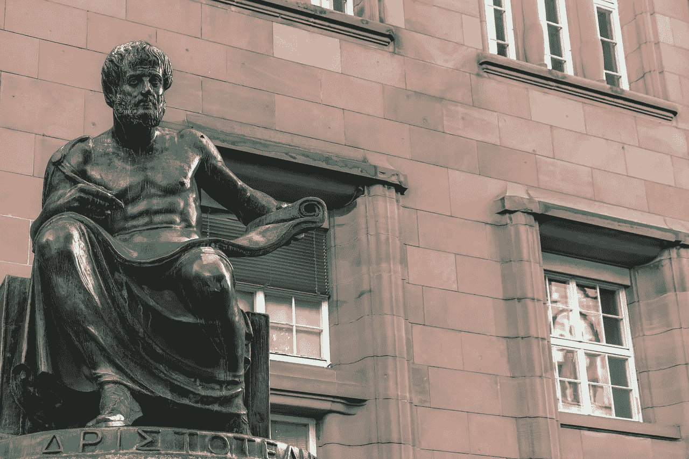

# 关于数据科学伦理的六个问题

> 原文：<https://towardsdatascience.com/six-questions-about-data-science-ethics-4bae9be67cca?source=collection_archive---------26----------------------->

“数据科学”这个词从未出现在亚里士多德的《尼各马科伦理学》中。(图片: [Couleur](https://pixabay.com/users/couleur-1195798/) / [Pixabay](https://pixabay.com/photos/sculpture-bronze-figure-aristotle-5397886/) )

在脸书崛起的那些年里，马克·扎克伯格的座右铭是著名的，“快速行动，打破常规”从那以后，很多事情都被打破了。尽管高科技给我们的生活带来了各种好处，但公司对快速增长的唯一关注意味着，对其产品可能如何危害社会的道德考虑只是事后的想法，是在损害已经造成之后要道歉的事情。

从医学到法律，专业领域已经发展了几个世纪的道德标准。数据科学领域还没有这么多时间。但考虑到我最近完成了一个数据科学训练营，并正在寻找我在该领域的第一个职位，我意识到我可能必须与许多道德问题进行斗争，这些问题现在才成为该行业的焦点。

我对关于数据科学道德的文章和课程进行了一些研究，并提出了一些我认为需要探索的更大的(通常是重叠的)问题，希望数据科学家至少有一定程度的标准和共识来回答这些问题。

# 1.数据的来源有偏差吗？

数据必须从某个来源收集，数据科学家需要记住数据是如何收集的以及数据来自哪里。偏见可能是固有的。例如，在一项名为[街道颠簸](https://www.wired.com/insights/2014/03/potholes-big-data-crowdsourcing-way-better-government/)的倡议中，波士顿居民曾经为波士顿市政府收集了一个众包坑洞数据集。但考虑到低收入人群比富裕人群更不容易拥有手机、汽车和了解科技趋势，众包数据更有利于富裕公民和他们的社区，因此这些社区更有利于街道维修。

从 Twitter 到抖音，再到 Instagram，每个社交媒体平台都有自己的人口统计数据，反映了成员的兴趣和倾向。因此，从平台上搜集的任何数据都会反映这些社区的偏见。

# 2.隐私得到保护了吗？

隐私，或者说缺乏隐私，在科技界已经是一个根深蒂固的问题。世界各地的政府都通过了相关法律。无数的应用程序和服务在注册时需要一些隐私政策协议，但这些冗长而难以理解的协议通常更多是针对服务的律师而不是用户。

收集的数据有多安全？如果泄露会造成什么损失？仅仅因为一家公司可以收获大量数据，就意味着它应该这样做吗？在 2016 年选举的一个丑闻中，当用户填写一个小调查时，剑桥分析公司收集了脸书的数据，所有这些用户的朋友的数据也被收集了，即使他们没有参与调查。

在共享数据时，如何真正做到匿名？仅仅删除姓名、地址和其他明显的识别信息通常是不够的。

# 3.数据属于谁，公司还是用户？

科技公司在收集数据方面投入了大量精力，因此他们理所当然地希望拥有这些数据。但是，当有人想要一张不讨好或有损自己的照片时，该怎么办呢？如果一家公司有关于某人的不准确数据，这个人如何发现并纠正它？

也有这样的情况，数据是关于某人的，但他们并没有直接参与其中。假设一家餐馆心怀不满的前员工在一个点评网站上用一星点评抨击这家餐馆。然后她让她的三十个朋友做同样的事情。如果评论是恶意的，餐馆老板如何让网站删除评论？

# 4.算法是如何影响个人生活的？

假设一家公司使用其现有员工的数据来创建一个算法，以预测新申请人的成功可能性。现在，假设这家公司有一种性别歧视的工作文化，在这种文化下，女性很难发展壮大。很可能任何算法都会预测女性申请者的成功率很低。人们可以在大学招生过程中为代表性不足的群体想到类似的类比。本质上，算法可以强制执行不公平的现状。

一个算法也将是盲目的，对现实世界的情况不宽容。假设在另一个大学招生场景中，一名学生被暂停学业，然后决定改变他的方式，并从那时起在学校努力学习。一种算法可能会基于一次停课拒绝该学生。举一个现实生活中的例子，2014 年澳大利亚的人质危机意味着身处险境的人需要迅速逃离。当他们加载他们的优步应用程序时，激增的价格已经自动达到正常价格的四倍。

虽然这些例子可能被归结为粗心或缺乏想象力，但作为一个明显不道德的例子，脸书曾经[做过一个实验](https://www.theatlantic.com/technology/archive/2014/06/everything-we-know-about-facebooks-secret-mood-manipulation-experiment/373648/)，他们操纵用户的反馈，以了解正面帖子的反馈是否会导致用户自己发布正面帖子，反之亦然。(事实证明确实如此。)所以，脸书在操纵人们的情绪，故意让许多用户感觉不好。与传统的心理实验不同，用户从未明确表示同意参与。

# 5.算法是如何影响社会的？

文化评论家抱怨说，电影和音乐网站使用的推荐系统会让人们被困在相同的流派中。人们不太可能尝试他们舒适区之外的事情；当他们可以变得开明时，他们变得狭隘。与此同时，未成名的艺术家很难引起人们的注意，而注意力却流向了已经成名的艺术家。

更严重的是，社会批评家指责 YouTube 等网站上的推荐算法在政治上让人们变得激进。这些算法旨在让用户参与并点击一个又一个视频，这可能会让他们陷入多巴胺驱动的越来越极端的内容的兔子洞。很容易将极端的网络内容与新闻中经常出现的各种暴力行为区分开来。

鉴于信用评分历史上依赖于一个人的财务信息，社交媒体数据已经[进入组合](https://www.forbes.com/sites/nizangpackin/2019/12/13/social-credit-much-more-than-your-traditional-financial-credit-score-data/)。支持者表示，这种做法允许更细微的评分，但其他人担心这可能导致社会隔离和歧视。

# 6.数据是被操纵的还是骗人的？

为什么到目前为止提到的许多负面影响可能反映了无意的偏见，有时还有更邪恶的事情在发生。2021 年初，时任纽约州州长的安德鲁·科莫(Andrew Cuomo)卷入了一桩丑闻，有报道称，他指示顾问公开声称养老院居民的新冠肺炎死亡人数远低于实际发生的人数。报道的统计数据只统计了发生在家中的死亡，没有统计病人在家中感染疾病但后来死于医院的死亡人数。

在更南边的佛罗里达州，一位名叫丽贝卡·琼斯的数据科学家与州长罗恩·德桑蒂斯不和；她说，她被迫从一个受欢迎的卫生部仪表板上删除关键的新冠肺炎数据。她在 2020 年 5 月被解雇，世仇不断升级。那年 12 月，警察突袭了她的家，她于 2021 年 1 月入狱。去年五月，佛罗里达州监察长办公室授予她 T2 告密者保护。

即使数据是准确的，它的呈现也可能被操纵来欺骗。如果你仔细观察 2020 年 4 月出现在福克斯新闻频道的每日新增病例的新冠肺炎图表，你会注意到 y 轴从 30 开始，而不是零，沿着 y 轴的增量是对数的，而不是线性的，这具有最小化峰值的图形效果。大多数人看了这张图表后会认为新病例的增长速度没有实际那么快。

从我收集的问题列表来看，很明显，数据科学家需要了解他们的工作如何影响社会。(当然，他们中的许多人已经对像我这样的问题进行了很多思考。)我还认为，这个领域需要专业组织来概述标准，在数据科学家中传播这些标准，并对公众进行相关教育。这一职业将增加公众和媒体的信任，并在社会和政治争议中赢得信誉。

对于医疗专业人士，美国医学协会出版每月一期的 *AMA 伦理杂志。美国律师协会代表全世界受迫害的法律专业人士大声疾呼。*

谁在为丽贝卡·琼斯说话？