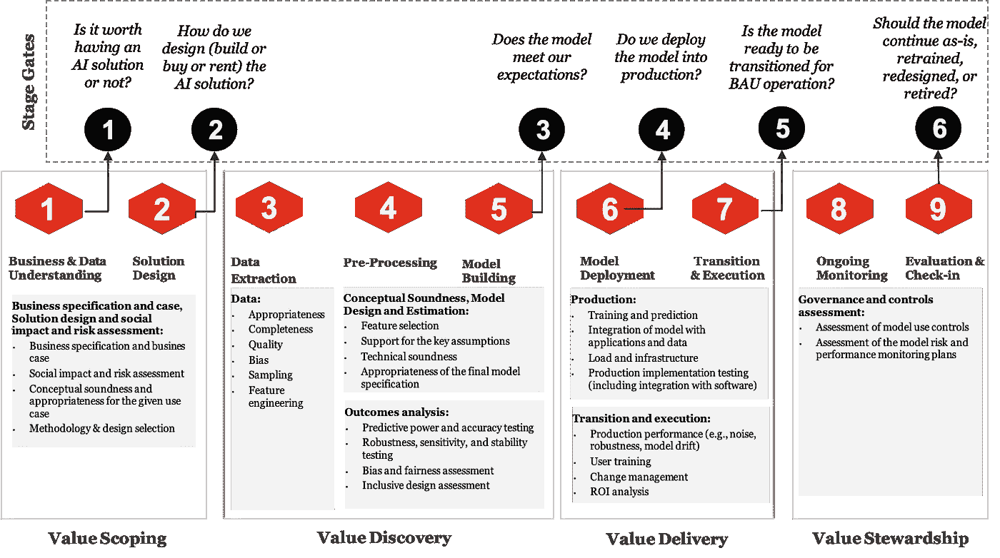
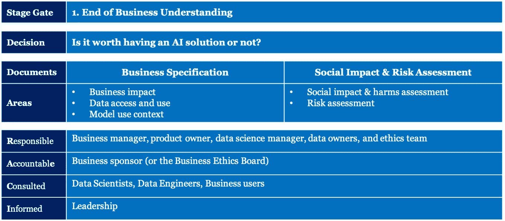
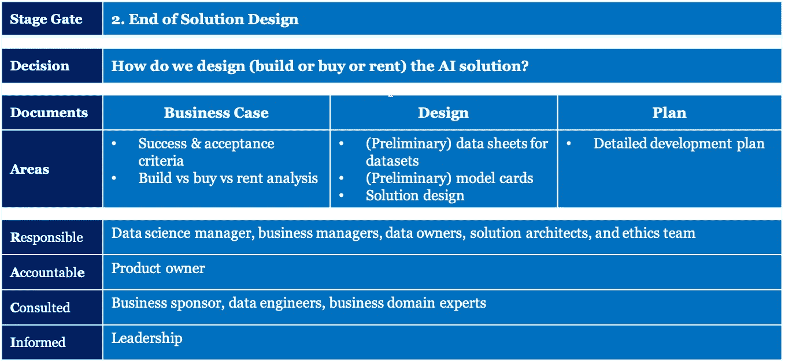
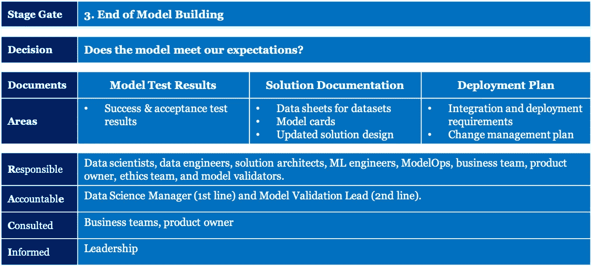
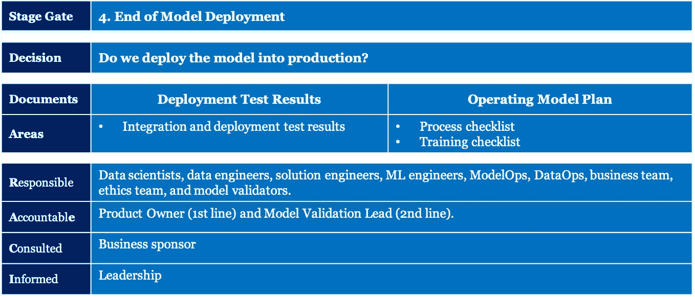
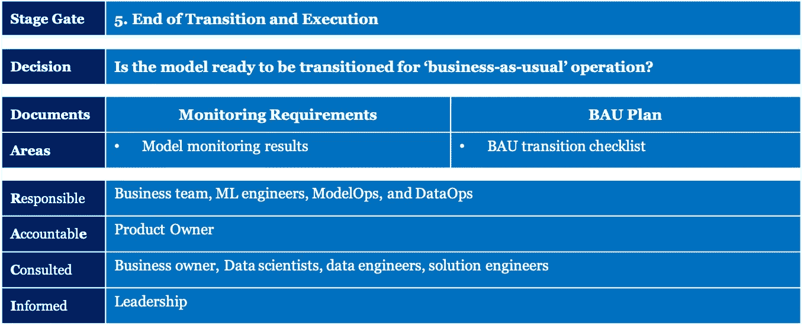
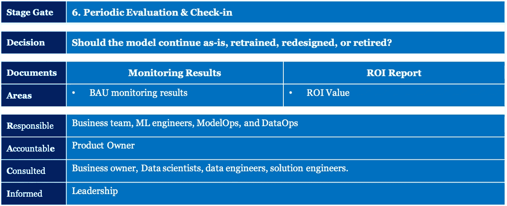

# 成功的人工智能治理的六个阶段

> 原文：<https://towardsdatascience.com/six-stage-gates-to-a-successful-ai-governance-14ab0787a380?source=collection_archive---------23----------------------->

## [走向责任 AI(第四部)](https://towardsdatascience.com/tagged/responsible-ai)

## 决策、文件和 RACI 矩阵

来源:照片由[勒内·迪安达](https://unsplash.com/@renedeanda?utm_source=unsplash&utm_medium=referral&utm_content=creditCopyText)在 [Unsplash](https://unsplash.com/s/photos/nested-gates?utm_source=unsplash&utm_medium=referral&utm_content=creditCopyText) 上拍摄

负责任地使用 AI 应该从详细评估 AI 带来的关键风险开始[1]，然后是对应该遵循的原则的良好理解[2]，然后是从自上而下和端到端的角度对 AI 进行治理[3]。我们在之前的文章中已经讨论过这些。在本文中，我们将重点关注第一道防线，深入探讨价值界定、价值发现、价值交付和价值管理的九步数据科学流程[4]，并强调治理的维度。

# 概观

G 考虑到对治理的关注，我们希望在九个步骤的过程中回答关于 ***的关键问题，即谁基于什么理由做出什么决策*** 。虽然我们在这个过程中有九个步骤，但我们只考虑在这个过程中做出关键决策的那些点。下图显示了我们的九个步骤流程、九个步骤的关键结果以及我们做出重大决策的六个阶段关口。这些决定是:

1.  拥有一个 AI 解决方案到底值不值得？
2.  我们如何设计(建造、购买或租赁)人工智能解决方案？
3.  模型符合我们的期望吗？
4.  我们将模型部署到生产中吗？
5.  该模式是否已准备好过渡到“常规业务”运营？
6.  模型应该继续保持原样、重新培训、重新设计还是退役？

图 1:九个步骤和六个阶段(来源:普华永道分析)

# 阶段门 1:是否值得拥有一个人工智能解决方案？

这个阶段关口发生在项目的**价值范围**阶段的**业务和数据理解**的第一步。这无疑是最关键的一步，因为它决定了我们是否想继续拥有一个人工智能解决方案。要做出这一决定，我们应该了解五个关键领域:

*   **业务影响:**首先，是围绕正在考虑的业务目标或用例。我们正在使哪些业务活动、决策或行动更加高效或有效？这个解决方案是一个全新流程或系统的机会吗？对部署该解决方案的组织有什么业务影响—时间节约、成本节约、收入增加、更好的体验等。？
*   **数据访问和使用:**其次，是了解哪些数据是可用的、可访问的，并且可以在道德上用于开发 AI 解决方案。诸如我们有足够的数据来建立模型吗？这些数据是否被恰当地标注或者可以被注释？有多少历史数据可用？数据的动态性如何，或者数据更改的频率和显著程度如何？
*   **车型使用语境:**第三，是了解车型投产后会如何使用。这应该回答这样的问题，谁是这个模型的用户？他们的业务或技术理解水平如何？人与模型之间的交互是什么，例如，人在回路中，人在回路中，人在回路外？
*   **社会影响&危害评估:**第四，理解人工智能解决方案更广泛的社会和道德含义。有多少人会受到影响？它是否侵犯了人权，如丧失个人自由或隐私，或对环境产生不利影响？它会造成身体、情感、心理或经济上的伤害吗？它有可能误导或操纵观点吗？
*   **风险评估:**第五，确定 AI 解决方案的风险等级。风险等级分为 1-3 级，在某些情况下为 1-5 级。风险分层基于人工智能解决方案造成的危害的严重性和频率，以及该解决方案的潜在社会影响。这种评估应该回答这样的问题:人工智能解决方案会带来什么样的风险？解决方案的风险和暴露(财务或非财务)的可能性有多大？需要考虑哪些潜在的风险缓解策略和控制类别？

这一步涉及许多利益相关者。我们使用以下 RACI(负责-问责-咨询-知情)矩阵来描述这些利益相关者的角色。下面的**阶段门卡**中记录了决策、文件和 RACI 矩阵的摘要。

图 2: Stage Gate 1 —拥有一个人工智能解决方案是否值得？(来源:普华永道分析)

商业影响——就人工智能解决方案对组织的价值及其社会影响或潜在风险而言，将决定负责任的商业赞助商的资历。经济影响越大或潜在风险越大，就越需要商业道德委员会的批准。

业务规范、社会影响和风险评估文档是产品负责人应该制作的关键文档。负责人，在这种情况下，是业务发起人，做出进行/不进行决策，以进一步评估解决方案的技术可行性。为了权衡继续开发的利弊，发现应用程序的风险和潜在危害以及潜在好处是很重要的。

# 阶段门 2:我们如何设计(建造、购买或租赁)一个人工智能解决方案？

这个阶段关口发生在项目的**价值范围**阶段的**解决方案设计**的第二步。步骤 1 中的业务规范在这个步骤中得到进一步的细化，我们开始探索所需的数据和模型。这一步还决定了人工智能解决方案是否应该建立，或者可以从分析和人工智能供应商或云平台提供商的大型生态系统中购买或租赁。这一步骤中需要考虑的主要方面是:

*   **成功和接受标准:**来自上一步的业务规范应该被细化，以阐明正在被自动化的关键活动或者将要被 AI 增强的决策[5]。这也应该考虑模型将如何被使用以及什么数据将是模型的一部分。基于这些，模型的性能标准(例如，准确性、特异性、假阳性率等。)，应该就模型的可解释性、可解释性、安全性、隐私性、安全性和健壮性达成一致。我们广义地称之为**成功标准**。这些也应该转化为一套应该满足的高级测试和验证程序。我们广义地称之为**验收标准**。
*   **构建 vs 购买 vs 租赁分析**:使用上述构件，组织可以确定所需的解决方案是否已经存在，是否可以作为托管解决方案租赁。这里的关键考虑是通用模型满足业务需求的程度，成功和已经同意的接受标准。做出推断所需的数据的安全性和机密性以及数据存储的位置也必须发挥重要作用。如果解决方案不能租用，但可以购买，则应进行类似的尽职调查，以确保其符合业务要求、成功的验收标准，而且经济高效。使用专有数据对模型进行的任何再训练都应纳入考虑范围。最后，如果我们正在构建模型，那么应该为如何在培训阶段构建模型以及如何最终部署和使用模型开发一个整体解决方案设计。例如，如果一个系统的可解释性对于成功的标准非常重要，那么就需要一个更简单的模型结构或者一个添加了可解释的人工智能元素的解决方案。
*   **(初步)数据集数据表:**在数据科学社区中，越来越常见的实践之一是数据集数据表的概念[6]。数据表不仅捕获数据集内的关键数据项及其定义，还捕获收集数据的动机、组成、收集过程、所需的预处理、清理和标记、推荐的用途、数据的共享和分发、数据的维护和停用。虽然在流程的这一阶段，数据手册可能并不全面，但包含其中一些要素的初步数据手册对于做出明智的建模决策非常有价值。
*   **(初步)模型卡:**与数据集的数据表类似，用于模型报告的模型卡[8]也在数据科学社区得到广泛应用。模型卡提供了正在构建的模型的规范，包括模型的细节、正在使用的算法、模型的预期用途、伦理考虑(如偏见和公平性或可解释性要求)、培训、验证和测试数据。在流程的早期阶段，模型卡将是初步的，将在后续阶段进行完善。模型规格应考虑到上一步中讨论的社会影响和风险评估。
*   解决方案设计:解决方案架构的概念是软件开发中广为接受的实践。随着模型从独立模型转移到模型工厂[8]，我们可以用一些额外的维度来增强这个传统的解决方案架构。捕捉不同模型如何相互作用的模型架构；最终用户如何标记或验证数据；如何构建数据管道来收集、清理、处理和提供模型应该是整体解决方案设计的一部分。
*   **详细的开发计划:**通过以上所有的分析，可以建立一个合理的实验计划和实验的初始成本。项目或冲刺计划应该确定人工智能解决方案的培训、测试和开发的关键角色、职责和时间安排。注意我们在别处的讨论[9],模型的项目范围，尤其是以前没有构建过的新模型，受到许多陷阱的影响，在计划价值交付时应该考虑这些陷阱。

此阶段的阶段门卡如下所示。

图 3:Stage Gate 2——我们如何设计(建造、购买或租赁)人工智能解决方案？(来源:普华永道分析)

成功和验收标准将由业务领域专家和数据科学团队共同决定。构建 vs 购买 vs 租赁决策应由产品所有者与业务发起人共同做出。数据表将由数据所有者和数据科学家共同交付，而模型卡将由数据科学家领导。软件解决方案架构师需要与机器学习或模型架构师和数据架构师合作，以完成整体解决方案设计文档。

最终决定是继续构建、购买或租赁人工智能解决方案，还是放弃整个努力，由产品所有者和业务发起人共同做出。本步骤和上一步骤中详述的所有文档都将作为流程的输入。

# 阶段 3:模型符合我们的期望吗？

这个阶段关口发生在项目的**价值发现**阶段的末尾。当我们走到这个阶段关口的时候，模型的训练已经通过一个数据提取、预处理、建模、测试的迭代循环完成了。在此阶段关口做出的关键决策是继续进行模型部署还是推迟/放弃模型开发。这一步骤中需要考虑的主要方面是:

*   **成功和验收测试结果:**成功和验收标准中描述的模型详细测试应在此阶段关口之前进行。结果应总结模型的性能、模型的可解释性和可解释性、模型的公平性、安全性、控制性、安全性、隐私性、健壮性和可再现性。验收标准中规定或建议的所有验收测试都应进行和评估。理想情况下，模型应该满足在前一阶段关口中商定的成功和验收标准。但是，在某些情况下，可能会决定放宽验收门槛，并批准下一阶段的模型。这只会在特殊情况下发生，应上报给业务发起人和产品负责人考虑。
*   **数据表、模型卡和更新的解决方案设计:**当模型培训完成时，可以更新前一阶段关口的关键文档。应该突出对训练模型有用的数据集和数据项。应记录选择的相关模型、使用的超参数、执行的实验以及提供最佳结果的模型集合。对整个模型架构、数据管道和解决方案架构的任何更改也应该更新。
*   **集成和部署需求:**一旦模型被批准部署，就可以起草模型部署的规范。它应包括生产中的模型推理是批处理模式还是实时模式，在过渡期间如何验证模型，以及模型需要再培训的频率(例如，过渡期间模型的培训是连续的还是定期的)。性能调优和负载测试需求也应该在需求中详细说明。此外，应详细说明该模型如何与其余应用系统集成(例如，用作 docker 容器或 API 调用，或将拥有自己的独立前端)。
*   **变更管理计划:**规划最终部署的最后一步是变更管理计划，包括任何流程变更、AI 解决方案的验证、人员的培训和重新部署。

此阶段的阶段门卡如下所示。

图 4:阶段 3——模型符合我们的期望吗？(来源:普华永道分析)

成功和验收测试结果将由数据科学家和数据工程师准备，并将由二线模型验证人员和道德团队进行验证。更新的数据表将由数据工程师负责，而更新的模型卡将由数据科学家负责。解决方案架构师和 ML 工程师以及模型操作人员将负责集成和部署需求。变更管理计划将由业务团队和产品负责人负责。

# 阶段 4:我们将模型部署到生产中吗？

只有在前一阶段关卡已经批准部署模型时，才会出现此阶段关卡。这个阶段关口发生在项目的**价值交付**阶段的模型部署步骤的末尾。当我们来到这个 stage gate 时，模型就可以部署了。在此阶段关口结束时做出的关键决策是发布部署以供生产使用。

*   **集成&部署测试结果:**根据前期指定的集成和部署需求，模型可以作为 API 端点，或者拥有自己的 web 接口，或者作为具有 UI 的独立应用程序交付。集成测试应该在这个阶段执行。此外，性能测试、负载平衡——特别是如果模型将在生产中进行训练，以及模型使用偏差测试、与最终用户的可解释性测试、健壮性测试和对抗性攻击测试都应该在这个阶段执行。
*   **流程清单:**基于已部署模型的交互模式(例如，人在回路中、人在回路上、人在回路外)的所有流程变更都应执行。如果需要的话，模型验证的流程流应该具有适当的例外、升级和批准标准。模型操作、数据操作和 SecOps 流程应在此阶段到位。
*   **培训清单:**任何新角色(如模型操作、数据操作等)或对现有角色的更改都应记录在案，并明确责任和活动。如果需要对大量用户(即临时用户或高级用户)进行新角色或角色变化的培训，则应在部署之前进行。

此阶段的阶段门卡如下所示。

图 5:阶段 4——我们将模型部署到生产中吗？(来源:普华永道分析)

集成和部署测试结果将由数据科学家、ML 工程师和软件工程师准备，并将由二线模型验证人员和道德团队进行验证。流程清单和培训清单将由不同的 XOP(模型操作、数据操作、安全操作)小组负责。培训将由业务团队和变革管理专家负责。

# 阶段 5:模型是否准备好过渡到“照常营业”操作？

这个阶段关口发生在项目的**价值交付**阶段的末尾。尽管该模型已投入生产，但在转换为 BAU(“常规业务”)模型之前，应密切监控该模型的运营。

*   **模型监控结果:**传统的软件部署通常不需要这个阶段关口，因为软件的工作不敏感或者不会随着新数据而改变。然而，在模型的情况下，有可能出现一些“漂移”[11] —数据漂移、特征漂移、概念漂移等。在部署模型的最初几个月，应该对此进行密切监控。密切观察的周期取决于模型的使用频率和数据的到达率。
*   **BAU 过渡检查表:**对模型进行严密监控后，如果模型仍值得生产使用，则应将其过渡到运营团队。确保分配和培训适当的操作人员是将模型过渡到 BAU 的一个关键方面。在此阶段，应建立并商定持续监控标准(即性能、偏差、可解释性等)、干预阈值和测试频率。

此阶段的阶段门卡如下所示。

图 6:阶段 5——模型是否准备好过渡到业务照常运行？(来源:普华永道分析)

模型监控结果将由不同的操作角色(模型操作、数据操作)在数据科学家的协助下准备。BAU 过渡将是业务团队和运营部门的共同责任。

# 阶段 6:模型应该继续保持原样，重新培训，重新设计，还是退役？

在**价值管理**阶段的**评估和检入**步骤中，此阶段关口会定期出现。评估频率将在过渡步骤或**价值交付**阶段结束时确定。在每次评估中要做出的决定是继续模型而不做任何改变，重新训练模型，重新设计，或者淘汰模型。为了做出这一决定，应检查以下方面:

*   **BAU 监控结果:**前一阶段的所有模型监控结果都应包含在 BAU 监控中。此外，应通过比较本期和前期的结果/原始模型部署和训练结果来评估模型衰减。任何衰退或不稳定都可能导致模型的重新训练或重新设计。
*   **ROI 价值:**除了模型性能，业务还应该包括模型的 ROI 或价值评估。这应考虑模型的益处(例如，效率收益、有效性、增强体验、成本节约、收入收益)，并确定将模型投入生产的益处是否超过维护模型的成本。这将决定该型号是否应该淘汰，或者用不同的或更新的型号替换。

此阶段的阶段门卡如下所示。

图 7:阶段入口 6——模型应该继续保持原样、重新培训、重新设计还是退役？(来源:普华永道分析)

在数据科学家和业务团队的协助下，不同的操作角色(模型操作、数据操作)将准备 BAU 监控结果。ROI 价值分析将由与数据科学家和模型操作人员合作的业务团队负责。重新培训、重新设计或淘汰模型的最终决定应由产品所有者做出。

作为 9 步模型开发和管理的一部分的 6 个阶段关口是关键的里程碑，是任何软件 2.0 管理过程不可或缺的一部分。我们在这里概述的规范的细节和深度可以根据模型的规模、范围、复杂性和社会影响进行调整。在后续文章中，我们将讨论规范以及如何根据模型的风险分层调整这些规范。

**作者:**

**参考文献**

[1] [人工智能风险的五种观点:理解人工智能的阴暗面(迈向负责任的人工智能——第一部分)](/five-views-of-ai-risk-eddb2fcea3c2)

[2] [企业负责任人工智能的十大原则](/ten-principles-of-responsible-ai-for-corporates-dd85ca509da9)(迈向负责任人工智能——第二部分)

[3] [负责任地使用人工智能的自顶向下和端到端治理](/ten-principles-of-responsible-ai-for-corporates-dd85ca509da9)(迈向负责任的人工智能——第 3 部分)

[4] [模型生命周期:从理念到价值](/model-lifecycle-from-ideas-to-value-14e654b7d4a4)

[5] [开发以人为中心的人工智能的十种人类能力和四种智能](https://medium.com/the-innovation/ten-human-abilities-and-four-intelligences-to-exploit-human-centered-ai-b48c5ea1c8be)

[6] [数据集数据表](https://arxiv.org/abs/1803.09010)

[7] [模型卡](https://arxiv.org/abs/1810.03993)

[8] [车型进化:从独立车型到车型工厂](/model-evolution-from-standalone-models-to-model-factory-5a8e01fa03cb)

【9】[将模型误认为软件的后果](/consequences-of-mistaking-models-for-software-94d813f115f5)

[10] [端点 vs API](https://stevenpcurtis.medium.com/endpoint-vs-api-ee96a91e88ca)

[11] [关于数据漂移的初级读本](https://medium.com/data-from-the-trenches/a-primer-on-data-drift-18789ef252a6)