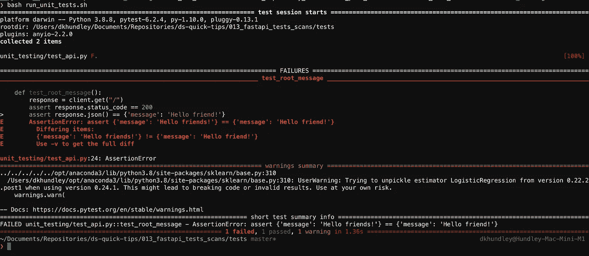
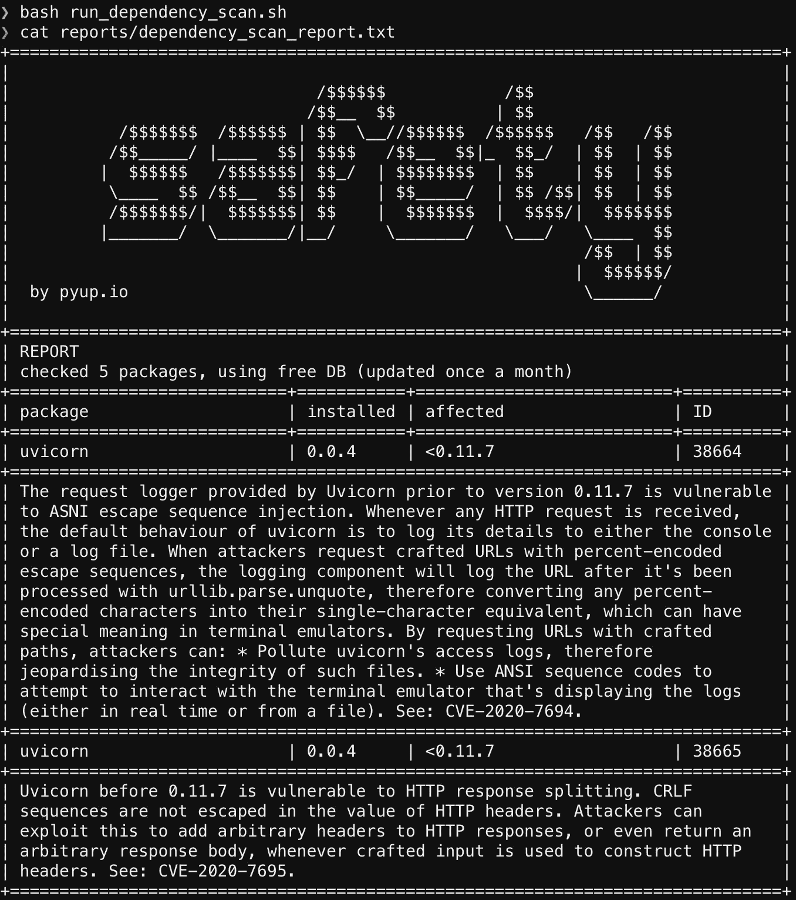
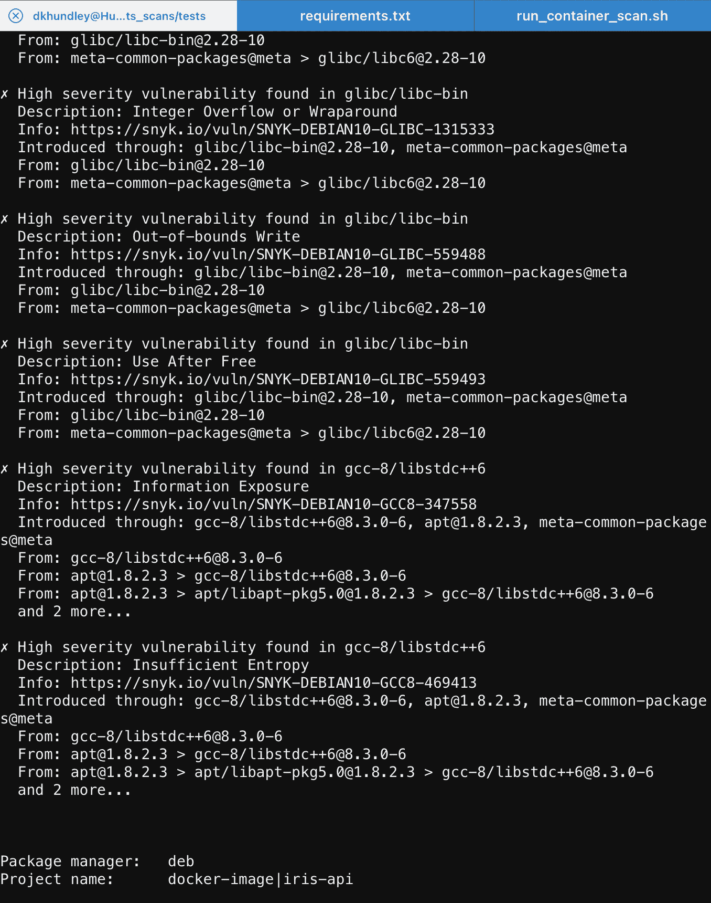
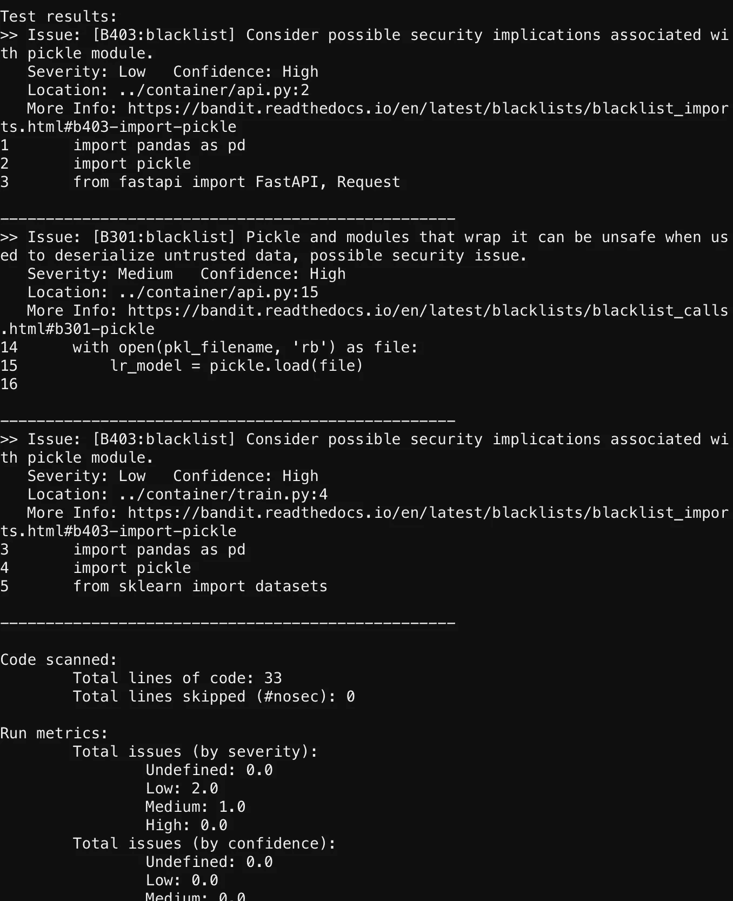
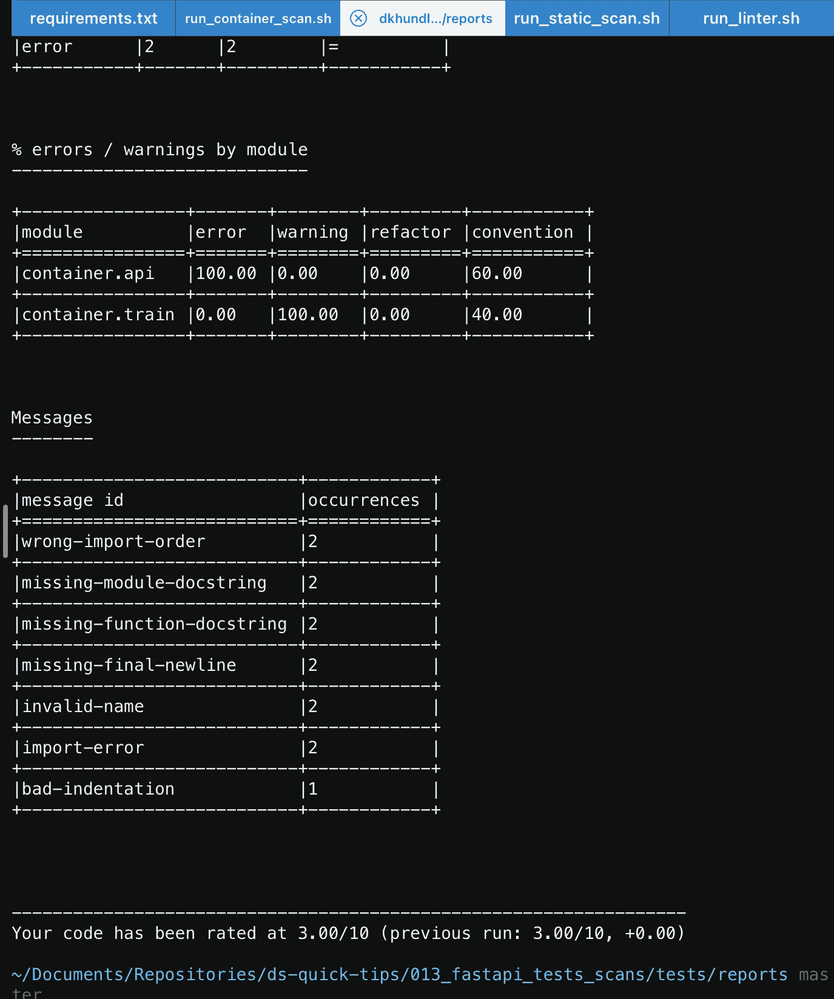

# 通过测试和扫描强化模型服务 API 的六种方法

> 原文：<https://towardsdatascience.com/six-ways-to-harden-your-model-serving-api-with-tests-scans-b006b6137b19?source=collection_archive---------35----------------------->


## 去生产？利用这些免费资源强化您的 API！

你好，朋友们！我回来了！抱歉中断了两个月。我似乎总是在夏天失去发布新东西的动力，但现在我有了一台全新的 Mac Mini 来支持我的工作，我带着一些新鲜的新内容回来了。

作为一名财富 50 强公司的机器学习工程师，我的主要职责是将机器学习模型部署到生产中，供多个企业级系统使用。大多数部署都是以模型服务 API 的形式出现的。API 接收一组数据，基于该数据生成一个推理，并将推理结果返回给调用者。

考虑到这些服务模型的 API 会接触到很多人，确保这些 API 以一种我们可以尝试保证 100%正常运行的方式得到加强是非常重要的。为此，我们试图通过执行大量不同的测试和安全扫描来强化我们的 API，这些测试和扫描表明我们在部署之前认真考虑了所有风险因素。此外，这些测试/扫描结果被保存到一个公共的存储库中，以防任何审计人员有兴趣看到这些 API 的“测试证据”。

当然，有许多不同的工具和供应商解决方案来支持这项工作，但是对于这篇文章，我将重点关注免费资源。如果你是一家大型企业公司，我可能会鼓励你研究一些供应商的解决方案，但是这篇文章至少会提供一个在创建模型服务 API 时应该考虑的不同因素的入门。

在我们进入我们的资源之前，让我们先快速看一下我为支持这篇文章而创建的虚拟模型 API。如果你想跟随我的代码，[请在 GitHub](https://github.com/dkhundley/ds-quick-tips/tree/master/013_fastapi_tests_scans) 找到它。

# API 概述

对于这个项目，我针对流行的公共 Iris 数据集创建了一个非常简单的逻辑回归模型。因为我不一定关心为我们的项目创建一个花哨的预测模型，所以您会发现我没有做任何类似特殊功能工程或任何超参数调整的事情。在我下面的训练脚本中，你可以看到我正在做的唯一的事情是用 Scikit-Learn 加载数据集，从数据集分离目标`y`值，将训练数据集馈送到 Scikit-Learn `LogisticRegression`模型，并将序列化的模型保存到名为`iris_model.pkl`的 pickle 文件中。

```
# Importing the required Python libraries
import numpy as np
import pandas as pd
import pickle
from sklearn import datasets
from sklearn.linear_model import LogisticRegression# Loading the iris dataset from Scikit-Learn
iris = datasets.load_iris()# Converting the iris dataset into a Pandas DataFrame
df_iris = pd.DataFrame(data = np.c_[iris['data'], iris['target']],
            columns = iris['feature_names'] + ['target'])# Separating the training dataset (X) from the predictor value (y)
X = df_iris.drop(columns = ['target'])
y = df_iris[['target']]# Instantiating a Logistic Regression (LR) model
lr_model = LogisticRegression()# Fitting the dataset to the LR model
lr_model.fit(X, y)# Saving the model to a serialized .pkl file
pkl_filename = "../models/iris_model.pkl"
with open(pkl_filename, 'wb') as file:
    pickle.dump(lr_model, file)
```

创建好模型后，我就可以创建 API 了。作为下面脚本的一部分，您可以看到我正在使用 FastAPI 框架创建具有两个端点的模型服务 API。第一个默认端点只是返回一个 JSON 消息，声明`Hello friends!`。第二个端点`/predict`是实际接收数据并从我们的模型返回推理结果的端点。同样，我们在这里做一些非常基础的东西。你实际的 API 可能会比这个复杂得多，但是我们在这里保持事情简单。

```
import pandas as pd
import pickle
from fastapi import FastAPI, Request
from fastapi.responses import JSONResponse## API INSTANTIATION
## ----------------------------------------------------------------
# Instantiating FastAPI
api = FastAPI()# Loading in model from serialized .pkl file
pkl_filename = "../models/iris_model.pkl"
with open(pkl_filename, 'rb') as file:
    lr_model = pickle.load(file)## API ENDPOINTS
## ----------------------------------------------------------------
# Defining a test root path and message
[@api](http://twitter.com/api).get('/')
def root():
    msg = {'message': 'Hello friends!'}
    return JSONResponse(content = msg, status_code = 200)# Defining the prediction endpoint
[@api](http://twitter.com/api).post('/predict')
async def predict(request: Request): # Getting the JSON from the body of the request
    input_data = await request.json() # Converting JSON to Pandas DataFrame
    input_df = pd.DataFrame([input_data]) # Getting the prediction from the Logistic Regression model
    pred = lr_model.predict(input_df)[0]return JSONResponse(content = pred, status_code = 200)
```

最后，如果您想自己测试这个 API，我创建了一些示例 JSON 数据，可以很好地满足这些目的。看起来是这样的:

```
{"sepal_length":5.1,"sepal_width":3.5,"petal_length":1.4,"petal_width":0.2}
```

这就是这个 API 的大部分内容！既然我们已经为这篇文章的剩余部分打下了基础，现在让我们开始进入所有可以像这样强化 API 的方法。

# 1.使用 Pytest 进行单元测试

原因之一，这可能是你最熟悉的一个。即使您不习惯强化 API，您也很可能已经为自己的健全性检查创建了一个单元测试。出于我们的目的，我们将使用`pytest`和 FastAPI 测试客户端。安装`pytest`非常容易。您只需运行以下命令:

`pip3 install pytest`

现在，为了在 CLI 中实际使用`pytest`，我们将运行一个小的 bash 脚本，该脚本执行我们的测试文件并将输出写到`reports`目录中。看起来是这样的:

```
pytest --log-file=reports/unit_test_report.txt unit_testing/
```

好的，这很简单…但是它怎么知道要测试什么呢？注意在上面命令的末尾，我们让`pytest`遍历`unit_testing`目录下的所有文件。在我的`unit_testing`目录中，我有一个 Python 脚本，它既设置单元测试客户端，又运行单元测试。完整的脚本如下所示:

```
import json
from fastapi.testclient import TestClient
from container.api import api## PYTEST SETUP
## --------------------------------------------------------------------------------------------------------------------
# Instantiating the test client from our container's API
client = TestClient(api)# Loading test JSON file
with open('test_json/test_data.json', 'rb') as file:
    test_json = json.load(file)## UNIT TEST CASES
## --------------------------------------------------------------------------------------------------------------------
# Creating a unit test for the basic root path
def test_root_message():
    response = client.get("/")
    assert response.status_code == 200
    assert response.json() == {'message': 'Hello friends!'}# Creating a unit test for the prediction endpoint
def test_predict():
    response = client.post('/predict', json = test_json)
    assert response.status_code == 200
```

在这里，你会注意到两个不同的部分。在“Pytest Setup”一节中，我们实际上是使用之前创建的同一个 FastAPI 脚本来实例化 FastAPI 测试客户端，然后加载少量的样本数据。在第二部分中，我们使用 FastAPI 测试客户端和样本数据来运行一些带有`assert`语句的测试用例。注意，为了通过单元测试，这些`assert`语句具有需要满足的特定条件。如果这些测试用例中的任何一个失败了，Pytest 将会适当地记录下来，并简要解释失败的原因。在下面的截图中，看看当我有意改变单元测试 look 为“Hello friend！”而不是恰当的“你好朋友！”



作者截图

尽早设置单元测试是非常好的，因为您可以设置一个 CI/CD 管道，在您对 API 进行修改的任何时候都可以运行这个测试。如果你犯了一个错误，单元测试会发现它并让你知道问题。单元测试无疑让我避免了许多粗心的错误，所以一定要为您的模型服务 API 编写单元测试！

# 2.使用蝗虫进行性能测试

由于 API 通常每天被调用数千次，如果不是数百万次的话，您肯定希望确保您的模型服务 API 能够适当地处理负载。为此，我们有一个名为蝗虫的工具来帮助我们。现在，我不打算在这个曾经的[上花太多时间，因为我已经写了一个完整的帖子，更详细地介绍了蝗虫](/performance-testing-an-ml-serving-api-with-locust-ecd98ab9b7f7)。如果你想了解更多，我肯定会鼓励你去看看。这里我要注意的唯一一件事是，post 主要关注在 UI 模型中使用 Locust。在他们所谓的“无头”模式下，完全可以在没有用户界面的情况下运行它。下面是该命令的样子:

```
locust — locustfile performance_testing/locustfile.py — headless — users 15 — spawn-rate 5 — run-time 30s — only-summary — csv reports/performance_test
```

在运行该命令时，Locust 将执行性能测试，然后将结果作为 4 个单独的 CSV 文件的一部分写出。老实说，我希望有一种方法可以将它作为一个单独的报告导出，但是我认为有总比没有好！同样，我们不打算深入讨论蝗虫命令是如何工作的，所以如果你想了解更多，我鼓励你看看我以前的帖子。

# 3.安全的依赖性扫描

这个和下一个是齐头并进的，但是我们将从这个开始，因为它是两个中“不太健壮”的。当容器化您的模型服务 API 时，您肯定需要执行一个`pip install`来安装您需要的所有 Python 库来支持您的工作。依赖项扫描将查看`requirements.txt`文件中依赖项的所有固定版本，并让您知道哪些类型的漏洞与相应的 Python 库相关联。

出于我们的目的，我们将使用一个名为 Safety 的免费工具。安全性非常简单易用。要安装安全，您只需运行以下命令:

```
pip install safety
```

实际执行安全命令也同样简单。在下面的命令中，你会看到它直接指向我的`requirements.txt`文件，然后适当地保存一个完整的输出报告。

```
safety check -r ../dependencies/requirements.txt --full-report -o reports/dependency_scan_report.txt
```

如果你不知道，有一个由美国国土安全部支持的名为 CVE 的开源数据库。 [CVE 数据库](https://cve.mitre.org/)包含所有已知和常见的安全漏洞，包括一些如何修复适当的 CVE 的选项。现在，我正在努力将我的依赖关系与一些最新的 Python 库联系起来，但是只是为了演示当安全发现一些问题时它是如何工作的，让我们看看当我用一个非常旧版本的 Uvicorn 扫描一个`requirements.txt`文件时会发生什么。(准确的说是 uvicon 0 . 0 . 4):



作者截图

如你所见，这个旧版本的 Uvicorn 有两个安全问题。它提供了一个很好的描述，也包括适当的 CVE 数。如果您想了解更多关于该漏洞的信息，您可以使用 CVE 号码进行搜索。例如，第一个漏洞记录了 CVE-2020–7694。[如果你去这个链接](https://nvd.nist.gov/vuln/detail/CVE-2020-7694)，除了 Safety 提供的相对简短的描述，你还可以了解更多关于这个漏洞的信息。

这就是安全，但在继续之前，我觉得我应该提到使用供应商解决方案的价值高于安全，特别是如果你为一家大公司工作。Safety 只查询政府的 CVE 数据库，该数据库并不总是与最新信息保持同步。供应商解决方案通常包含他们自己的数据库以及这些额外的漏洞问题，因此，如果您的公司特别关注安全性，我可能会建议您使用这些解决方案中的一种。

# 4.用 Docker 扫描集装箱(Snyk)

依赖扫描很棒，但是它的问题是，如果你要走容器化的路线(你可能会这样)，它不能得到与你使用的基本映像相关的所有东西。最近，Docker 与一家名为 Snyk 的第三方公司合作，将一个容器扫描工具直接嵌入 Docker CLI。它非常容易使用，并自动捆绑了最新版本的 Docker。唯一的“问题”是，你需要一个 Docker Hub 帐户，但也可以自由创建。如果您以前没有这样做过，[您可以在这里创建一个 Docker Hub 帐户](https://www.google.com/url?sa=t&rct=j&q=&esrc=s&source=web&cd=&ved=2ahUKEwjj59ykzaTyAhXgFVkFHbMXA08QFnoECAoQAw&url=https%3A%2F%2Fhub.docker.com%2Fsignup&usg=AOvVaw0ZK6uD6-fF7BcJCTMDsVuh)。

要在本地使用容器扫描，您需要做两件事。首先，你需要登录 Docker Hub。为此，请运行以下命令:

```
docker login
```

运行该命令将启动一些其他提示，要求您输入各自的 Docker 用户名和密码信息。当然，您需要做的下一件事是构建容器！出于我的目的，我通过如下方式构建我的容器，使事情变得非常简单:

```
docker build -t iris-api:dev .
```

构建好容器并登录 Docker 后，我们就可以执行容器扫描了！该命令如下所示:

```
docker scan iris-api:dev | tee reports/container_scan_results.txt
```

现在，你可能想知道`tee`在这里做什么。我们所有的其他工具都提供了某种输出结果的机制，但是`docker scan`命令没有任何内置选项来导出结果。相反，输出仅直接显示在 CLI 中。`tee`允许我们从命令行界面获取输出，并保存到文本文件中。如果你想在其他场合使用`tee`，你完全可以。无论如何不仅限于`docker scan`。以下是我的扫描结果:



作者截图

如您所见，它引发了相当多的漏洞，绝对超过了我们的依赖扫描。这是因为我使用的是`python:3.9-slim-buster`，Snyk 暴露了许多与 Debian OS 相关的漏洞。我实话实说:我不知道我是否同意所有这些发现，所以慎用。我认为 Snyk 是一家较新的公司，所以我乐观地认为他们会改进他们的流程，以正确反映适当的漏洞！

# 5.用 Bandit 进行静态代码扫描

我们在列表上的最后一次安全扫描着眼于您的 Python 代码的潜在漏洞，我们在一个名为 Bandit 的工具的支持下完成这项工作。对于这次扫描，我们将指向包含所有 Python 文件的目录，它将指出从纯 Python 的角度来看我们应该小心的事情。在我的例子中，我的所有 Python 文件(包括带有 FastAPI 的文件)都在一个名为`container`的目录中，因此我们将使用以下命令让 Bandit 扫描那里:

```
bandit --format=txt --output=reports/static_scan_report.txt -r ../container/
```

在我们的场景中，Python 代码非常简单，所以扫描并不明显。如果你好奇，下面是我的特定扫描的输出结果:



作者截图

如您所见，它正确地指出，我应该对导入 pickle 文件保持谨慎，因为有人将恶意软件打包成 pickle 文件的一部分并不罕见。在我们的例子中，我们知道我们构建了 pickle 文件，所以我们可以看着它说，“谢谢 Bandit，但是我很好！”

# 6.用 Pylint 编码棉绒

这最后一个是…我要说可选。(一会儿你就知道为什么了。)如果你回想起你的大学时代，你可能会想起你的教授让你用一种特殊的格式写论文，如 MLA 或 APA 格式。如果你不知道的话，编码界有一个非常相似的东西，叫做 PEP-8。Pylint 专门检查您的 Python 代码，以确保它遵循 PEP-8 标准以及其他一些标准。安装 Pylint 非常容易。只需运行以下命令:

```
pip install pylint
```

为了针对您的代码运行 linter，您需要做的就是以如下方式使用`pylint`:

```
pylint ../container/ --reports=y --output=reports/linter_report.txt
```

该命令的输出将提供关于您如何改进的完整描述，并且还会提供……*战栗*…您的表现如何，满分为 10 分。(越高越好。)现在，让我们看看我的分数如何:



作者截图

是的，你没看错。我得了满分 10 分的 3.00 分。请允许我发表一点小小的意见…亲爱的读者，你认为我的代码有那么糟糕吗？我因为提供有力的评论和把事情分成“部分”而臭名昭著，所以我接受乌姆里奇的说法，我只得到区区 3.00 分。但是，嘿，我在大学里也和教授们在 APA 格式上争论过，所以这是我的天性，在这些能力上与众不同。😂尽管如此，我觉得如果您的组织真的关心遵循 PEP-8 指南，这是值得一提的。

这篇文章到此结束！回来的感觉真好。希望你喜欢这个，并期待在不久的将来会有更多精彩的内容。我已经在 SageMaker，Terraform 上发了帖子，还有更多正在制作中。会很好玩的！感谢阅读！