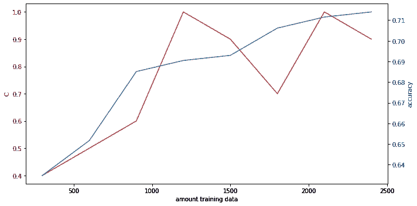

# 规模很重要——是吗？

> 原文：<https://towardsdatascience.com/size-matters-or-does-it-98bbd613313f?source=collection_archive---------63----------------------->

## 随着数据量的增加，ML 模型的性能如何提高？什么时候贴标签的成本大于收益？


Ravi Sharma 在 [Unsplash](https://unsplash.com?utm_source=medium&utm_medium=referral) 上拍摄的照片

情感分析是一项艰巨的任务。我们从一堆像推文或评论这样的文档开始，将它们翻译成数字，并试图根据某种 ML 算法来确定该消息是否具有积极或消极的意义。

一方面，拥有更多数据应该会提高我们模型的质量。另一方面，给数据贴标签会很昂贵(或者至少很烦人)。因此，我们希望有足够多的数据来训练模型，同时密切关注标签的成本。

但是模型的准确性如何随着更大的数据集而提高呢？在这篇博文中，我们将看到模型的准确性和特定用例中的数据量之间的关系。

在下文中，我们使用数据集 [*对 Kaggle 的金融推文*](https://www.kaggle.com/ankurzing/sentiment-analysis-for-financial-news) 进行情绪分析，该数据集由超过 4800 条推文及其标签(“正面”、“负面”和“中性”)组成。这相当大量的推文允许我们将数据分成合理大小的训练和测试数据集。该数据集是不平衡的，有 2879 条中立的，1363 条正面的和 604 条负面的推文。

训练数据集的大小将如何影响模型在测试数据上的“样本外”性能？尺寸重要吗？

为了找到这个问题的答案，我们首先从整个数据集中随机抽取 2400 条推文，这些推文构成了训练数据。剩下的数据是测试数据，将用于评估模型的性能。

为了简单起见，我们使用推文的 [tf-idf](https://en.wikipedia.org/wiki/Tf%E2%80%93idf) 表示，训练逻辑回归模型，并通过 10 重交叉验证来调整正则化强度 *C* 。我们对不同数量的数据重复这一过程。(在 [this GitHub Repo](https://github.com/FlorianHeinrichs/Sentiment-Analysis-Financial-Tweets) 中可以找到具有不同表示和模型的情绪分析)

所以事不宜迟，让我们深入到代码*(基于上面提到的情感分析)*。首先，我们需要加载所需的包和数据，进行一些预处理，并将数据分成训练和测试数据:

接下来，我们为 tf-idf 表示和 10 重交叉验证定义一些辅助函数:

最后，我们通过 10 重交叉验证选择正则化参数 *C* ，并使用各自的参数对从 *n = 300* 到*n = 2400*不同数据量的模型进行训练:

结果如图 1 所示。



图 1:作为训练数据量的函数的逆正则化强度 *C(红色)和准确度(蓝色);x 轴:训练数据量；y 轴:C(红色)，精度(蓝色)；作者图片*

此外，以下是 *n = 300* 和*n = 2400*的混淆矩阵:

```
n = 300, LogReg with C = 0.4
Confusion Matrix:
[[ 203  377  139]
 [ 144 1222   52]
 [  55  118  113]]Estimated accuracy:0.635n = 2400, LogReg with C = 0.9
Confusion Matrix:
[[ 399  246   74]
 [ 186 1148   84]
 [  35   68  183]]

Estimated accuracy:0.714
```

测试数据集的精确度随着数据量 *n* 的增加而增加。不足为奇的是，准确性在开始时提高很快，然后随着数据量的增加而降低。正则化参数没有明确的趋势，尽管我们预计它会随着 *C* 正则化强度的倒数而增长，并且我们可能预计正则化强度会随着数据量的增加而减弱，这在结果中有所反映。

如前所述，数据集是不平衡的，大约 60%是中立的，28%是积极的，12%是消极的。毫不奇怪，基于 300 条推文的模型通过偏好中性推文来实现其准确性。尽管准确率“仅”从 63.5%提高到 71.4%，但定性差异甚至更大，因为基于 2400 条推文的模型平衡了其预测。根据具体的使用情况，另一个指标，如精确度、召回率或 f1 分数，可能更适合捕捉定性差异。

## 结论

在给定的场景中，大量的训练数据提高了模型的准确性和质量。尽管精确度的提高看起来很小，但是模型的质量却有了显著的提高。所以，至少在这种情况下，尺寸确实很重要。

当然，这一发现不能推广到其他场景和其他数据集，但它给出了一种直觉，即较大的数据集导致(在一定程度上)质量的提高，这可能不会反映在准确性上。给定的例子进一步表明，模型质量的改进增加了成本，并且在应用中可能是不需要的。对数据和模型选择进行适当的预处理(为了简单起见，这里省略了)可能对改进模型更有效。