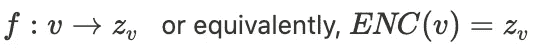

# 图的跳格神经网络

> 原文：<https://towardsdatascience.com/skip-gram-neural-network-for-graphs-83b8f308bf87?source=collection_archive---------21----------------------->

本文将深入探讨节点嵌入的更多细节。如果您缺乏对节点嵌入的直觉和理解，可以查看以前的这篇文章，其中讨论了节点嵌入的直觉。但是如果你准备好了。我们可以开始了。

布拉登·科拉姆在 [Unsplash](https://unsplash.com?utm_source=medium&utm_medium=referral) 拍摄的照片

在关于节点嵌入的[一级解释](/node-embeddings-for-beginners-554ab1625d98)中，我解释了为什么我们需要嵌入，这样我们就有了向量形式的图形数据。而且，我说…

> *嵌入应该捕获图形拓扑、节点之间的关系和进一步的信息。我们如何理解这一点，以便有一个明确的程序？*

在上一篇文章中，我建议…

> *解决这个问题的一个可能的捷径是尝试形成嵌入，使得两个节点的节点嵌入在某种意义上是相似的，如果它们碰巧在网络中具有某种相似性的话。*

好的，为了更正式地建立这一点，让我们回顾一下我们已经谈到的内容。我们说我们有或者想要一些嵌入，但是我们仅有的是来自网络的节点。因此，我们需要一个变换或函数。嵌入环境中的函数称为编码器。

设 ***f*** 为从节点 ***v*** 到嵌入 ***z*** 的映射编码器，其中 ***z*** 为*维嵌入中的向量， ***v*** 为图 ***中的顶点****

****

*作者通过编码器从节点到嵌入空间的映射*

*从我的经验来看，这个函数 ***f*** 最初是很难掌握的。尤其是当 deepwalk 或 node2vec 的随机行走方法是您听到的第一个嵌入策略时。在这两种使用随机行走的方法中， ***f*** 只是查找嵌入矩阵中的一行或一列，因为每个节点 ***v*** 由一行或一列表示。*

# *下一个——相似性之谜*

*在前一篇文章和本文的介绍中，我提到了应该捕捉的相似性。相似性帮助我们建立嵌入，使得嵌入反映真实世界网络的信息。让我们更正式地总结一下。*

*解码器是从两个节点*enc(****v****)*和*enc(****v****)*的嵌入映射到相似性得分的函数:*

**

# *解码器*

*一种可能的解码器是表示余弦距离的点积。*

**

*如果两个向量指向相同的方向，则点积为 1；如果两个向量相互垂直，则点积为 0；如果两个向量指向相反的方向，则点积为-1。*

*然而，其他距离度量/解码器也允许计算相似性值。*

*当我第一次看到 Jure Leskovec 关于节点嵌入的演讲时，我根本没有意识到这是 node2vec 或 deepwalk 的一部分。据我所知，解码器在这两种方法的算法中都是非常隐含的，但后面会有更多介绍。并且解码器仍然允许评估两个节点表示之间的嵌入空间中的相似性值。*

# *网络中节点的相似性*

*定义相似性有很多种可能。下面给出了一个可能的选择。*

*相似性可能意味着两个节点…*

*   *是有联系的*
*   *共享邻居*
*   *具有相似的“结构角色”*
*   *在随机漫步中同时出现*

*让我们多关注一下随机漫步*

# *为什么是随机漫步？*

**

*Andrew Gook 在 [Unsplash](https://unsplash.com?utm_source=medium&utm_medium=referral) 上拍摄的照片*

*但是为什么随机漫步和同现有助于描述相似性呢？*

*这样看，如果一个随机游走者以很高的概率从节点 ***u*** 移动到节点 ***v*** ，那么 ***u*** 和 ***v*** 在某种意义上是相似的，即它们属于网络的相同邻域或结构。*

*为什么随机漫步是个好主意？很有效率。你可以很容易地将一次随机漫步与许多步行者并行。此外，您不需要考虑可能包含数百万个节点的网络的所有可能对，但它很好地描述了邻近性。*

# *但更重要的是..*

*谷歌研究人员(Mikolov 等人)引入 word2vec 的自然语言处理工作启发了纽约石溪大学计算机科学系的研究小组尝试类似的东西。句子可以被来自随机漫步的节点序列模仿，他们提出了一种叫做 deepwalk 的算法。*

> **节点序列模仿跳格模型所需的句子**

*也许你仍然有点怀疑为什么这应该工作。deepwalk 的作者们的动机如下:*

> **如果连通图的度分布遵循幂律(无标度)，我们观察到顶点在短随机行走中出现的频率也将遵循幂律分布。自然语言中的词频遵循类似的分布，语言建模技术解释了这种分布行为。为了强调这种相似性，我们在图 2 中展示了两种不同的幂律分布。— Perozzi 等人，2014 年，深度行走**

**

*Deepwalk，Perrozzi 等人，2014 年*

*Deep walk 反过来启发了斯坦福大学的研究人员来改进这种算法，他们的结果被称为 node2vec，这是他们在 2014 年发表 deepwalk 两年后发表的。*

# *word2vec 是怎么导致 deepwalk 的？*

*谷歌的团队基于一种叫做 skip-gram 的模型成功实现了单词嵌入。他们看一篇文章，提取一个单词的上下文，这个单词基本上是句子。并且跳格模型应该基于每个单词来预测该单词的上下文。例如，哪些单词很可能出现在 house 旁边？门、地板、厨房等。*

*我们建立了这个跳格模型，随后我们看到它如何转化为 deepwalk。*

*首先我们需要整篇文章中的一个句子。*

**

*接下来，应用一个窗口并在文本上移动，以便创建训练样本。在下图中，我选择了大小为二的窗口。这意味着我们感兴趣的单词前面有两个单词，后面有两个单词(突出显示为深蓝色)。作为窗口一部分的单词的邻域是淡蓝色的。一个词的邻域中的词的集合也称为语料库。*

**

*自然语言处理的跳格模型的训练样本，作者*

*现在我们有了训练样本，我们需要一个模型。让我们假设我们训练这一对(“例子”，“傻”)。*

*我们的输入是一个独热编码向量，其长度等于词汇 ***V*** 的长度。值为 1 的条目位于我们对单词“example”进行编码的位置。然后我们将这个向量乘以一个输入权重矩阵。但是基本上，将一个矩阵乘以一个独热编码的向量会导致选择一个列或行向量。矩阵 ***的这一列或一行 W_{in}*** 就是我们要找的嵌入向量(用蓝色竖线表示)。*

*这个向量，我们现在称之为 ***h*** 随后乘以第二个权重矩阵 ***W_{out}*** 。产品被传递到非线性激活函数中。在这种情况下，它是 softmax，因为我们希望对输出单词的概率分布进行建模。在我们的例子中，输入单词是“example ”,我们计算词汇表中每个单词在“example”语料库中找到它的概率。这一过程受到监督。这意味着我们希望输入“示例”给出“愚蠢”的概率为 1，因为这是我们的数据所建议的。我们在“例”的邻域发现了“傻”。*

# *跳跃图中的表征学习*

*如果嵌入向量 ***h*** 和权重矩阵 ***W_{out}*** 不向 softmax 提供导致 1 的输入，我们需要根据它们的贡献来改变这两者。这种比例变化是通过随机梯度下降实现的。*

> *单词“silly”的预测和真实概率= 1 之间的差异导致单词“example”的嵌入向量的变化。使得“例子”更好地预测“愚蠢”。*

# *将这些知识转化为图表..*

*回到我们的主要兴趣图嵌入，我们可以得出某些类比。我已经指出，纽约的研究人员将一个语料库或一个句子视为随机游走序列或邻域。表格的其余部分补充了其他类比。*

**

# *行动中的漫步者*

*这个动画展示了一个随机漫步人如何探索网络。结果，存储了一系列节点。这个序列模仿我们的句子，能够使用跳格模型。*

**

*随机漫步机*

# *Deepwalk 中的方法*

*在 deepwalk 出版物中，他们完全遵循了这一类比，并将 Google 研究人员在单词嵌入领域的工作用于图形嵌入。真好！我喜欢看到不同的团队互相激励。所以，不要羞于看到其他领域的研究人员正在试图解决的问题。也许你从他们那里获得了灵感，从而实现了突破。*

*让我们一步一步地检查算法。在嵌入的随机初始化和随机选择节点之后。我们将进行一次随机漫步。随后，我们将使用一个窗口在序列上滑动。在我们的例子中，窗口大小是 2。这会生成成对的节点。*

**

*下一步，生成的节点对将被传递到 skip-gram 模型中。该图显示了训练一对( *v_5* ， *v_8* )的示例*

**

*按作者列出的网络跳转程序*

*在我们的例子中，嵌入 ***h*** 连同权重矩阵 ***W_{out}*** 没有正确地用于预测节点 *v_8* 在节点 *v_5* 的邻域中。这就是为什么我们需要用梯度下降来适应它们，以获得更精确的值。*

*在许多随机行走和梯度下降迭代之后，学习过程将停止。矩阵 ***W_{in}*** 包含每个节点 *v_i* 的向量 *h_i* ，表示嵌入。这种嵌入可以用于下游的机器学习任务。*

# *摘要*

*简要回顾前一篇文章，解释为什么我们依靠节点相似性来形成节点嵌入。我们看到了随机漫步是如何提供一个解决方案，用计算效率来表达节点相似性的。这是将自然语言处理中的知识应用于网络的结果。我们修改了 word2vec 的工作方式以及它与 deepwalk 的关系。*

*[1] Perozzi 等人，deepwalk，2014 年*

## *相关著作*

*<https://yvesboutellier.medium.com/node-embeddings-for-beginners-554ab1625d98>  </graph-coloring-with-networkx-88c45f09b8f4> *