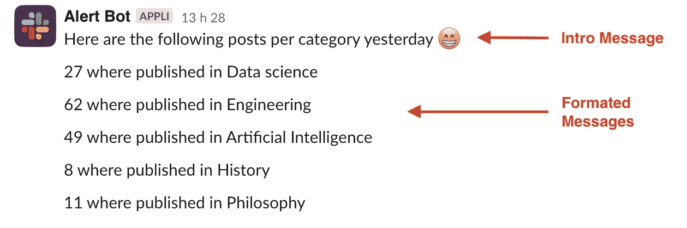

# 增长黑客:从 BigQuery (SQL)发送松弛警报

> 原文：<https://towardsdatascience.com/slack-alerts-from-a-sql-query-on-bigquery-f626b767304c?source=collection_archive---------8----------------------->

## 如何根据 SQL 查询的结果发送时差警报？

根据我们数据仓库中的数据发送松弛警报是我最喜欢的增长技巧之一。在过去 2 年多的时间里，它帮助我们的团队检测准备流失的用户，回收被遗弃的购物车，或者检测高质量的用户。而且反应要快！


图片由 [apassingstranger](https://pixabay.com/fr/users/apassingstranger-20265584/) 在 [Pixabay](https://pixabay.com) 上拍摄

首先，我们一直使用 [AirFlow](https://cloud.google.com/composer) 来执行 SQL，并根据结果向 Slack 发送警报。对于每个警报，我们必须创建一个新的 DAG。这对于 2 或 3 个警报来说是没问题的，但是随着我们的成长，这种方法变得混乱了。气流开始被警报 Dag 淹没，我们需要一种更快的方法来设置新的警报。

因此，我们创造了一个更好的系统，我将在本文中分享！😁


作者图片

# 它只需要一个主表

现在，根据 SQL 查询的结果建立一个新的时差警报只需要主表中的一行。

我们只需要插入要执行的 SQL 代码、CRON 触发器、要发送给 Slack 的格式化消息以及可选的 intro 消息。


作者截图

介绍消息(如果有)将首先发送。将为 SQL 查询产生的每一行发送格式化的消息。



作者图片

那么，让我们来深入研究一下这个系统吧！

# 体系结构


作者模式

该架构使用经典的生产者/消费者模式。它包括:

*   **云调度器:**启动系统。它定期调用我们的生产者，由 CRON 定义。
*   **主表:**包含要触发的警报的所有信息。托管在 BigQuery 上。
*   **Producer:** 查询主表，查找应该触发的警报，并将其推送到发布/订阅主题。
*   **消费者:**订阅发布/订阅以了解要执行的警报。执行 SQL 查询，并在必要时向 Slack 发送预警。
*   **Pub/sub:** 一个分离生产者和消费者的简单话题。

# 主表

主表包含所有关于预警的信息:
*要执行什么 SQL？什么时候执行？把结果送到哪里？等等。*

我决定在 BigQuery 上托管主表，但是您可以使用任何其他 SGBD。甚至 Google Sheet 也能工作。

我们的表具有以下结构:

*   **名称:**警报的名称。我们将使用它作为一个 ID，这样我们的生产者可以告诉我们的消费者执行哪个警报。*
*   **描述:**描述，用于提供信息。
*   **cron:** CRON 表达式，用于确定给定警报的执行频率。
*   **last_execution:** 记录一个警报的上次执行时间，这样我们就知道下一次什么时候执行它
*   **sql:** 要执行的 sql 代码。该 SQL 的结果将包含作为警报发送的数据
*   **intro_msg:** 可选地，我们可以决定用一条介绍消息来介绍我们的提醒。
*   **row_msg:** 在 Slack 中显示数据的格式化方式。
*   **通道:**我们希望在其中发送警报的空闲通道。

** BigQuery 不支持自动递增的 id 或唯一约束。因此，我们将通过名称来引用警报。确保你没有重复的。如果使用另一个 SGBDR，使用自动递增的整数作为 ID 可能更好。*

要创建主表，可以使用以下指令:

```
CREATE OR REPLACE TABLE [your_schema].master (
    name STRING,
    description STRING,
    cron STRING,
    last_execution datetime,
    sql STRING,
    intro_msg STRING,
    row_msg STRING,
    channel STRING
);
```

## **示例:基于中等帖子发送每日警报**

假设您想要在每天早上 7:00 执行 SQL 查询的**，并将格式化的结果发送到名为***# medium-alerts***的通道。**

```
## Number of posts by category published yesterday on medium
SELECT category, count(post_id) as nb_posts
FROM medium
WHERE publishing_date = DATE_ADD(CURRENT_DATE(), INTERVAL -1 DAY)
GROUP BY category
```

对于这种情况，执行将产生以下结果:


作者截图

根据期望的输出格式，每行:
`{nb_posts} where published in {category}`

**因此，主表需要包含以下记录:**


**因此，我们的时差警报将如下所示:**


作者图片

# 生产者和消费者

## GCP 服务帐户

首先，我们必须创建一个有权限运行我们系统的服务帐户。尽管有多种解决方案来处理这个问题，但让我们简化一下，创建一个包含这个项目所需的所有权限的服务帐户。

进入 **GCP** **IAM** (身份和访问管理)，导航至您的**服务账户**。创建一个新的服务帐户，并为其命名。

添加所需的权限。首先，您需要以下内容:

```
Cloud Functions Invoker
Pub/Sub Publisher
BigQuery Data Viewer
BigQuery Job User
```

因为您的消费者必须写入主表来更新最后的执行日期，所以您也可以授予`BigQuery Data Editor`权限。但是如果这样做，您的服务帐户将拥有对 BigQuery 中所有内容的写权限。为了加强安全性，我们可以在您的主表上直接在表级别应用这些权限。

为此，请转到 **BigQuery** ，打开您的主表，并点击 **Share** 。
授予您的服务帐户`BigQuery Data Editor`角色。


作者截图

## 发布/订阅

现在，您将不得不创建一个发布/订阅主题来分离您的生产者和您的消费者。只需转到 Pub/Sub，创建一个主题，并给它一个名称。


作者截图

## 生产者

我们的生产者将运行主表，并根据 CRON 表达式寻找要触发的警报。


作者截图

要设置您的生产者，只需进入 **GCP 云功能**，并创建一个新功能。

命名它(我已经选择称它为 BigqueryAlertProducer)，选择 HTTP 作为你的**触发类型**，选择**要求认证**来触发你的函数。

使用之前创建的**运行时服务帐户**。

然后，使用以下代码创建您的函数:

返回一个计数不是必须的，但是它可能有助于调试。不要忘记替换[您的项目]和[您的模式]。

将`get_alerts_to_execute`设置为进入终点。
添加到 **requirement.txt** 中的以下库:

```
google-cloud-bigquery
google-cloud-pubsub
croniter
```

## 消费者

我们的消费者将订阅 Pub/Sub，并执行通过主题收到的每个警报。为此，它必须从 BigQuery(主表)中读取 SQL 查询，执行它，如果需要，将格式化的结果发送到 Slack。最后，将警报的最后执行日期更新到主表中。


作者截图

再次，创建一个新的云函数。

命名它，选择 **Cloud Pub/Sub** 作为您的**触发器类型，**并选择之前创建的主题。

使用与生产者相同的**运行时服务帐户**。

然后，使用以下代码创建您的函数:

不要忘记替换您的 _PROJECT 和 _SCHEMA。

注意，我们必须将 SLACK_BOT_TOKEN 设置为环境变量。在下一步中，我们将创建机器人并获取令牌。然后，您必须编辑您的函数，将令牌添加到您的运行时环境变量中。

将`trigger_pubsub`设置为入口端点。
添加到 **requirement.txt** 中的以下库:

```
google-cloud-bigquery
google-cloud-pubsub
croniter
slack_sdk
```

## 调度程序

最后，让我们设置一个调度程序，它将每隔 X 分钟触发我们的生产者。

转到云调度程序，并创建一个新作业。给它一个名称和描述。然后，你必须通过一个 CRON 表达式来设置执行频率。比如用`*/10 * * * *`每 10mn 发射一次。这个网站可能对定义你的 CRON 表达式有很大的帮助。


作者截图

在**配置执行**部分，选择 **HTTP** 作为您的**目标类型**，选择 **POST** 作为您的 **HTTP 方法**，并复制/粘贴您的**生产者的 URL** 。

为了调用生产者云函数，您需要对 HTTP 请求进行身份验证。设置以下标题:

```
Content-Type: application/octet-stream
User-Agent: Google-Cloud-Scheduler
```

在**认证头**中，选择`Add OIDC token`。并选择您之前创建的服务帐户。


作者截图

# Slack 应用

这是最后一步！为了在空闲时发送警报，我们需要创建一个应用程序。

进入[https://api.slack.com/apps](https://api.slack.com/apps)，点击**创建新应用**。
选择从头开始创建**，给它一个名字并选择你的工作空间。**

**在应用程序基本信息页面中，您可以随意个性化您的机器人外观🤖**

**然后，使用左侧菜单导航至 **OAuth &权限**。在 Bot Token 作用域中，您需要添加两个作用域:`channel:read`和`chat:write`。**

****

**作者截图**

**向上滚动到您的工作区的 **OAuth 令牌**部分，并点击**安装到工作区**。按照流程安装您的应用程序。**

****

**作者截图**

**完成后，回到同一个部分，在这里你可以访问你的应用程序的 **Bot 用户 OAuth 令牌**。从`xoxb-...`开始。**

**这是您需要向您的消费者提供 Slack 访问权的令牌。复制它，编辑您的消费者函数，并将您的令牌添加到运行时环境变量中。**

**现在，您只需将您的应用程序添加到您想要发送警报的 Slack 频道。**

**就是这样！🎉🎉**

# **结论**

**现在，您已经有了一个功能齐全的松弛预警系统，它基于您将在数据库中定义的任何自定义查询。尽管我们在本文中使用了 BigQuery，但是您可以将完全相同的系统用于任何数据库或任何云提供商。将架构翻译成 AWS lambda 和 SQS 并不困难。**

**最后，正如我之前所说的:基于 SQL 的松弛警报是我最喜欢的基于数据的增长技巧之一。能够检测您的数据或重要用户行为的趋势，并通过专用渠道提供给您的团队，帮助我们防止客户流失，转化更多客户，等等💪**