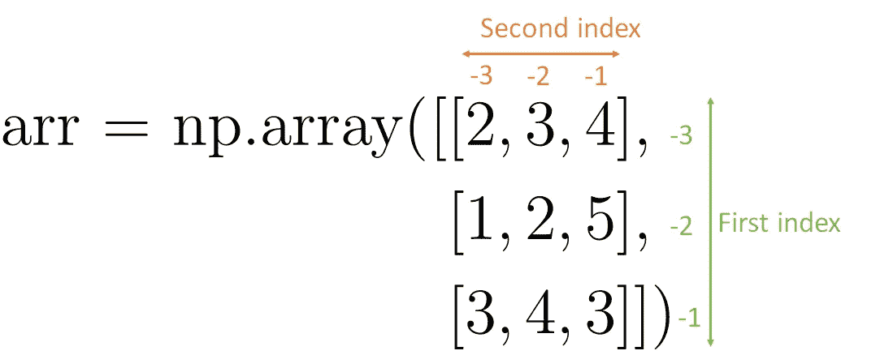

# 像专家一样分割 NumPy 数组

> 原文：<https://towardsdatascience.com/slicing-numpy-arrays-like-a-ninja-e4910670ceb0?source=collection_archive---------0----------------------->

## 终极 numpy 数组索引和切片指南

丹尼尔·林肯在 [Unsplash](https://unsplash.com?utm_source=medium&utm_medium=referral) 上的照片

# 介绍

> 分割 numpy 数组就像削水果一样。你切掉一部分，保留其余部分。numpy 忍者—

读完这篇文章后，你应该能够像切黄油一样切开数组。我将从解释如何从 numpy 数组中选择一个元素开始。然后我会告诉你如何分割一个一维数组。我将建立更多的维度，直到你能够分割任意维数的数组。在文章的最后，我想向您展示混合单一索引和切片减少了切片结果的维数。

# 选择单个元素

## 一维数组

一维 numpy 数组的索引从 0 开始。这意味着第一个元素的索引为 0。第二个元素的索引为 1，第三个元素的索引为 2，依此类推。

(图片由作者提供)

比方说，我想打印数字 7(这是第二个元素)。我通过**索引**方括号中的数组“arr”得到它。

## 二维数组

为了从二维数组中获取一个元素，我必须提供两个索引。

(图片由作者提供)

第一个索引总是沿着被最少括号包围的轴。

例如，要从这个数组中得到数字 5，必须先用第一个索引，然后用第二个索引来索引这个数组。

(图片由作者提供)

如果考虑按列组织的 2D 数组，可以认为第一个索引选择行，第二个索引选择列。

(图片由作者提供)

## 三维或多维数组

对于三维或多维数组，必须为每个维度提供一个索引。

(图片由作者提供)

第一个索引总是选择最外面的方括号内的元素。通过这种逻辑，您可以计算出任意数组中索引的顺序。

假设我想从这个数组中获取数字 10。在思想上，从整个数组开始，选择包含你想要的数字的部分，扔掉其余的。

(图片由作者提供)

所以要打印数组中的数字 10，我会使用索引 1，2，0。

(图片由作者提供)

## 用负指数倒数

您可以提供负索引以在数组中倒计数。最后一个索引的索引是-1，倒数第二个元素的索引是-2，依此类推。

## 一维的

(图片由作者提供)

## 二维的

(图片由作者提供)

## 立体的

(图片由作者提供)

## 结合正负指标

您总是可以结合正索引和负索引来选择数组中的元素。例如，如果我想打印以下数组中的数字 5，我可以用-2 作为第一个索引，用 2 作为第二个索引。

(图片由作者提供)

# 选择数组的一部分(=切片)

只选择数组的一部分称为**切片**。

## 一维数组

(图片由作者提供)

为了分割一维数组，我提供了一个由分号(:)分隔的开始和结束数字。然后，范围开始于结束号前的**起始号**和**。**

(图片由作者提供)

当我想从开始直到索引为 3 的元素获得整个数组时，我可以写:print(arr[0:4])。然而，这与以下情况相同:

(图片由作者提供)

类似地，为了从索引 1 一直到数组的末尾，我可以在不提供切片结束的情况下编写它。

(图片由作者提供)

为了打印完整的数组，我只使用冒号进行索引。

(图片由作者提供)

对于一维数组，以这种方式打印整个数组是没有意义的，而是使用 print(arr)直接打印数组。然而，当你分割一个数组时，它被复制。当您使用没有切片的原始数组时，情况并非如此。对于像打印这样的应用程序来说，这种差异无关紧要，但是对于修改数组的其他情况，这就很重要了。

## 二维数组

当我对 2D 数组进行切片时，我认为结果是所选行(第一个索引)和列(第二个索引)的交集。

(图片由作者提供)

当我只给 2D 数组的第一个索引时，它会返回一整行。例如，print(arr[1，])将与 print(arr[1])相同。

(图片由作者提供)

## **三维或多维数组**

三维或多维数组的切片遵循与 2D 数组相同的逻辑，但是我无法想象它的行和列。

(图片由作者提供)

我想以下面的方式分割 3D 或更多维的数组。我从最外面的括号开始，根据第一个索引从头到尾进行选择。然后我再深入一层括号，根据第二个索引从头到尾进行选择。

(图片由作者提供)

## 负索引切片

当使用负索引进行切片时，切片从开始处开始，并在结束之前的一个元素处结束，就像使用正索引一样。例如，如果我想打印(arr[-4:-1])最后一个要打印的元素的索引为-2。

(图片由作者提供)

## 组合切片和单一索引

请注意，当您同时使用单个索引和切片时，您会损失维度。更具体地说，您在使用单一索引的地方失去了维度。让我们考虑下面的例子:

(图片由作者提供)

第三维度会降低。这是有意义的，因为只有一个元素不需要最内部段周围的括号，numpy 将删除它们。得到的数组将是 2D。

(图片由作者提供)

你总是可以用负指数作为开始，用正指数作为结束。但是，请确保起始索引处的元素必须位于结束索引处的元素的左侧。否则你会得到一个空数组。

# 摘要

读完这篇文章后，你应该知道的要点应该是。

*   数组的索引从 0 开始。
*   如果你想从一个数组中得到一个数字，你必须给出和数组维数一样多的索引。
*   通过给定由冒号(:)分隔的开始和结束索引来分割数组。你将得到从开始索引到结束索引前一个元素的元素
*   要从开始切片，您只需不指定开始。要从末端切片，只需不指定末端即可。如果您想要一个维度中的每个元素，您既不需要开始也不需要结束，只需要写一个冒号(:)
*   对 2D 数组进行切片时，您可以将结果想象为所选行和所选列的交集。

# **想联系和支持我？**

领英
[https://www.linkedin.com/in/vincent-m%C3%BCller-6b3542214/](https://www.linkedin.com/in/vincent-m%C3%BCller-6b3542214/)
脸书
[https://www.facebook.com/profile.php?id=100072095823739](https://www.facebook.com/profile.php?id=100072095823739)
推特
[https://twitter.com/Vincent02770108](https://twitter.com/Vincent02770108)
中等
[https://medium.com/@Vincent.Mueller](https://medium.com/@Vincent.Mueller)
成为中等会员并支持我(你的部分会员费直接归我)
[https://medium.com/@Vincent.Mueller/membership](https://medium.com/@Vincent.Mueller/membership)

# 相关故事

</np-reshape-in-python-39b4636d7d91>  </matrix-calculus-for-data-scientists-6f0990b9c222>  </backpropagation-in-neural-networks-6561e1268da8>  

# 其他故事

</eigenvalues-and-eigenvectors-378e851bf372>  </support-vector-machines-illustrated-b48a32c56388>  </how-you-can-use-gpt-j-9c4299dd8526> 