# 使用 Python 的 Matplotlib 绘制坡度图

> 原文：<https://towardsdatascience.com/slope-charts-with-pythons-matplotlib-2c3456c137b8?source=collection_archive---------11----------------------->

## 如何绘制这个简单的图表来显示变化和层次

斜率图有一种简单明了的格式，可以毫不费力地说明变化和排列变量，它不仅仅是一种过分美化的折线图。

它们已经在数据可视化中赢得了一席之地，可以成为您的报告和仪表板的重要补充。

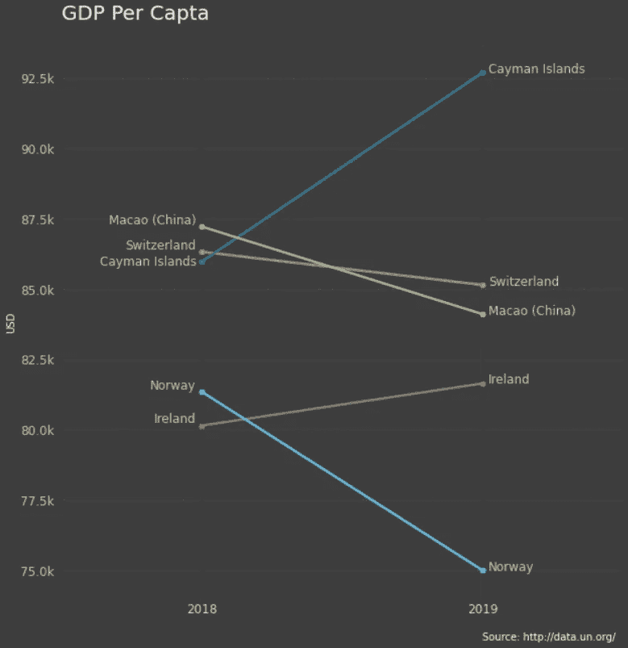

斜率表—图片由作者提供

在本文中，我们将探索如何用 Matplotlib 绘制它们，了解设计它们的不同方法，以及它们与其他数据可视化的比较。

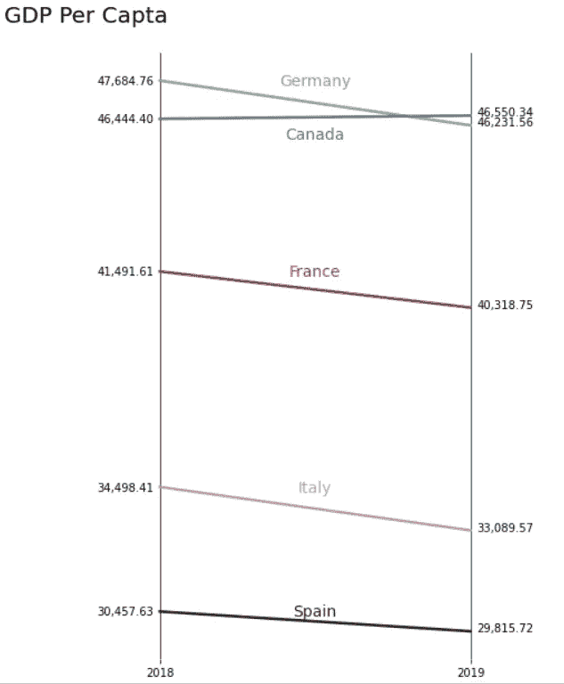

斜率表—图片由作者提供

## 入门指南

我们将在下面的例子中使用的数据是来自联合国的人均 GDP。我用过滤器只下载了 2018 年和 2019 年的数据。

```
import pandas as pd
import matplotlib.pyplot as pltdf = pd.read_csv('../data/UNdata_gdp.csv')
df.head()
```

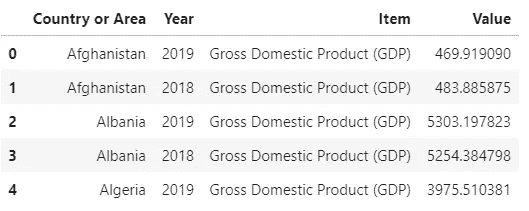

让我们从绘制一个国家的单线图开始。

```
temp = df[df['Country or Area'] == 'Switzerland']
plt.plot(temp.Year, temp.Value)plt.show()
```

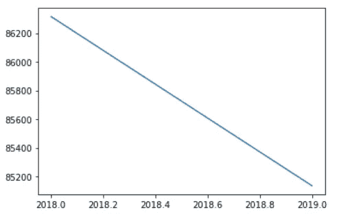

简单折线图—图片由作者提供

我们需要为一系列国家重复这一过程，以绘制其他线条。我们还可以开始准备可视化布局，方法是添加一个具有自定义大小的图形，固定 x 刻度，并增加 x 轴上的空间以添加标签。

线条起点和终点的标签是斜率表的一个显著特征；它们可以显示不同的信息来满足我们可视化的目的。

```
countries = ['Ireland', 'Norway',
             'Switzerland', 'Cayman Islands',
             'China, Macao Special Administrative Region']fig, ax = plt.subplots(1, figsize=(10,10))for i in countries:
    temp = df[df['Country or Area'] == i]
    plt.plot(temp.Year, temp.Value)

plt.xlim(2017.5,2019.5)
plt.xticks([2018, 2019])plt.show()
```

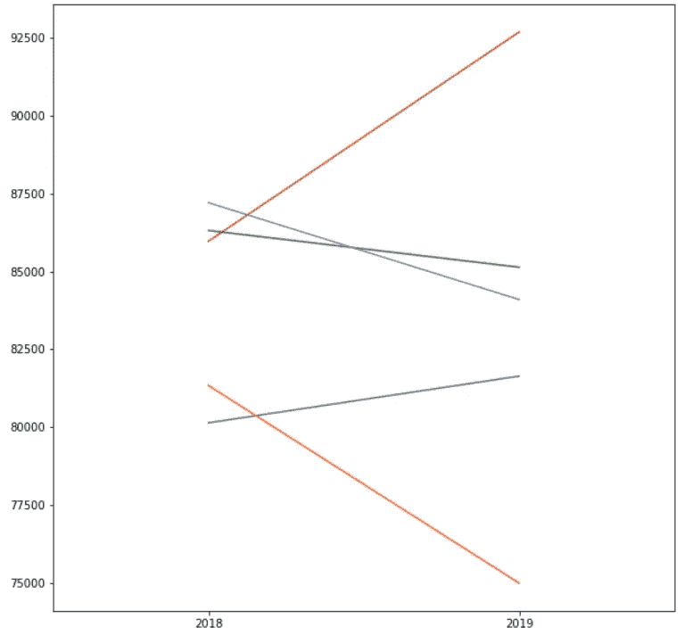

矩形中的一些线条——作者图片

酷，它开始看起来更像一个斜率图，但我们还没有到那一步。

让我们添加标签并格式化 y 刻度。

```
countries = ['Ireland', 'Norway',
             'Switzerland', 'Cayman Islands',
             'China, Macao Special Administrative Region']fig, ax = plt.subplots(1, figsize=(10,10))for i in countries:
    # get a single country from the list
    temp = df[df['Country or Area'] == i]
    # plot the lines
    plt.plot(temp.Year, temp.Value, marker='o', markersize=5)
    # replace large labels
    if i == 'China, Macao Special Administrative Region':
        i = 'Macao (China)'
    # end label
    plt.text(temp.Year.values[0]+0.02, temp.Value.values[0], i)
    # start label
    plt.text(temp.Year.values[1]-0.02, temp.Value.values[1], i, ha='right')

# x limits, x ticks, and y label 
plt.xlim(2017.5,2019.5)
plt.xticks([2018, 2019])# get y ticks, replace 1,000 with k, and draw the ticks
yticks = plt.yticks()[0]
plt.yticks(yticks, ['{}k'.format(i/1000) for i in yticks])plt.show()
```

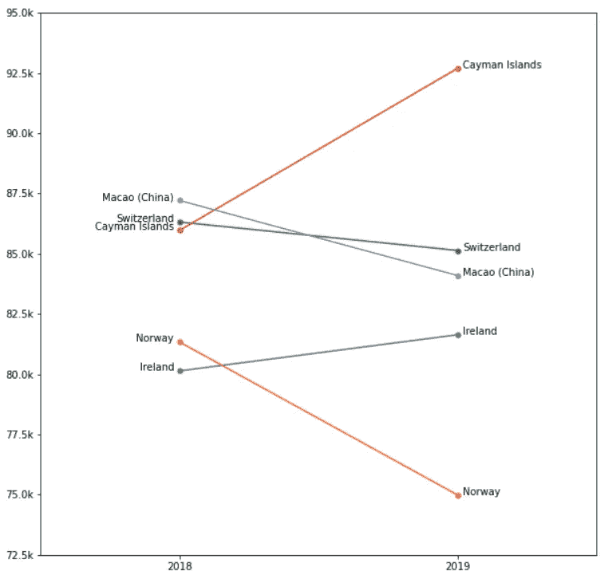

斜率表—图片由作者提供

就是这样！我们有一张斜率表。

带有国家/地区名称的标签使得跟踪信息变得非常容易，比传说更容易理解。它还对变化前后的变量进行排序。

## 定制的

在探索其他应用之前，让我们为斜率表添加更多的细节。

我们将删除书脊，添加网格线，y 轴标签，标题，并改变一些颜色。

```
countries = ['Ireland', 'Norway',
             'Switzerland', 'Cayman Islands',
             'China, Macao Special Administrative Region']colors = ['#769465', '#69BDE0', '#E06D5E', '#2F7694', '#94E069']fig, ax = plt.subplots(1, figsize=(10,10), facecolor='darkgrey')
ax.set_facecolor('darkgrey')
for i, v in enumerate(countries):
    # get a single country from the list
    temp = df[df['Country or Area'] == v]
    # plot the lines
    plt.plot(temp.Year, temp.Value, 
             color=colors[i], lw=2.5, 
             marker='o', markersize=5)
    # replace large labels
    if v == 'China, Macao Special Administrative Region':
        v = 'Macao (China)'
    # end label
    plt.text(temp.Year.values[0]+0.02, temp.Value.values[0], v)
    # start label
    plt.text(temp.Year.values[1]-0.02, temp.Value.values[1], v, ha='right')

# x limits, x ticks, and y label 
plt.xlim(2017.5,2019.5)
plt.xticks([2018, 2019])
plt.ylabel('USD')
# get y ticks, replace 1,000 with k, and draw the ticks
yticks = plt.yticks()[0]
plt.yticks(yticks[1:-1], ['{}k'.format(i/1000) for i in yticks[1:-1]])# grid
ax.xaxis.grid(color='black', linestyle='solid', which='both', alpha=0.9)
ax.yaxis.grid(color='black', linestyle='dashed', which='both', alpha=0.1)# remove spines
ax.spines['right'].set_visible(False)
ax.spines['left'].set_visible(False)
ax.spines['bottom'].set_visible(False)
ax.spines['top'].set_visible(False)plt.title('GDP Per Capta\n', loc='left', fontsize=20)
plt.show()
```

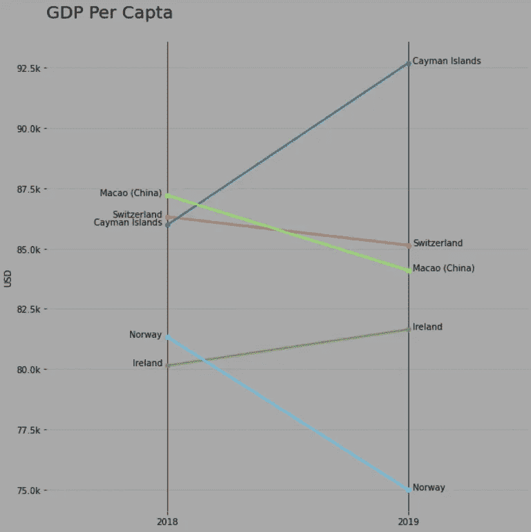

斜率表—图片由作者提供

标签通常用于两个主要目的，命名线或显示值。

有时，知道确切的值对我们的 viz 是必不可少的，我们可能需要牺牲名称来显示它们。

```
countries = ['Ireland', 'Norway',
             'Switzerland', 'Cayman Islands',
             'China, Macao Special Administrative Region']colors = ['#769465', '#69BDE0', '#E06D5E', '#2F7694', '#94E069']fig, ax = plt.subplots(1, figsize=(10,10), facecolor='darkgrey')
ax.set_facecolor('darkgrey')
for i, v in enumerate(countries):
    temp = df[df['Country or Area'] == v]
    plt.plot(temp.Year, temp.Value, color=colors[i], lw=2.5)

    plt.text(temp.Year.values[0]+0.02, 
             temp.Value.values[0], 
             '{:,.2f}'.format(temp.Value.values[0]))

    plt.text(temp.Year.values[1]-0.02, 
             temp.Value.values[1], 
             '{:,.2f}'.format(temp.Value.values[1]), va='center', ha='right')plt.xlim(2017.5,2019.5)
plt.xticks([2018, 2019])
yticks = plt.yticks()[0]
plt.yticks([])# grid
ax.xaxis.grid(color='black', linestyle='solid', which='both', alpha=0.9)# remove spines
ax.spines['right'].set_visible(False)
ax.spines['left'].set_visible(False)
ax.spines['bottom'].set_visible(False)
ax.spines['top'].set_visible(False)plt.title('GDP Per Capta\n', loc='left', fontsize=20)for i, v in enumerate(countries):
    if v == 'China, Macao Special Administrative Region':
        countries[i] = 'Macao (China)'plt.legend(countries, loc='upper left', frameon=False)
plt.show()
```

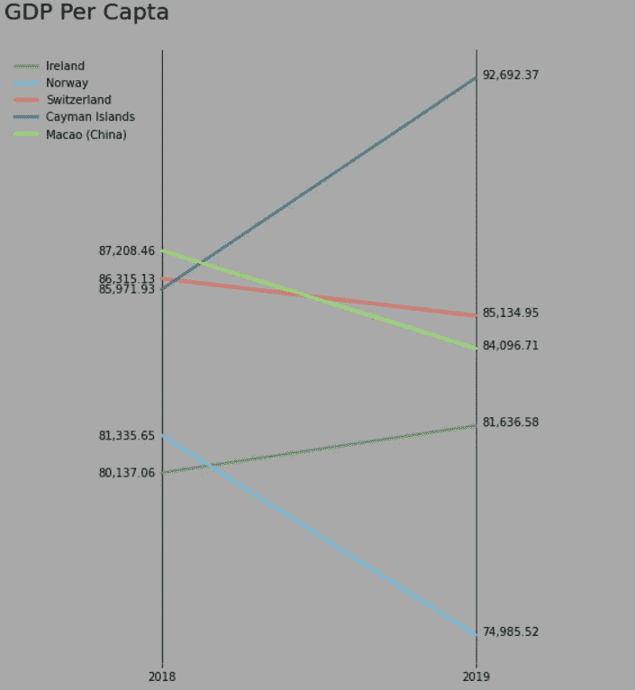

斜率表—图片由作者提供

仍然很容易理解每行代表什么，但是当我们使用图例而不是标签时，排名就不那么明确了。

在某些情况下，我们也许能够鱼和熊掌兼得，但这取决于数据。也就是说——如果这些行的间距足够大，你就可以把名字写在它们的上面或下面。

```
colors = ['#87B38D', '#477998', '#291F1E', '#BC9CB0', '#A3333D']countries = ['Germany', 'Canada',
             'Spain', 'Italy', 'France']fig, ax = plt.subplots(1, figsize=(10,10))for i, v in enumerate(countries):
    temp = df[df['Country or Area'] == v]
    plt.plot(temp.Year, temp.Value, color=colors[i], lw=2.5)

    plt.text(temp.Year.values[0]+0.02, 
             temp.Value.values[0], 
             '{:,.2f}'.format(temp.Value.values[0]))

    plt.text(temp.Year.values[1]-0.02, 
             temp.Value.values[1], 
             '{:,.2f}'.format(temp.Value.values[1]), 
             va='center', ha='right')

    correction = 0
    if v == 'Canada': correction = 500
    plt.text(2018.5, 
             temp.Value.values[1] - correction, 
             v, color=colors[i],
             va='center', ha='center', fontsize=14)plt.xlim(2017.5,2019.5)
plt.xticks([2018, 2019])
plt.yticks([])# grid
ax.xaxis.grid(color='black', linestyle='solid', 
              which='both', alpha=0.9)# remove spines
ax.spines['right'].set_visible(False)
ax.spines['left'].set_visible(False)
ax.spines['bottom'].set_visible(False)
ax.spines['top'].set_visible(False)plt.title('GDP Per Capta\n', loc='left', fontsize=20)plt.show()
```


斜率表—图片由作者提供

斜率表通常很简单，有几种不同的方法，它们可能需要一些调整来适应你的解决方案，但总的来说，你可以用很少的元素得到一个有意义的图表。

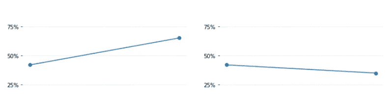

斜率表—图片由作者提供

## 其他方法

毫无疑问，您可以将变化可视化，并使用其他数据可视化显示相同的信息。

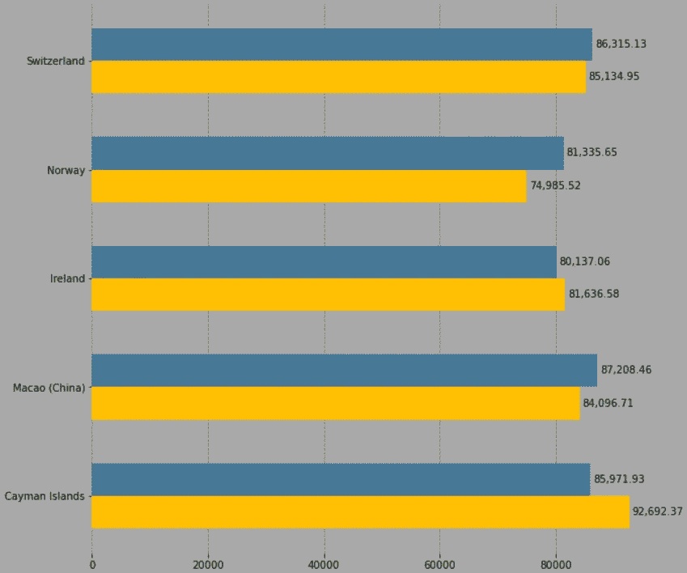

条形图—作者提供的图片

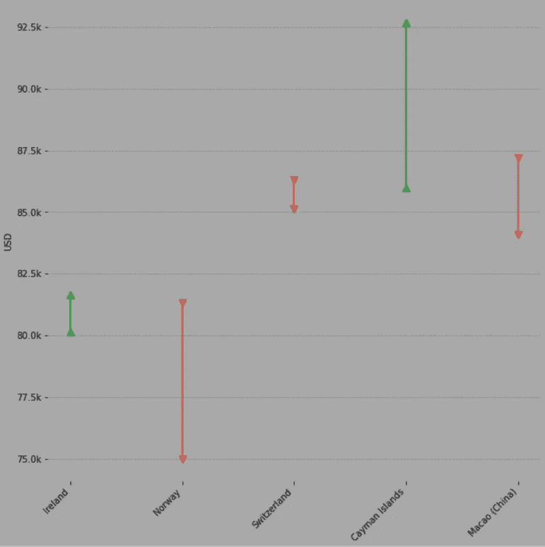

箭头图—作者图片

使用条形图和箭头图，您可以按初始值、终值或变化量/百分比对数据进行排序。你需要多个图表来显示前后的排名，但这是不一样的。

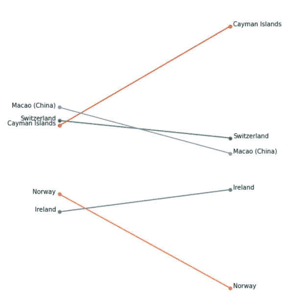

没有什么能像斜率表那样自然地显示排名。

即使变量的顺序对您的可视化并不重要，但斜率表在传达变化和为您的报告和仪表板增加多样性方面做得很好。

您可以在这里找到本文[中使用的所有可视化代码。](https://github.com/Thiagobc23/slope-charts-Matplotlib)

感谢阅读我的文章。我希望你喜欢它。

[更多 Python DataViz 教程](https://linktr.ee/admin/settings#Settings--SocialLinks)。