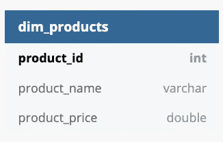
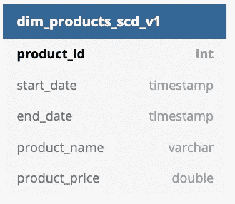
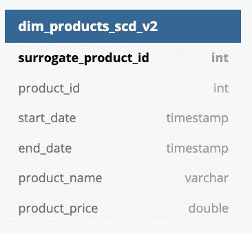
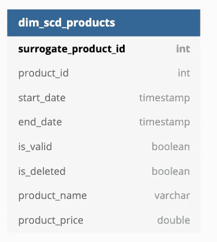

# Spark 中渐变维度类型 2

> 原文：<https://towardsdatascience.com/slowly-changing-dimension-type-2-in-spark-7d5865ac915b?source=collection_archive---------7----------------------->

资料照片由[尤金·日夫奇克](https://unsplash.com/@eugenezhyvchik?utm_source=unsplash&utm_medium=referral&utm_content=creditCopyText)在 [Unsplash](https://unsplash.com/s/photos/evolution?utm_source=unsplash&utm_medium=referral&utm_content=creditCopyText) 拍摄

## [理解大数据](https://towardsdatascience.com/tagged/making-sense-of-big-data)

## 介绍什么是渐变维度类型 2 以及如何用 Apache Spark 创建它

# 介绍

如果这不是你第一次阅读我的帖子，你知道在我进入大数据世界之前，我是一名传统的 DWH/BI 开发人员。使用数据湖，我们的工作方式与我以前不同。所以过了一段时间后，我决定回到“我的根源”,写了一篇数据仓库指南的博文。现在我将再次回到这个话题，解释渐变维度(SCD ),尤其是关于 Type 2，并提供一些关于如何在 Apache Spark 中实现它的代码，以及与关系数据库相比的一些关键差异。

# 什么是 SCD？

如果您是数据仓库领域的新手，它可能听起来像某种疾病的缩写，但实际上，它是一个能够跟踪事物如何随时间变化的表。

SCD 有多种类型。即:

*   那些只保留原始数据的—不可变的
*   那些只保留当前值的
*   具有当前值和先前值等。

如果你想了解更多，金博尔集团有一个关于不同类型 SCD 的很好的[设计技巧](https://www.kimballgroup.com/2013/02/design-tip-152-slowly-changing-dimension-types-0-4-5-6-7/)。尽管就我所知，这取决于你使用的是什么资源，类型可能有不同的含义:在一个上下文中，它在另一个上下文中意味着一件事——方式不同的方法。

# 那么我说的 2 型是什么呢？

想象一下我们有产品维度。我通过 dbdiagram.io 工具创建了所有表格插图！

产品维度。作者图片

我们可能想看看产品的名称或价格如何影响我们的销售。当然，你可能会认为我在胡说八道，因为产品价格对销售有着巨大的影响，而产品名称可能与此毫无关系。但与我裸露；这只是一个展示 SCD 类型 2 如何工作的例子。

因此，想象一下，如果我们每天都在构建我们的维度，并且我们注意到一些信息发生了变化，但是因为我们只是加载快照值，所以我们看不到变化的内容和原因。因此，在这种情况下，当该行有效时，我们添加生效日期。

具有生效日期的产品维度。作者图片

好了，现在发生的情况是，我们的表中没有主键，因为我们现在将有多个 product_id。为了解决这个问题，我们可以创建一个代理键，通过 join on 键和事实发生的日期，我们可以轻松地将它添加到事实表中。

具有代理键的产品维度。作者图片

但是如果我们的一个产品因为某种原因被删除了会怎么样呢？是的，我们应该通过添加一个标志 **is_deleted 来确定它是否被删除。**

但是等等，现在要获得当前值以进行快速分析，我们必须在 end_date 扫描所有表(如果它是 null 或者设置为 2999–12–31)？是的，这听起来也不太有效，所以让我们添加另一个标志，**是有效的。**

因此，我们的终端 SCD 类型 2 应该看起来像:

最终 SCD。作者图片

# Apache Spark 中的实现

你可能会想，我们在 RDBMS 中有 MERGE 命令，我们可以很容易地做到这一点。是的，您可以，但是您最有可能操作的是镶木地板(或任何其他类型的文件)。或者，如果你足够幸运，你的公司有像 [Apache 胡迪](https://hudi.apache.org/)/[Delta](https://delta.io/)/[Apache Iceberg](https://iceberg.apache.org/)这样的表格格式，这样你就可以在那里利用类似的特性。

但是让我们假设您没有任何其他选择，只能用最简单的步骤创建 SCD。

声明我的代码与我之前解释的不同之处:

1.  在我的代码中，我没有使用 is_valid 标志；我将传递 end _ date = 2999–12–31，它将标识当前有效的行。
2.  此外，我还添加了 open_reason 和 close_reason 来标识一行被打开和关闭的原因。
3.  我也不会为一个表添加一个代理键来进行 PK

## 先决条件

如果一行发生了变化，我们需要的第一件事是更容易识别——get _ values _ hash 方法。我更喜欢 MD5，在使用 MS SQL stack 构建数据保险库模型时，我广泛使用了 MD5，但这次我有点懒，没有找到它，而是使用了一个简单的**散列。**

哈希值方法

我们还需要确保当前快照中的列在 SCD 中没有相同的名称，以避免重复的列错误:

列重命名方法

我们还需要一个分割器来识别哪些行应该被检查更改——只检查打开的行。我们根本不应该碰历史记录。

从现有 SCD 打开和关闭行拆分器。

## 新行

所以新行非常简单；我们添加 SCD 列，如 is_valid、start_date、close_date、open_reason、close_reason。我还添加了一些特定的处理程序。如果某些数据到达较晚或有特定的列，我们应该使用它作为开放日期，而不是当前日期。

## 删除的行

我们从现有的 SCD 中取出打开的行，并只在删除的行上创建它们的副本。关闭 SCD 中已打开的文件，并向新打开的文件添加相关数据(is_deleted flag = 1，end _ date = 2999–12–31 ),并将其合并回一个数据帧。

处理删除的行

## 已更新或未更改的行

所以这个有点复杂，主要是因为这个，我们有那些先决条件的方法。

首先，我们识别没有改变的记录，并把它们放在一边；他们会像以前一样。

第二，我们通过比较记录值的散列来处理更改的记录。为了避免两次读取相同的源，我使用了一个作弊方法，结果证明在较小的表中效率非常高(我还没有在较大的表上试过)=我添加了一个包含两个值(0，1)的数组列，稍后我将展开它，有条件地处理这两种情况。因此，在旧行上添加日期更改，打开包含所有相关元数据的新行，并联合所有三个数据框(无更改、来自 SCD 的更新更改、来自快照的新值)。

所以整个过程看起来是这样的:

# 摘要

在本文中，您已经简要介绍了 SCD type 2，并且知道如果您的表存储在 parquet 文件中(不使用任何表格式)，如何使用 Apache Spark 创建它。

值得一提的是，代码并非完美无瑕。

*   添加代理键以便在事实数据表中使用
*   我假设删除该行后，它将不再出现，因此在这种情况下，代码将不会以正确的方式工作。
*   添加 is_valid 标志，不处理与 bool/int 相比过滤效率不高的日期。
*   添加一些缓存/广播/洗牌分区选项，用一些参数提高性能。

你可以在我的 [GitHub](https://github.com/TomasPel/BlogPosts/tree/master/slowly_changing_dimension) 中找到我开发时使用的一些测试的完整代码。