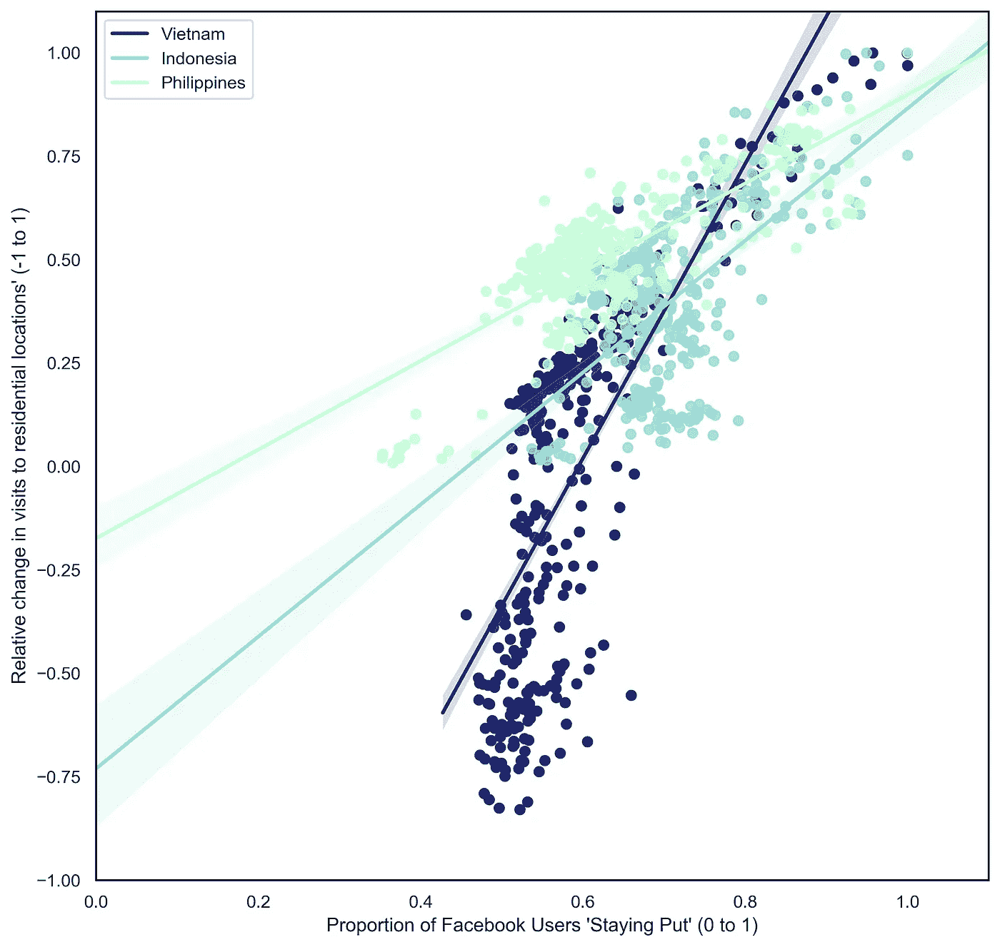

# 智能手机位置数据代表谁？

> 原文：<https://towardsdatascience.com/small-districts-big-data-who-does-geo-referenced-mobility-data-represent-78212ca004f6?source=collection_archive---------58----------------------->

## [实践教程](https://towardsdatascience.com/tagged/hands-on-tutorials)

## 脸书数据的快速验证

> 这项工作已经完全使用公开数据完成，并与 [Kai Kaiser](https://medium.com/@kaialexander.kaiser/about) 合著。所有错误和遗漏都是作者的。

在危机情况下，政府和国际救济组织传统上依赖行政报告和调查数据。这些数据被用来为自然灾害或公共卫生危机等冲击的出现、应对和恢复提供信息。然而，尽管可以仔细收集传统数据并专门用于衡量灾害的各种社会经济层面，但它面临着局限性。它可能不常见，实施成本高，易受滞后影响，并且在更高的空间粒度级别上可能不具有代表性。此外，许多发展中国家的系统根本没有能力在面对意料之外的发展时衡量和迅速提供这些数据。

# 智能手机设备的激增导致了数据收集模式的转变

包含 GPS 技术的设备使得以前所未有的规模和频率测量人类运动成为可能。越来越多的科技公司，如[脸书](https://dataforgood.fb.com/)、[谷歌](https://www.google.com/covid19/mobility/)和[苹果](https://covid19.apple.com/mobility)，以及应用集成或地图提供商，如 [Unacast](https://www.unacast.com/data-for-good) 、 [Cuebiq](https://www.cuebiq.com/visitation-insights-covid19/) 和 [Mapbox](https://www.mapbox.com/movement-data) ，已经将这些数据资产提供给人道主义社区，作为“数据为善”运动的一部分——由新冠肺炎加速。虽然不是专门为风险管理而构建的，但从位置数据中获得的数据集具有很高的空间精度，并且经常更新(通常是每天或甚至每 8 小时更新一次)。此外，它们往往由同一提供者同时为几个国家提供，这种方法和衡量的一致性在传统数据中并不常见。

对于依赖传统流动性指标的决策者来说，这可能会改变游戏规则。例如，一些数据集可以在网格块或像素级别获得，通常尺寸约为 1 公里 x 1 公里，并且可以根据感兴趣的区域任意向上聚合。这使得能够将精细的移动数据映射到越来越小的感兴趣的镜头，例如越南的选区/社区、巴基斯坦的工会理事会或美国的人口普查区。

# 成败的问题是:这些数据代表谁？

如果携带智能手机或基于 GPS 的设备被要求包含在这些数据中，不可避免地，这些数据将倾向于支付能力。此外，在低收入国家，如果只有一名家庭成员拥有智能手机(相比之下，美国有三分之一的家庭拥有三部或更多智能手机)，数据也可能倾向于“养家糊口的人”，因此也存在性别差异。对基于全球定位系统的数据的代表性如何进行频繁、可访问的分析仍然至关重要，特别是如果要将其应用于风险缓解政策。

全球可用的地理空间层(人口统计、性别和建筑足迹)的可用性使得有可能快速量化代表性，并对这些数据进行比较性国家验证。

# 深入了解脸书移动数据

鉴于移动性数据在公共政策中的大量可能应用，我们[采用了](https://www.mdpi.com/2220-9964/10/2/73)一种快速且可复制的评估方法，为不同地方背景下的移动性数据设定基准。下面应用这种方法来了解脸书痕迹在当地居民以及流动人口(如游客或流离失所者)中的代表性。我们选择脸书数据是因为它有一个庞大的用户群体，已经在用它来回答政策问题。

讨论了脸书为移动性分析提供的两个主要产品。首先，*移动范围图*测量行政单位级别的移动性。[该数据集可证明有助于快速评估灾害影响](/the-digital-tailwinds-of-pandemics-and-typhoons-cross-border-insights-from-facebook-mobility-data-763c493b5ecc)。其次，*脸书灾难地图*提供了脸书用户的数量，而不是行政边界级别，而是 Bing 瓦片，大小从 600 米 x600 米开始。这些磁贴可以根据感兴趣的区域任意向上聚合，例如在移动范围地图的情况下，移动范围地图是根据脸书用户在给定时间段内访问的 Bing 磁贴数量构建的[聚合指标](https://research.fb.com/blog/2020/06/protecting-privacy-in-facebook-mobility-data-during-the-covid-19-response/)。

**图一。**一个散点图，展示了脸书和谷歌在越南(R 平方= 0.77)、印尼(R 平方= 0.60)和菲律宾(R 平方= 0.79)的数据之间的密切关系。作者准备的图表。

使用*运动范围图*，可以进行快速验证步骤。我们发现*停留*指标，或“脸书用户全天停留在一个磁贴上的比率”，与[谷歌社区移动地图](https://www.google.com/covid19/mobility/)提供的居民访问数据高度相关。图 1 展示了三个太平洋国家的一致性:越南、印度尼西亚和菲律宾。

就全球覆盖范围而言，谷歌和脸书的移动数据在大多数国家往往是相互关联的，如图 2 所示。这表明了科技公司提供的数据集在表现*上的一致性，并激发了对这些数据集如何串联使用的进一步研究。*

虽然这些数据不一定包括没有携带智能手机的人，但它确实表明了一个有希望的结果:在各个平台上，两个主要移动数据集——脸书移动范围地图和谷歌社区移动报告——的空间分布高度相关。这是利用这些数据集为人道主义工作建立信心的重要一步。

**图二。**当全天停留在一个单幅图块中的用户数量(脸书移动范围地图指标)与访问住宅位置的百分比变化(由 Google COVID 社区移动地图提供)进行比较时，我们发现在大多数国家中存在中度到非常强的相关性。图片作者。

# **感兴趣的用户如何访问这些数据？**

运动范围地图是一个[开放数据集](https://data.humdata.org/dataset/movement-range-maps)，在地区级别可用。随着越来越多的移动产品本着数据为善的精神提供给人道主义界，开展快速验证工作以使这些数据可操作将成为基础。