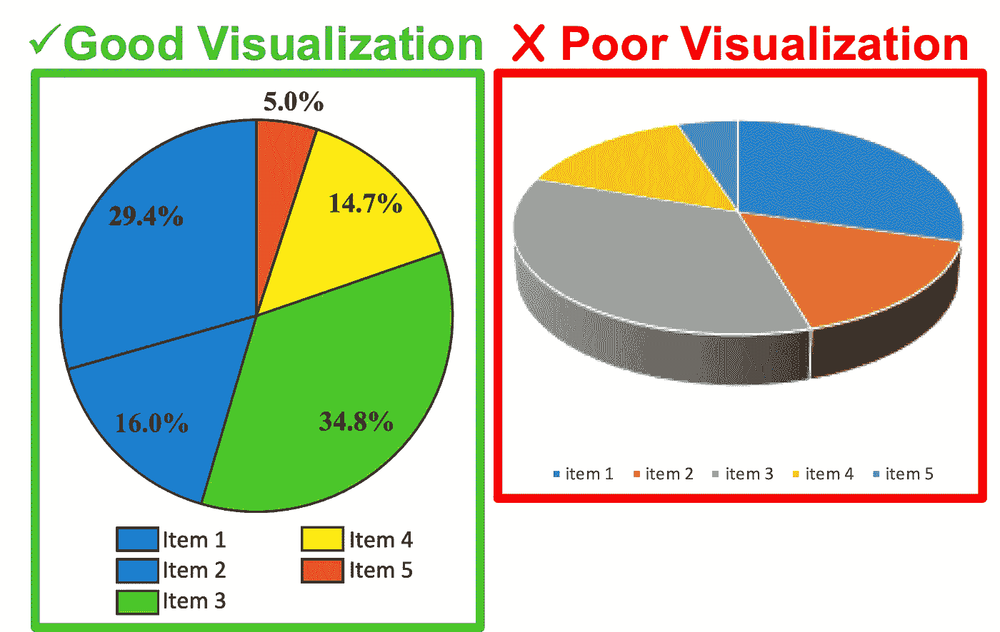
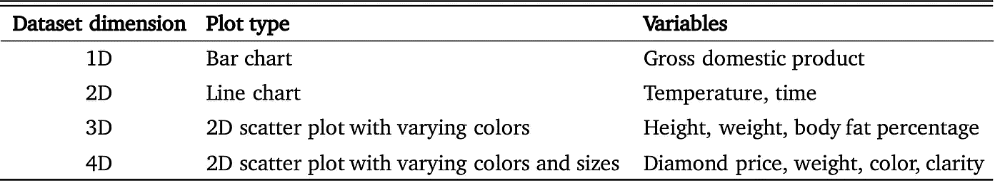
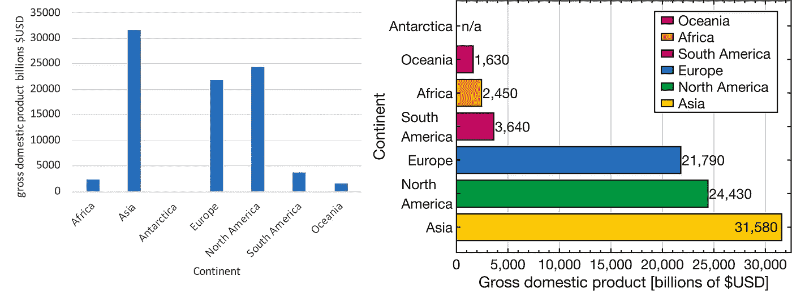
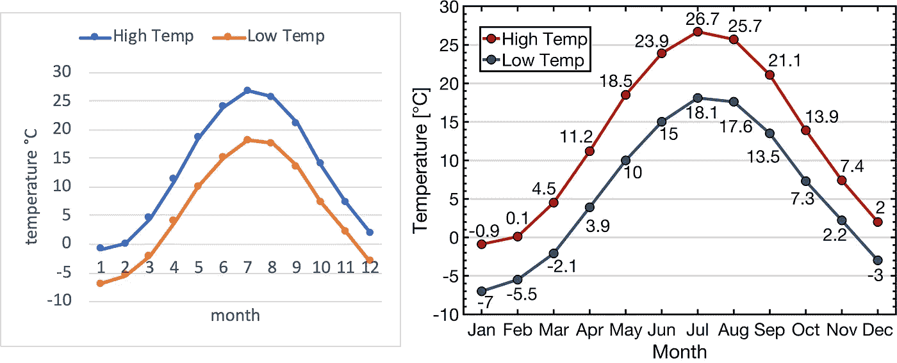
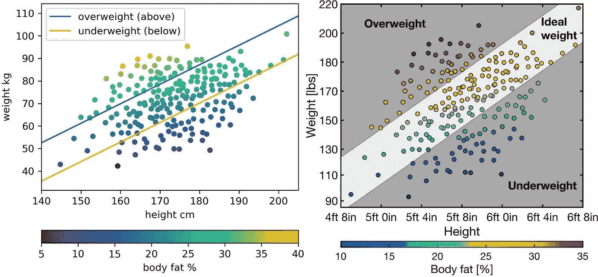
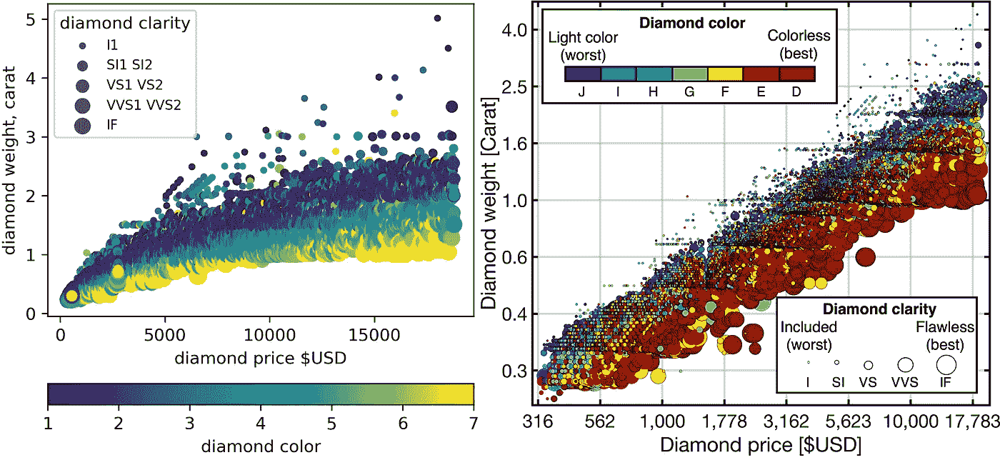

# 迈向更直观、更美观的图形的一小步

> 原文：<https://towardsdatascience.com/small-steps-towards-more-intuitive-and-aesthetic-graphics-723e658ecd0?source=collection_archive---------60----------------------->

## 微小的图形修改和可视化决策如何能够产生更清晰、更具信息性的图形

作者图片

数据可视化领域始于 18 世纪晚期 William Playfair 对基本图形设计的开发，并且已经发展到每年发布数万亿统计图形图像的程度。在当前的信息时代，随着数据集变得越来越大、越来越复杂，良好的数据可视化技能变得越来越重要。

> 不考虑目标用途，最有效的设计数据图形是传达预期信息的最简单的图形。因此，将数据可视化视为一门科学和一门艺术是很重要的，因为有效的量化图形必须简单而准确地传达数据，同时具有美感。

有很多关于如何对图形进行一般改进的教程，比如为了清晰起见而处理字体大小、标记大小、标签、图例和颜色。今天可用的许多编程语言和可视化软件对于生成定量图形来说都是极好的，但是这些工具可以通过根据被可视化的数据实现简单的改变来更好地使用。没有多少人会考虑绘制的数据类型如何影响可视化决策，从而为读者提供更清晰、更丰富的图形。

# 让图表更直观

有几种不同的方法可以改善图形的外观。可视化决策，如选择线的颜色，可能看起来不太重要，但在时间-温度图中，将较高的温度改为红线，将较低的温度改为蓝线，可能会使读者更容易理解该图。

以下是四个不同数据集上的四个好的和差的可视化例子，这些数据集的维度不断增加。下表总结了用作示例的数字和变量的类型。

注意，具有更高维度的数据集更复杂，并且通常由更多绘图参数组成，用于可视化附加变量。

## 一维图形

各大洲的国内生产总值数据被用来生成 1D 案例的柱状图。下图比较了左边差的图形和右边好的图形。

各大洲的国内生产总值数据绘制在左侧的穷人图和右侧的风格图中。作者图片

为改善量化图的外观所做的具体修改包括按升序对数据进行排序，对每个洲进行颜色编码，并在每个条形的末尾添加数据标签。

## 二维图形

2D 图是一个合成的时间-温度线图，显示了一个城市全年的月温度。下图比较了左边差的图形和右边好的图形。

北美某城市的合成温度数据绘制在左侧的劣质图和右侧的样式图中。作者图片

为改善定量图形的外观而进行的修改包括更改线条颜色以使其更加直观(红色表示高点，蓝色表示低点)，移动轴和图例以减少空白，将月份数字更改为月份名称，以及为每个点添加数据标签。

## 三维图形

3D 图是一个合成散点图，显示了健身房会员的身高、体重和体脂百分比。下图比较了左边差的图形和右边好的图形。

合成的身高、体重和体脂百分比数据绘制在左侧的穷人图和右侧的风格图中。作者图片

为改善定量图形的外观所做的修改包括将线条改为灰度背景，以更好地突出代表区域，移动轴以减少空白，将体重和身高的单位从 kg 和 cm 改为 lbs 和 ft，使用增加了颜色范围的颜色条，以及设置颜色条值的限制。

## 四维图形

4D 图是一个散点图，显示了大约 54，000 颗钻石的价格、重量、颜色和净度。下图比较了左边差的图形和右边好的图形。

钻石的重量、价格、颜色和净度数据绘制在左侧的穷人图和右侧的风格图中。作者图片

为改善定量图形的外观而进行的修改包括:缩放数据以更好地显示具有不同属性的钻石，移动轴以减少空白，将轴更改为对数刻度，因为数据更呈对数正态分布，在轴上添加均匀间隔的刻度，根据透明度对数据进行分类，以使较大的点绘制在较小的点下面， 用黑边包围每个点以增加与其他数据点的视觉对比，添加额外的注释以帮助读者识别哪个钻石颜色和净度值更好，以及使用具有更大颜色范围的颜色条。

# 摘要

这里介绍的四个示例比较了使用默认设置生成的图形和改进外观并创建更清晰、信息量更大的图的图形样式。虽然具体的改进取决于所绘制的数据类型，但是可以进行一些一般性的更改来改善图形的外观，例如:

*   使用更多人更容易理解的单位
*   不同的字体和标记大小
*   整理数据
*   更改默认标签
*   轴限制，测井轴，颜色限制
*   对适当的变量使用直观的颜色

尽管可以采取更多的措施来改善图形的外观，但这些措施通常是针对被可视化数据的维度和性质的。花些时间思考可视化的数据总是值得的，因为可以采取几个步骤来修改图形，以生成更清晰、信息更丰富的图。