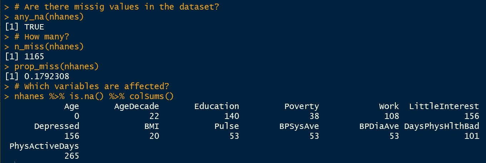

# R 中丢失数据的智能处理

> 原文：<https://towardsdatascience.com/smart-handling-of-missing-data-in-r-6425f8a559f2?source=collection_archive---------3----------------------->

## [实践教程](https://towardsdatascience.com/tagged/hands-on-tutorials)

## 缺失数据无处不在——学习如何总结、可视化和估算它们，同时关注统计不确定性。


由[罗斯·斯奈登](https://unsplash.com/@rosssneddon?utm_source=unsplash&utm_medium=referral&utm_content=creditCopyText)在 [Unsplash](https://unsplash.com/s/photos/puzzle?utm_source=unsplash&utm_medium=referral&utm_content=creditCopyText) 上拍摄的照片

当值应该被报告但不可用时，我们最终得到缺失的值。在现实生活的数据中，缺失值几乎是自动出现的——就像没有人能够真正摆脱的阴影。想想调查中的无回应、数据收集过程中的技术问题或连接不同来源的数据——令人恼火的是，我们只有完整案例的数据相当稀缺。但是你为什么要关心它呢？简单地忽略丢失的数据会有什么问题呢？

本文将向您展示为什么缺失数据需要特殊处理，以及为什么这是值得的。

*   了解可视化技术，以检测缺失数据中的有趣模式。
*   了解为什么均值插补或列表删除不一定总是最佳选择。
*   通过 r 中的链式方程(小鼠)执行多重插补。
*   评估插补质量，以说明统计不确定性，并使您的分析更加稳健。

# **缺失数据的问题**

一些分析(如线性回归)需要完整的观测值，但在普通的统计软件中，当向系统输入包含缺失值的数据时，你不会得到错误。相反，不完整的案例会被自动删除，这通常是悄悄发生的。但是，如果您计划在同一个数据集上测试不同的模型，它们之间的统计比较将是不合适的，因为您不能保证模型是基于相同的观察。此外，通过完全丢弃观察值，我们不仅会失去统计能力，甚至可能会得到有偏差的结果——丢弃的观察值可能会提供有关感兴趣问题的关键信息，因此简单地忽略它们将是一种遗憾。

例如，假设您被咨询来评估组织 z 中的心理工作条件。为此，您在开始采访利益相关者之前创建了一个员工调查。因为沮丧的员工通常会跳过不愉快但至关重要的问题，丢失数据几乎是不可避免的。因为这些价值观肯定会影响员工的整体满意度，所以我们应该关注它们。在这种情况下，数据不是随机缺失的，或者至少不是完全随机缺失的，因为缺失取决于员工满意度本身。有点太复杂了？好吧，让我们慢慢来:哪种类型的缺失数据存在，它如何影响数据分析？

*   **非随机缺失(MNAR):** 数据集中缺失值的位置取决于缺失值本身。在我们的例子中，员工倾向于报告积极或中立的回答，并在不同意的情况下跳过每个问题。例如，个人可能会系统地将以下项目留空，因为他们对给领导留下差评感到不舒服:“我会毫不犹豫地向我的领导报告不愉快的问题。”尽管如此，删除这些观察结果会将结果扭曲为积极的，因为它会让人觉得每个人都很好，组织不需要任何干预。在这种情况下，缺失的存在是有趣的，因为它告诉我们一些正在研究的现象——我们绝对不应该忽视它们。
*   **随机缺失(MAR):** 数据集中缺失值的位置取决于其他一些观察到的数据。在员工调查的另一种情况下，一些受访者并不完全确定，可能觉得无法用数字来准确回答他们的想法和行为。最终，他们很少回答被问到的问题。因此，反应多少取决于另一个未被观察到的机制:在这种情况下，个人需要更精确的自我报告。删除这些回答将是一个遗憾，因为它们可以从以前的回答中预测出来，甚至可能引入偏差:事实上，数据集将只包括自发回答这些问题的人的回答，我们不知道这将如何影响整体结果。因此，不建议在分析中忽略缺失的数据。
*   **完全随机缺失(MCAR):** 数据集中缺失值的位置完全是随机的，它们不依赖于任何其他数据。在第三种情况下，当调查平台上突然出现技术问题时，所有员工同时填写调查。因此，每个人都需要提前停止，因此在调查快结束时，所有参与者都会出现缺失值。数据的成对删除会使你难以分析数据集中最后的变量，但至少它可能不会给结果带来任何特定的偏差。根据经验，当数据包含不依赖于观察值或未观察值的少于 5%的随机缺失时，完全案例分析也可能是一种可接受的方法(Graham，2009)。

您不知道数据集中的值是否随机丢失？如果数据是随机丢失的，有一些统计测试，但是考虑到你需要一些关于丢失值的假设，以及你期望它们在哪里，无止境的测试似乎有点麻烦。更有意义的做法可能是直观地探索数据，并注意潜在的与方法相关的偏差，以防你马上没有强有力的想法。如果你对现实生活中的缺失数据问题感兴趣，我强烈推荐科勒、波尔和卡斯滕森(2017) 的一篇[论文:作者展示了在大规模教育学生评估中对无应答的不同处理如何影响能力分数等重要结果。](https://onlinelibrary.wiley.com/doi/pdf/10.1111/jedm.12154?casa_token=Uxrr04VwR7kAAAAA:AGnOk2sd0sej65rlh0XQS33YaCmHjYCNI8l-pWshbj46aBfTTCX4Eb3qG3QZBW4FWF_M6_JzIgTn0gw)

# **用 naniar 探索缺失的数据——获得鸟瞰图**

我们将使用的数据是来自美国国家健康和营养检查研究的调查数据——它包含 10000 个健康相关结果的观察数据，这些数据是在 20 世纪 60 年代早期收集的，同时还有一些人口统计变量(年龄、收入等)。).通过安装 Randall Pruim (2016)的 [NHANES 包](https://cran.r-project.org/web/packages/NHANES/NHANES.pdf)，可在 R 中使用。

首先，我们加载数据集，并通过从原始指数中随机采样将样本大小减少到 500 个观察值——您可能会使用较小的数据集，我们将使绘制变得稍微容易一些。我假设您的计算机上已经安装了 dplyr。


现在，我们将通过 Nicholas Tierney 和他的同事们(2020 年)制作的非常简洁的 [naniar 包](https://www.rdocumentation.org/packages/naniar/versions/0.0.4.9000)来粗略地了解一下失踪的情况…



结果表明，数据集中确实存在缺失数据，约占 18%的值(n = 1165)。除了“年龄”变量，每个变量都有大量的缺失值。请注意，由于我们抽取的是随机样本，所以每次运行脚本时，结果可能会有所不同。


通过查看每个变量的缺失摘要，我们注意到，在数据集中的所有变量中，尤其是“PhysActiveDays”变量的缺失量最高。该变量代表“参与者在典型的一周中进行中度或剧烈活动的天数。”众所周知，体育活动会产生如此大的影响，这一变量似乎是一个有趣的生活方式变量，可能是各种健康结果的潜在预测因素。请记住，值得注意的是，该数据集中缺失值的数量超过了记录值的数量。

我们可以将这种总结转换成如下的可视化表示:


为了更好地理解数据是否是随机缺失的，我们将可视化所有变量中缺失值的位置。


我们可以看到缺失值“聚集”在哪里，这似乎与我们之前对每个变量缺失值的概述相匹配。情节的左边部分特别有趣:一些参与者没有回答一排与心理健康相关的问题(例如“LitteInterest”和“Depression”)——这些问题可能已经超出了他们个人的舒适区(但这只是我的一个假设)。

现在，缺失值的出现与其他变量的缺失有关吗？让我们找出答案。


该结果与观察结果一致，即在大量情况下，某些遗漏碰巧发生在某些变量上(例如，遗漏工作、教育、兴趣和抑郁信息，以及缺少体育活动日的记录)。因此，在我看来，数据并不是完全随机丢失的。我们已经知道，如果数据是 MAR 或 MNAR，输入缺失值是明智的。

如果您有关于某个变量中缺失值对目标变量的影响的具体假设，您可以像这样测试它:

出于某种原因，你会认为身体质量指数缺失价值观的比例会随着人们对做事的兴趣程度而有所不同。


结果表明，我们不能拒绝零假设，从而假设每个兴趣水平的身体质量指数缺失率没有差异。请注意，从概念上讲，这没有任何意义，但我不想让它远离你。😉

好的——在开始插补之前，让我们先检查一件事:阅读 [NHANES 数据集](https://cran.r-project.org/web/packages/NHANES/NHANES.pdf)的文档，我们可以看到一些变量没有记录到 9 岁或 12 岁以下的儿童(例如，自我报告的健康状况或参与者在过去一个月中身体状况不佳的天数)。为了找出年龄如何影响数据集中缺失值的存在，我们可以创建一个热图，表示按年龄细分的每个变量的缺失密度。


事实上，对于 0-9 岁的个体来说，许多变量中有更多的缺失值。在某些情况下，这也适用于青少年(10-19 岁)的人口统计变量和抑郁相关变量，但我们现在不会触及这一点。然而，在我们的统计分析中排除儿童似乎是合理的，以减少我们结果中的偏差。

# 案例研究—调查心血管健康


由[杰西·奥里科](https://unsplash.com/@jessedo81?utm_source=unsplash&utm_medium=referral&utm_content=creditCopyText)在 [Unsplash](https://unsplash.com/s/photos/blood-pressure?utm_source=unsplash&utm_medium=referral&utm_content=creditCopyText) 上拍摄的照片

假设您对心血管健康感兴趣，因为您开展了一项旨在促进心血管疾病预防的干预计划——在没有关于患者身体状况的任何进一步信息的情况下，您想知道是否有一些可能与心血管健康相关的常见参数。你可以肯定，一个人生活越活跃，你就越不可能观察到血压异常升高(Whelton et al .，2002)。类似地，身体质量指数(身体质量指数)也可能与心血管健康相关，因为肥胖个体经常经历高血压，而较瘦的人的血压往往较低(例如，Bogers，2007；Hadaegh 等人，2012)。您决定在这个大型数据集上测试您的假设，但是您必须注意缺失的值，以确定是否值得专门针对那些有患心血管疾病风险的个体。

为了便于计算，您使用动脉血压中值(MAP)作为目标变量，这是一个有效的参数(Kundu，Biswas & Das，2017 年),代表血管系统中的血压平均值，不考虑收缩压和舒张压的波动。

下面是我们如何根据收缩压和舒张压计算每个人的 MAP([Psychrembel，2004](https://www.pschyrembel.de/Mittlerer%20arterieller%20Blutdruck%20(MAD)/webpages---klassifikationen---MittlererArteriellerBlutdruck/doc/) ):

> MAP =舒张压+ 1/3(收缩压-舒张压)

# **估算缺失数据—填空**

在进入我喜欢的插补技术之前，让我们先了解一下各种各样的插补技术，例如均值插补、最大似然插补、热卡插补和 k 近邻插补。即使它们确实有些用处，它们也有一个共同的缺点:它们没有考虑到统计上的不确定性，而这种不确定性自然与输入缺失值有关。我们如何知道我们是否准确地预测了可能被记录的值？此外，我们估算的质量如何影响我们的统计模型？

理解好的就意味着理解坏的——如果我们简单地用它们各自的平均值代替所有的连续变量，数据会发生什么？让我们看看。


我们可以看到红色的估算值和蓝色的自然值——估算值似乎形成了一种“十字”,看起来有些不自然。这是因为与记录值不同，均值估算值不包括自然方差。因此，这些值不太“分散”,并且在技术上可以最小化我们的线性回归中的标准误差。我们会认为我们的估计比现实生活中的更准确。

因此，我们需要一个好的替代方案——链式方程多重插补(MICE)是我最喜欢的方法，因为它非常灵活，可以同时处理不同的变量类型(例如，连续变量、二元变量、有序变量等)。).对于每个包含缺失值的变量，我们可以使用数据中的剩余信息来创建一个模型，该模型可以预测记录了哪些内容来填补空白——当使用统计软件时，这完全是在后台悄悄发生的。为了说明插补中的统计不确定性，MICE 程序经过几轮，并计算每轮缺失值的替代值。顾名思义，我们因此多次填充缺失值，并创建几个完整的数据集，然后将结果汇集在一起，以获得更真实的结果。如果你对链式方程多重插补的更多细节感兴趣，我推荐你阅读这篇由 Azur 和他的同事(2011)写得很好的[论文。当你已经知道随机森林优于简单决策树的时候，这个想法可能会让你想起什么？](https://onlinelibrary.wiley.com/doi/pdf/10.1002/mpr.329)

让我们通过使用 Stef van Buuren (2020)的精彩的 [mice 包](https://cran.r-project.org/web/packages/mice/mice.pdf)来实现 R 中的 MICE 过程。

```
install.packages("mice")
library(mice)
```

为了对每一个包含缺失值的目标变量做出好的预测，我们保存至少与它有些相关(r > 0.25)的变量。

然后，我们运行实际插补程序 10 次，设置一个种子，选择一种方法，并在我们的原始数据集上使用预测矩阵。根据您选择的回合数，计算可能需要一段时间…

现在，我们对 10 个估算数据集的每一个进行回归分析，并最终汇总结果。为了了解统计不确定性，我们将在汇总结果的回归总结中包含 95%的置信区间。


正如预期的那样，我们可以看到身体质量指数以及身体活动的程度显著地预测了我们的 NHANES 子样本中的平均血压( *p < .001* )。身体质量指数的回归估计值约为 0.41，这意味着每增加一个单位，我们预计平均动脉压将增加 0.41 毫米汞柱。考虑到置信区间，当从我们的不同插补周期中抽取回归系数时，身体质量指数和血压之间的关系似乎始终是正的(95% CI [0.25，0.56])。然而，对于身体活动的程度，我们的置信区间包括积极和消极的估计(95% CI [- 1.07，0.44])，这应该使我们持怀疑态度。这意味着，根据每一轮的插补质量，我们会得到不同的结果，从而会以不同的方式解释脉搏和身体质量指数之间的关系。假设你只有一轮(简单的插补)，那么你就没有机会评估你的系数估计值的可靠性。因此，我们很大程度上受益于多次输入缺失值并汇集结果！

请注意，我们不知道血压和身体质量指数之间的关系是否是因果关系，但假设这种轻微的联系似乎并不牵强——即使这种联系可能受到健康生活方式的调节(例如，频繁的体育活动，适当的营养等)。).

此外，我们将创建一个带状图来评估插补质量——红点是否自然符合报告值？


低身体质量指数值似乎有更多的估算值，这是由更高密度的缺失值造成的(您可以从平均估算散点图中猜到)。除此之外，估算值很好地分散在数据云中，似乎在各轮估算中没有实质性的不同。

我们完成了——现在我们可以使用混合插补来完善我们的数据集，这样就不会有遗漏。

# **奖励回合——通过交叉验证评估模型的稳健性**

现在我们有了一个简单的回归模型，可以预测平均动脉血压。一种常见的情况是，我们希望实际利用我们的知识，预测新的参与者样本中未知的血压。但是对于这项工作来说，它真的足够准确吗？

我们首先将数据分成测试数据和训练数据，然后只在一部分数据上训练算法。


与我们之前的分析一致，只有身体质量指数与血压显著相关。R 平方值表明我们的模型只能解释大约 5%的血压变化。

我们仍然试图使用该模型在算法从未见过的数据集(测试数据集)内实际预测血压。最后，我们将评估模型的准确性。


输出给我们的 RMSE 值为 11.83，这意味着平均而言，预测值与实际值相差约 12 个血压单位。假定正常的 MAP 值在 [65 和 110 毫米汞柱](https://web.archive.org/web/20131212030722/http://www.impactednurse.com/?p=329)之间，大约 12 毫米汞柱的偏差可能会使接近正常值(例如 62 毫米汞柱)的值向并发症和心力衰竭的临界值移动。学者提出，在平均动脉压为 50 毫米汞柱的情况下，即使 1 分钟，外科手术期间的死亡风险也会增加 5% (Maheshwari 等人，2018)。在这种情况下，我们糟糕的估计精度表明我们的模型不能代替真实数据(例如，实际记录的血压)。此外，错误率达 14%,与高质量的算法(谷歌、脸书等)相比，这仍然相当高。)达到 95%以上的准确率。对我来说，这个模型似乎并没有真正击中目标，但是嘿——它仍然有助于得到粗略的估计。在牢记这些限制的时候，开始就不错了！

# 了解你的拼图

> 处理丢失数据的最好办法是什么都不要有。
> 
> —格特鲁德·玛丽·考克斯

…但仍然无处不在。所以，掌握一些如何处理思念的诀窍绝对是值得的。你已经学会了如何总结、可视化和估算缺失数据，以符合后续分析。通过这种方式，你不仅知道你的拼图缺少哪些部分，而且你有看到更大画面的技术技能。

## **参考文献**

[1] J. W. Graham，[缺失数据分析:在现实世界中发挥作用](https://www.annualreviews.org/doi/abs/10.1146/annurev.psych.58.110405.085530)。(2009 年)，*心理学年度评论*， *60* ，549–576

[2]c . k hler，S. Pohl & C. H. Carstensen，(2017)，[处理大规模认知评估中的无反应项目:缺失数据方法对估计解释关系的影响](https://onlinelibrary.wiley.com/doi/full/10.1111/jedm.12154?casa_token=XTbM2OT6r08AAAAA%3A8J2CguPpdJlbxlE__kB_ietu3Xthv8VctcIGAmpgpB6V_8AEQUKxiU2RpCrbO_Q_INvyYPms5S79nfc)，*教育测量杂志*，54(4)，397–419

[3] R. Pruim， [NHANES:数据来自美国国家健康和营养检查研究](https://cran.r-project.org/web/packages/NHANES/NHANES.pdf) (2016)， *R 包*

[4] N. Tierney，D. Cook，m .麦克拜恩，C. Fay，M. O'Hara-Wild 和 J. Hester， [Naniar:缺失数据的数据结构、摘要和可视化](https://cran.r-project.org/web/packages/naniar/index.html) (2019)， *R 包*

[5] S. P. Whelton，A. Chin，X. Xin 和 J. He，[有氧运动对血压的影响:随机对照试验的荟萃分析](https://www.acpjournals.org/doi/abs/10.7326/0003-4819-136-7-200204020-00006) (2002)，*内科年报*，136(7)，493–503

[6] R. P. Bogers，W. J. Bemelmans，R. T. Hoogenveen，H. C. Boshuizen，M. Woodward，P. Knekt… & M. J. Shipley，[超重与冠心病风险增加的相关性部分独立于血压和胆固醇水平:对包括 300 000 多人的 21 项队列研究的荟萃分析](https://jamanetwork.com/journals/jamainternalmedicine/article-abstract/413025) (2007)，*《内科学文献》*，167(16)

[7] F. Hadaegh，G. Shafiee，M. Hatami 和 F. Azizi，[收缩压和舒张压、平均动脉压和脉压用于预测中东人口的心血管事件和死亡率](https://www.tandfonline.com/doi/full/10.3109/08037051.2011.585808?casa_token=s2bWtiIZe7AAAAAA%3AHQzXGxVvoqZpLm2UxHYp_p_g_VZLxAkXOmWLd-2ofO6Q1K0FWlw4kzZMgPMcxD1CUotqHex4BuJk) (2012)，*血压*，21(1)，12–18

[8] R. N. Kundu，S. Biswas & M. Das (2017)，[平均动脉压分类:对血压相关风险协变量进行统计解释的更好工具](https://journalca.com/index.php/CA/article/view/21140)，*心脏病学和血管病学:国际期刊*，1–7

[9] W. Psychrembel，[mittler arterieller Druck](https://www.pschyrembel.de/Mittlerer%20arterieller%20Blutdruck%20(MAD)/webpages---klassifikationen---MittlererArteriellerBlutdruck/doc/)(2004)。klini sches wrter buch。260. *Aufl。慕尼黑德·格里特*

[10] M. J. Azur、E. A. Stuart、C. Frangakis 和 P. J. Leaf，[链式方程的多重插补:它是什么，如何工作？](https://onlinelibrary.wiley.com/doi/full/10.1002/mpr.329) (2011)，*《国际精神病学研究方法杂志》*，20(1)，40–49

[11]s . v . buu ren & k . Groothuis-Oudshoorn(2010)，[小鼠:R](http://132.180.15.2/math/statlib/R/CRAN/doc/packages/mice.pdf) ，*统计软件杂志*，1–68

[12] K. Maheshwari，S. Khanna，G. R. Bajracharya，N. Makarova，Q. Riter，S. Raza，… & D. I. Sessler，[一项非心脏手术期间连续无创血压监测的随机试验](https://www.ncbi.nlm.nih.gov/pmc/articles/PMC6072385/) (2018)，*麻醉和镇痛*， *127* (2)，424