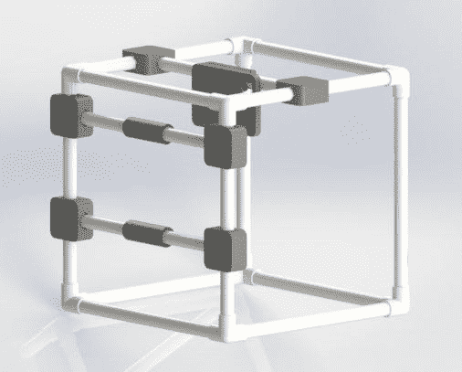
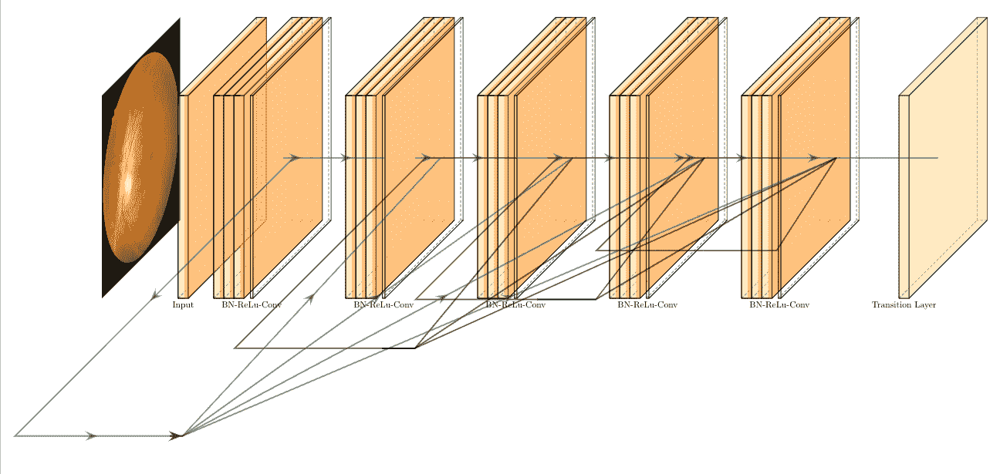
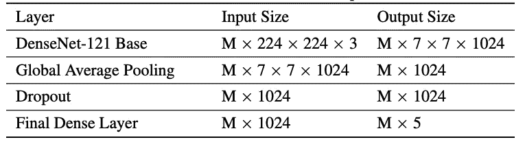
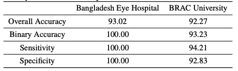
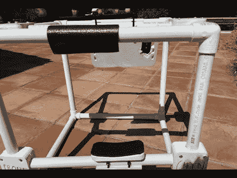

# 用于人工智能筛查的基于智能手机的视网膜照相装置

> 原文：<https://towardsdatascience.com/smartphone-based-retinal-camera-rig-for-ai-screening-4f7944d5a513?source=collection_archive---------35----------------------->

## *用于人工智能视网膜成像的智能手机系统的博客和描述*

作者图片

最近，我为我的组织 [Drishti](https://drishtiai.org/) 完成了一个项目，该项目为孟加拉国的农村地区进行基于人工智能的糖尿病视网膜病变筛查。为了在没有全成本视网膜相机的情况下进行视网膜扫描，我们建造了一个可以容纳智能手机的钻机来拍摄这些图像。这些图像然后可以上传到我们研究支持的人工智能算法，以提供即时和准确的初步筛选。这个项目展示了软件和硬件之间的和谐，因为我们能够有效地将我们的人工智能算法与低成本的视网膜相机装备相结合。希望你喜欢这篇文章，如果你有任何想法或需要改进的地方，请告诉我。

# 软件

我们 CNN 的模型示意图(图片由作者提供)

我们的算法是执行糖尿病视网膜病变筛查的 CNN。算法本身将实用性置于新颖性之上。基础网络是 DenseNet-121，最后一层替换为 5 节点全连接层。我们预测糖尿病视网膜病变分为 5 个不同的阶段。

模型架构细节表。m 代表小批量。(图片由作者提供)

为了训练 CNN，我们使用了开源的 APTOS 2019 失明检测眼底图像数据集(APTOS)。在孟加拉人的眼睛上，该算法达到了 93%以上的准确率，考虑到它训练的图像来自一个单独的数据集，这是非常令人印象深刻的。结果证实了在孟加拉国的真实临床环境中使用该算法的潜力。

我们的算法在两个孟加拉人眼睛数据集上的结果(图片由作者提供)

关于孟加拉人眼睛的方法细节和结果的论文可在[此处](https://arxiv.org/abs/2108.04358)获得。

# 五金器具

视网膜摄像系统(图片由作者提供)

我们构建了我们的系统来容纳带有视网膜附件的智能手机。这个[视频](https://www.youtube.com/watch?v=1zDsNmXHbFA)演示了如何使用它。框架由 PVC 管制成，所有附件都是 CAD 设计和 3D 打印的。患者将他们的下巴放在下巴托上，并直视视网膜照相机。然后，技术人员会用 iPhone 拍摄照片，并上传到 Drishti 的网络服务器上，以获得即时预测。

该系统可以很容易地拆卸，以便可以在不同的诊所之间转移。这些部件是用拉链绑在一起的，所以需要时可以拆开。我们的装配指南是[这里是](https://www.youtube.com/watch?v=K8nVQCHWzno)。

这个建筑的成本不到 20 美元，花了大约 2 个月的时间规划、设计和购买材料。视网膜附件本身是必须购买的，但是其余的部件都是低价的。整个系统运行良好，我们目前正在将该系统的副本部署到我们正在开始试运行的两家诊所。

我们目前正在开发 v2，它为可调节组件增加了翼形螺钉，以提高适应性。我们的 CAD 可在这里[获得。如果你点击 STL 文件，你将能够与 3D 渲染的设计进行交互。](https://github.com/Drishti-BD/Drishti-CAD)

这是与[萨吉夫·沙阿](https://sajivshah.medium.com/)合作完成的。他协助开发和设计 CAD 零件，并 3D 打印材料。他还帮助组装了第一个原型，并撰写了指导性文件。

感谢您阅读这篇关于我们项目细节的短文/博文。如果你有任何想法或想法，请告诉我！